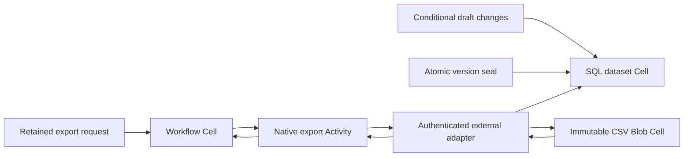

# Report export

Seal a regional-count dataset, export bounded CSV pages through native
Activities, record durable Workflow progress, and download a verified Blob
report. The library owns row validation, conditional SQL commands, stable
versions, canonical CSV encoding, checksum verification, and typed clients.
The binary owns its private provider scope, local authorization, external
adapter, Activity supervisors, readiness, and drain.

```sh
sh cookbook/scripts/report-export.sh
```

The demo replaces the bounded draft, seals a fresh version, changes the live
draft while exporting, produces three pages, and verifies the exact immutable
CSV. Repeated demos consume named-version capacity. Docker Compose and Rust
1.97 are required; no cloud account is needed. SQLite uses the chosen state
directory, and authoritative storage uses private `cookbook/report-export/cells`
and `cookbook/report-export/artifacts` prefixes.

## Consistency and transaction boundaries



| Contract | Implementation |
| --- | --- |
| Draft concurrency | Put, delete, and complete replacement require an exact global draft revision. A successful change advances it once; stale changes are durable `Conflict` outcomes. |
| Sealing | One SQL transaction copies all draft rows and captures their count, revision, and canonical content digest. Named versions cannot be altered or removed through the domain API. |
| Export policy | Every page reads the same sealed version and verifies its complete metadata. Changes to the draft or newer sealed versions cannot enter an existing export. |
| Pagination | Keyset cursor is the exclusive previous row ID. Pages contain at most 32 ordered records. ID gaps are valid domain data; repeated or regressing IDs are rejected. |
| Durable progress | Workflow records each page's cursor, row count, digest, ETag, and key only after native Activity completion. Old completions cannot append progress twice. |
| Page identity | Key derives from authorized source Cell, sealed version, dataset digest, encoding version, and exclusive cursor. Native run and lease attempts do not change it. |
| Final verification | Read every required page through native verified Blob APIs, compare exact manifest links, parse canonical CSV, verify global row order/count, and recompute the sealed dataset digest. Missing, repeated, reordered, or changed records refuse final publication. |
| Publication | Pages and final files use native Blob staging and `Missing` publication conditions. Retry verifies existing bytes and reuses the same manifest. Staging remains invisible. |
| Result link | Workflow accepts only a report for its sealed version, exact row count, dataset digest, and deterministic output key. A Workflow receipt does not prove visibility in the other two Cells. |
| Failures | Missing links or native Activity failures do not prove that no CSV was published. Original request evidence is retained and unknown/expired outcomes remain distinct from proven absence. |
| Authority | The OS caller owns the fixed local tenant. Only the numeric loopback adapter accepts network input; bearer authorization precedes parsing and native dispatch. |
| Ownership and drain | Adapter uses the already-open dataset and Blob writers. Accepted jobs outlive their HTTP sockets. Stop admission, finish native jobs and Activity completions, then release serving ownership. |

CSV has a fixed `id,label,units` header, fully quoted UTF-8 fields, doubled
embedded quotes, and CRLF record terminators. Labels begin with an alphabetic
character and occupy at most 128 UTF-8 bytes; embedded newlines are valid and
round-trip as data. Numeric fields have one canonical decimal encoding. CSV is
encoded outside SQLite after the sealed query returns. The encoding uses a
pinned CSV crate version and explicit options.

There is one fixed shard per namespace. The dataset holds at most 512 rows and
16 permanent sealed versions. A page is at most 16 KiB; at most 16 pages produce
a final file of at most 256 KiB. Finalization intentionally fits this bounded
reference workload in memory and publishes one native Blob part. Larger exports
need a separately designed streaming policy. Run bindings are permanent and
bounded at 1024. Workflow state is bounded at 32 KiB; each Cell has declared
64 MiB native and 16 MiB change limits. Four connections and four admitted
adapter jobs bound transport work; one native Activity supervisor runs per
Workflow shard. No artifact deletion or part collection is performed.

## Persistent commands

Run serving commands sequentially for this fixed installation. Use a free
adapter port and retain it for each live export request. Help and preparation
run without starting storage.

```sh
sh cookbook/scripts/report-export.sh info cookbook/.state/report-export
sh cookbook/scripts/report-export.sh sample 70 0 /tmp/report-change.json
sh cookbook/scripts/report-export.sh prepare-data /tmp/report-change.json /tmp/report-data.json
sh cookbook/scripts/report-export.sh data cookbook/.state/report-export /tmp/report-data.json
sh cookbook/scripts/report-export.sh prepare-seal 1 00000000-0000-0000-0000-000000000001 /tmp/report-seal.json
sh cookbook/scripts/report-export.sh data cookbook/.state/report-export /tmp/report-seal.json
sh cookbook/scripts/report-export.sh snapshot cookbook/.state/report-export 00000000-0000-0000-0000-000000000001 > /tmp/report-snapshot.json
sh cookbook/scripts/report-export.sh prepare-run /tmp/report-snapshot.json http://127.0.0.1:19022/ /tmp/report-run.json
sh cookbook/scripts/report-export.sh start cookbook/.state/report-export /tmp/report-run.json
sh cookbook/scripts/report-export.sh serve cookbook/.state/report-export 19022 60
```

The shown revision values assume a fresh draft; use `info` for an existing
installation. `prepare-run` prints its Workflow UUID. Inspect with
`get STATE_DIRECTORY WORKFLOW_UUID`; progress includes the pinned source,
recorded row count, cursor, page manifests, and final report. Read sealed pages
with `page STATE_DIRECTORY SNAPSHOT_JSON AFTER`.

Download with `download STATE_DIRECTORY HEX_KEY OUTPUT_FILE`, using the
64-character lowercase hex encoding of the report's 32 key bytes. The download
is natively verified and published exclusively after file and directory fsync;
an existing destination is never overwritten.

Retain all prepared files before dispatch. Preparation refuses replacement.
`data` and `start` replay the original mutation identities. `resolve-data` and
`resolve` inspect the original evidence without dispatch. Validity is five
minutes; expired evidence reports `absence_proven: false` without provisioning
storage. Activities and staging have at most a one-hour lifetime. Use
`CELLULE_EXPORT_TOKEN` to configure the adapter credential; its default is an
explicit synthetic local-development token, never saved in Workflow input.

Stop authoritative storage with `sh cookbook/scripts/local-storage.sh down`;
its volume remains. The cookbook's explicit storage reset removes all
applications in that volume, so reserve reset for a private test installation.

## Verification

```sh
cargo test --manifest-path cookbook/Cargo.toml -p cellule-cookbook-report-export --locked
cargo clippy --manifest-path cookbook/Cargo.toml -p cellule-cookbook-report-export --all-targets --locked -- -D warnings
```

The [persistent process scenario](../../scenarios/report-export.py) runs in CI
or an isolated source snapshot with a private local provider. It changes the
draft through authenticated native ingress after the first sealed page is
published, seals a newer version, and kills the exporter before completion.
After serving-lease expiry, native retry must reuse that first manifest and
finish the original sealed version without duplicate or missing CSV records.
`CELLULE_EXPORT_AFTER_PAGE_MS=10000` opens the bounded first-page observation
window. Cold restore must recover the sealed version, progress, final report,
and original command outcomes.

The application passed 15 focused tests, two persistent demo runs, and all
25 independent-process checks. The isolated cookbook workspace passed
formatting, compilation, Clippy with warnings denied, API documentation,
136 tests, and the repository's structural and documentation gates. The process
checks include exact native action and page-manifest reuse, canonical Unicode
CSV, a newer sealed version remaining isolated, graceful final-completion
drain, durable input conflict, and byte-identical cold recovery. CI includes
this application in its generated scenario matrix.
