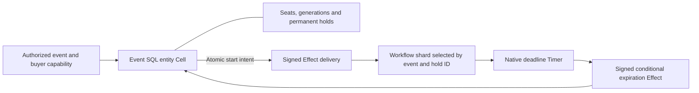

# Event seat reservations

One event SQL entity Cell owns its seats, permanent hold records, and seat
generations. A successful hold publishes the allocation and a native Effect
requesting its deadline Workflow in the same transaction. Native maintenance
fires the Workflow Timer; a signed return Effect expires only that exact hold.

```sh
sh cookbook/scripts/reservations.sh
```

The default demo races two buyers for one seat, confirms the winner, expires
another hold autonomously, and proves a cancelled hold's old timer cannot release
its replacement. It verifies retained confirmation replay and fresh-request
idempotency, prints reconciled inventory and a receipt, then drains. Rust 1.97
or newer and Docker Compose are required; no cloud account is needed.

## Boundaries and deadline policy



All inventory decisions for an event share one fenced writer. A partial unique
index permits at most one held or confirmed allocation per seat. Confirmation
is permanent; cancellation and expiration can release only a held allocation.
Different events have independent inventory, ownership, and receipt domains.
The two fixed Workflow shards are independent transaction domains shared by
an installation's events. Workflow keys hash both event and hold identity.
Callbacks for an earlier event remain deliverable while a later event is served.
The coordinator serializes those callbacks through one independently leased
receiver node at a time, acquiring the original event Cell and draining before
each transport reply. It authenticates and authorizes before acquiring any Cell;
receiver boots use the same installation identity and authority-pinned recovery.
Pending start intent in an inactive source event still needs that source to be
served; opening a different event is not a source-roster scan.

Confirmation succeeds only when its recorded command time is strictly before
the frozen deadline. At or after the deadline, confirmation rejects durably and
expires the hold even if timer delivery is delayed. An overdue held seat can also
be replaced atomically by a new hold, expiring the old row first. Each new hold
increments the seat's generation. The old hold ID, seat, generation and deadline
must all match an expiration capability; terminal holds are harmless no-ops.
A delayed timeout never releases a confirmed seat or a newer generation.

The source receipt proves allocation **and start intent**, not Workflow start
or expiration delivery. `deadline` is an independent Workflow observation;
`completed` means expiration intent was published. Read `hold` or `inventory`
for authoritative allocation state. These observations do not form a cross-Cell
snapshot. When the service is stopped, timers and delivery stop until it restarts;
absolute deadlines do not move, and overdue starts fire immediately on recovery.

The library assumes the embedding has authorized event administration, reads,
and the buyer identity in each operation before constructing or using its typed
capability. The local CLI uses shell access and a fixed tenant as its authorization
boundary. Internal `ScheduleDeadline` and `ExpireHold` are worker operations;
never expose them as buyer endpoints. Expiration trusts the pinned Workflow's
recorded logical firing time. The signed local peer policy pins the permitted
source Cell, destination, event, command and codec. A fleet adapter must provide
its own authenticated transport and clock policy.

## Retained CLI operations

Run from the repository root. Choose a new prepared file for every new logical
command, outside boot-owned working files. Preparation freezes native request
UUID, five-minute evidence timestamps, event and action in a create-new fsynced
file. Keep that file unchanged when resolving or retrying an uncertain outcome.

```sh
mkdir -p cookbook/.state/reservation-inputs
cat > cookbook/.state/reservation-inputs/event.json <<'JSON'
{"event":"concert","action":{"operation":"initialize","seats":3}}
JSON
sh cookbook/scripts/reservations.sh prepare \
  cookbook/.state/reservation-inputs/event.json cookbook/.state/reservation-inputs/event.mutation.json
sh cookbook/scripts/reservations.sh apply \
  cookbook/.state/reservations cookbook/.state/reservation-inputs/event.mutation.json
```

Choose an absolute deadline in Unix milliseconds within the next hour. This
example stamps a new logical hold using Python's local clock:

```sh
python3 - <<'PY'
import json, time
from pathlib import Path
Path("cookbook/.state/reservation-inputs/hold.json").write_text(json.dumps({
    "event": "concert",
    "action": {"operation": "hold", "id": "01900000-0000-7000-8000-000000000001",
               "seat": 1, "buyer": "alice", "deadline_ms": int(time.time() * 1000) + 300000}
}))
PY
sh cookbook/scripts/reservations.sh prepare \
  cookbook/.state/reservation-inputs/hold.json cookbook/.state/reservation-inputs/hold.mutation.json
sh cookbook/scripts/reservations.sh apply \
  cookbook/.state/reservations cookbook/.state/reservation-inputs/hold.mutation.json
sh cookbook/scripts/reservations.sh hold \
  cookbook/.state/reservations concert 01900000-0000-7000-8000-000000000001
sh cookbook/scripts/reservations.sh deadline \
  cookbook/.state/reservations concert 01900000-0000-7000-8000-000000000001
```

Copy the exact generation from `hold` into a separately prepared confirmation:

```json
{"event":"concert","action":{"operation":"confirm","id":"01900000-0000-7000-8000-000000000001","generation":1,"buyer":"alice"}}
```

Use `cancel` with the same fields to cancel an unconfirmed hold. Buyer and
generation must match. A different buyer receives a durable `forbidden` outcome
without the selected hold payload. A fresh confirmation of a confirmed hold
returns `already_confirmed`; a fresh cancellation of a cancelled hold returns
`already_cancelled`. Opposite terminal operations reject. Retrying the same
permanent hold ID with identical fields returns its current record, including
terminal state, and never reacquires a seat. Inspect that state before using it.

```sh
sh cookbook/scripts/reservations.sh resolve \
  cookbook/.state/reservations cookbook/.state/reservation-inputs/hold.mutation.json
sh cookbook/scripts/reservations.sh inventory cookbook/.state/reservations concert
sh cookbook/scripts/reservations.sh list cookbook/.state/reservations concert - 20
sh cookbook/scripts/reservations.sh serve cookbook/.state/reservations concert 60
```

`serve` owns native maintenance and both Effect delivery directions. SIGTERM or
interrupt stops admission and drains accepted delivery while the enrollment
lease remains live. Short CLI operations also install the workers and drain;
run `serve` to keep future deadlines progressing. This local profile serves one
explicit event per process. Another local CLI cannot steal that process's live
Cells; an embedding service can expose the library through its own authenticated
ingress and use its existing serving handle.

Prepare two distinct hold files for the same event and seat, then use
`race STATE_DIRECTORY HOLD_MUTATION_A HOLD_MUTATION_B` to contend through the
same writer. The CLI renders both receipt-bearing decisions. Domain rejections
from `apply` print their output and return a nonzero exit status. `resolve`
observes the original decision without inventing a new request. An expired
file reports `resolution: expired, absence_proven: false` before provisioning
state; expiry never permits reissuing an uncertain allocation.

## Contracts and bounds

| Contract | Behavior |
| --- | --- |
| Stable event and buyer keys | 1–64 lowercase ASCII letters, digits and internal hyphens; no aliases. Entity identity uses framework version-one canonical partitioning. |
| Inventory | 1–100 consecutive numbered seats, initialized once. No generic SQL endpoint or inventory reset. |
| Hold identity | Nonnil canonical lowercase UUID, stored as 16 bytes. Event-local permanent business identity is separate from native request identity. |
| Hold deadline | Frozen absolute positive Unix milliseconds; new holds must be in the future and within one hour of recorded server time. No extensions; cancel and acquire a new identity/generation. |
| Terminal history | At most 1,024 permanent holds per event. Terminal rows and deadline bindings remain retained; cancellation does not free identity capacity. Existing settlement still works at capacity. |
| Revision | Increments on actual allocations, confirmations, cancellations and expirations. Native no-op outcome publications have separate receipts. |
| Conditional expiration | Exact event, hold ID, seat, generation and deadline plus a trusted Workflow firing time at or after the deadline. Confirmed and terminal rows remain unchanged. |
| Workflow compatibility | Native version-one schema, pinned executable definition digest, explicit Timer identity, immutable application-owned start binding, fixed command/codec IDs and source digest. |
| Delivery retention | Native intents live for at most seven days. Failed start delivery, unavailable active deadline Workflow, exhausted delivery, or a held deadline beyond coordination retention closes readiness; investigate and reconcile explicitly. |
| Pagination | 1–100 permanent hold records by UUID per source read, with coherent inventory counters. Separate pages are current observations. Supervision inspects at most 100 currently held seats. |
| Process bounds | 4 KiB JSON files, 1 KiB commands, 2 KiB hold results, 64 KiB history output; 64 MiB database / 16 MiB capture per Cell. One event and two Workflow shards use three resident SQL Cells in the primary node. At most one callback node uses one other SQL Cell. Each node has four SQL workers, 64 MiB native and 1 GiB disk budgets; the two-node bound is 128 MiB native and 2 GiB disk. |
| Worker ownership | Three bounded signed Effect loops plus shared maintenance and lease renewal. Worker errors preserve their source and close readiness. Drain finishes accepted destination/source settlement before releasing ownership. |
| Diagnostics | Receipt-bearing JSON results; bounded 32-entry optional expiration channel. `serve ... AFTER_EXPIRATION_PUBLICATION_MS keep\|drop` delays or loses the first expiration reply after publication, solely for local recovery verification. |
| Cleanup | Successful drain removes only the current boot's SQLite working files. Later boots preserve crashed session evidence and restore from the authority-pinned root. Shared storage `down` retains the volume; explicit `reset` is installation-wide. |

No payment, notification or ticket delivery occurs inside an inventory transaction.
An embedding product must decide how those independent external actions are
coordinated. This application demonstrates seat ownership and deadlines.

## Code and verification

[Inventory commands](src/commands.rs) own serialized allocation and settlement;
[SQL constraints](src/schema.sql) backstop scarce inventory; the
[definition](src/definition.rs) implements deterministic deadline transitions;
[service](src/service.rs) owns signed workers and supervision; the
[typed client](src/lib.rs) can be reused without a listener. The
[binary](src/main.rs) owns providers, retained files, CLI admission and drain.

```sh
cargo test --manifest-path cookbook/Cargo.toml \
  -p cellule-cookbook-reservations --test application --locked
```

[Public tests](tests/application.rs) exercise seat contention, real native Timer
races, late confirmation with delayed delivery, permanent buyer-bound settlement,
old-generation timeouts, callbacks for previously served events through drained
receivers, actual signed reply loss and inbox resolution, bounded
history, full identity capacity, explicit peer rosters, and cold recovery of an
overdue pending start. The [process scenario](../../scenarios/reservations.py)
runs in CI or an isolated source snapshot against private local S3. It kills the
service after expiration publication, checks live-owner fencing, waits for the
native lease boundary, restores and resolves original evidence, retains orphan
files, confirms replacements, and verifies independent cold reconstruction.
These establish the local cookbook profile; fleet, provider and upgrade
qualification remain separate framework work.
