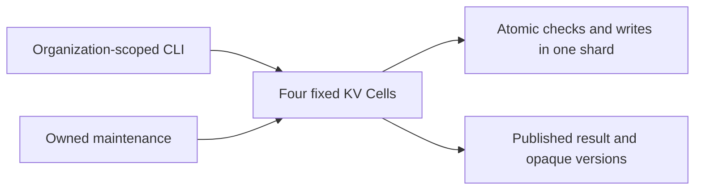

# Persistent organization settings

Edit preferences and feature flags through conditional native KV operations.
Every bundle checks all versions before writing, so a conflict leaves the whole
bundle unchanged. Replies and durable rejections follow Cellule publication.



Organizations share four fixed shards but have separate KV scopes. A bundle
is atomic within one organization's shard. It cannot include another scope.
The local OS user owns this CLI's fixed tenant; an HTTP embedding must derive
tenants from authenticated principals before binding application handles.

## Run

From the repository root, with Rust 1.97 and Docker Compose:

```sh
sh cookbook/scripts/settings.sh
```

The demo creates a new organization, atomically writes two preferences, races
two editors, replays the losing conflict, deletes and recreates a setting,
rejects its old version, and waits for supervised expiry cleanup. Output is
JSON with `"scenario":"passed"`, the organization, checks, preferences, and
receipt. Each run has a new organization, preserving earlier data.

## Conditional edits

Create `preferences.json`:

```json
[
  {"key":"theme","expected":{"kind":"absent"},"value":{"type":"text","value":"dark"},"expires_at_ms":null},
  {"key":"feature.beta","expected":{"kind":"absent"},"value":{"type":"boolean","value":true},"expires_at_ms":null}
]
```

Retain a mutation file before dispatch:

```sh
sh cookbook/scripts/settings.sh prepare acme preferences.json preferences.mutation.json
sh cookbook/scripts/settings.sh apply cookbook/.state/settings acme preferences.mutation.json
sh cookbook/scripts/settings.sh get cookbook/.state/settings acme theme
sh cookbook/scripts/settings.sh list cookbook/.state/settings acme feature. - 20
sh cookbook/scripts/settings.sh resolve cookbook/.state/settings acme preferences.mutation.json
```

To update or delete a setting, copy its returned version into
`{"kind":"version","version":"<56 lowercase hex characters>"}`. A null
value deletes it. Versions are opaque; do not infer permission or compare
them lexicographically. Delete/recreate produces a different version, so an
old editor cannot overwrite the new setting. Replaying a deletion returns its
original outcome and cannot delete a subsequently recreated setting.

Mutation files bind the organization, edit bytes, identity, and five-minute
request window. Retain them unchanged for retries and resolution. Applied
conflicts print a durable outcome and receipt, then exit nonzero. Resolution
returns the recorded outcome and sequence. Unknown or expired outcomes exit
nonzero; neither proves absence. Retry only with the original identity while
it remains valid.

## Limits and lifecycle

| Contract | Behavior |
| --- | --- |
| Organization | 1–64 lowercase ASCII letters, digits, or hyphens; exact canonical bytes route the scope. |
| Names | 1–64 dotted lowercase ASCII characters; first character is a letter; no trailing or repeated dots. |
| Values | Boolean, integer, or trimmed nonempty text of at most 256 UTF-8 bytes. |
| Bundle | 1–16 distinct keys; every edit carries an absent or exact-version check. |
| Expiry | Positive absolute Unix milliseconds; expired entries are logically absent even before cleanup. |
| Listing | Exclusive name cursor, optional prefix, 1–100 entries, at most 64 KiB; current reads across pages. |
| Operations | Atomic 1, get 2, list 3, internal maintenance 4; codec and schema version one. |
| Compatibility | Fixed namespace and four shards; native KV schema installer; domain JSON and version fixtures. |
| Readiness | Probed provider, signed renewable lease, healthy supervised maintenance task. |
| Shutdown | Stop tasks, finish accepted work, drain, withdraw, then remove this boot's working files. |

Shared [node support](../../support/README.md) runs bounded maintenance every
100 ms for resident Cells. It rechecks published sequences inside typed ticks
and processes at most 128 items per tick. The demo proves cleanup publishes a
new receipt without a manual tick; point reads also hide expired values.
No cross-organization snapshot or transaction is implied by sharing a shard.

Restart restores the exact authority-pinned root into fresh local files.
Docker storage persists through `local-storage.sh down`. An interrupted
process's live lease delays takeover; wait for expiry before restarting.
The current assembly rejects changed stored module code/schema. Compatible
upgrades belong to the catalog's evolution application and qualification.

## Evidence

Public tests cover competing edits, durable conflict replay, atomic bundle
failure, replayed deletion, stale versions after recreation, scope isolation
even on the same shard, bounded prefix pages, supervised expiry, restart,
receipts, and JSON compatibility fixtures. The process scenario verifies
these persistence contracts across independent CLI invocations against local
S3. Run broad checks and process scenarios in CI or an isolated snapshot.
