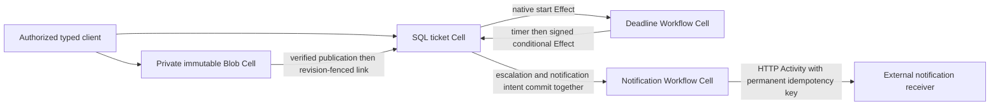

# Support desk

**Status: implemented; local process verification passed; CI qualification
pending.** The typed domain library, immutable attachment facade,
generation-specific deadline Workflows, signed Effect coordination, HTTP
notification Activities, retained-file CLI, authorized HTTP ingress, and
independently persistent receiver are implemented. The process scenario passed
all 17 crash, recovery, and cold-read checks. This is the twentieth runnable
application in the cookbook; the preceding 19 are already CI-qualified.

The application opens a ticket, records a bounded conversation, links immutable
attachments, assigns an agent, and escalates overdue work. Resolution and
reopening change the ticket generation. A delayed timer callback can escalate
only an open ticket whose current generation and exact deadline match.



Each box is a separate transaction domain. A ticket receipt proves its local
decision and committed intents. It does not prove the Blob publication,
Workflow start, or external notification delivery. `CoordinationClient` uses
the coordinator host's handle to expose independent native progress.

## Domain library

`TicketClient` prepares exact typed commands before dispatch, resolves retained
pending evidence, and reads receipt-gated metadata and bounded conversation
pages. Opening permanently binds the original subject, requester, deadline,
and receiver endpoint. Message IDs permanently bind exact author and body;
identical retries remain duplicates after resolution or capacity exhaustion.
Changed bytes at the same message ID are durable conflicts.

Assignment installs a new deadline generation. Resolving increments the
generation and clears current escalation without discarding history. Reopening
is an explicit revision-fenced action with another deadline. Timer callbacks
check status and generation inside the ticket transaction. An obsolete callback
returns `unchanged`, leaving the resolved or reassigned ticket intact. An
accepted escalation publishes its notification-start Effect in that same local
transaction.

`AttachmentPlan` freezes complete bytes, a ticket-local permanent identity, the
original source revision, and distinct native identities for begin, part,
completion, and linking. `AttachmentClient` verifies the published manifest,
metadata, complete bytes, and digest before preparing a link. Reconciliation
retains the original revision and request windows. A stale link remains a
durable conflict; an operator's later edit requires an explicit new plan.
Immutable publication can survive without a ticket reference and is not deleted
by this application.

Notification Workflows retain the exact escalation input, native Activity
attempts, bounded external diagnostics, retry timers, and verified receiver
acknowledgments. External idempotency keys include the source Cell and deadline
generation. A transient or lost reply can follow application at the receiver;
retries use the same key and frozen payload. A terminal failure preserves that
uncertainty for explicit reconciliation. Credentials come from embedding
configuration and are excluded from persisted notification inputs.

## Bounds and ownership

| Contract | Local reference bound |
| --- | --- |
| Ticket and participant keys | Canonical lowercase ASCII slugs, 1..48 bytes |
| Subject and attachment display name | 1..160 UTF-8 bytes |
| Permanent conversation | 64 messages, each 1..2048 UTF-8 bytes |
| Conversation page | 1..16 messages, at most 256 KiB encoded output |
| Immutable attachment links | 16 per ticket, each object at most 64 KiB |
| Complete ticket metadata | At most 128 KiB |
| Deadline generations | 64; generation 65 is reserved for final resolution |
| Deadline distance | Greater than publication time and at most seven days ahead |
| Independent native Workflow bindings | 4096 per coordination Cell |
| Notification delivery | Four HTTP rounds; bounded two-second HTTP requests and 4096-byte replies |
| Served ticket roster | Explicit one or two tickets, with no discovery from history pages |
| Callback diagnostic delays | At most ten seconds before and ten seconds after publication |
| HTTP ingress | Eight connections, four accepted operations, 384 KiB inputs, 256 KiB replies |
| External receiver | 4096 permanent records, each at most 16 KiB; one exclusive process owner |

`spawn_coordination` installs ticket outbox workers, the deadline callback
worker, an Activity supervisor, and readiness supervision. All belong to the
source node. The source node drains accepted work while the independently
leased coordinator remains alive; the coordinator drains afterward. Only
diagnostic pauses observe cancellation during an accepted native delivery.
The 30-second callback lease covers both supported delays.

Libraries own domain invariants, schemas, stable namespace and codec IDs,
retained Workflow definitions, and typed APIs. The embedding owns participant
authorization, endpoint selection, credentials, private artifact storage,
ingress, and the complete roster. This local endpoint profile permits only
canonical loopback HTTP `/notifications` destinations.

## Executable and retained evidence

Run the complete two-ticket demo from the repository root:

```sh
sh cookbook/scripts/support-desk.sh
```

The demo creates a unique tenant and two tickets, links and restores a private
attachment, races a deadline callback with resolution, then delivers an
escalation notification to its own persistent loopback receiver. That receiver
applies the notification and deliberately drops its first reply, so the
Workflow demonstrates a retry with the same permanent idempotency key. Its
active plan is synced before dispatch and is finalized only after host shutdown
drains accepted work. Set `CELLULE_SUPPORT_DESK_NOTIFICATION_ENDPOINT` to use an
independently managed receiver instead; the retained plan pins that destination
and requires it on restart.

The default launcher stores state beneath `cookbook/.state/support-desk`. Help,
request preparation, and receiver inspection work without Docker or object
storage:

```sh
sh cookbook/scripts/support-desk.sh help
```

`help`, `prepare`, `prepare-attachment`, `receiver`, and `receiver-record` do not
start a Cell node or require object storage. Cell commands use the local storage
profile from `CELLULE_COOKBOOK_ENDPOINT`, defaulting to loopback port 19000 and
the `cellule-cookbook` bucket. The source and coordinator have separate working
directories beneath `STATE`; authoritative Cells and private Blob parts use
separate stable object prefixes.

| Command | Behavior |
| --- | --- |
| `prepare INPUT_JSON REQUEST_FILE` | Saves and syncs the original tenant, typed change, request ID, and five-minute request window before dispatch. Refuses to overwrite existing evidence. |
| `apply STATE REQUEST_FILE` | Dispatches the exact prepared change; a durable rejection includes its original source outcome and receipt. |
| `resolve STATE REQUEST_FILE` | Resolves original evidence without dispatch. Expired or unknown evidence is explicitly inconclusive. |
| `get STATE TENANT TICKET` | Reads source metadata with its own receipt. |
| `messages STATE TENANT TICKET [AFTER LIMIT]` | Reads a coherent conversation page; defaults to sequence zero and sixteen entries. |
| `prepare-attachment TENANT TICKET ATTACHMENT NAME SOURCE REVISION PLAN_FILE` | Freezes one complete regular file, permanent attachment identity, source revision, upload ID, and all four native identities. |
| `publish-attachment STATE PLAN_FILE [AFTER_PUBLICATION_MS]` | Verifies immutable Blob publication and emits a publication checkpoint before an optional bounded delay. It does not link the ticket. |
| `reconcile-attachment STATE PLAN_FILE` | Verifies the complete object and executes the original revision-fenced source link. |
| `resolve-attachment STATE PLAN_FILE [begin\|part\|complete\|link]` | Resolves the selected original phase, defaulting to the source link. |
| `download-attachment STATE PLAN_FILE OUTPUT_FILE` | Restores and verifies the exact original bytes, then atomically saves a new output file. |
| `progress STATE TENANT TICKET` | Reads current source metadata, its deadline, and its latest independent notification Workflow. |
| `effect STATE TENANT TICKET EFFECT_HEX` | Inspects the source's native coordination intent, claim attempt, lease, and retained result. |
| `callback-effect STATE TENANT EFFECT_HEX` | Inspects the deadline host's native callback ledger independently. |
| `serve STATE ROSTER_JSON SECONDS [CONTROLS_JSON]` | Runs owned coordination workers and authorized typed HTTP ingress for 1..3600 seconds or until a shutdown signal. |
| `receiver RECEIVER_STATE PORT [CONTROLS_JSON]` | Runs the external notification receiver with independently retained local records. Port zero selects an available port. |
| `receiver-record RECEIVER_STATE NOTIFICATION_KEY` | Reads and verifies an immutable external record without starting any server or Cell node. |

An input file contains `tenant` and `change: {ticket, action}`. Action fields are
the public `Action` contract: `open` supplies `subject`, `requester`, an absolute
Unix `due_at_ms`, and `endpoint`; `message` supplies `expected_revision` and
`message: {id, author, body}`; `assign` supplies `expected_revision`, `agent`, and
`due_at_ms`; `resolve` supplies `expected_revision`; `reopen` supplies
`expected_revision` and `due_at_ms`. Deadlines must remain in the future when
the command publishes. Preparation does not refresh them during recovery.

The executable drains the source before the coordinator on completion, errors,
and shutdown signals. Accepted HTTP operations belong to owned jobs and survive
a disconnected caller. Successful drain emits one `drained` event. Interrupted
mutations keep their original files for exact outcome resolution.

## Participant HTTP capabilities

A serving roster names the complete one- or two-ticket scope, configured actors,
and the receiver destination:

```json
{
  "tenant": "acme",
  "tickets": ["cannot-sign-in", "missing-export"],
  "port": 0,
  "requester": "alice",
  "agent": "sam",
  "notification_endpoint": "http://127.0.0.1:19400/notifications"
}
```

The `ready` event reports the bound loopback address. Customer routes begin with
`/customer/`; agent routes begin with `/agent/`. The customer may open a ticket,
post messages as the configured requester, resolve owned work, and access its
attachments. The agent may post messages as the configured agent, assign that
agent, resolve work, and explicitly reopen it. Both may read roster tickets and
independent coordination progress. The customer cannot access a ticket opened
by another requester. Opening must pin the roster's receiver endpoint.

| Suffix after the capability prefix | Method and input |
| --- | --- |
| `ready` | `GET`; owned host readiness |
| `tickets/TICKET` | `GET`; source metadata and receipt |
| `tickets/TICKET/messages` | `GET` for the first page, or `POST` a `PageRequest` with `after` and `limit` |
| `tickets/TICKET/progress` | `GET`; source, deadline, and latest notification observations |
| `tickets/TICKET/changes` | `POST` the unchanged retained request file |
| `tickets/TICKET/resolve` | `POST` the unchanged retained request file for read-only resolution |
| `tickets/TICKET/publish-attachment` | `POST` the unchanged retained attachment plan file; Blob publication only |
| `tickets/TICKET/link-attachment` | `POST` the unchanged retained plan for source linking |
| `tickets/TICKET/resolve-attachment` | `POST` the unchanged retained plan for original source-link resolution |
| `tickets/TICKET/attachments/ATTACHMENT` | `GET`; referenced complete verified object as lossless `bytes_hex`, with its independent Blob receipt |

Every POST uses exactly `Content-Type: application/json`. Mutation and resolution
requests also require `Idempotency-Key` equal to the canonical UUID of the
retained native request ID. Attachment publication uses its begin-phase ID;
linking and link resolution use its link-phase ID. The URI ticket and configured
tenant must match the retained file. Authentication and scope checks precede
native dispatch; domain revision and generation checks remain transactional.
Unknown fields, raw SQL, query parameters, and arbitrary destinations are refused.

Credentials come only from embedding environment configuration. The local
synthetic defaults are:

| Environment variable | Development default |
| --- | --- |
| `CELLULE_SUPPORT_DESK_CUSTOMER_TOKEN` | `cellule-cookbook-local-support-customer` |
| `CELLULE_SUPPORT_DESK_AGENT_TOKEN` | `cellule-cookbook-local-support-agent` |
| `CELLULE_SUPPORT_DESK_TOKEN` | `cellule-cookbook-local-support-desk` |

All are bounded visible ASCII values. Customer and agent credentials must
differ. HTTP routes require one Bearer authorization header. Credentials never
enter retained command files, Workflow state, receiver records, or diagnostics.

## Independent notification receiver

The external receiver authenticates `POST /notifications`, checks the permanent
notification key, complete payload, and actual bound endpoint, and serializes
immutable publication under exclusive directory ownership. It syncs a temporary
record, publishes without overwrite, and syncs the parent directory before
acknowledging. Its acknowledgment binds the key, exact canonical payload digest,
and one logical application. Exact retries reuse that record; changed payloads
at the same key conflict. Ownership ends on drain or process death; restart
verifies all retained records and removes only abandoned pre-publication files.

Receiver controls contain optional `key`, `after_publication_ms` (0..10000), and
`drop_reply_once`. A selected new publication emits `receiver_published` before
the pause, then can close the real connection without a reply. Retry uses the
same permanent record. Shutdown skips the diagnostic pause and drains accepted
operations; it never removes a published record. `GET /health` requires the same
receiver credential.

Serving controls contain optional exact `deadline`, `before_escalation_ms`,
`after_publication_ms`, and `drop_reply_once`. Delays are at most ten seconds
each. Actual native callback events report `callback_ready` before the ticket
transaction and `ticket_published` after its durable outcome, with independent
source and ticket commit sequences. A selected lost callback reply is resolved
through the native Inbox; it is not replaced with a fresh domain invocation.

## Development verification

From the repository root, focused public SDK tests run with:

```sh
cargo test --manifest-path cookbook/Cargo.toml -p cellule-cookbook-support-desk --all-features --locked
```

Set `CARGO_TARGET_DIR` under this checkout's mounted build directory as required
by the contributor guide. Twelve focused tests passed, including native timer
delivery racing resolution, original-Inbox resolution after a lost escalation
reply, notification retry after external application, complete conversation
capacity, final-generation resolution, and cold byte-identical attachment
recovery, participant HTTP scope and author checks before dispatch, original
receipt replay, and receiver restart after real reply loss with accepted work
drained. Package formatting, Clippy across all targets/features with warnings
denied, and API documentation with warnings denied also passed.

The isolated process scenario passed all 17 checks, including an external
receiver process killed after durable publication, exact-plan resume,
notification re-claim, one logical receiver application, timer callback racing
resolution, and cold restoration of the ticket, conversation, Workflow ledgers,
callback receipt, and attachment. The default self-hosted demo also completed
through the documented launcher and emitted its final `drained` event. CI
process and demo jobs provide the remaining qualification evidence.
