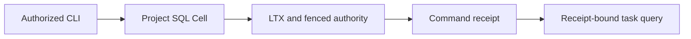

# Persistent taskboard reference application

Manage tasks in project-scoped SQL Cells using typed Rust commands. Each
project's task identities, revisions, assignments, and closure decisions
commit within one Cell. Request outcomes share that transaction and replies
wait for Cellule's durable publication gate.



## Run a complete journey

From the repository root, with Rust 1.97 and Docker Compose installed:

```sh
sh cookbook/scripts/taskboard.sh
```

The command starts persistent local storage, creates a task, discards its reply
and resolves the retained evidence, assigns Alice, closes the task, and verifies
a read requiring the closure receipt. Expected output is a JSON object with
`"scenario":"passed"`, `"closed":true`, `"revision":3`, an assignment to
`alice`, the project key, and the observed receipt. Repeat runs create new demo
projects while retaining previous data. The transport test separately injects
an actual lost reply.

The node drains on both success and error paths. Logs go to stderr and
application output goes to stdout. Library consumers need no CLI or listener.

## Use domain commands

Create `create-task.json` containing:

```json
{"operation":"create","id":1,"title":"Review the release"}
```

Prepare a mutation file before dispatch, then apply it to a project:

```sh
sh cookbook/scripts/taskboard.sh prepare release create-task.json create-task.mutation.json
sh cookbook/scripts/taskboard.sh apply cookbook/.state/taskboard release create-task.mutation.json
sh cookbook/scripts/taskboard.sh resolve cookbook/.state/taskboard release create-task.mutation.json
sh cookbook/scripts/taskboard.sh list cookbook/.state/taskboard release
```

The mutation file is bound to its project. Retain it unchanged. An uncertain reply requires resolution of
that original identity; `unknown` or `expired` does not prove absence. An
`absent` outcome permits retry of the same mutation while it remains valid.
Prepared identities have a five-minute validity window. Successful resolutions
return the recorded domain output and commit sequence. Durable rejections
return their output and receipt and exit nonzero when applied.

| Operation JSON | Domain rule |
| --- | --- |
| `{"operation":"create","id":1,"title":"Review the release"}` | Positive, unused project-local identity; a nonempty trimmed title of at most 200 UTF-8 bytes. |
| `{"operation":"assign","id":1,"expected_revision":1,"assignee":"alice"}` | Task is open and revision matches; assignee is null or at most 80 UTF-8 bytes. |
| `{"operation":"close","id":1,"expected_revision":2}` | Task is open and revision matches; closure advances its revision. |

Project keys contain 1–64 lowercase ASCII letters, digits, and internal hyphens.
Pagination uses an exclusive positive task-ID cursor and a limit of 1–100.
Listings are ordered by task identity; separate calls do not form a long-lived
snapshot. A receipt from another project cannot be used as a read minimum.

## Recovery and contracts

Stop the app, retain the object volume, remove its local working directory,
then list the same project. The new signed session acquires ownership through
the framework and restores the authority-pinned root. No bucket listing picks
the recovery state. An ungracefully killed process can delay takeover until
its 30-second session lease expires; a live owner must never be stolen.

| Contract | Implementation |
| --- | --- |
| Cell identity | Stable namespace plus canonical project key and fixed application/tenant IDs. |
| Schema | Checked version-one migration in `src/schema.sql`. |
| Commands | `ChangeTask`, operation 1, codec version 1; input/output capped at 1 KiB. |
| Reads | `ListTasks`, operation 2, codec version 1; at most 100 tasks and 64 KiB. |
| Business failure | Durable `invalid`, `not_found`, or `conflict`, distinct from transport/storage errors. |
| Contention | Expected revision prevents lost updates; closed tasks cannot be reassigned. |
| Observability | JSON domain outcomes and receipts; framework tracing enabled through `RUST_LOG`. |

This application uses a local OS principal, not remote user authentication.
Changes to domain sources alter the module digest. The current support rejects
old stored code/schema after such a change; resetting disposable development
storage is appropriate only when preserving it is unnecessary. A compatible
upgrade requires explicit retained code/migration handling and qualification.

## Evidence

The public integration suite verifies the complete domain journey, request
replay, two competing editors, durable validation/terminal outcomes, bounded
pagination, project and receipt isolation, cold restore after all working
files are removed, and signed peer reply loss. Wire bytes and canonical keys
have compatibility fixtures. The separate process scenario verifies persistent
S3 state and request outcomes across independent CLI invocations.

The catalog's remaining apps, fleet networking, follower-durability paths,
cloud providers, measured scale, and upgrade qualification are not established
by this application's local tests.
