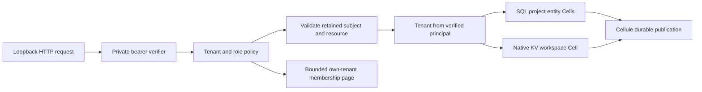

# Tenant workspace

A complete local HTTP service with verified bearer membership, two isolated
tenants, conditional project documents, tenant preferences, and bounded tenant
administration. Acme and Globex deliberately use the same project and preference
names. Authorization happens before Cell target selection and provisioning.



## Run

From the repository root, with Rust 1.97 and Docker Compose:

```sh
sh cookbook/scripts/tenant-workspace.sh
```

The default demo starts a real ephemeral loopback HTTP listener, uses private
random credentials, edits both tenants' identically named projects and
preferences, replays retained commands, resolves original outcomes, checks every
tenant route for cross-tenant denial, and drains HTTP requests and the node.
It prints one `scenario: passed` record and exits unsuccessfully on failure.
The [workspace guide](../../README.md) explains persistent storage and reset.

Start a server explicitly:

```sh
sh cookbook/scripts/tenant-workspace.sh init /tmp/workspace-credentials.json
sh cookbook/scripts/tenant-workspace.sh serve cookbook/.state/tenant-workspace /tmp/workspace-credentials.json 127.0.0.1:18080
```

`init` creates six random 256-bit tokens in a new file, with mode 0600 on Unix,
fsyncs it and its directory, and refuses overwrite. It prints only the path.
Load a token from that private file in a separate terminal; do not put it in a
URL. The local profile requires loopback binding. HTTP transport, authentication,
and authorization belong to this application, independently of Cellule storage
transport and authority.

```sh
WORKSPACE_TOKEN=$(python3 -c 'import json; d=json.load(open("/tmp/workspace-credentials.json")); print(next(m["token"] for m in d["members"] if m["subject"]=="acme-admin"))')
curl --fail-with-body -H "Authorization: Bearer $WORKSPACE_TOKEN" http://127.0.0.1:18080/v1/me
curl --fail-with-body -H "Authorization: Bearer $WORKSPACE_TOKEN" http://127.0.0.1:18080/v1/tenants/acme/projects/launch
```

The private startup registry is an included local identity provider. It is
bounded to 32 members, verifies canonical opaque tokens with constant-time
[BLAKE3 hash equality](https://docs.rs/blake3/latest/blake3/struct.Hash.html),
and keeps secrets out of Debug, response bodies, readiness output, and logs.
Membership changes take effect after a drain and restart; there is no hot
revocation or wildcard administrator. An embedding can replace this verifier
with its own trusted identity provider while retaining the policy and target
selection boundary. Keep credential files outside disposable SQLite directories.
The runnable profile is qualified on Unix with private file permissions.

## Public routes and policy

| Route | Method | Role | Behavior |
| --- | --- | --- | --- |
| `/healthz` | GET | Public | Storage, lease, and task readiness; no tenant data. |
| `/v1/me` | GET | Verified member | Own subject, tenant, and role. |
| `/v1/tenants/{tenant}/projects/{project}` | GET | Any own-tenant member | One project document and its receipt. |
| Same project route | PUT | Editor or admin | Conditional create/replacement; durable conflict is HTTP 409. |
| Project route plus `/resolve` | POST | Editor or admin | Original caller's retained outcome, without dispatching the mutation. |
| `/v1/tenants/{tenant}/preferences` | GET | Any own-tenant member | Both supported preferences in one native KV query. |
| Same preferences route | PUT | Admin | Conditional theme or locale edit; durable conflict is HTTP 409. |
| Preferences route plus `/resolve` | POST | Admin | Original admin's retained outcome. |
| `/v1/tenants/{tenant}/admin/members` | GET | Admin | Only own-tenant memberships; `limit=1..10`, exclusive `after` subject cursor. |

Every protected route authenticates before parsing its body, checks the claimed
tenant against the verified membership, and applies the role policy before
selecting targets. `Principal` can only be constructed by verification. Typed
clients repeat subject, resource, and role checks before preparing commands.
There is no platform-wide administrative access.

Anonymous or invalid credentials receive uniform HTTP 401. Another tenant or
an insufficient role receives uniform HTTP 403, independent of that tenant's
resource existence. Unknown body/query fields and raw target hints are rejected.
A receipt from another tenant, project, or primitive cannot select that target;
it fails before dispatch. HTTP responses suppress infrastructure details while
local diagnostics preserve source error chains.

## Retain before sending

A mutation freezes version, tenant claim, verified subject, logical resource,
original identity, and exact change. The server derives the target from the
verified tenant and compares the retained resource to the route. Moving a
retained `launch` edit to `support`, or assigning it another tenant or subject,
fails before dispatch. Changing a command under the same request identity
cannot silently replace its original result.

```sh
cat > /tmp/workspace-project.json <<'JSON'
{"expected_revision":null,"title":"Acme launch","description":"A private project"}
JSON
sh cookbook/scripts/tenant-workspace.sh prepare /tmp/workspace-credentials.json acme-admin project:launch /tmp/workspace-project.json /tmp/workspace-project.mutation.json
curl --fail-with-body -X PUT -H "Authorization: Bearer $WORKSPACE_TOKEN" -H 'Content-Type: application/json' --data-binary @/tmp/workspace-project.mutation.json http://127.0.0.1:18080/v1/tenants/acme/projects/launch
curl --fail-with-body -X POST -H "Authorization: Bearer $WORKSPACE_TOKEN" -H 'Content-Type: application/json' --data-binary @/tmp/workspace-project.mutation.json http://127.0.0.1:18080/v1/tenants/acme/projects/launch/resolve
```

Null revision requires absence. An update supplies the exact positive revision
from a prior read. Preparation needs no storage, writes a new private mutation
file, fsyncs it and its directory, and refuses overwrite. Preserve the file
unchanged on retry or unknown outcome. Identities last five minutes;
`expired` reports admission metadata before dispatch and explicitly does not
prove absence or a prior outcome. Resolution is authorized under
the current membership and cannot restore revoked permissions.

Preference changes use resource `preferences` and one of these shapes:

```json
{"key":"theme","expected":null,"value":"dark"}
{"key":"locale","expected":null,"value":"fr"}
```

Read preferences to obtain the exact opaque 56-character native version for a
later conditional edit. Supported themes are `light`/`dark`, locales `en`/`fr`.
No arbitrary KV key or scope is exposed. Reads accept an optional
`X-Cellule-Receipt` header containing the exact JSON receipt returned by the
same resource; the typed client checks its Cell before dispatch, and native
reads enforce incarnation and sequence evidence.

## Topology, limits, and lifecycle

| Contract | Implementation |
| --- | --- |
| Tenant identity | Stable Acme and Globex IDs compiled into the application; never derived from unchecked ingress strings. |
| Project scope | Canonical configured keys `launch` and `support`; one SQL entity Cell for each key and tenant, at most four project Cells. |
| Preferences | One fixed native KV shard per tenant, with constant `workspace` scope and two supported keys; at most two KV Cells. |
| Atomicity | A project revision and its document change in one SQL transaction. A preference version and its value change in one native KV transaction. These are separate receipt and transaction domains. |
| Bounded data | 128-byte project title, 512-byte description, two preferences, 32 configured memberships, and member pages up to ten entries. |
| HTTP admission | 32 requests, 4-KiB JSON bodies, strict fields, and 15-second observation deadlines. Timeout requires retaining mutation evidence because accepted work may still finish. |
| Host | Shared explicit worker/memory/disk budgets, 64-MiB Cell limit, 16-MiB capture limit, enrolled signed node lease, supervised native maintenance. |
| Acquisition | Authorized resources open lazily. Listener readiness does not assert ownership of every possible Cell; a live foreign owner causes unavailable data operations without stealing its lease. |
| Compatibility | Checked schema version one, stable operation and codec IDs, fixed namespaces, and source/lockfile digests. Evolution is covered by the catalog's separate evolution application. |
| Shutdown | SIGINT/SIGTERM or readiness loss closes HTTP admission, drains accepted requests, then drains the native node before releasing leases and working files. |
| Hard crash | A successor must wait for the signed 30-second lease to expire; it restores the authority-pinned root into new session files and preserves interrupted-session evidence. |

The [public behavior suite](tests/application.rs) checks both directions of
isolation through all tenant routes, forged targets/subjects/resources/receipts,
zero native dispatch on denial, roles, private credentials, bounded bodies and
admin pages, concurrent project/KV edits, durable rejections, retained replay,
cold restore, and an accepted slow publication that finishes after HTTP
admission closes. The [process scenario](../../scenarios/tenant-workspace.py)
uses real HTTP and private persistent S3 storage across independent processes,
including discarded replies, SIGKILL, live-owner refusal, takeover, and drain.

Reuse `Workspace`, `WorkspaceClient`, and the domain types without starting a
listener; `router` is the concrete [Axum adapter](https://docs.rs/axum/0.8.8/axum/).
The embedding still owns provider construction, enrollment, credential verification,
readiness, listener configuration, and shutdown. The complete
[catalog](../../../docs/cookbook.md) records the remaining applications.
