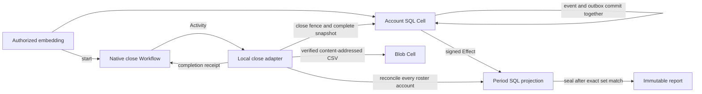

# Usage ledger

**Status: implemented; package quality checks and the persistent process journey
pass locally; CI qualification is pending.** This runnable reference
application keeps permanent usage events in account SQL Cells, projects events
eventually into one period Cell with signed Effects, closes each account behind
a local write fence, reconciles complete source snapshots, and publishes a
content-addressed CSV statement through Blob from a durable close Workflow.

All amounts are synthetic microcredits. This example teaches storage and
coordination patterns; it does not calculate prices, taxes, invoices, or
financial compliance. The embedding application chooses rates, authenticates
accounts, authorizes callers, and configures storage.



## Contracts demonstrated

- An account event ID permanently binds the exact event payload. Identical
  retries remain duplicates after the account closes; changed bytes conflict.
- Account SQL commits the new event and its signed projection intent together.
  Period projection is eventual, deduplicated, and independent of source truth.
- A period has a frozen, sorted roster of 1–8 account Cells. Each account
  accepts at most 32 events, and each event has a bounded category, amount, and
  event-time window.
- Closing first marks the period as closing, then fences each account
  transactionally. The account persists its full sorted event snapshot with
  that fence, so retries return the original complete set.
- Reconciliation copies events missing from the period inbox and verifies
  already projected bytes, account count, digest, and total. Sealing fails if
  any account is missing or any projected event differs from its source set.
- The report is stored in the period SQL Cell before its CSV Blob is published.
  The Blob key is derived from the period and report digest; retries verify the
  existing object byte for byte. SQL sealing and Blob publication remain
  separate transactions.
- A native Workflow owns close Activity retries. The local loopback adapter is
  authenticated with an embedding-provided token; no credentials enter Workflow
  state or SQL records.

The demo deliberately leaves the second account's Effects undelivered until
after the close Workflow has sealed the statement. The account snapshots still
contain all accepted events. Later Effect delivery resolves as exact duplicate
projection, illustrating that a receipt from one Cell does not prove another
Cell has caught up.

## Run the journey

From the repository root:

```sh
sh cookbook/scripts/usage-ledger.sh demo /tmp/cellule-usage-ledger
```

The launcher starts the cookbook's local RustFS container and runs the retained
demo. The plan at `usage-ledger-demo-plan.json` is written and synced before
dispatch. It contains the exact period, roster, event IDs, values, and Activity
endpoint. The generated CSV is written to `usage-ledger-statement.csv` after it
is read back and verified from Blob.

Inspect period state with the tenant and period ID printed by the demo:

```sh
sh cookbook/scripts/usage-ledger.sh inspect /tmp/cellule-usage-ledger TENANT PERIOD_HEX
```

The typed library exposes `AccountClient`, `PeriodClient`, `CloseClient`, and
`StatementFiles` for embedding applications. Construct them only after the
embedding authorizes the tenant and account. The exported `Service` is a local
single-node cookbook assembly that opens fixed Cells and owns its workers; a
production embedding should assemble its own lifecycle and provider policy.

`CELLULE_COOKBOOK_ENDPOINT` selects the local S3-compatible storage endpoint.
`CELLULE_USAGE_LEDGER_ADAPTER_ENDPOINT` selects the canonical numeric loopback
Activity endpoint and must remain unchanged while a retained close Workflow is
running. `CELLULE_USAGE_LEDGER_ADAPTER_TOKEN` supplies its bearer token. The
post-publication delay variable is reserved for the crash scenario.

## Verification

The crate has focused public-behavior tests and a persistent process scenario.
The scenario kills the process after the Blob report is published but before
the Activity completion is recorded, restarts from the same state after native
leases expire, verifies byte-identical plan recovery, and checks late Effect
settlement and the final CSV. CI qualification remains pending until the
workspace checks and isolated scenario pass on the PR revision.
