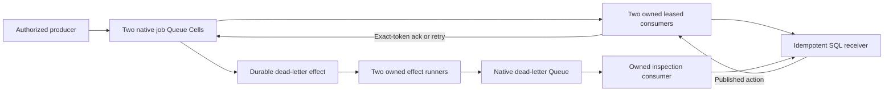

# Work queue

A complete job-delivery application with two native Queue shards, one native
dead-letter Queue, and a SQL receiver. The receiver commits outside the queue
transaction: a worker can crash after the action succeeds and before its
acknowledgement. A permanent application job key makes redelivery idempotent.



```sh
sh cookbook/scripts/work-queue.sh
```

The launcher starts the cookbook's pinned local S3 provider, runs the demo,
and drains all owned workers. Rust 1.97 and Docker Compose are required.
The library exposes `Producer`, typed receiver commands, application compilation,
and `spawn_workers`. The executable owns its fixed local tenant, OS-principal
authorization, storage prefix, signals, and signed process-local peer transport.
Network applications must supply their own authentication and peer trust policy.

## Contracts

| Boundary | Behavior |
| --- | --- |
| Producer | Nonzero canonical UUID and trimmed text of at most 512 bytes; the UUID selects one of two shards. Preserve the availability timestamp as well as bytes and mutation identity on retry. |
| Queue | Producer deduplication, one unpredictable lease token, receipt validation before emitting payloads, exact-token ack/retry, pause/resume, native attempt exhaustion, and bounded redrive. Native producer retention is 30 days. |
| Receiver | Permanent `(job UUID, delivery kind)` primary key; identical redelivery returns `Duplicate`, changed bytes return a durable conflict. A disabled receiver rejects new work through a published `Unavailable` outcome. |
| Dead letters | The source atomically records a native dead-letter effect after 20 attempts. Two owned effect runners deliver signed commands into the destination inbox; its consumer publishes a SQL inspection row before acknowledging. |
| Resources | Two job consumers, two effect runners, one inspection consumer, one shared maintenance task; one message per claim, 15-second leases, 100-ms retry/idle delays, fixed four-Cell topology. |
| Drain | Workers stop admission, finish accepted commands and settle completed actions. Lease renewal remains live until runtime drain. Worker failure closes readiness. Unknown claim/action/ack outcomes fail the worker; lease recovery plus business-key deduplication makes later redelivery safe. |
| Inspection | Lifetime action/dead-letter totals and current-read keyset pages of 1–100 rows ordered by `(job, dead)`. The composite cursor preserves both kinds of row for a job. |

The queue and receiver do not promise a transaction spanning external systems.
Replace the SQL receiver with an external service that honors the same durable
business-key contract. An arbitrary email, payment, or HTTP call that ignores
that key can repeat its action after a lost acknowledgement.

## Retain operations before dispatch

Every ingress mutation uses the same prepare/apply/resolve flow. Preparation
runs without storage, writes a version-one JSON record with a five-minute
request identity, fsyncs it and its parent, and refuses to overwrite it.
The record is bound to this application's fixed local installation.

```sh
cat > /tmp/job.json <<'JSON'
{"operation":"submit","job":{"id":"018f7ce0-67d0-7000-8000-000000000001","body":"Generate the report"},"available_at_ms":0}
JSON
sh cookbook/scripts/work-queue.sh prepare /tmp/job.json /tmp/job.mutation.json
sh cookbook/scripts/work-queue.sh apply cookbook/.state/work-queue /tmp/job.mutation.json
sh cookbook/scripts/work-queue.sh resolve cookbook/.state/work-queue /tmp/job.mutation.json
sh cookbook/scripts/work-queue.sh worker cookbook/.state/work-queue 5
sh cookbook/scripts/work-queue.sh inspect cookbook/.state/work-queue
sh cookbook/scripts/work-queue.sh info cookbook/.state/work-queue
```

An availability timestamp of zero means already due. Repeated application
returns the original result; resolution never dispatches. A missing result
within retention is reported as absent. Unknown or expired evidence exits with
an error; expiry does not prove a command never ran. The CLI prints published
business rejections and exits unsuccessfully. Native outcomes in mutation
output are diagnostic Rust enum strings; inspection and progress use JSON
fields. The binary prints source error chains on stderr.

Inspection accepts an optional JSON cursor from `next` and a limit, for example
`inspect STATE_DIRECTORY '{"job_id":"018f7ce0-67d0-7000-8000-000000000001","dead":false}' 20`.
Use `-` to begin; a null `next` ends the traversal. Pages are current reads, so
concurrent inserts before the cursor require a new traversal. This query uses
codec version two; mutation codecs remain version one.

Other operation JSON shapes use the same preparation flow:

```json
{"operation":"pause","shard":0}
{"operation":"resume","shard":0}
{"operation":"enabled","value":false}
{"operation":"redrive","shard":0,"limit":1}
```

Run one local installation process at a time. Its signed 30-second node lease
prevents another process from stealing a live writer. SIGINT and SIGTERM drain;
interrupted mutations exit unsuccessfully so callers retain their evidence,
while a worker stops successfully after settling accepted work.
SIGKILL requires waiting for lease expiry before takeover. The optional worker
arguments bound serving to 1–3600 seconds and delay a published action's ack
by 0–10000 milliseconds. That checkpoint is exercised by the fault scenario;
graceful shutdown skips the delay and settles immediately. Lease extension is
covered through the public API tests; normal bounded actions need no extension.

The receiver never prunes business-key deduplication rows. Its declared 64-MiB
Cell limit bounds storage and eventually rejects writes; a production embedding
must choose a retention or partition policy consistent with its external action
contract. Redrive keeps the original business key. A payload conflict cannot be
repaired by changing the job's bytes under that key.

## Evidence and reuse

The [public behavior suite](tests/application.rs) covers producer resolution,
competing consumers, stale tokens, lease extension/retry, pause/resume, exact-root
restart, permanent receiver deduplication, signed native dead-letter delivery,
redrive, slow durable publication, and graceful drain at the publication checkpoint.
Consumers and effect runners share a 15-second lease budget; publication and
receipt validation consume part of that budget before delivery. A terminal
dead-letter effect failure closes readiness and reports its source receipt.
The [process scenario](../../scenarios/work-queue.py) kills a worker after its
receiver publication, verifies live-owner refusal, waits for expiry, restores,
and proves attempt-two redelivery produces one logical action. It also drives
exhaustion, inspection, redrive, and durable conflicts across independent
processes. The driver waits for exact receiver checkpoints with a bounded deadline, then
drains and checks durable source and destination state. Run process tests in CI
or an isolated source snapshot with private
storage. No cloud account or framework test fixture is used by the application.

Source, dependency lock, native schemas, operation IDs, and namespace topology
are pinned contracts. An existing installation rejects an incompatible source
build until explicit schema/release evolution; this application does not invent
a migration bypass. See the [workspace guide](../../README.md) and
[catalog](../../../docs/cookbook.md) for the remaining applications.
