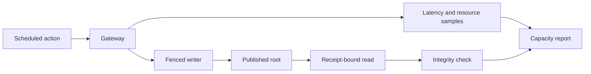

# Application qualification and performance

The application integration suite tests typed writes, receipt-bound reads, recovery,
peer routing, reader recruitment, rollout, and process fleets. Run performance
scenarios only against a disposable bucket and a fresh evidence directory.

The dated reports below preserve measurements from their stated source revisions.
They are not current capacity claims. Use the [quickstart](../../docs/quickstart.md)
and [qualification runner](qualification/run.sh) for a fresh run.

| Scenario | Entry | Evidence |
| --- | --- | --- |
| Local typed action | [Quickstart](../../docs/quickstart.md) | Write, publish, read-back. |
| Three-process RustFS | [`qualification/run.sh`](qualification/run.sh) | Local and forwarded gateway calls, receipts, drained sessions. |
| Entity fleet and scaling | [`qualification/entities.py`](qualification/entities.py), [`scale.py`](qualification/scale.py) | Isolated Cell ledgers and bounded traffic. |
| Fixed 12-Cell write capacity | [`qualification/scale.py`](qualification/scale.py) with `--workload capacity` | Hot, uniform, and skewed offered-rate ramps with receipt and overload checks. |
| Fixed 12-Cell follower-proof capacity | [`qualification/scale.py`](qualification/scale.py) with `--workload capacity-follower` | Networked follower proofs, offered-rate ramps, and final root coverage. |
| Paired follower-store diagnostic | [`qualification/follower.py`](qualification/follower.py) | Hashed binaries, five alternating pairs, private Docker volumes, append batches and bytes, exact cold readback; separate from application TPS. `--profile d1-matrix` adds all 1/8/32-lane × 1/16/64-frame cases for both coverage modes. |
| Primary 64-Cell write diagnostic | [`qualification/write.py`](qualification/write.py) | Frozen application binary, four-CPU/eight-GiB owner limits, two selected followers, 60-second uniform upsert windows, complete command and overwritten-value audit; one repeat is not qualification. |
| Small-KV fleet write diagnostic | [`qualification/write.py`](qualification/write.py) with `--profile small-kv-fleet-v1` | 1,000 Cells, 96-byte values, private 4-GiB tmpfs per node, three eight-CPU/16-GiB node caps, two selected followers, 60-second uniform write windows through 15,000/s; fleet and per-owner TPS and scheduled latency, complete command/root audit. Actual shared VM capacity remains separately recorded. |
| Small-KV write attribution | [`qualification/write.py`](qualification/write.py) with `--profile small-kv-attribution-v1` | The same small-KV traffic gates, plus a declared 60-second idle control after seeding. Separate Cell renewal/publication CAS observations and pre-enqueue node-log waits; absent or cancelled phases remain explicit. No new application SQL during idle; final traces must drain without loss. |
| Small-KV attribution with provisioned backend | [`qualification/write.py`](qualification/write.py) with `--profile small-kv-attribution-v2` | Same traffic and integrity gates; external RustFS retains two CPUs/two GiB and persistent storage, with explicit 65,536 soft/hard file limits. Verify its actual process/cgroup limits before and after load and reject descriptor exhaustion. This environment correction is separate from framework gains. |
| Resident owner population | [`qualification/population.py`](qualification/population.py) | One eight-CPU/16-GiB owner at 64/256/1,000/2,000 Cells, first durable writes and exact reads, idle CPU, memory, descriptors, lease renewal, and drain; separate from traffic capacity. |
| Sparse owner point reads | [`qualification/owner_reads.py`](qualification/owner_reads.py) | 2,000 resident Cells, one seeded key each, receipt-bound local reads at 5,000–50,000/s; generator and bounded evidence writer share the eight-CPU/16-GiB owner budget; read phase, linked SQL-slot lifetime and export drain audits; separate from mixed load and the full dataset. |
| Generator timing | [`qualification/pacer.py`](qualification/pacer.py) | Five rounds of absolute deadlines, bounded handoff, complete arrival timestamps, and CPU charges; separate from application capacity. |
| Reader and rollout variants | [Application integration suite](tests/integration.rs) | Selection, replacement, and recovered receipts. |

Set `CELLULE_TEST_ENDPOINT`, `CELLULE_TEST_BUCKET`, and a unique
`CELLULE_TEST_PREFIX`; supply matching provider credentials. The
[qualification guide](../cellule-runtime/docs/delivery.md) distinguishes local
correctness from provider, fleet, and production evidence. Local and Compose
runs do not establish production capacity.

## Dated evidence

| Question | Reports |
| --- | --- |
| How did the local and three-process baselines behave? | [Local](performance/2026-09-21-local.md), [three-node](performance/2026-09-21-three-node-local.md), [three-process](performance/2026-09-21-three-process-local.md), [balanced fleet](performance/2026-09-21-balanced-three-process-local.md) |
| What did the public action and deployment probes show? | [Action](performance/2026-09-25-public-host-action.md), [RustFS](performance/2026-09-25-public-host-rustfs.md), [three-node Compose](performance/2026-09-27-three-node-compose.md), [replica Compose](performance/2026-09-27-replica-compose.md) |
| How were reader recruitment and publication evaluated? | [Recruitment](performance/2026-09-27-reader-recruitment.md), [publication](performance/2026-09-27-reader-publication.md), [expiry](performance/2026-09-27-reader-expiry.md), [loss during load](performance/2026-09-27-reader-loss-during-load.md) |
| What were the scale and mixed-load limits? | [Scaling](performance/2026-09-27-reader-scaling.md), [mixed readers](performance/2026-09-27-mixed-readers.md), [host readers Compose](performance/2026-09-27-host-readers-compose.md), [qualification notes](performance/2026-09-27-qualification-notes.md) |
| Is the writable Cell limit established? | [Write capacity measurement status](performance/2026-09-29-write-capacity.md) |
| How is write optimization progressing? | [Implementation record](performance/2026-10-05-write-optimization.md), [design and node target](../cellule-runtime/docs/write-performance-design.md) |
| What explains celld's architecture and the small-KV reference? | [Pinned celld/Cellule review and read/SQL delivery decisions](../cellule-runtime/docs/celld-architecture-performance.md) |

Read each result with its workload, provider, process topology, failure status,
and source revision. An integrity pass at an overloaded point does not establish
supported throughput.
