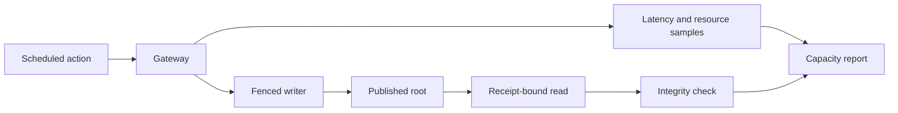

# Application qualification and performance

The application integration suite tests typed writes, receipt-bound reads, recovery,
peer routing, reader recruitment, rollout, and process fleets. Run performance
scenarios only against a disposable bucket and a fresh evidence directory.

The dated reports below preserve measurements from their stated source revisions.
They are not current capacity claims. Use the [quickstart](../../docs/quickstart.md)
and [qualification runner](qualification/run.sh) for a fresh run.

| Scenario | Entry | Evidence |
| --- | --- | --- |
| Local typed action | [Quickstart](../../docs/quickstart.md) | Write, publish, read-back. |
| Three-process RustFS | [`qualification/run.sh`](qualification/run.sh) | Local and forwarded gateway calls, receipts, drained sessions. |
| Entity fleet and scaling | [`qualification/entities.py`](qualification/entities.py), [`scale.py`](qualification/scale.py) | Isolated Cell ledgers and bounded traffic. |
| Fixed 12-Cell write capacity | [`qualification/scale.py`](qualification/scale.py) with `--workload capacity` | Hot, uniform, and skewed offered-rate ramps with receipt and overload checks. |
| Fixed 12-Cell follower-proof capacity | [`qualification/scale.py`](qualification/scale.py) with `--workload capacity-follower` | Networked follower proofs, offered-rate ramps, and final root coverage. |
| Reader and rollout variants | [Application integration suite](tests/integration.rs) | Selection, replacement, and recovered receipts. |

Set `CELLULE_TEST_ENDPOINT`, `CELLULE_TEST_BUCKET`, and a unique
`CELLULE_TEST_PREFIX`; supply matching provider credentials. The
[qualification guide](../cellule-runtime/docs/delivery.md) distinguishes local
correctness from provider, fleet, and production evidence. Local and Compose
runs do not establish production capacity.

The reference fleet's TCP transport bounds connection setup to 250 ms within
its overall request deadline. A setup timeout is a known pre-dispatch failure;
a deadline after connection remains an unknown outcome. This lets reader
selection move past a killed node while preserving the full reply budget for
connected peers. Reader-loss evidence still requires every load lane to make
progress before, during, and after replacement, with receipt minima enforced.

Scheduled entity traffic retains samples in its bounded window buffer and
flushes evidence after offered work drains, before reporting the measured
window. File I/O cannot delay the next offered arrival; its cost still counts
in the window duration. Lateness, concurrency, receipt, and drain-grace gates
remain unchanged, and missed arrivals remain visible in the raw rows.

The follower capacity lane preserves the serving root snapshot in
`capacity-roots-3.tsv`; a follower-acknowledged write can still be waiting for
object publication there. After all hosts finish shutdown and withdraw their
live sessions, the driver reads authority again and requires idle Cells with
the original epoch and incarnation. Each exact final root is authenticated
and restored through a fresh replica onto fresh disk. Its SQLite commit
sequence must match the root, and its invoice count must equal every
acknowledged write without loss or duplication. `capacity-final-roots.tsv`
retains this proof. The verifier applies the original strict root coverage
check to these drained roots and reports the earlier snapshot's lag separately.
Both snapshots retain the LTX transaction ID, checksum, and BLAKE3 digest of
the authenticated database restored onto fresh disk. Compaction may change a
root manifest digest at the same command sequence, but its LTX position and
restored database bytes must remain identical. Missing position or restored
digest evidence fails verification; earlier artifacts must be regenerated.
This final recovery check runs outside the scheduled load windows; their
latency, throughput, resource, overload and drain-grace limits stay unchanged.

## Dated evidence

| Question | Reports |
| --- | --- |
| How did the local and three-process baselines behave? | [Local](performance/2026-09-21-local.md), [three-node](performance/2026-09-21-three-node-local.md), [three-process](performance/2026-09-21-three-process-local.md), [balanced fleet](performance/2026-09-21-balanced-three-process-local.md) |
| What did the public action and deployment probes show? | [Action](performance/2026-09-25-public-host-action.md), [RustFS](performance/2026-09-25-public-host-rustfs.md), [three-node Compose](performance/2026-09-27-three-node-compose.md), [replica Compose](performance/2026-09-27-replica-compose.md) |
| How were reader recruitment and publication evaluated? | [Recruitment](performance/2026-09-27-reader-recruitment.md), [publication](performance/2026-09-27-reader-publication.md), [expiry](performance/2026-09-27-reader-expiry.md), [loss during load](performance/2026-09-27-reader-loss-during-load.md) |
| What were the scale and mixed-load limits? | [Scaling](performance/2026-09-27-reader-scaling.md), [mixed readers](performance/2026-09-27-mixed-readers.md), [host readers Compose](performance/2026-09-27-host-readers-compose.md), [qualification notes](performance/2026-09-27-qualification-notes.md) |
| Is the writable Cell limit established? | [Write capacity measurement status](performance/2026-09-29-write-capacity.md) |

Read each result with its workload, provider, process topology, failure status,
and source revision. An integrity pass at an overloaded point does not establish
supported throughput.
