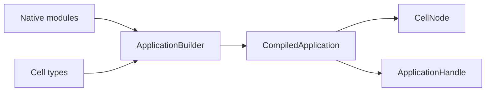

# cellule-app

Declare a stable Cell topology, compile native Rust modules, and expose typed
application handles. The host owns runtime lifecycle and network wiring.

Each SQL Cell owns its SQLite database, request ledger, and capture/recovery
lineage. Cells can share worker threads and resource budgets within a host,
and run on different nodes under separate fenced ownership. The application
builder declares Cell types, partitions, schemas, and operations; the host
handles placement, activation, routing, and recovery.



| Guide | Topic |
| --- | --- |
| [API guide](../../docs/api.md) | Compile an application, bind handles, invoke commands, and handle outcomes. |
| [Topology](docs/topology.md) | Stable IDs, shards, entity partitions, and descriptors. |
| [Invocations](docs/invocation.md) | Typed clients, read policy, and receipts. |
| [Examples and tests](docs/examples.md) | Runnable paths and proof levels. |

This complete declaration is compiled as a crate doc test:

```rust
use cellule_app::CellType;
use cellule_runtime::{CatalogRole, NamespaceId};

fn orders_topology() -> cellule_runtime::Result<CellType> {
    CellType::new(
        "orders",
        "orders",
        NamespaceId::from_bytes([1; 16]),
        CatalogRole::Sql,
        1,
    )?
    .with_entity_partitions()
}

assert!(orders_topology().is_ok());
```

For SQL Cells addressed directly by canonical 16-byte UUIDs, use
`CellType::entity_uuid`. It has a separate persisted partition version from
the 33-byte hashed entity mode. See [Topology](docs/topology.md).

```sh
cargo run -p cellule-app --example basic --locked
cargo run -p cellule-app --example sql --locked
cargo run -p cellule-app --example blob --locked
cargo run -p cellule-app --example workflow --locked
cargo run -p cellule-app --example schedules --locked
cargo test -p cellule-app --locked
```
