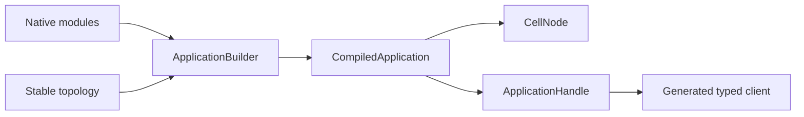
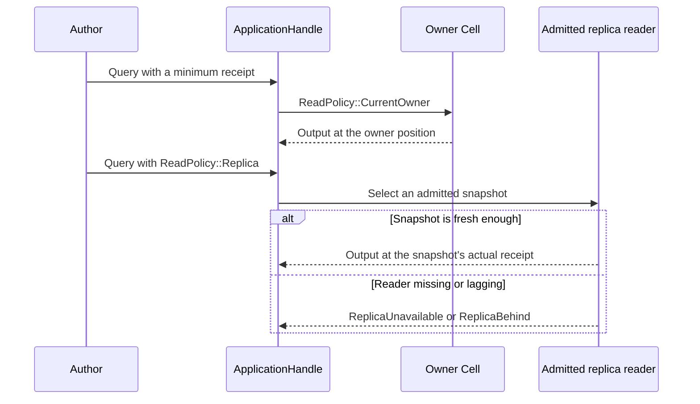

# Application guide

| Document | For |
| --- | --- |
| [Cellule API guide](../../../docs/api.md) | Public entry points, typed capabilities, receipts, and outcome handling. |
| [Topology](topology.md) | Define identity, partitioning, and descriptor stability. |
| [Invocations](invocation.md) | Send typed commands and receipt-bound queries. |
| [Examples and tests](examples.md) | Run the authoring and end-to-end paths. |
| [Crate entry](../README.md) | Minimal compiling declaration. |

Applications are statically linked Rust modules. They receive typed execution
capabilities, not raw authority, storage credentials, or network access.

## Contents

- [Overview](#overview)
- [Declare a topology](#declare-a-topology)
- [Identity and routing contracts](#identity-and-routing-contracts)
- [Read policies](#read-policies)
- [Verification map](#verification-map)
- [See also](#see-also)

<a id="overview"></a>
## Overview

Compile native Rust modules into one deterministic application descriptor. Use
typed handles or generated clients to address Cells and invoke registered
commands and queries. The host owns runtime lifecycle and transport wiring.



The author boundary ends at typed capabilities:

```text
author modules + stable topology
        |
        v
  ApplicationBuilder
        |
        v
  CompiledApplication  (frozen descriptor and digest)
        |
        +--> CellNode           host: runtime, storage, peers, transport
        `--> ApplicationHandle  author: typed client, commands, receipts
```

`ApplicationBuilder` rejects duplicate Cell type identities; the compiled
descriptor digest is the routing contract shared by handles and generated
clients.

## Declare a topology

This complete example is compiled by `cargo test -p cellule-app --doc` as the
[crate entry](../README.md) doc test.

```rust
use cellule_app::CellType;
use cellule_runtime::{CatalogRole, NamespaceId};

fn orders_topology() -> cellule_runtime::Result<CellType> {
    CellType::new(
        "orders",
        "orders",
        NamespaceId::from_bytes([1; 16]),
        CatalogRole::Sql,
        1,
    )?
    .with_entity_partitions()
}

assert!(orders_topology().is_ok());
```

| Example | Demonstrates |
| --- | --- |
| [basic.rs](../examples/basic.rs) | Module descriptors, registration, KV, and Queue. |
| [sql.rs](../examples/sql.rs) | A real command and receipt-bound read. |
| [blob.rs](../examples/blob.rs) | A multipart Blob write and receipt-bound read. |
| [workflow.rs](../examples/workflow.rs) | A durable activity. |
| [schedules.rs](../examples/schedules.rs) | A scheduled cross-Cell effect. |

Run one path at a time from the workspace root:

```sh
cargo run -p cellule-app --example basic --locked
cargo run -p cellule-app --example sql --locked
cargo run -p cellule-app --example blob --locked
cargo run -p cellule-app --example workflow --locked
cargo run -p cellule-app --example schedules --locked
```

## Identity and routing contracts

| Surface | Contract |
| --- | --- |
| `ApplicationHandle::new` | Checks the application name and client registry digest before calls start. |
| `cell_client!` | Binds explicit stable namespace/operation IDs and the declared `CellKey` type. |
| Fixed shards | `CellType::new` declares a bounded shard count. |
| Entity Cells | `with_entity_partitions` requires one declared shard; typed keys derive canonical 33-byte partitions. |
| Provisioning | `CellType::entity_partition` uses the same derivation as generated clients. |
| Explicit SQL/Effects | Accept validated entity targets. |
| Namespace primitives | KV, Blob, Queue, Cron, Workflow, and Activities require fixed shards. |

**Entity topology** changes the descriptor. It does not split SQLite state or
bypass catalog and host admission.

## Read policies

| Operation | Routing and proof |
| --- | --- |
| Default query | `ReadPolicy::CurrentOwner` keeps owner ordering. |
| Explicit replica query | `ReadPolicy::Replica` returns an admitted snapshot's actual receipt. |
| Minimum receipt | Still checks Cell, incarnation, and sequence. |
| Missing or lagging reader | Returns `ReplicaUnavailable` or `ReplicaBehind`; no owner fallback. |
| Commands, resolution, streams, lease validation | Always retain owner ordering. |



- The host wires `CellClient::with_read_replicas`, `ReplicaReadRouter`, and an
  authenticated `ReplicaPeerClient`.
- Selection and retries share one five-second deadline.
- Replica retries preserve each reader's original placement position, so a
  fallback does not reset round-robin ties for the next query. Outstanding
  attempts still take priority when choosing the least busy reader.
- Authors receive typed capabilities, not storage or transport handles.

## Verification map

| Test file | Evidence |
| --- | --- |
| `tests/contracts.rs` | Descriptor, digest, and identity contracts. |
| `tests/primitives.rs` | Typed primitive writes, read-back, and exact-root owner recovery. |
| `tests/host.rs` | Signed peers, duplicate results, and owner loss. |
| `tests/host/replicas.rs` | Reader recruitment, refresh, and cancellation during drain. |
| `tests/host/rollout.rs` | Additive release with retained code and recovered receipts. |
| `tests/entities.rs` | Generated entity routing and isolated request ledgers. |
| `tests/process_performance.rs` | Separate-process fleet workload; ignored unless explicitly selected. |

```sh
cargo test -p cellule-app --locked
```

- Public-host fixtures share one process.
- RustFS, constrained containers, and continuous-traffic rollout require the
  separate qualification environment.

The provider-backed `process_performance::reference_replica_retry_three_process_fleet`
case injects one initial replica refusal across three independent hosts. It
checks the same 12 successful reads, balanced receiver counts, automatic
recruitment/refresh, receipt readback, policy eviction and joined shutdown as the
ordinary process smoke. With an isolated RustFS bucket, prefix and explicit
credentials configured, run:

```sh
cargo test -p cellule-app --test integration --locked \
  process_performance::reference_replica_retry_three_process_fleet \
  -- --ignored --exact --nocapture
```

See [PERFORMANCE.md](../PERFORMANCE.md), [AGENTS.md](../AGENTS.md), and the
[framework quickstart](../../../docs/quickstart.md).

<a id="see-also"></a>
## See also

| Next step | Read |
| --- | --- |
| Typed commands, queries, and receipts | [Invocations](invocation.md) |
| Stable IDs, shards, and entity partitions | [Topology and descriptors](topology.md) |
| Runnable primitive paths and proof levels | [Examples and tests](examples.md) |
| Public entry points and outcome handling | [Cellule API guide](../../../docs/api.md) |
| Embedding and startup order | [Integrate Cellule into a service](../../../docs/framework.md) |
| Local runnable quickstart | [Run a Cellule application](../../../docs/quickstart.md) |
| Workloads and evidence boundaries | [Performance and qualification](../PERFORMANCE.md) |
| Minimal compiling declaration | [Crate entry](../README.md) |
