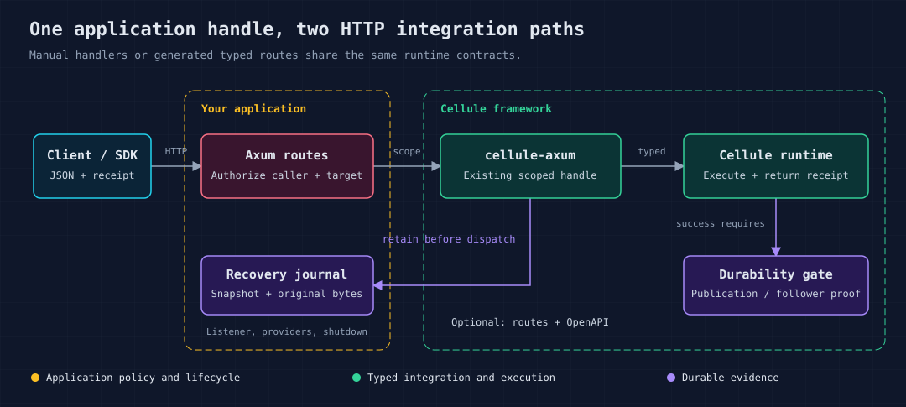
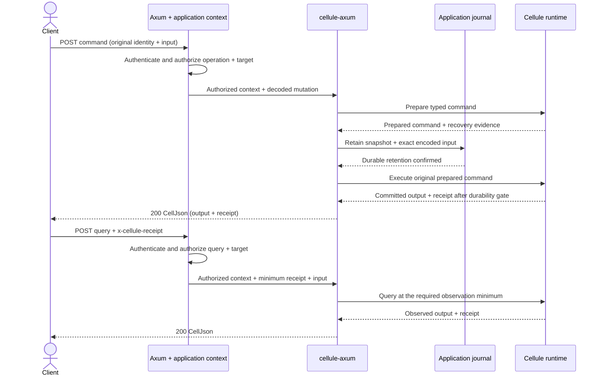

# cellule-axum

Connect an existing Cellule application to **Axum 0.8**. Use typed extractors
and receipt-bearing JSON in your own handlers, or enable `openapi` to generate
POST routes and their OpenAPI document together.



| Choose a path | Use it when |
| --- | --- |
| [Manual handlers](#write-a-manual-handler) | You need REST methods, custom DTOs, statuses, or validation against the authenticated principal. |
| [Generated typed routes](#generate-typed-routes-and-openapi) | Your registered command/query input and output are suitable for the authorized caller. |
| [OpenAPI for manual handlers](#document-manual-handlers-with-openapi) | You want schemas and error responses for existing Axum routes. |

Your application supplies the scoped `ApplicationHandle`, authentication,
tenant/resource authorization, providers, listener, and shutdown. The adapter
uses that handle; the runtime owns command execution, durable publication,
and receipts.

| Runnable example | Focus | Default port |
| --- | --- | --- |
| [`sql`](examples/sql.rs) | Manual REST handlers and receipt-bound reads. | 3000 |
| [`typed-api-service`](examples/typed-api-service/main.rs) | Typed routes, authorized context, OpenAPI, and recovery journal. | 3001 |
| [`application-builder-service`](examples/application-builder-service/README.md) | Native module registration, shared scoped factory, two tenants, leased host startup, and ordered shutdown. | 3002 |

The complete service examples have separate folders under `examples/`:

```text
examples/
├── sql.rs                        # manual REST and performance service
├── sql_metrics/                  # SQL service telemetry
├── http_load.rs                  # HTTP read load driver
├── typed-api-service/            # typed routes, authorization and OpenAPI
│   ├── main.rs
│   ├── support/mod.rs             # local module and runtime setup
│   └── recovery/mod.rs            # command evidence journal
└── application-builder-service/  # native builder and leased host integration
    ├── Cargo.toml
    └── src/
```

For the full application-to-host integration, run the standalone service from
the workspace root:

```sh
cargo run --manifest-path crates/cellule-axum/examples/application-builder-service/Cargo.toml --locked
```

Its HTTP layer uses Axum/OpenAPI; the `CellBinding`, compilation, and
`ApplicationBinding` APIs are reusable with other adapters and workers. It keeps
an independent manifest and lockfile so application-owned cookbook startup
dependencies stay outside the adapter crate.

## Try the typed API service

Run this from the Cellule workspace:

```sh
cargo run -p cellule-axum --example typed-api-service --features openapi --locked
```

The [typed API service](examples/typed-api-service/main.rs) binds `127.0.0.1:3001`.
It includes an authorized extractor, a SQLite recovery journal, typed routes,
and an OpenAPI document.

| Route | Request | Result |
| --- | --- | --- |
| `POST /total` | Mutation identity + integer input | `200`, committed total + receipt |
| `POST /total/read` | JSON `null`; optional `x-cellule-receipt` | `200`, observed total + receipt |
| `POST /recovery/{request_id}` | Original request ID | Resolve a retained command in the authorized scope |
| `GET /scope` | Authorized request | Selected Cell identity |
| `GET /ready` | No credentials | `204` when the initialized Cell can answer a query |
| `GET /openapi.json` | No credentials | OpenAPI for the generated total routes |

In a second terminal, create one mutation body, write it, and read at its receipt:

```sh
set -eu
now_ms=$(python3 -c 'import time; print(time.time_ns() // 1000000)')
request_id=$(python3 -c 'import uuid; print(uuid.uuid4())')
body=$(printf '{"identity":{"request_id":"%s","issued_at_ms":%s,"expires_at_ms":%s},"input":1999}' "$request_id" "$now_ms" "$((now_ms + 60000))")

reply=$(curl --fail-with-body --silent --show-error http://127.0.0.1:3001/total \
  -H 'Authorization: Bearer local-orders' \
  -H 'Content-Type: application/json' --data "$body")
printf '%s\n' "$reply"

receipt=$(printf '%s' "$reply" | python3 -c 'import json,sys; print(json.dumps(json.load(sys.stdin)["receipt"], separators=(",", ":")))')
curl --fail-with-body --silent --show-error http://127.0.0.1:3001/total/read \
  -H 'Authorization: Bearer local-orders' \
  -H 'Content-Type: application/json' \
  -H "x-cellule-receipt: $receipt" --data 'null'

curl --fail-with-body --silent --show-error http://127.0.0.1:3001/openapi.json
```

Keep `$body` unchanged for any retry. The tutorial credential authorizes only
its local fixture scope. Files and object storage are temporary; restarting
creates a fresh environment. Ctrl-C drains HTTP before runtime shutdown.

For REST routes `POST /orders` and `GET /orders/{id}`, run the
[SQL example](examples/sql.rs) on port 3000:

```sh
cargo run -p cellule-axum --example sql --locked
```

## Write a manual handler

Add the adapter alongside Axum and your Cellule application crates:

```toml
[dependencies]
axum = { version = "0.8", features = ["json"] }
cellule-app = "0.1"
cellule-axum = "0.1"
cellule-runtime = "0.1"
serde = { version = "1", features = ["derive"] }
```

This GET helper reads a registered query with unit input. `A` is your
`CellApplication`; `Q` is your `Query`. Supply a namespace declared by `A`
and replace `b"orders"` with your authorized resource scope.

```rust,no_run
use axum::{Router, routing::get};
use cellule_app::{ApplicationHandle, CellApplication};
use cellule_axum::{CellJson, Cellule, HttpError, MinimumReceipt};
use cellule_runtime::{NamespaceId, Query};
use serde::Serialize;

fn routes<A, Q>(handle: ApplicationHandle<A>, namespace: NamespaceId) -> Router
where
    A: CellApplication + 'static,
    Q: Query<Input = ()>,
    Q::Output: Serialize + Sync,
{
    Router::new()
        .route(
            "/total",
            get(move |app: Cellule<A>, minimum: MinimumReceipt| async move {
                let target = app.target_for_scope(namespace, b"orders")?;
                let observed = app.query::<Q>(&target, minimum.0, ()).await?;
                Ok::<_, HttpError>(CellJson::from(observed))
            }),
        )
        .with_state(handle)
}
```

Install authorization middleware before exposing the route. Choose the handle
and target from the caller's permitted tenant and resources; a tenant header
alone does not authorize access.

| Extractor | Where its capability comes from |
| --- | --- |
| `Cellule<A>` | Router state containing `ApplicationHandle<A>`. For larger state, implement Axum's `FromRef<ServiceState>` for the handle. |
| `RequestCellule<A>` | `Extension<ApplicationHandle<A>>` installed by application authorization middleware for this request. |

For a manual command, `MutationJson<T>` decodes the caller's identity and input.
Put it last because it consumes the body. Prepare and retain the command's
snapshot and exact encoded input before execution when work must survive
handler cancellation. See the [multi-tenant and recovery recipes](docs/README.md).

## Generate typed routes and OpenAPI

Add an application feature that forwards to the adapter's optional feature:

```toml
[features]
openapi = ["cellule-axum/openapi"]
```

Build with `--features openapi`. The OpenAPI snippets below use that same gate
and compile with the feature enabled or disabled. Utoipa 6 and `utoipa-axum`
are re-exported by the adapter.

**Generated commands and queries both use POST and return `200` with
`CellJson`.** Commands accept `MutationBody<C::Input>`; queries accept their
typed JSON input directly. Unit query input requires JSON `null`. Inputs need
`Deserialize` and `ToSchema`; outputs need `Serialize` and `ToSchema`.

This complete helper registers two routes and serves their document. Its type
parameters correspond to the concrete types in the runnable example:

| Parameter | Meaning | Example type |
| --- | --- | --- |
| `A` | Compiled application | `OrdersApp` |
| `C` | Command: integer input/output | `SetTotal` |
| `Q` | Query: unit input, integer output | `ReadTotal` |
| `X` | Authorized extractor + command evidence storage | `Authorized` |

```rust,no_run
#[cfg(feature = "openapi")]
mod typed_routes {
    use axum::{Json, Router, extract::FromRequestParts, routing::get};
    use cellule_app::{ApplicationHandle, CellApplication};
    use cellule_axum::{CellApi, CommandEndpoint, EndpointSpec};
    use cellule_runtime::{Command, Error, NamespaceId, Query};

    pub fn routes<A, C, Q, X>(
        handle: ApplicationHandle<A>,
        namespace: NamespaceId,
    ) -> Result<Router, Error>
    where
        A: CellApplication + 'static,
        C: Command<Input = i64, Output = i64>,
        Q: Query<Input = (), Output = i64>,
        X: CommandEndpoint<A, C> + FromRequestParts<ApplicationHandle<A>>,
        X::Rejection: Send,
    {
        let (router, document) = CellApi::<A, ApplicationHandle<A>>::new(handle.compiled())?
            .command::<C, X>(namespace, EndpointSpec::new("/total", "setTotal"))?
            .query::<Q, X>(namespace, EndpointSpec::new("/total/read", "readTotal"))?
            .into_router()
            .split_for_parts();

        // Add your API version, security schemes, and 401/403 responses here.
        Ok(router
            .route("/openapi.json", get(move || async move { Json(document) }))
            .with_state(handle))
    }
}
```

The parameters let this helper use your existing application and operations.
For other input/output types, use the full bounds on
[`CellApi::command` and `query`](src/api.rs). Returned `OpenApiRouter`s support
merge/nest before `split_for_parts`.

Implement `X` in your application:

1. `FromRequestParts` authenticates the caller and authorizes the operation and
   target before returning the context.
2. `CellEndpoint<A>` exposes its `ApplicationHandle<A>` and `CellTarget`.
3. `CommandEndpoint<A, C>::retain` atomically stores
   `prepared.snapshot().to_bytes()` and `prepared.input_bytes()`. Return only
   after both are durable; retention failure prevents dispatch. Identical
   evidence must be idempotent and conflicting bytes must be refused.

The [example extractor](examples/typed-api-service/main.rs) and
[SQLite journal](examples/typed-api-service/recovery/mod.rs) implement these contracts. Authenticate
in the extractor, or read an authorized context installed by middleware.



Registration checks namespace/module/codec contracts, route syntax and required
path-parameter schemas. Requests verify the handle's artifact and namespace.
Duplicate route shapes and operation IDs are refused **within one `CellApi`
builder**; validate the final document after merging separately built routers.

Add actual security schemes, 401/403 responses, API version and server URLs
alongside your middleware. Recovery, readiness and other manual routes need
their own annotations. Generate SDKs from the final exported document; see the
[OpenAPI and SDK recipe](docs/README.md#openapi-and-sdks).

## Document manual handlers with OpenAPI

Keep your own routes for GET requests, DTO mapping, custom success statuses or
principal-specific input validation. The `openapi` feature supplies
`CellJson<T>` / `MutationBody<T>` schemas, `HttpError` responses and
`params(MinimumReceipt)` for Utoipa annotations.

This complete GET example includes the annotation, document builder and Axum
routes. Substitute a namespace declared by your application and install
authorization before exposing the handler.

```rust,no_run
#[cfg(feature = "openapi")]
mod manual_openapi {
    use axum::{Json, Router, routing::get};
    use cellule_app::{ApplicationHandle, CellApplication};
    use cellule_axum::{CellJson, Cellule, HttpError, MinimumReceipt, utoipa};
    use cellule_runtime::{NamespaceId, Query};
    use utoipa::OpenApi;

    #[utoipa::path(
get,
path = "/total",
params(MinimumReceipt),
responses((status = 200, body = CellJson<i64>), HttpError)
)]
    async fn read_total<A, Q>(
        app: Cellule<A>,
        minimum: MinimumReceipt,
    ) -> Result<CellJson<i64>, HttpError>
    where
        A: CellApplication,
        Q: Query<Input = (), Output = i64>,
    {
        let target = app.target_for_scope(NamespaceId::from_bytes([1; 16]), b"orders")?;
        Ok(CellJson::from(
            app.query::<Q>(&target, minimum.0, ()).await?,
        ))
    }

    #[derive(utoipa::OpenApi)]
    #[openapi(paths(read_total))]
    struct ApiDoc;

    pub fn routes<A, Q>(handle: ApplicationHandle<A>) -> Router
    where
        A: CellApplication + 'static,
        Q: Query<Input = (), Output = i64>,
    {
        let document = ApiDoc::openapi();
        Router::new()
            .route("/total", get(read_total::<A, Q>))
            .route("/openapi.json", get(move || async move { Json(document) }))
            .with_state(handle)
    }
}
```

For commands, use `request_body = MutationBody<YourInput>` in the annotation
and `CellJson<YourOutput>` as the success body. Derive `ToSchema` on public
DTOs. HTTP schemas do not change native codecs or persisted formats.

## Understand replies and receipts

Both `CellJson::from(committed)` and `CellJson::from(observed)` serialize as:

```json
{
  "output": 1999,
  "receipt": {
    "cell": "0101010101010101010101010101010101010101010101010101010101010101",
    "incarnation": "02020202020202020202020202020202",
    "commit_sequence": 7
  }
}
```

These IDs illustrate the format; real replies identify the selected Cell.
A `Committed` command result follows the durability gate. A query receipt
records an observation; it does not claim that the query wrote anything.

Pass **all three receipt fields** to a subsequent query. `MinimumReceipt`
extracts the optional `x-cellule-receipt` JSON header. The runtime verifies its
Cell, incarnation and required observation position; a sequence alone is
insufficient. A receipt is an observation constraint, not an authorization
credential.

```rust
use axum::http::HeaderMap;
use cellule_axum::{HttpError, MINIMUM_RECEIPT_HEADER, ReceiptDto};
use cellule_runtime::{
    Receipt,
    identity::{CellId, IncarnationId},
};

fn main() -> Result<(), HttpError> {
    let receipt = Receipt {
        cell: CellId::from_bytes([1; 32]),
        incarnation: IncarnationId::from_bytes([2; 16]),
        commit_sequence: 7,
    };
    let mut headers = HeaderMap::new();
    headers.insert(
        MINIMUM_RECEIPT_HEADER,
        ReceiptDto::from(receipt).to_header_value()?,
    );
    Ok(())
}
```

Missing headers yield `None`. Malformed, duplicate, noncanonical or oversized
headers (over 256 bytes) return `400`. Sequences remain unsigned 64-bit JSON
integers. TypeScript clients need lossless decoding beyond
`Number.MAX_SAFE_INTEGER`; Python's standard JSON integer decoding preserves
the value, as used in the quickstart.

For DTO conversion, `CellJson::from(result).map(convert)` and `try_map(convert)`
retain the receipt. Mapping or serialization failures return
`invalid_published_result` with that receipt. For a custom success status,
convert to a response first and change only a successful response's status;
an unconditional Axum status tuple can overwrite a serialization error.

## Handle failures and uncertain commands

`HttpError` returns a fixed public `code` and `message` with
`Cache-Control: no-store`. The original source, rejection output, receipts and
pending evidence remain available through `std::error::Error::source` and
`into_source`. Private source strings, SQL, provider errors and local paths
stay out of public bodies.

| Failure | HTTP | Public code / evidence |
| --- | --- | --- |
| Invalid identity, input or receipt header | 400 | `invalid_request` |
| Malformed JSON / typed JSON mismatch | 400 / 422 | `invalid_request` |
| Body limit / missing JSON content type | 413 / 415 | `body_too_large` / `unsupported_media_type` |
| Identity reused for different command bytes | 409 | `request_conflict` |
| Durably rejected command | 409 | `command_rejected`, receipt |
| Pending command | 503 | `outcome_unknown`, original request ID |
| Published output decoding, mapping or serialization failure | 500 | `invalid_published_result`, receipt |
| Deadline before submission | 504 | `deadline_exceeded` |
| Capacity, draining, fencing, unavailable replica or peer | 503 | `unavailable` |
| Other runtime failure | 500 | `internal_error` |

Set Axum's `DefaultBodyLimit` for your service. `MutationJson` refuses unknown
envelope/identity fields; runtime preparation checks the identity's lifetime.
The adapter never creates identities or retries commands.

Cancellation or a failed reply can happen after commitment. Keep the original
identity and exact input; do not infer an outcome from the HTTP status.
Inspect `InvocationError` before conversion when you need a domain rejection
body or recovery evidence. Resolve the retained original command:

```text
Uncertain dispatch / lost reply
  |
  +-- restore original snapshot + exact encoded input
  +-- resolve original evidence
        |
        +-- Committed --> return stored success/rejection + original receipt
        +-- Absent ----> execute restored command; runtime checks expiry/incarnation
        +-- Unknown ---> retain evidence and resolve later
        +-- Expired ---> stop replay
```

Keep recovery storage private and authorize recovery against the same scope.
Supervise recovery across cancellation and process restarts. See the
[uncertain command guide](../../docs/api.md#handle-an-uncertain-command) and
[recovery recipe](docs/README.md#custody-and-recovery).

## Reference and verification

| API | Purpose |
| --- | --- |
| `Cellule<A>`, `RequestCellule<A>` | Extract an existing scoped application capability. |
| `MutationJson<T>`, `MutationBody<T>` | Decode and describe the identity + input command envelope. |
| `CellJson<T>` | Return output with its exact receipt. |
| `ReceiptDto`, `MinimumReceipt` | Preserve receipts in JSON replies and bounded query headers. |
| `HttpError` | Preserve source errors and mutation evidence while producing safe HTTP errors. |
| `CellApi`, `EndpointSpec` (`openapi`) | Declare typed POST routes and OpenAPI together. |
| `CellEndpoint`, `CommandEndpoint` (`openapi`) | Supply authorized context and durable evidence storage. |

The [integration recipes](docs/README.md) cover tenants, recovery, readiness
and SDK contracts. The [framework guide](../../docs/framework.md) covers provider
setup and node lifecycle. On shutdown, stop ingress and drain accepted HTTP
work, then await runtime shutdown before releasing storage and providers.
Apply cleanup on setup and serving failures too.

All Rust snippets in this README are compiled as crate doctests:

```sh
cargo test -p cellule-axum --doc --all-features --locked
cargo test -p cellule-axum --doc --no-default-features --locked
cargo test -p cellule-axum --all-targets --all-features --locked
```

## Verify HTTP against RustFS

The same example can use real S3 objects. Set `CELLULE_TEST_ENDPOINT`,
`CELLULE_TEST_BUCKET`, a fresh nonempty `CELLULE_TEST_PREFIX`,
`AWS_ACCESS_KEY_ID`, and `AWS_SECRET_ACCESS_KEY`. `AWS_DEFAULT_REGION`
defaults to `us-east-1`; `AWS_SESSION_TOKEN` is optional.
`CELLULE_AXUM_BIND` selects a loopback listener (default `127.0.0.1:3000`).
`CELLULE_AXUM_CELLS` selects 1–16 active SQL Cells, and
`CELLULE_AXUM_WORKERS` selects 1–16 SQL workers; both default to one.
Order IDs route to shard `id mod active_cells` (Euclidean remainder).
The application declares 16 fixed shards and activates the selected prefix
of that topology. Each active Cell has its own database, writer, publication
root, and request ledger; handlers use `CellClient::local_many` through the
same typed application handle and `Cellule` extractor.
The service refuses readiness unless all six storage capability checks pass.

After Ctrl-C drains HTTP and releases the Cell, starting the **same binary**
with the same S3 prefix **and Cell count** restores every authoritative root
into a new temporary SQLite directory, using a fresh fenced session.
Changing the Cell count changes order routing, so use a fresh prefix for
each performance point. An active owner is refused;
this tutorial demonstrates graceful restart, not failed-owner takeover.
Keep the binary unchanged so its application code digest matches the catalog.

The [performance runner](../../scripts/bench-axum-rustfs.py) measures real
HTTP POST and GET requests, using the adapter, application handles, SQL
runtime, LTX publication, and RustFS. It verifies receipt sequences, every
acknowledged row, exact retries, conflicting inputs, expired identities,
released authority, and cold recovery followed by another durable write.
For multiple Cells, it verifies distinct Cell identities and contiguous
sequences separately for every shard, restores every database, and publishes
one new command per recovered writer. A shared request identity across
distinct Cells also verifies their independent request ledgers.
It saves request envelopes, individual timings, responses, service logs,
and aggregate results. An unexpected response fails the run; uncertain
commands are never silently retried with new identities.

Use an isolated source snapshot for these process tests. From the repository
root, build a release binary and start the cookbook's pinned local provider:

```sh
task_dir="$HOME/Workspace/crabbuild-target/cellule-axum-rustfs-$(date +%s)"
mkdir -p "$task_dir/source"
git archive HEAD | tar -x -C "$task_dir/source"
export CARGO_TARGET_DIR="$task_dir/target"
cargo build --release -p cellule-axum --examples --locked --manifest-path "$task_dir/source/Cargo.toml"

export COMPOSE_PROJECT_NAME=cellule-axum-perf
export CELLULE_COOKBOOK_STORAGE_PORT=19751
sh "$task_dir/source/cookbook/scripts/local-storage.sh" up
export CELLULE_TEST_ENDPOINT=http://127.0.0.1:19751
export CELLULE_TEST_BUCKET=cellule-cookbook
export CELLULE_TEST_PREFIX="axum-http-$(date +%s)"
export AWS_ACCESS_KEY_ID=cellule-cookbook
export AWS_SECRET_ACCESS_KEY=cellule-cookbook-local-only
export AWS_DEFAULT_REGION=us-east-1

python3 "$task_dir/source/scripts/bench-axum-rustfs.py" \
  --binary "$CARGO_TARGET_DIR/release/examples/sql" \
  --output "$task_dir/results" \
  --repeats 3 --cells 1 4 8 16 --workers 4 --concurrency 16 \
  --warmup 16 --writes 512 --reads 2048
sh "$task_dir/source/cookbook/scripts/local-storage.sh" down
```

This local Compose project uses disposable example credentials. The runner
needs Python 3.11 or newer and retains its S3 prefixes for inspection. The
`down` command preserves the provider's volume. `--cells` and `--concurrency`
form a matrix; each phase must contain at least one request per active Cell.
The command above holds workers, client concurrency, and total operation
counts constant while varying the number of Cells. Powers of two and the
chosen operation counts distribute work evenly across the Cells.
Measurements describe one service process under closed-loop load on the
current machine; they do not qualify
production capacity, distributed ownership, or fault recovery.

See the [steady-read optimization](performance/2026-10-03-rustfs-steady.md),
[earlier multicell comparison](performance/2026-10-03-rustfs-multicell.md),
and [single-Cell report](performance/2026-10-03-rustfs-http.md) for results
and retained evidence. CI also runs a small 1/4-Cell × 1/4-client
matrix with the same correctness checks, without performance thresholds.

For steady-state reads, build both examples and add the Rust driver:

```sh
python3 "$task_dir/source/scripts/bench-axum-rustfs.py" \
  --binary "$CARGO_TARGET_DIR/release/examples/sql" \
  --read-driver "$CARGO_TARGET_DIR/release/examples/http_load" \
  --output "$task_dir/steady-results" \
  --repeats 3 --cells 1 4 16 --workers 4 --concurrency 16 64 \
  --warmup 16 --writes 32 --reads 64 \
  --read-warmup-seconds 5 --read-seconds 60
```

The provider must remain running and the S3 prefix must be fresh. Each client
visits all acknowledged orders, validates every output and minimum receipt,
and reuses HTTP connections. The bounded histogram records all attempts at
10 µs resolution through one second; an overflow percentile is reported as
unknown, and the exact maximum is retained. Latency includes body decoding
and validation. Payload throughput counts successful JSON response bodies,
excluding HTTP headers and transport overhead. CPU windows include warmup.
Service logs report lifetime mean actor queue, worker round-trip, and primitive
query durations after drain; these include warmup and correctness checks.

Add `--baseline-binary /absolute/path/to/previous/sql` for paired comparisons
with alternating baseline/candidate order and separate fresh prefixes. Keep
the driver, topology, HTTP Tokio thread count, and workload identical; repeat
the matrix with different `--workers` values to vary SQL capacity separately.
`TOKIO_WORKER_THREADS` controls the example's HTTP runtime independently of
SQL workers. On macOS, `--sample` records server stacks for diagnosis; omit
it from final comparisons to avoid profiler overhead.

For a dedicated Linux runner, dispatch the existing capacity workflow in
`axum-reads` mode. This runs the paired HTTP benchmark separately from the
unchanged capacity qualification jobs and retains its evidence:

```sh
gh workflow run write-capacity.yml --ref YOUR_BRANCH \
  -f mode=axum-reads \
  -f baseline_ref=a277e5282badab55ceb58433fdddf0dee4dc8542 \
  -f read_seconds=60
```

For sustained writes, use timed POST admission after five seconds of write
warmup. Every issued identity and response is retained, and every acknowledged
row and exact retry is checked live and after a fresh-file cold restore:

```sh
python3 "$task_dir/source/scripts/bench-axum-rustfs.py" \
  --binary "$CARGO_TARGET_DIR/release/examples/sql" \
  --output "$task_dir/write-results" \
  --repeats 3 --cells 1 4 16 --workers 4 --concurrency 16 \
  --warmup 16 --writes 32 --reads 64 \
  --write-warmup-seconds 5 --write-seconds 120

gh workflow run write-capacity.yml --ref YOUR_BRANCH \
  -f mode=axum-writes -f baseline_ref=BASELINE_COMMIT -f write_seconds=120
```

The workflow defaults to sixteen write clients. Run an additional comparison
with `-f write_concurrency=64` to exercise per-Cell queues at sixteen Cells.
Keep its results separate from the sixteen-client series: concurrency changes
the workload. Both profiles retain three alternating pairs per Cell count,
the same resource ceilings, and every durability and cold-recovery check.

Timed writes replace the fixed `--writes` count. Clients stop admitting POSTs
at the deadline and wait for every in-flight request; throughput includes that
drain time. JSON response-body throughput excludes headers and transport.
The closed-loop Python write driver is intended for storage-bound commands.
Its per-client ledgers retain uncertain transport outcomes without retrying
them; any error fails verification. Each phase retains at most 100,000 responses.
The example reports lifetime publication, compaction, worker and queue timing
histograms after drain, including warmup and correctness checks. Root preparation
separates dirty-memory admission from admitted work; its total includes both.
Dirty and recovery semaphore waits are also measured across replica operations.
These phases overlap with preparation and compaction totals; do not add them.
It also records effective host capacities and fixed provider-operation duration,
outcome, and byte counters. Provider counts include startup, verification, and
maintenance, so they are not steady-window write request counts. Histogram
upper bounds have 100 µs resolution through two seconds; overflow percentiles
are unknown. The paired write workflow instruments both servers identically,
retaining its observation-only baseline patch and complete baseline diff in the
artifact. The patch changes no admission ceilings or publication barriers.
The write workflow also records dedicated RustFS cgroup CPU counters before
and after each load window, including warmup. For a local dedicated container,
pass `--provider-container CONTAINER_ID`; this requires cgroup v2 and Docker.

The [sustained-write report](performance/2026-10-03-rustfs-steady-writes.md)
retains all paired results and durability evidence. The initial compaction
comparison improves compaction time but does not establish consistent gains
in HTTP write throughput or tail latency. The current-main confirmation also
retains mixed results; neither comparison establishes the optimization goal.

The later [group-commit report](performance/2026-10-04-rustfs-grouped-paired-writes.md)
records sustained throughput and latency gains at one and four Cells, together
with every sixteen-Cell regression and the failed 64-client baseline warmup.

```sh
cargo test -p cellule-axum --all-targets --locked
```
