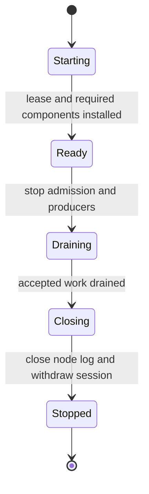
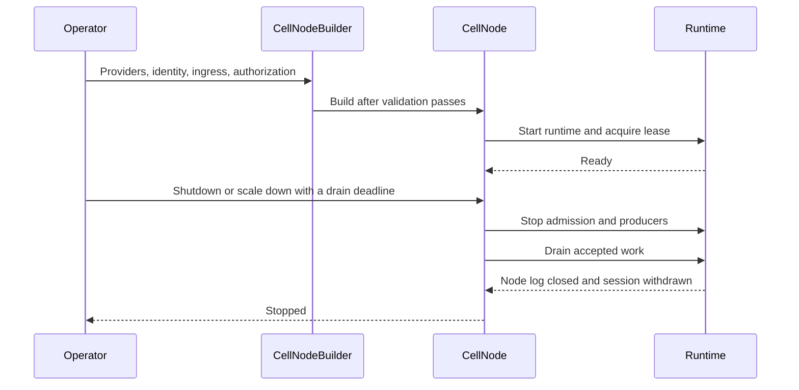
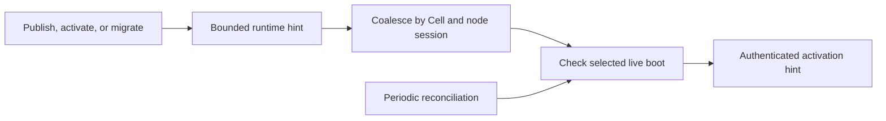

# Host guide

| Document | For |
| --- | --- |
| [Lifecycle](lifecycle.md) | Start and stop one node safely. |
| [Read replicas](read-replicas.md) | Install and supervise immutable views. |
| [Source reader succession](source-readers.md) | Check exact native retirement against the current writer and reader policy. |
| [Original failed-boot writers](original-writers.md) | Retain complete original ownership metadata before dependent effects. |
| [Fleet journal example](../minion/README.md) | Run the durable local journal foundation and inspect its integration limits. |
| [Crate entry](../README.md) | Ownership and test command. |

The host is a lifecycle facade. It does not add a second Cell scheduler,
writer, publisher, or authority path.

## Contents

- [Overview](#overview)
- [Lifecycle ownership](#lifecycle-ownership)
- [Read replicas](#read-replicas)
- [Bounds and timing](#bounds-and-timing)
- [Publication-driven recruitment](#publication-driven-recruitment)
- [Code and proof](#code-and-proof)
- [See also](#see-also)

<a id="overview"></a>
## Overview

`CellNode` owns one runtime, its admission ledger, facilities, and task group.
The application supplies providers, identity, ingress, and authorization.



Startup and shutdown cross the same boundaries in order:



## Lifecycle ownership

| Component | Contract |
| --- | --- |
| `CellNodeBuilder` | Validate configuration before runtime startup. |
| `CellNodeTaskGroup` | Bound and supervise tasks; stop ordinary work before lease maintenance. |
| Lease maintenance | Keep renewing through runtime drain and covered node-log close. |
| Shutdown | Use one absolute deadline across both task phases. |
| Scale down | Serialize releases with shutdown through one drain lane. |
| Drain deadline | Bounds releases after lane acquisition; waiting for the lane is not bounded by it. |
| Fleet pacing | Remains in the planner's movement budget. |

**Do not construct a second scheduler, authority, publisher, or runtime**
alongside the host. Use [the framework integration
guide](../../../docs/framework.md) for startup order.

Scale down and shutdown share one drain lane, so a caller's deadline bounds the
releases it starts, not the wait for the lane:

```text
scale down --+
             +--> [ one drain lane ] --> ordered releases
shutdown ----+           |
                         `-- a caller's deadline bounds the releases it starts;
                             waiting for the lane is not bounded by it
```

## Read replicas

| Setup | Purpose |
| --- | --- |
| `SqlWorkerPool::with_native_memory_limit` | Reserve memory for snapshots separately from writer capacity. |
| `CellNode::install_read_replicas` | Install the manager after the task group; supervise refresh and eviction. |
| Peer dispatcher wiring | Use that same manager as resolver and control implementation. |
| `install_read_replica_recruitment` | Recruit readers for locally owned Cells through an authorized `ReplicaPeerClient`. |
| Application layout, signed directory, local root, LTX limits | Supplied by the operator. |

- An activation hint must pass current owner and reader-selection checks.
- Queries never activate or refresh a missing reader.
- Drain cancels activation before closing views and joining their work.

## Bounds and timing

| Resource | Current bound |
| --- | --- |
| Writer native-memory default | 64 KiB per configured writer. |
| Snapshot reservation | 12 MiB per view; refresh can retain old and new views together. |
| Dirty recruitment set | 64 Cells. |
| Activation fanout | 16 concurrent hints across Cells. |
| Retained publication refresh | One latest hint per running Cell/session pair; at most 16. |
| Discovery and activation | One 30-second deadline per prepared Cell. |
| Explicit operator pass | At most 64 Cells within 30 seconds. |
| Periodic reconciliation | Five-second poll; not a freshness or replacement SLO. |

- The reference host's native admission and retained-cut budgets are 32 MiB and
  64 MiB within its 1 GiB container.
- Reservations are separate from measured RSS and the container ceiling.

## Publication-driven recruitment



- Commands never wait for readers.
- Fleet-only acknowledgement emits no hint until its root reaches object
  storage.
- Polling repairs dropped hints and reconciles membership changes.
- A stalled reader does not block healthy readers' updates.
- A publication during activation retains one follow-up hint, sent after the
  running hint completes within the retained hint's discovery deadline.

Pending hints recheck the selected boot at its observed lease expiry. Renewal
preserves the request; expiry or withdrawal releases it for replacement.

## Code and proof

| Module | Responsibility |
| --- | --- |
| `builder` | Validation and required-owner wiring. |
| `node` | Lifecycle, status, qualification, and scale down. |
| `read_replicas` | Selected immutable views, refresh, eviction, and close. |
| `read_replicas/recruitment` | Scoped recruitment, bounded fanout, and replacement. |
| `durability` | Node-log supervision and rotation. |
| `fleet` | Journal-bound finite actions, admitted receiver resources, exact source evidence, and checked activation. Applications own authentication, journal, and trusted Cell input lookup. |
| `facility`, `tasks`, `status` | Owned facilities, bounded tasks, lifecycle reporting. |

```sh
cargo test -p cellule-host --locked
```

- `tests/node.rs` covers builder validation, components, lifecycle,
  qualification, and task supervision.
- Read [AGENTS.md](../AGENTS.md) before changes.

<a id="see-also"></a>
## See also

| Next step | Read |
| --- | --- |
| Builder, readiness, drain, and shutdown | [Node lifecycle](lifecycle.md) |
| Admission, recruitment, refresh, and eviction | [Read replica lifecycle](read-replicas.md) |
| Embedding and service startup order | [Integrate Cellule into a service](../../../docs/framework.md) |
| Runtime ownership and subsystems | [Runtime guide](../../cellule-runtime/docs/README.md) |
| Author-facing capabilities and receipts | [Application guide](../../cellule-app/docs/README.md) |
| Exported node and facility types | [Crate entry](../README.md) |
| Contributor rules for this crate | [Crate AGENTS.md](../AGENTS.md) |
