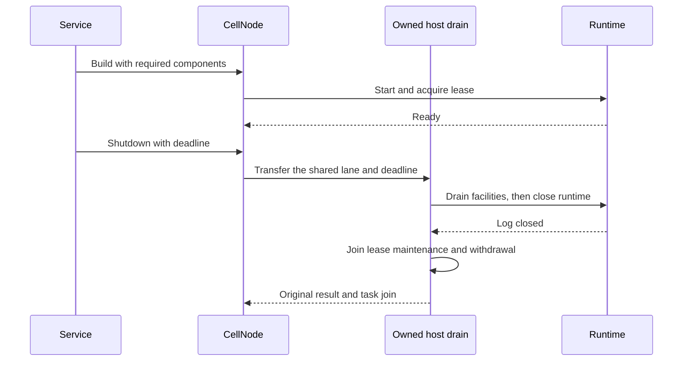

# Node lifecycle

| Component | Responsibility |
| --- | --- |
| `CellNodeBuilder` | Validate dependencies before starting runtime. |
| `CellNodeTaskGroup` | Bound and supervise ordinary tasks and lease maintenance. |
| `CellNode` | Report readiness, status, and shared runtime metrics. |
| Facilities | Register owned components before readiness. |
| Drain | Stop admission, finish accepted work, then close the node log. |
| Scale down | Serialize releases with shutdown through one drain lane. |



A deadline bounds releases started after acquiring the drain lane; it does not
bound waiting for that lane. Fleet-level pacing stays in the movement planner.
The node retains lease maintenance while accepted work and covered log tails
are drained. See [the framework integration guide](../../../docs/framework.md) for service
startup order.

The host retains one runtime shutdown task and its original result. A deadline
cancels the join waiter; accepted runtime drain continues. A later drain joins
that task instead of calling runtime shutdown twice. Facility failures remain
inspectable, and the host reaches Stopped only after every required phase
succeeds. A retained runtime failure preserves its original error as a source
on every subsequent observation.

The whole host drain also has one retained task slot. It runs the same reverse
facility order, runtime barrier and lease-maintenance phase. Cancelling a
shutdown caller leaves that task and its original callback future owned; the
host continues toward Stopped. The task keeps the shared lane guard, so queued
shutdown or scale-down callers cannot overlap it or repeat an accepted callback.
An idempotent stop still joins the original task epilogue before returning.

For managed fleet boots, install `CellNode::install_fleet_boot_withdrawal`
after boot confirmation and before `start()`. Supply the original authenticated
directory version, Established boot record, and its enrollment journal. The
same retained drain task withdraws that exact boot after facilities, runtime,
and lease maintenance join. It checks the permanent canonical tombstone and
confirms durable retirement before exposing Stopped. A missing advertisement,
recovery-claim tombstone, failed facility, or ambiguous journal reply leaves the
node Draining. Retry retains the original binding and retirement evidence;
a late heartbeat can be reconciled only for the same signed boot identity.
The directory's `is_withdrawn` query requires no retained log or recovery claim;
the broader `is_retired` query only confirms a permanent fence.
This binding proves boot closure. Fleet relocation and complete reader/follower
settlement remain separate required barriers.

A deadline keeps its existing phase timeout and ordinary task-abort policies.
After a returned incomplete attempt, the next caller first joins that original
attempt, then resumes the canonical sequence with its new deadline. The runtime
shutdown task is still invoked once. Genuine task-group failures remain errors;
a host task panic retains its original join failure and blocks a new attempt.

`CellNode::drain_observation()` captures fixed-size local attempt diagnostics.
It retains the original first/latest failure objects after a successful retry.
The embedding application authenticates any route exposing this observation.

| Local drain phase | Meaning |
| --- | --- |
| No observation | No retained local attempt was started; this proves no fleet absence. |
| Running | No original return or joined failure has been captured. This does not certify task health or progress. |
| Returned | The original sequence result is available; its task epilogue has not been joined. |
| Joined | The original task was joined; inspect its actual result and NodeState. |

These diagnostics do not authorize maintenance completion. Relocation,
reader/follower policy, current authority and confirmed withdrawal still need
the fleet operation's complete proof. Native rotation handles stay weak; a
successful autonomous shutdown may clear them before a later observer arrives.
Capture and publish their canonical evidence before terminal shutdown.

The task group retains each join and its original result within its existing
256-task bound. Concurrent drains share those joins; cancelling a caller leaves
the work owned. A failure cannot disappear after its handle is consumed, and
every sibling is joined even when another task fails. A repeated node drain
still reports that original source and keeps lease maintenance and Draining.

| Task deadline | Retained outcome |
| --- | --- |
| Ordinary work | Abort the work task, retain its supervisor, then join its cancellation and destructor on a later drain. Cancellation remains an original error. |
| Node-log supervisor watcher | Retain the watcher and the existing native facility join. A later drain can succeed after canonical cleanup succeeds. |
| Lease maintenance | Node drain reaches this phase only after required work and runtime closure succeed. A work failure cannot become session withdrawal on retry. |

Dropping the task group aborts its remaining owned tasks. Stopped still requires
successful joins through the canonical node drain lane.

## Requested node-log rotation

Install the existing durability provider during startup, then call
`CellNode::request_node_log_rotation(expected_epoch)` from an authorized
management adapter. The same supervisor wakes immediately and uses confirmed
old-member retirement; maintenance does not wait for the normal frame threshold.
The provider's `rotation_required(live_node_limit)` hook also requests automatic
rotation when its enrolled members expire, before the frame threshold. The
fleet-bound provider delegates this read to `FleetNodeDurabilityProvider`.
A failed membership read emits Failed and retries on a later tick while the
object-proof path remains available. After the read, the supervisor rechecks
its one bounded claim so an accepted maintenance request keeps strict retirement.

Duplicate requests for that epoch share progress. An automatic best-effort
rotation already in flight is refused; observe the current binding before retry.

| Inspection | Meaning |
| --- | --- |
| `NodeLogRotationRequest::observe()` | Local Queued, Retiring, Recruiting, Completed or Interrupted progress, with first/latest original errors. |
| `node_log_rotation_request(epoch)` | Recover a retained local request after a lost handle or reply. Missing is not evidence of completion or absence. |
| `fleet_durability_supervisor(now_ms)` | Capture the original supervisor lifecycle, separate supervisor/request-stop errors, and the existing pending/completed request bank, including automatic claims. |
| `retirement()` | Every original member confirmed its exact fence and canonical old-epoch authority close succeeded. |
| `completion()` | The retirement proof plus the newer epoch installed through expected-binding replacement. This does not establish redundancy policy or journal settlement. |

Member failures remain retryable in strict mode; timer rotation cannot weaken an
accepted maintenance request. Existing Cells may continue through the ordinary
object-proof fallback while retirement or replacement enrollment is pending.
Applications own follower selection, exclusion of maintenance nodes, enrollment
barriers, authority reconciliation, deadlines, authorization and durable results.

The node charges bounded request storage to its shared byte ledger. It retains
one pending request and one most-recent completed request; handles are weak and
cannot retain the node's resources after drain. Completed local history can be
evicted, so publish its canonical evidence to the fleet journal before finalizing.

The host retains the single supervisor's join outside its cancellable task-group
watcher. Caller cancellation or a drain deadline drops only a join waiter.
Accepted retirement and recruitment replies still join; a recruited replacement
that returns during drain is canonically closed. The host remains Draining until
all required joins and cleanup succeed, retaining lease maintenance meanwhile.
Lost cleanup replies retry the same generation under the retained owner.
Complete member responses remain cached before the authority-close await.
Closure retries reuse those original fences and call only authority reconciliation;
they do not send retire RPCs after directory authorization has closed.
Foreign boot/node or non-advancing replacement configuration is rejected before
construction or any attempt to close that foreign scope.
Interrupted rotation never counts as
fleet settlement. Complete role observation, failed-owner recovery and journal
retirement remain required before physical-node finalization.

Supervisor capture uses brief metadata locks and never waits on provider work
or the original join lane. Its installed owner reserves four KiB before work
starts; capture still works during drain after new runtime byte admission closes.
`NotStarted`, `Running`, `FinishedUnobserved` and `Returned` require the original
join. `JoinedUnsettled` retains a failed request stop; `Joined` can still carry
the original supervisor failure. Cancellation alone establishes neither join
nor cleanup. The bounded rotation bank preserves original proof/error Arcs;
an unavailable bank is an explicit error, never fabricated empty coverage.
An absent component supplies no coverage, and wrong-type/poisoned owners fail.
Combine this advisory local capture with producer pages, inbound native lanes,
fresh authority, replacement policy and authenticated revision-bound evidence
before settling fleet roles.

### Verify a live owner's follower evacuation

After the original requested rotation completes, call
`CellNode::follower_evacuation(original, operation, minimum_members, deadline)`
on that same live owner. Supply the original Established follower request, the
current Evacuating or Closing operation and the application's nonzero redundancy minimum
(one or two members). This read-only check returns a blocker while recruitment
is incomplete. It never requests another rotation or closes a lane.

| Returned evidence | Required checks |
| --- | --- |
| Original and Retired rows | Same request, acceptance time and establishment evidence; every old ensemble member is durably Retired. |
| Original rotation Arc | Confirmed object-covered retirement and the newer binding installed by the existing supervisor; retry leaves original errors inspectable. |
| Replacement enrollment | Complete original signed source/member boots and canonical epoch; the donor is excluded and the member minimum is met. |
| Replacement rows and current authority | Every member is Established on an Active managed boot at its exact intent revision; signed boot identities and source authority are rechecked around full journal confirmation. |
| Capture interval and snapshot | At most thirty seconds, bounded by the operation and caller deadlines; original journal timestamps are never refreshed. |

The returned `FollowerEvacuation` retains its node metadata charge. Publish and
revalidate this per-owner interval before local history can be evicted. A
withdrawn or changed replacement, missing original completion, changed registry,
expired operation or incomplete enrollment produces no settlement evidence.
Complete foreign/native inventory, Pending producers, failed-owner recovery and
terminal action handoff remain required before physical-node shutdown.

### Persist and revalidate follower replacement evidence

`FollowerReplacementPolicy` gives the application's nonzero member minimum a
durable revision in the existing fleet journal. `FleetFollowerEvacuationJournal`
loads it at the complete head/registry barrier. Policy changes compare that
barrier and live controller, advance the policy revision exactly once and bump
the shared registry. Absence blocks publication; it cannot silently reduce
redundancy. Applications authorize these changes and make their ordinary
recruitment satisfy the same policy.

`FollowerEvacuation::durable_record` preserves every original Retired member,
the original Established donor request identity, object-covered watermark,
signed source/member boot identities, complete replacement requests and the
capture interval. The journal atomically commits the bounded manifest and its
latest operation/request pointer. Replay returns original history without
restoring a superseded pointer or refreshing timestamps.

`FleetSnapshotTransport::capture` routes exact read-only requests to
`CellNode::fleet_snapshot` through its existing finite task owner. Authenticate
the physical endpoint and boot, preserve original request/response/error values,
and return fresh captures. The transport owns no second runtime or role executor.
`FleetFollowerEvacuationVerifier` combines canonical directory/policy reads with
complete source/member native traversals and all-category rechecks. A replacement
epoch can be enrolled and installed before its first append; its native producer,
supervisor and runtime binding prove installation even while the canonical log
is inactive. An inactive advertisement alone grants no such evidence.

```rust,no_run
use cellule_host::{FollowerEvacuation, fleet::{
    FleetFollowerEvacuationJournal, FleetFollowerEvacuationPublication,
    FleetFollowerEvacuationVerifier, FleetSnapshotTransport,
}};
use cellule_runtime::{Error, Result, node::NodeDirectory};
use std::sync::Arc;
use tokio::time::Instant;

async fn persist_follower_replacement(
    capture: &FollowerEvacuation,
    journal: &dyn FleetFollowerEvacuationJournal,
    directory: NodeDirectory,
    transport: Arc<dyn FleetSnapshotTransport>,
    deadline: Instant,
    clock: impl FnMut() -> Result<i64>,
) -> Result<FleetFollowerEvacuationPublication> {
    let policy = journal.follower_replacement_policy(capture.snapshot()).await
        .map_err(|source| Error::Facility { name: "fleet-policy", source })?
        .ok_or(Error::Fenced)?;
    let verifier = FleetFollowerEvacuationVerifier::new(directory, transport);
    FleetFollowerEvacuationPublication::publish(
        capture, policy, journal, &verifier, deadline, clock,
    ).await
}
```

After reconstruction, load immutable history and call `recheck`. A committed
record and a failed final confirmation remain separately inspectable, with
original shared source errors. `refresh` builds new metadata from that committed
original retirement when policy, current ensemble, or operation deadline/session
changes. Ordinary rotation supplies the new ensemble. The original local rotation
receipt may already be evicted; refresh starts no rotation or retirement. Publish
the opaque candidate through `publish_refreshed`. Both Evacuating and Closing
allow this repair before terminal finalization.

Applications account bounded copied manifest/collector buffers and join accepted
backend/native work. Fresh checks use monotonic thirty-second intervals and caller,
controller and operation deadlines. This supplies live-owner replacement evidence.
A failed original leader requires canonical recovery and affected-Cell successor
evidence; complete fleet role observation, process providers and terminal action
handoff remain required. See the [reference evidence cases](../minion/README.md#durable-follower-replacement-evidence).

### Publish a recovered owner's follower retirement

First finish canonical recovery pinning, every original member's native
retirement and the Retired tombstone CAS through the
[runtime recovery path](../../cellule-runtime/docs/failover-and-followers.md#contents).
Then capture `FleetRecoveredFollowerRetirement` against the complete current
`FleetRoster`. It binds the canonical physical leader, session, epoch, full
ensemble and manifest to every original member request. Missing or duplicate
requests, foreign scope, unretired authority and changed journal barriers refuse
capture/publication. Pending establishment replies remain original obligations.

```rust
use cellule_host::fleet::{
    FleetJournal, FleetRecoveredFollowerPublication,
    FleetRecoveredFollowerRetirement, FleetRoster,
};
use cellule_runtime::{
    fleet::operations::FleetScope,
    identity::SessionId,
    node::{NodeDirectory, SealedNodeLog},
};
use tokio::time::Instant;

pub async fn publish_recovered_followers(
    journal: &dyn FleetJournal,
    directory: &NodeDirectory,
    scope: FleetScope,
    sealed: &SealedNodeLog,
    authenticated_claimant: SessionId,
    deadline: Instant,
    mut clock: impl FnMut() -> cellule_runtime::Result<i64>,
) -> Result<FleetRecoveredFollowerPublication, Box<dyn std::error::Error + Send + Sync>> {
    let snapshot = journal.load_snapshot(scope).await?;
    let roster = FleetRoster::collect(journal, &snapshot, deadline).await?;
    let retirement = FleetRecoveredFollowerRetirement::capture(
        journal, directory, &roster, sealed,
        authenticated_claimant, deadline, &mut clock,
    ).await?;
    Ok(retirement.publish(
        journal, directory, authenticated_claimant, deadline, &mut clock,
    ).await?)
}
```

Own the publication future in accepted finite work and account the copied
collector/record buffers. The API starts no background worker or native retire
RPC. The caller deadline bounds journal waiters; the adapter retains and joins
accepted backend work after deadline or cancellation. `members()` preserves all
returned responses and their separate original errors; `confirmed()`
requires successful replies plus a complete post-publication roster and fresh
canonical authority. Clock regression, stale barriers or an incomplete final
scan preserve successful writes without granting closure.

After a lost reply or controller restart, collect a fresh roster and recapture
the exact canonical epoch. Deterministic events preserve each original spec,
acceptance, establishment history and retirement time. Replay still works after
native grace collection; it adopts canonical history without reconstructing
missing member receipts. The closure covers these follower enrollment rows.
Failed-boot/process closure, replacement policy, affected writers and terminal
host shutdown remain required before maintenance completion.

### Join one exact installed reader request

`ReadReplicaManager::remove_enrolled(original, deadline)` binds removal to the
original Established enrollment under the canonical activation lane. It checks
both physical endpoints, acceptance, original native opening proof and the
current journal row before closing. A delayed source-maintenance request cannot
remove a newer reader for the same Cell. An Active remote receiver can join its
old source role after writer handoff through this path.

```rust
use cellule_host::read_replicas::{ReadReplicaManager, ReaderEnrollmentRetirement};
use cellule_runtime::fleet::operations::EnrollmentRecord;
use tokio::time::Instant;

pub async fn join_original_reader(
    receiver: &ReadReplicaManager,
    original: &EnrollmentRecord,
    deadline: Instant,
) -> cellule_runtime::Result<ReaderEnrollmentRetirement> {
    receiver.remove_enrolled(original, deadline).await
}
```

The returned local capsule retains the original request/source, confirmed Retired
row, exact final installed root, final joined receipt and original bounded interval.
The root survives snapshot detachment and includes its Cell/incarnation, digest,
transaction position and commit sequence. Use the successor runtime's canonical
`verify_root_prefix` path to prove derivation and current origin availability;
matching or higher sequence counters alone do not prove that prefix.
Its copied records stay
charged to the shared node metadata ledger until dropped. The ordinary native
closure joins accepted queries/refreshes and retained peer clones; publication
uses the existing producer event and unchanged evidence format.

Authorize both endpoints and establish writer succession/current reader policy
before requesting source maintenance closure. Deadline/cancellation can retain a
fenced original view and its same unpublished event; retry that exact request.
Lost journal replies keep their source errors. Absent or unknown native owners
supply no joining proof, even when a terminal row exists. Retain successful
capsules through the application's durable authenticated accepted-work owner;
process reconstruction requires independent lifetime evidence. This local result
supplies no replacement policy, writer lineage, complete roster or fleet
settlement/finalization permission. Source/failed-owner policy matching remains
required before `SettleRoles` or `Finalize`.

### Publish an original failed receiver's reader closure

`FleetFailedReaderRetirement` settles one original reader enrollment after
its exact receiver boot is permanently fenced and independently proven unable
to execute again. Capture accepts Pending, Established and exact replayed
Retired requests at a complete bootstrapped roster. The reader's receiver
node/session must match the original Established boot; a failed source writer
cannot authorize closure of a reader on a live receiver.

`FleetFailedBootProcessRequest::capture` can collect the original boot/fence
request while roles remain unresolved. It permits only read-only process
confirmation. This breaks the dependency between obtaining durable process
evidence and settling the roles that must precede boot retirement. Its digest
excludes mutable enrollment status and collection times, so the same original
process witness survives reader/follower publication and fresh recapture.

Use the application-owned `FleetFailedBootProcesses` provider described below.
It must join the original process and all accepted native/external work and
producers, authenticate that exact lifetime, and prevent session reuse. Neither
canonical withdrawal nor an expired advertisement supplies process evidence.

```rust
async fn publish_failed_reader(
    journal: &dyn cellule_host::fleet::FleetJournal,
    directory: &cellule_runtime::node::NodeDirectory,
    processes: &dyn cellule_host::fleet::FleetFailedBootProcesses,
    original_boot: &cellule_runtime::fleet::operations::EnrollmentRecord,
    original_reader: &cellule_runtime::fleet::operations::EnrollmentRecord,
    claimant: cellule_runtime::identity::SessionId,
    deadline: tokio::time::Instant,
    mut clock: impl FnMut() -> cellule_runtime::Result<i64>,
) -> cellule_runtime::Result<cellule_host::fleet::FleetFailedReaderPublication> {
    let snapshot = journal.load_snapshot(original_reader.spec().scope).await
        .map_err(|source| cellule_runtime::Error::Facility {
            name: "example-failed-reader-journal", source,
        })?;
    let roster = cellule_host::fleet::FleetRoster::collect(journal, &snapshot, deadline).await?;
    let retirement = cellule_host::fleet::FleetFailedReaderRetirement::capture(
        journal, directory, &roster, original_boot, original_reader,
        claimant, deadline, &mut clock,
    ).await?;
    retirement.publish(journal, directory, processes, claimant, deadline, clock).await
}
```

Publication rechecks the original complete barrier after provider confirmation,
then uses the existing enrollment journal. Inspect `record()` even when
`confirmed()` fails: publication replies and final checks retain separate
original errors and durable partial state. Fresh recapture adopts lost replies
without refreshing original acceptance, establishment or retirement times.
The final roster, original history, canonical receiver fence and unchanged
process witness must confirm within the original thirty-second interval.
Backend owners retain and join accepted work after cancellation or deadline.

This closes one original reader lifetime. Replacement-policy coverage, other
roles, affected writers, boot retirement and physical maintenance finalization
remain separate requirements. For a failed source with a live receiver, use
that receiver's ordinary joined reader lifecycle. The
[native example cases](../minion/README.md#failed-reader-lifetime-evidence)
exercise actual SQLite readers, joined host shutdown and independent journal
reconstruction; OS crash and external-job/provider campaigns remain required.

### Publish an original failed boot's closure

Before recovery can change Cell ownership, obtain original process evidence from
`FleetFailedBootProcessRequest::capture_fenced` and `confirm`. The directory's
read-only `fenced_session` supplies the permanent exact physical/session fence
while the leader log can still be Recovering. It does not prove termination,
native/external work joining, log retirement or takeover readiness.

The fenced request uses a new v2 identity bound to the full original boot,
acceptance/establishment and immutable fence times. Recovery phase/manifest,
claimant, registry and capture times are excluded. It can be recaptured after
recovery and controller/adapter reconstruction with the same original witness.
`confirm` checks the current complete roster, original boot, permanent authority
and stable provider evidence twice in a monotonic thirty-second interval. It
starts no termination, native or recovery effect. Applications still authenticate
and durably join the actual original process and every accepted job first.

```rust
async fn confirm_original_process(
    journal: &dyn cellule_host::fleet::FleetJournal,
    directory: &cellule_runtime::node::NodeDirectory,
    processes: &dyn cellule_host::fleet::FleetFailedBootProcesses,
    original: &cellule_runtime::fleet::operations::EnrollmentRecord,
    claimant: cellule_runtime::identity::SessionId,
    deadline: tokio::time::Instant,
    mut clock: impl FnMut() -> cellule_runtime::Result<i64>,
) -> cellule_runtime::Result<(
    cellule_host::fleet::FleetFailedBootProcessRequest,
    cellule_host::fleet::FleetFailedBootProcessConfirmation,
)> {
    let snapshot = journal.load_snapshot(original.spec().scope).await.map_err(|source| {
        cellule_runtime::Error::Facility { name: "application-process-journal", source }
    })?;
    let roster = cellule_host::fleet::FleetRoster::collect(journal, &snapshot, deadline).await?;
    let request = cellule_host::fleet::FleetFailedBootProcessRequest::capture_fenced(
        journal, directory, &roster, original, claimant, deadline, &mut clock,
    ).await?;
    let confirmed = request.confirm(
        journal, directory, processes, claimant, deadline, clock,
    ).await?;
    Ok((request, confirmed))
}
```

Retain the complete original Cell set before overlay publication, log sealing or
takeover. A process confirmation permits this collection; it is not the collection
or successor evidence. Full catalog/native inventory and durable operation-bound
retention remain required. An active Recovering log blocks independent takeover;
already Sealed/inactive logs require an earlier retained writer set or verified
complete original ownership history. The canonical authority path now retains
full owner observations before departure, including unpublished and object-covered
controls. Its [per-Cell history read](../../cellule-runtime/docs/storage.md#retain-original-owners-before-departure)
refuses missing legacy/restore history. Authenticated complete catalog traversal,
original process joining, durable operation binding and successor verification
remain required; history alone cannot finalize a node. Re-reading only current
failed-owner controls cannot reconstruct Cells that already moved.

After recovery and all related roles close, use
`FleetFailedBootRetirement::capture_retained` with the original process request
and a freshly collected roster. It preserves the original request interval and
identity, and requires fresh terminal-log and physical-reference checks. Publication
uses the same provider and enrollment journal. Process confirmation cannot bypass
any boot-retirement barrier. The existing terminal `capture` retains its v1
digest and event identity. `request.fence()` is always available;
`request.canonical()` now returns an optional original terminal-log observation.
It is absent for fenced captures even after their original log later retires.
After restart, recapture a fenced request with `capture_fenced` and use
`capture_retained` again. Preserve the basis chosen for the original publication:
terminal v1 and fenced v2 requests have distinct identities. Changing basis or
witness cannot adopt an already committed retirement. The provider durably retains
that original request/witness binding; mixed-binary/provider rollout qualification
remains required.

After recovered follower publication, `FleetFailedBootRetirement` closes the
original boot row through the same enrollment journal. It requires a complete
bootstrapped roster, the exact Established original request and all its related
reader/follower requests settled. A fresh `NodeDirectory::closed_session` checks
the physical node/session's permanent fence and Retired leader log. Sealed or
inactive unretired logs, missing records and expired advertisements refuse.
Complete physical follower discovery also rejects a live reference belonging to
that original boot; registered obligations of a different boot remain separate.

The application implements `FleetFailedBootProcesses`. Its read-only
`confirm_stopped` checks durable evidence that the original process and its
accepted external jobs/producers have joined and that the same session cannot
execute again. Authentication, provider termination and evidence persistence
belong to the application. A witness digest identifies that evidence; its public
constructor checks shape and supplies no authentication or process observation.
Do not create a witness from a reusable PID, expiry, missing inventory, timeout,
recovery result or replacement process. Start and own termination through the
application's supervised finite work before requesting confirmation.

```rust
async fn publish_failed_boot(
    journal: &dyn cellule_host::fleet::FleetJournal,
    directory: &cellule_runtime::node::NodeDirectory,
    processes: &dyn cellule_host::fleet::FleetFailedBootProcesses,
    original: &cellule_runtime::fleet::operations::EnrollmentRecord,
    claimant: cellule_runtime::identity::SessionId,
    deadline: tokio::time::Instant,
    mut clock: impl FnMut() -> cellule_runtime::Result<i64>,
) -> cellule_runtime::Result<cellule_host::fleet::FleetFailedBootPublication> {
    let snapshot = journal.load_snapshot(original.spec().scope).await.map_err(|source| {
        cellule_runtime::Error::Facility { name: "application-failed-boot-journal", source }
    })?;
    let roster = cellule_host::fleet::FleetRoster::collect(journal, &snapshot, deadline).await?;
    let retirement = cellule_host::fleet::FleetFailedBootRetirement::capture(
        journal, directory, &roster, original, claimant, deadline, &mut clock,
    ).await?;
    retirement.publish(journal, directory, processes, claimant, deadline, clock).await
}
```

Inspect `record()` even if `confirmed()` fails: a lost reply or final check can
leave an actual committed retirement. The original source error remains shared
and inspectable. Fresh recapture and the same durable process witness adopt the
original request, acceptance, establishment and retirement time after controller
or adapter restart. A changed witness conflicts with committed retirement.
The final complete roster, exact returned row, canonical authority, physical
references and process proof must revalidate within the original thirty-second
interval. Accepted backend jobs remain with the journal/provider owner after a
waiter cancellation or deadline.

For a later observation, recapture the original retained request at the current
complete roster and call `FleetFailedBootRetirement::confirm`. This read-only
path requires the already committed Retired row and its original process witness;
it publishes no enrollment event. It repeats the same terminal authority,
related-role, physical-reference and process checks at one exact full head and
registry. Missing retirement, changed witness, stale head and regressed clocks
refuse. The returned capsule preserves the committed row and digest while
recording the new confirmation interval.

```rust
async fn observe_failed_boot(
    journal: &dyn cellule_host::fleet::FleetJournal,
    directory: &cellule_runtime::node::NodeDirectory,
    processes: &dyn cellule_host::fleet::FleetFailedBootProcesses,
    request: &cellule_host::fleet::FleetFailedBootProcessRequest,
    claimant: cellule_runtime::identity::SessionId,
    deadline: tokio::time::Instant,
    mut clock: impl FnMut() -> cellule_runtime::Result<i64>,
) -> cellule_runtime::Result<cellule_host::fleet::FleetFailedBootClosure> {
    let snapshot = journal.load_snapshot(request.boot().spec().scope).await.map_err(|source| {
        cellule_runtime::Error::Facility { name: "application-failed-boot-journal", source }
    })?;
    let roster = cellule_host::fleet::FleetRoster::collect(journal, &snapshot, deadline).await?;
    let retirement = cellule_host::fleet::FleetFailedBootRetirement::capture_retained(
        journal, directory, &roster, request, claimant, deadline, &mut clock,
    ).await?;
    retirement.confirm(journal, directory, processes, claimant, deadline, clock).await
}
```

Attach these fresh capsules with `FleetObservation::with_failed_boot_closures`.
The observation retains every original interval and binds the full barrier and
closure digest in its planner inputs. Capsules must agree with retained role
coverage, roster and original writer evidence. A retired session cannot advertise
or supply current Cell rows; a replacement session remains separate. Attachment
cannot upgrade an incomplete observation. Authenticate discovery and process
evidence, establish replacement policy, and join all accepted work separately.

`FleetFailedBootProcessRequest::confirm` also checks an already Retired boot's
committed request/witness binding. Two equal provider reads cannot replace that
binding or switch between the original fenced and terminal request bases. Both
existing bases remain valid when they match the committed retirement.
Combined successor/closure observation requires the same full head and registry
in either attachment order; matching registry revisions alone are insufficient.

This closure settles that boot's enrollment. It does not convert a recovered
tombstone into planned withdrawal or prove replacement policy, affected-writer
relocation, operation completion or permission to stop the physical node.
`SettleRoles`/`Finalize` still require those additional barriers and the existing
native shutdown handoff. The [focused example cases](../minion/README.md#failed-boot-process-evidence)
exercise a joined child lifetime and independently reconstructed evidence;
they do not qualify a complete multi-process fleet or provider deployment.

## Journal bound fleet actions

### Source enrollment closure

First reader/follower acceptance checks both exact endpoint intents and the
source intent's retained maintenance operation in the same journal transaction.
Use `EnrollmentRecord::pending` with that original operation; Active sources
require no operation input. A Draining source may recruit replacements before
Closing. Closing/Completed fence new requests without requiring an intent revision
change. Missing or mismatched operation evidence refuses admission.

Compare the complete original request before these current checks on replay.
Accepted work may still establish or retire after Closing; its original timestamp
and canonical evidence remain intact. The fence supplies no role settlement,
native joining or finalization proof. Node boot enrollment still honors its exact
retained mode and supplies no readiness by itself.

### Fleet boot admission

For a fleet-managed host, load its retained `NodeIntent` and pass it to
`CellNodeBuilder::with_fleet_startup_intent` before building. The leased runtime
holds its shared writer, reader and follower gate before the application can
install a lease. An Active row must name this boot; a maintenance predecessor
can build with admission held until the journal validates its successor.
The offline unleased maintenance builder rejects this configuration.

| Startup boundary | Required behavior |
| --- | --- |
| Build | Validate the retained intent, hold new roles, and install its sticky Cordoned/Draining mode. Missing or ambiguous rows fail before build. |
| Enroll boot | Journal Pending before canonical directory creation. Only New permits first execution; an Existing request requires canonical inspection and its exact original evidence. |
| Confirm | Call `confirm_fleet_startup(journal, enrollment_key)` after Established publication and lease installation. `FleetEnrollmentJournal::load_boot` reads the exact established boot and current intent in one transaction. Missing, pending, retired or foreign evidence cannot open admission. |
| Bind closure | Before readiness, call `install_fleet_boot_withdrawal(directory, original_version, established_record, journal)`. The binding is immutable and requires the exact confirmed boot. The native closing owner checks withdrawal and durable retirement before Stopped. |
| Start | Install required facilities/task supervision and finish probes, then call `start()`. Confirmation alone keeps the hold. Start checks the owned components and opens Active admission, or enters `NodeState::Maintenance` under retained cordon/drain. |
| Route requests | Serving probes use `is_ready()`. Authorized management uses `is_management_ready()`, which includes Maintenance. Fleet action/inspection endpoints remain available there; new roles stay closed. |
| Refresh intent | Call `refresh_fleet_intent(journal, deadline)` from the supervised membership/lease loop before renewal. It rechecks the original Established boot and current physical intent atomically, then applies sticky cordon/drain to the shared gate. A failed or expired read grants no renewal authority. |
| Close | The bound native drain joins accepted work, runtime and lease maintenance before withdrawing the boot and retiring its registry obligation. Only checked ordinary withdrawal and its permanent session tombstone settle a lost reply; absence, expiry or a recovery claimant cannot. |

Confirmation is a cancellable read. Concurrent confirmations cannot overwrite a
newer checked intent with an older reply; a read that finishes after shutdown
cannot reopen the node. Local startup checks do not replace an application's
atomic enrollment policy, authentication or complete registry import. Startup
retains the original enrollment record, including its acceptance time and evidence;
another Established request cannot replace it. Intent refresh rejects older or
contradictory replies and rechecks lifecycle after the read. A delayed reply cannot
reopen shutdown, and an Active reply cannot clear a local cordon. Cancellation
drops only the read waiter; retry against the original boot. Existing owners keep
serving while live intent closes new roles. The application owns supervision,
polling cadence, error handling and the lease renewal policy; this API starts no task.
Authorized Cordon actions use the same gate and remain replayable after refresh.

The [reference example](../minion/README.md) wires this order
to actual signed directory enrollment and one durable SQLite transaction domain.
Managed reader and follower bindings provide the local producer barriers below.
Complete fleet observation remains integration work.

### Managed follower enrollment

Install `install_fleet_node_durability_provider` before readiness, using the
shared `FleetJournal` and an application-owned `FleetNodeDurabilityProvider`.
Preparation returns `FleetNodeLogRecruitment`: an opaque exact directory attempt,
authenticated transport, authority, lease and telemetry. It performs no enrollment
CAS or append. Configured fleet startup rejects an ordinary unmanaged durability
provider and a manually installed runtime epoch without this typed binding.
Recruitment waits for the startup hold to clear; confirmed maintenance mode can
still replace outbound follower obligations while new inbound roles stay closed.

| Boundary | Managed behavior |
| --- | --- |
| Prepare | Validate canonical shipper limits; capture exact source/follower boots and fresh endpoint intent revisions. Reserve one MiB from the shared node ledger before accepting any request. |
| Accept | Retain every original request before awaits. Every selected member must return a validated New Pending acceptance before the single original-token directory CAS. |
| Unknown enrollment | Inspect only the retained attempt. An original-token conditional refusal may exclude its delayed CAS. Missing, expired or newer empty records remain unknown; no reselection or CAS rebasing is allowed. |
| No native dispatch | Atomically refuse every original member, including members whose acceptance reply was lost or acceptance never started. An absent key becomes an exclusion tombstone. Delayed acceptance returns Existing with that original terminal row. |
| Establish | Replay the original checked enrollment events and acceptance times until all publications confirm. No shipper/configuration is delivered before that barrier. |
| Retire | Join object coverage and every exact native member fence, retain the complete observation, reconcile canonical authority close, then durably retire every original member. Lost publication never repeats a confirmed native close. |
| Drain | Join the existing supervisor before settling its undelivered attempt, then let runtime drain close delivered epochs. Deadlines cancel waiters; owned cleanup and byte charges remain until journal settlement. |

There is one pending preparation and at most 32 inventoried epochs. Retirement
removes local inventory and releases its reservation only after durable settlement.
`follower_enrollment_completion(epoch)` exposes immutable inputs, native proofs,
all member responses, publication state, and separate original native/journal
errors without waiting on RPCs. Missing local history supplies no fleet proof.

`fleet_follower_enrollments_page(cursor, limit, now_ms)` enumerates every retained
epoch, including original member requests whose acceptance is unknown. A page
reserves one MiB before copying fixed-size follower metadata, admits 1–32 epochs,
and hashes signed inputs/proofs in place. It preserves original retirement/error
Arcs without deep-copying signed ensembles or provider CAS tokens. Drop the page
to release its charge. A process-local continuation binds all epochs, native and
publication progress, pending attempt, shared mode, and protocol state. Changes
or missing continuation keys require restarting from the first page.

| Capture | Interpretation |
| --- | --- |
| Busy protocol, no epochs | Preparation may be awaiting provider/journal I/O before a request exists; zero rows supply no absence proof. |
| Pending epoch | Preserve all original selected members, including missing acceptance replies; capture starts no CAS or cleanup. |
| Enrollment/refusal digest | Identifies an original checked proof; it supplies no authentication, current authority or replacement-policy proof. |
| Retirement observation | Keeps original successful and failed member replies before separate canonical closure and durable publication. |
| Missing or failed producer | An unbound node returns `None`; wrong component type, failed lock, exhausted or closed runtime byte ledger returns an error. Neither supplies empty coverage. |

An idle protocol and zero retained epochs do not prove a joined supervisor,
empty inbound follower lanes, withdrawal, or safe finalization. This is an
interval scan. Applications still collect authenticated request-bound envelopes,
the complete durable roster, fresh directory authority, native lanes and readers,
and supervisor/facility completion. `try_owned_component` preserves typed lookup
failures for these collectors; optional legacy lookups still return `None`.

The provider allocates a never-reused advancing epoch for each leader boot. Its
transport must address the originally selected signed follower boots. Its authority
serializes heartbeat/activation/coverage/closure, fresh-loads the exact source
epoch after enrollment, and reconciles ambiguous close from the original checked
close receipt. Arbitrary absence cannot prove closure. Applications retain durable
backend, authentication, replacement policy and failed-process reconciliation.
Complete role observation and these remaining proofs precede fleet finalization.

Install `CellNode::install_fleet_actions` during startup with a fleet/application
scope, stable physical NodeId, an application-owned `FleetActionJournal`, and
trusted `FleetCellProvider` inputs. The provider resolves catalog, replica,
canonical authority, private local destination, and this node's leased owner.
Its lookup performs no hydration or takeover; remote callers supply no local
paths or credentials.
For failed-source recovery, `recovery_inputs` supplies an existing canonical
`NodeTakeoverProof` and recovery manifest store. Ordinary node recovery first
fences the failed session and seals/pins its required tail; the provider lookup
performs none of those effects.
The application authenticates management requests. The journal atomically
checks the current controller epoch, head, permit, intent, endpoint, and
deadline when first accepting an action. `AcceptedFleetAction` validates its
shape and exact inputs; its Rust type supplies no remote authorization.

`apply_fleet_action` executes settled source Release with
`release_idle_cell_at`, actual receiver preparation, canonical activation,
resource cleanup and failed-source recovery. Maintenance Cordon closes the
same new-writer, reader, and follower admission gate after exact boot-bound
journal acceptance. Existing owners keep serving until their movement barrier.
Fresh inspection uses its separate request-bound method. The caller-driven
reconciler supports cordon and settled movement; complete observation wiring,
complete primitive maintenance coverage and role finalization remain under implementation in the
[fleet operations plan](../../../docs/fleet-operations-plan.md).

| Event | Action executor behavior |
| --- | --- |
| First acceptance | Commit exact acceptance before its effect. Movement Release rechecks deadline and invokes the canonical actor release for the exact session, generation, incarnation and epoch. |
| Source preflight refusal | The actor returns `Error::CellReleaseRefused` only before this request begins canonical deactivation. Record Rejected with its original source error; the reconciler then cancels and joins unused receiver credit. Independent local eviction grants no release proof for this attempt. |
| Prepare receiver | Validate catalog/Cell/incarnation and current release/schema support; reserve actual runtime/LTX resources before returning Reserved. A refusal preserves the original error and leaves the source serving. |
| Maintenance Cordon | Apply retained Draining intent through the shared admission gate. Replays retain the exact acceptance/result; a dropped waiter leaves publication owned. This preserves existing obligations and uses no shutdown lane. |
| Other maintenance effects | Refuse role settlement, finalization and maintenance inspection until their inventory and host barriers are implemented. A cordon receipt cannot establish Stopped or withdrawal. |
| Activate receiver | Confirm the exact Idle acquisition basis is durably retained before ordinary ownership CAS; consume prepared credit through canonical restore and actor activation. |
| Acquisition-basis reply lost | Keep authority untouched and the prepared credit charged. Repeating the same accepted action confirms the original basis and capture time before takeover. |
| Unused credit after release | Journal CleaningReceiver, cancel/join that credit, and retain the source position and fleet permit. Cleanup returns to Released, with no claim of pre-release cancellation. After confirmed cleanup, ordinary admitted acquisition may resume. |
| Ordinary acquisition on the preferred session | Free the unused preparation without closing the ordinary writer. Verify current authority, actor readiness, and the required release position. Matching session alone never proves prepared credit was consumed. |
| Recover unresolved source release | Journal Recovering, cancel proved-unused preparation, validate canonical failed-session proof, and confirm `RecoveryBasis` before ownership CAS. Confirm `RecoveryEvidence` after exact recovery publication and before actor admission. Return Recovered only with current actor/authority proof. |
| Recovery input reply lost | No ownership CAS starts. Retain the original input/time; an unchanged full canonical control permits confirming that basis and continuing the accepted action. |
| Recovery position reply lost | No actor is admitted. Canonical rollback preserves the materialized root; the attempt stays charged and Unknown. Ordinary acquisition can restore serving, after which inspection verifies it against the retained recovery evidence. |
| Duplicate | Compare the full immutable specification, including cost and physical identities. Join current work or return its committed result. |
| Dropped caller | Retain and finish execution plus journal publication independently of the caller. |
| Result publication failure | Retain the original checked result. Result delivery joins the owned task, so an immediate subsequent dispatch can retry publication. Drain also retries; neither repeats source release. |
| Existing acceptance without a result | Record Unknown and retain the fleet permit; never infer the original release root from current authority. |
| Node drain | Stop new action admission and join retained finite work before runtime shutdown. Keep task handles and checked results when a deadline cancels the drain waiter. |
| Action task fails | Join every accepted sibling job, settle resources, and retain the original join error across repeated drain calls. Runtime cleanup still runs; consuming a task handle cannot make a later shutdown report success. |

`FleetActionCompletion::committed` is true only after confirmed durable result
publication. Preserve its separate execution and journal errors in correlated
diagnostics. A committed Released result proves source release; destination
serving still requires fresh authority and actor evidence. A replay returns a
retained observation; it does not refresh that proof. The executor checks a
new serving observation through the normal FIFO query/lease boundary and
compares actor inventory with current authority. The receiver's local receipt
retires only after confirmed result publication and accepted-task completion.
Later inspection uses retained journal evidence after local retirement.

Clean release and recovery remain separate in status and history. A source-epoch
Idle root after a lost release reply can be a recovery input only with canonical
failed-session proof; a later root alone cannot manufacture Released. Recovery
uses `AcquisitionObserver` recording points through the same ordinary acquisition,
exact-root restoration, and rollback path. The journal atomically binds basis
and evidence to original acceptance, rejects changed inputs, and returns the
original time for identical writes.

The executor uses at most two retained action jobs and charges their envelopes,
results, and acquisition inputs to the existing node retained-byte ledger.
Unknown work retains its fleet permit in the journal. A missing local receipt,
caller timeout, or expired reservation alone proves neither resource settlement
nor successful movement. These local gates do not establish complete fleet
maintenance or process/provider qualification.

## Fresh fleet inspection

Use `CellNode::inspect_fleet_action` for current evidence. A retained
Inspect reply is historical and cannot establish current serving.
`apply_fleet_action` refuses raw Inspect dispatch; use the request-bound method.
Effects and observations use the same finite task owner, shared action bound and
runtime ledger; shutdown joins accepted inspections after dropped waiters.

| Boundary | Required behavior |
| --- | --- |
| Request | Build `FleetInspectionRequest` from the current head's Inspect action and exact `RegistryVersion`. Name the physical node/boot, a new nonce for this pass and an exclusive capture deadline. |
| Authorization | `FleetActionJournal::authorize_inspection` checks current head, registry revision and endpoint intent in one read transaction. Cached acceptance/result records cannot satisfy it. |
| Capture | Inspect actual actor/authority state. Recovery inspection cannot start acquisition; missing recovery position remains Unknown. Retained release and resource-settlement proofs remain historical facts. |
| Response | `FleetInspectionObservation` retains the original capture start/end and full request. `validate_for` rejects mismatched nonce, endpoint, payload, registry or authorization, future time, expired deadline and an over-age capture interval. |
| Dependent decision | Authenticate the reply, check its required position, and compare the head/registry versions again when committing the reducer transition. A failed inspection preserves the charged attempt. |

The observation codecs use new record kinds 17 and 18. Existing effect and
result encodings remain unchanged. Deploy readers before these producers;
decoding a record does not authenticate its origin or prove a complete roster.

## Request bound native fleet pages

`CellNode::fleet_snapshot` captures one native category through the same two-job
bank as effects and inspection. `FleetSnapshotRequest` pins the complete journal
head/registry, physical node and boot, nonce, category, native continuation,
limit, issue time and exclusive deadline. The interval is at most 30 seconds
and ends within the original controller lease. Applications authenticate callers.

`FleetActionJournal::authorize_snapshot` must compare the full current barrier
and endpoint intent in one transaction, before and after the native read. The
reference SQLite journal implements that transaction. Changed revisions or
boots fail; retries cannot restamp the original request or interval. Waiter
cancellation leaves accepted capture owned until its original join, including
blocking follower inventory reads. Shutdown joins that work.

| Subject | Original native source |
| --- | --- |
| Host | Lifecycle, installed owner bindings, mode, local node-log identity and original finite fleet work. |
| Cells | Generation-bound live and transitioning actor inventory. |
| Readers / ReaderEnrollments | Managed native views and original producer requests/jobs. |
| FollowerLanes / FollowerEnrollments | Persisted inbound lanes and original managed leader enrollment progress. |
| DurabilitySupervisor | Retained task lifecycle, original failures and bounded rotation bank. |

The response retains each native page's allocation token and original errors.
Drop it to release its page charge. `FleetNodeSnapshot::validate` checks the
full request, capture interval and available native scope/boot identities.
Missing owners return `Unbound`; missing or failed capture supplies no role
coverage. Local bindings, counts and log identity remain advisory. Complete
observation still requires stable traversal, durable roster confirmation,
current remote authority and replacement policy. This in-process API defines
no persisted or wire format; applications own authenticated transport encoding.

Every response retains `action_work()`: original effect, inspection and capture
keys, task ownership, response state, canonical result digest, publication and
known-outcome flags, and separate original errors. Only its exact executing
capture is excluded; other captures remain work. Changed work during the native
read refuses the response. No task handle or recursive snapshot body is retained.

`CellNode::fleet_action_work()` reads the same original bank without submitting,
reaping, joining or executing work. It admits 4 KiB for retained metadata plus
bounded codec scratch through the native ledger. Native clones share the charge;
drop the last clone to release it. Capture during drain requires available native
metadata admission; a closed runtime or failed capture supplies no empty proof.
An uninstalled owner returns `None`.

| Work state | Required interpretation |
| --- | --- |
| Running / FinishedUnobserved | The original task still needs its join; a finished handle supplies no success. |
| Returned | A response exists, but the original task is still retained. |
| Joining | Another caller owns the original join lane; its result remains unknown. |
| Joined | The original join completed; missing responses, unknown outcomes and publication errors remain independent obligations. |

The work revision advances on effect/inspection admission and removal, including
turnover between empty reads. A separate capture revision detects any job
admission/removal within one capture. Ordinary fresh read-only captures leave
cross-capture work fingerprints stable. The first original bank failure remains
visible after its failed job is removed while metadata capture is available.
These observations cannot close durable unknown actions, external application
tasks, native roles or the maintenance operation.

### Full native traversal and revalidation

`FleetNodeInventoryScan::new(&roster, node, session)` pins a current Established
managed boot in a bootstrapped full roster. Serve each `next_subject()` through
the authenticated snapshot transport and pass the exact request and original
response to `accept()`. Drop the response after acceptance to release its native
page charge. A failed acceptance poisons that traversal. `finish()` requires
every continuation and a fresh first-page recheck of all seven categories.
Applications account the collector's bounded copied buffers.

| Retained input | Required interpretation |
| --- | --- |
| Writer rows and transitioning Cell IDs | Transitions remain obligations; actor maps can overlap. They never imply absent ownership or complete signed counts. |
| Reader views and producer records/jobs | Preserve original requests, accepted timestamps, publication state and shared errors. Preparation with no Pending row remains visible through job state. |
| Persisted lanes and follower producer state | Include cold/retired lanes, quarantined files and unknown preparation. An idle producer does not prove a joined supervisor. |
| Supervisor observation | Preserve the original lifecycle, rotation barriers, completion and failures. |
| Finite fleet work | Copy original metadata and shared errors into the application-accounted collector buffer. Every page and global recheck must match its full fingerprint, including effect/inspection turnover and admission closure. |
| Missing bindings | Retain None/Unbound identity. Absence requires the application's bootstrapped closed composition proof. |

`inventory.validate_enrollments(&roster)` matches the retained native inputs to
the same full roster. A mismatch disables complete coverage; callers may retain
independently fresh writers for pressure relief. After scanning **all** nodes,
unexpected directory records, exact Cell/log authority and replacement policy,
use `inventory.recheck()` to fetch seven fresh first pages. These pages fingerprint
the entire category, including rows outside the page. Finish every recheck and
then reconfirm the full journal barrier. Revalidation keeps the original start
clock, rejects nonce reuse across rounds, and never refreshes the original rows.
Matching fingerprints supply interval evidence, not an atomic fleet snapshot.
Failed-process closure, policy satisfaction and the finalization transaction
remain separate requirements; these collectors grant no shutdown permission.

`FleetFollowerReferences::collect(directory, roster, member, page_limit, deadline,
clock)` traverses all authoritative log references for a physical follower,
including expired advertisements and fenced tombstones. It preserves exact
leader/session, epoch, phase, ensemble and coverage. Its enrollment check matches
retained original requests; Pending requests without a current reference still
require their original nonexecution or closure evidence. Applications account
the bounded copied buffer, with at most 10,000 rows and 128 rows per page.

After native and policy collection, `references.recheck(...)` traverses every
page again and compares exact rows. Native topology fingerprints intentionally
omit volatile coverage and leader liveness, so a first-page fingerprint cannot
replace this authority recheck. A changed row, deadline, missing page or changed
roster returns an error and preserves the original interval. Reconfirm the full
roster after both authority and native rechecks. A closed local lane can still
have a foreign authority reference; zero local writers do not settle that tail.

`FleetRoleCoverage::check(roster, native, foreign, now_ms)` matches the combined
graph. Supply every required original boot and every retained physical node's
reference scan. Complete all initial captures, all seven-category native
rechecks, then every exact foreign recheck, in that order; reconfirm the full
journal after the check. Missing or duplicate inputs, stale intervals and
incomplete rechecks are refused. Starting another native or foreign recheck
invalidates its earlier confirmation, including cancellation and failure.

A follower can be Established before its first append creates a persisted lane.
The combined check observes that obligation through the exact delivered managed
source producer, installed binding, original member rows and current Open
authority on every ensemble member. Local `validate_enrollments` remains strict
without this cross-node witness. Failed or unobserved owners remain blockers.
The returned digest binds the original roster, category fingerprints, exact
foreign rows and collection/recheck times; it is an in-process input identifier.
Authentication, unexpected advertisements, current Cell authority, replacement
policy and failed-process closure remain separate adapter duties. Pending rows
remain obligations. Coverage grants neither role settlement nor permission to
stop a node.

Attach the original graph with `observation.with_role_coverage(coverage)`.
`FleetObservation` retains it and includes its digest in canonical planner
inputs. The graph's collection/recheck interval must fit inside the original
observation interval; attachment rejects a different scope or registry and
cannot replace an already retained graph. The reconciler compares its exact
head, registry and full roster digest again after confirming the journal.
A controller renewal changing only the head invalidates an earlier graph even
when the registry is unchanged. Attachment never upgrades the adapter's
`complete` assertion. The reference observer retains successful graph checks
through this path; partial pressure inputs retain their incomplete status.

### Retain current reader and follower replacement checks

Reload durable evacuation history with `FleetReaderEvacuationVerifier::recheck`
and `FleetFollowerEvacuationVerifier::recheck`. Their owned confirmations retain
the complete original record, current authority, selected/probed reader prefixes,
or the follower source/member native graph. Construct the outer observation after
these reads and signed boot discovery, using the original collection start and
finish. Then attach both collections through one path:

```rust
fn retain_current_role_policy(
    observation: cellule_host::fleet::FleetObservation,
    readers: Vec<cellule_host::fleet::FleetReaderEvacuationCheck>,
    followers: Vec<cellule_host::fleet::FleetFollowerEvacuationCheck>,
) -> cellule_runtime::Result<cellule_host::fleet::FleetObservation> {
    observation.with_role_evacuations(readers, followers)
}
```

Every check must match the exact full head, registry and roster. Its original
fresh interval must lie inside the outer observation interval.
Original retired obligations cannot occur twice, including overlapping follower
ensembles. Signed replacement boots must match the existing producer-specific
identity; a changed writer row or follower epoch/ensemble invalidates the input.
Attachment order with role coverage, writer successors or failed-boot closure
does not change these checks. The reconciler repeats the roster comparison.
Planner digest v11 binds collection presence, canonical record order, full
barriers, fresh intervals, current authority, reader prefixes and retained native
follower inventories. Persisted history, enrollment and transport codecs are unchanged.

`reader_evacuations()` and `follower_evacuations()` expose the retained originals;
each check's `record()` supplies its immutable durable history. A supplied subset
does not establish complete policy coverage or upgrade an incomplete observation.
All remaining roles, failed-owner recovery, original accepted native/external work
and terminal drain handoff are still required before SettleRoles/Finalize.

### Retain the complete original maintenance role set

The first Cordoned-to-Evacuating CAS must commit every unresolved reader/follower
enrollment involving the physical node at either endpoint, including earlier
boots. `MaintenanceEnrollmentInventory` binds the original Cordoned operation,
full head digest, bootstrapped registry, capture time and every immutable page.
Pages contain at most 128 complete original acceptances; the full retained roster
is bounded to 10,000 rows. A malformed or oversized scan fails before phase commit.

`FleetMaintenanceEnrollments::collect` reads the committed manifest and every
page, matches original requests, timestamps and establishment evidence against a
fresh complete roster, and reconfirms the full journal snapshot. Retiring rows,
extending a deadline or adopting a successor boot preserves the first set.
`FleetObservation::with_maintenance_enrollments` retains this evidence inside the
outer interval and compares the exact head, registry and roster with other checks,
in either attachment order. Planner digest v11 binds its presence and full digest.

A missing manifest or page remains unknown. A committed empty manifest proves
only that the original unresolved role set was empty at the phase transaction.
Already Evacuating operations with missing history cannot be backfilled from the
current roster. The minion initializes a one-way capture
anchor in the original BeginMaintenance transaction and binds it to the manifest
with BeginEvacuation. Missing history after boot adoption cannot become a new
first capture. Missing anchors, including operations predating this contract,
remain unknown and refuse capture; no current-roster migration is supplied. New source-side replacement requests after capture remain current
obligations in the full roster and native graph. Neither this metadata nor a
supplied subset of evacuation checks grants complete policy/work coverage,
SettleRoles or Finalize. Failed-owner successor policy, durable unknown actions
and native/external accepted work must still be collected and settled.

### Look up maintenance policy history

Use the existing native verifiers to discover every eligible retired donor from
the complete original/current request set. The application supplies the same
linearizable journal domain and its authenticated peer/directory handles:

```rust
async fn collect_reader_maintenance_policy(
    verifier: &cellule_host::fleet::FleetReaderEvacuationVerifier,
    journal: &dyn cellule_host::fleet::FleetReaderEvacuationJournal,
    original: &cellule_host::fleet::FleetMaintenanceEnrollments,
    roster: &cellule_host::fleet::FleetRoster,
    deadline: tokio::time::Instant,
    clock: impl FnMut() -> cellule_runtime::Result<i64>,
) -> cellule_runtime::Result<Vec<cellule_host::fleet::FleetReaderEvacuationCheck>> {
    verifier.collect_maintenance(journal, original, roster, deadline, clock).await
}
```

`FleetFollowerEvacuationVerifier::collect_maintenance` supplies the corresponding
complete follower donor lookup and current native source/member checks. Both use
one canonical request set shared with the matcher below. Each latest history
must name the exact current row and original acceptance. Every returned check
must match the expected full head, registry and roster. Full journal rechecks
surround the entire collection, including explicit missing-history reads.
One monotonic capture clock bounds the whole method to 30 seconds; the caller's
deadline bounds every lookup and native confirmation. Errors preserve their source.
Follower ensemble witnesses are bounded before retaining native graph copies.

Collect the immutable original set first, call both role collectors for enabled
producers, then construct the outer observation using the original start and the
final clock. Attach both returned vectors through `with_role_evacuations` and
retain `with_maintenance_enrollments` before matching. A missing latest record
returns no check and becomes `MissingPolicy`; it never supplies a zero-role proof.
Pending/Established work, source succession and unknown nonexecution stay in the
full matcher even when they are ineligible for donor lookup. This read-only path
starts no role effects or tasks and grants no settlement/finalization rights.

### Confirm original nonexecution

A terminal request without establishment history remains unknown. An independent
`FleetEnrollmentNonexecution` provider confirms durable evidence that all original
native/external producer work was joined, no role effect committed, and the exact
request cannot execute later. Confirmation is read-only. The application owns
authentication, earlier joining and durable evidence retention; neither a digest
constructor nor a journal tombstone performs those duties. A role that committed
but lost its establishment reply requires native retirement and replacement
policy, not this nonexecution proof.

`FleetMaintenanceNonexecution::collect` enumerates the same complete original/current
set as policy matching, confirms each eligible terminal request twice, and rechecks
the full head/registry. Missing evidence remains a gap; source errors and changed
bindings refuse collection. One monotonic interval and caller deadline bound the
whole capture. Stable request identities retain the immutable original manifest,
acceptance and terminal witness across controller/head changes. Fresh capsules
remain bound to their exact full roster and original capture interval.

```rust
use cellule_host::fleet::{
    FleetEnrollmentNonexecution, FleetJournal, FleetMaintenanceEnrollments,
    FleetMaintenanceNonexecution, FleetObservation, FleetRoster,
};
use cellule_runtime::Result;
use tokio::time::Instant;

async fn attach_nonexecution(
    journal: &dyn FleetJournal,
    provider: &dyn FleetEnrollmentNonexecution,
    roster: &FleetRoster,
    observation: FleetObservation,
    deadline: Instant,
    clock: impl Fn() -> Result<i64>,
) -> Result<FleetObservation> {
    let original = FleetMaintenanceEnrollments::collect(
        journal, roster, deadline, &clock,
    ).await?;
    let checks = FleetMaintenanceNonexecution::collect(
        journal, &original, roster, provider, deadline, &clock,
    ).await?;
    observation.with_maintenance_enrollments(original)?
        .with_maintenance_nonexecution(checks)?
        .check_maintenance_policies(roster, clock()?)
}
```

The observation's outer interval must include both collections. Attach all native
policy and nonexecution checks before matching; later input changes refuse.
Checked nonexecution is reported separately and binds planner digest v11. It
cannot upgrade incomplete node observation, prove installed-role redundancy,
join other accepted work, or grant SettleRoles/Finalize rights.

### Match every required maintenance policy

After collecting the immutable original set and all available current native
policy checks, match them against the same complete `FleetRoster`:

```rust
fn match_maintenance_policy(
    observation: cellule_host::fleet::FleetObservation,
    roster: &cellule_host::fleet::FleetRoster,
    now_ms: i64,
) -> cellule_runtime::Result<cellule_host::fleet::FleetObservation> {
    observation.check_maintenance_policies(roster, now_ms)
}
```

Attach `with_maintenance_enrollments` and `with_role_evacuations` before this call.
The matcher retains every original acceptance, including terminal current rows,
plus every currently unresolved related reader/follower request. Each supplied
check must match the entire current row; an originally Established donor also
requires its exact original acceptance digest. Original Pending history remains
Pending history when the current row advances. A caller-selected subset cannot
supply complete request coverage.

| Result | Meaning |
| --- | --- |
| `Reader` / `Follower` | Exact current role and fresh native replacement policy checked. |
| `Pending` / `Established` | Accepted native outcome or installed role still unresolved. |
| `MissingPolicy` | Retired donor lacks current replacement policy evidence. |
| `SourceSuccessor` | Source-side or failed-owner policy still needs separate evidence. |
| `Nonexecution` | Independently confirmed original work joining and exclusion; no role effect committed. |
| `UnprovenNonexecution` | Closed unknown acceptance lacks checked nonexecution or policy evidence. |

Missing original history refuses matching. Explicit zero requires a committed
empty original manifest and no currently unresolved related requests.
`maintenance_policy_coverage()` exposes the exact original/current obligations;
`FleetReconcileReport::maintenance_policy` supplies bounded advisory counts with
their own head revision, registry and original interval. `None` means unknown.
Later allocations cannot restamp these counts to the report's newer snapshot.
Planner digest v11 binds the coverage digest and source inputs; changing the
attached policy collections after matching is refused.

`is_complete()` describes only enumerated request-policy coverage. It does not
prove unjournaled native-role absence, source/failed-owner succession, accepted
work joining, host Stopped or withdrawal. Full node observation and those barriers
remain required; matching grants no SettleRoles/Finalize rights.

## Caller driven fleet reconciliation

### Reader producer inventory

`ReadReplicaManager::fleet_reader_enrollments_page(cursor, limit, now_ms)`
captures retained original reader requests and progress without awaiting journal
or native opening/closure calls. The canonical activation lane still serializes
all mutations; short index/progress locks make Pending and unknown work visible
during paused replies. Each page admits one MiB from the shared node byte ledger
before copying rows, permits 1–128 entries, and scans at most 10,000 obligations.
Drop the page to release its reservation. A closed runtime or exhausted ledger
returns an error; an unbound manager returns `None`, supplying no coverage.
Variable payloads may fill the byte budget before the requested row limit;
continue from the returned cursor. An oversized first row fails explicitly.

| Observed state | Meaning |
| --- | --- |
| Original request, no acceptance reply | Acceptance is unknown; even an absent journal row cannot authorize another opening. |
| `opening_started`, no `opening_joined` | Native opening may still run or its task failed without a joined result. |
| Original event, `published == false` | Native progress is retained while durable publication remains unconfirmed. Execution and journal errors preserve separate original sources. |
| Running job, no request row | Accepted preparation is still work; zero local enrollment rows cannot prove absence of an obligation. |
| Unobserved or joining job | The original protocol result is unknown. A vanished/completed task handle does not prove closure. |
| Returned protocol, retained handle | The original response is available, but the retained drain owner still joins the task epilogue. |

Cursors bind manager scope/boot, mode, job counts and every original row's
progress. Changed progress, retirement or mode requires restarting pagination.
This is an advisory interval scan, not an atomic or authenticated fleet proof.
Also traverse `fleet_readers_page` for installed native views and recheck the
durable roster and ordinary authority. These pages neither settle responsibility
nor certify replacement policy, shutdown or maintenance finalization.

### Reconciler integration

Construct `FleetReconciler::new(scope, claimant, profile, journal, observer,
transport)` with the same validated profile as the journal. Supervise one
application loop calling `reconcile_once(clock, deadline)`. The facade starts
no timer, runtime, or detached effect task. Time is logical milliseconds in the
node/journal clock domain. Supply a clock callback returning `Result<i64>`;
each boundary reads it directly and rejects regression. The deadline is a
Tokio monotonic instant.
Honor the report's suggested wake time: committed forward progress requests an
immediate next pass, while unresolved or cancelled work uses periodic retry.
Counts for clean release, fresh activation, canonical recovery, and cancellation
are separate and describe transitions committed during this pass.

| Boundary | Reconciler behavior |
| --- | --- |
| Controller | Claim or renew by CAS, preserving every charged attempt across lease replacement. |
| Existing work | Inspect uncertain phases first; commit each dependent transition against the complete head and registry version. |
| Maintenance | Dispatch Cordon from Requested, commit Cordoned only after a durable bound result, then commit BeginEvacuation on a later pass. These steps continue when optional scheduling is stopped. |
| Planning | Overlay retained intents before selecting donors or receivers. Verify signed inputs, require complete fresh membership for count moves, and project unresolved receive costs before relief uses any remaining shared budget. Partial fresh inputs can evacuate maintenance Cells at normal pressure using their configured peak cost; the exact runtime quiescence and release barrier remains required. |
| Dispatch | Commit the phase before sending; check full retained acceptance and result binding. Transport timeout retains the phase and permit. |
| Unaccepted action | Prove absence in the same journal CAS that advances the head revision, fencing delayed old requests before retry. Accepted work remains charged and is inspected. Expired preparation/release returns to cleanup. |
| Expired unused receiver | After proven release, cancel and join expired prepared credit before first activation. Retain the release position and fleet permits, then use canonical ordinary admission after committed cleanup. |
| Endpoint failure | Reserve bounded deadline shares for charged attempts, maintenance and planning. Retain attempt errors in `failures` and the maintenance error in `maintenance_failure`. After an ambiguous timeout, reread the journal and controller epoch before continuing. Journal errors stop the pass. |
| Serving | Consume request-bound fresh actor/authority evidence before activation or retirement. A historical receipt cannot replace the current check. |
| History | Atomically retire with progress; read incarnation-specific cooldown and the global post-batch time from committed history. |
| Operator stop | Disable new allocations while accepted work continues through inspection and cleanup. |
| Maintenance deadline | Keep the cordon; stop new maintenance allocations and bound their deadlines by the operation deadline. Already accepted effects remain retained. Empty movement permits cannot prove completed role evacuation or shutdown. |

The reconciler collects `FleetRoster` from every intent and enrollment page,
then passes it to `FleetObserver::observe`. The observer owns authenticated
native page collection, including every original failed boot named by the
roster. The reconciler rechecks the entire head and registry after capture.
Count balancing requires bootstrapped coverage, exact established boot rows,
fresh signed advertisements for every required boot, no Pending enrollment,
and ownership rows matching signed counts. Unknown live boots, failed missing
boots, replaced sessions and omitted actors disable count balancing. Pressure
relief still uses its existing source/receiver gates. The roster and all retained
row evidence enter the planner digest; a digest supplies no authority.

`FleetObserver` additionally proves signing-key enrollment, discovery of
unexpected live records and complete native reader/follower role coverage.
Roster traversal and matching writer counts alone cannot finalize maintenance.
`FleetTransport` owns endpoint authorization and exact boot routing to the public
node action/inspection APIs. Driver models combine SQLite with simulated effects.
The `fleet_operations overload` command and its shared test now execute two
real moves across three leased nodes, reopen an independent controller client,
and verify original receipts and readback. `controller-restart` also loses both
source replies, waits for actual controller expiry, changes claimant/epoch,
adopts retained releases and joins expired receiver credit before activation.
Both scenarios verify empty resource ledgers after shutdown. `balance` also
honors real residence and post-batch samples, renews canonical boots, and
drives repeated bounded batches toward even counts with original receipt checks.
The request-bound collector supports the example's closed writer profile;
native reader/follower installations and unresolved role enrollment keep that
profile incomplete. Production complete observations,
source/receiver failure adoption, busy maintenance, and role finalization remain
required by the [fleet plan](../../../docs/fleet-operations-plan.md).

## Shared fleet journal and enrollment transactions

`FleetJournal` extends the action and enrollment journal contracts. Its
`FleetJournalSnapshot` reads the head and shared `RegistryVersion` together.
`compare_exchange` checks both exact versions, controller fencing, and reducer
invariants in the same durable transaction. Allocate also checks scheduling
policy and current retained source/receiver intents. Maintenance changes retain
the physical-node row and operation; retirement commits exact history with its
permit release. Older completed operations and cordons remain reachable.

`FleetEnrollmentJournal` records Pending before starting ordinary boot, reader,
or follower enrollment. Only New authorizes first execution. Existing compares
the full spec and returns its original state; an unknown Pending record needs
inspection. Producers check intent revisions inside acceptance, retain failed
boots, and publish checked completion/refusal/closure evidence. Reboot lease
enrollment carries the retained mode and cannot open readiness under a cordon.

Registry pages require an exact shared revision and a limit in 1..=128. A changed
revision restarts the scan. Bootstrap requires a controlled pause and complete
import; an empty live directory does not establish coverage. Stop/resume updates
this same registry version and blocks only new planned allocations. Previously
accepted actions and their resource obligations still reconcile.

The application supplies the durable backend, authorization, and canonical
enrollment evidence. The [fleet journal example](../minion/README.md)
implements all three journal contracts in one local SQLite transaction domain.
Its focused tests exercise independent clients, lost commit replies and
reconstruction. Boot production uses the startup barrier above. The
[managed reader producer](read-replicas.md#bind-the-durable-fleet-producer) binds
ordinary activation and joined closure to this journal. Install it after read
replicas and before start; configured fleet hosts require it for readiness.
Complete observer coverage, failed-owner follower reconciliation, replacement policy,
maintenance finalization, and process/provider qualification remain required.


## Runtime maintenance quiescence checkpoint

The canonical runtime now exposes exact-source foreground quiescence and
separate primitive maintenance readiness. See
[foreground quiescence](../../cellule-runtime/docs/deployment.md#foreground-quiescence-for-planned-maintenance)
for admission and proof limits. Fleet observations hash the quiescence flag,
readiness presence and all blocker classes under planner input domain
`cellule.fleet-planner-inputs.v3`. Existing retained attempt digests remain
opaque and unchanged; this is a new producer domain, not a journal rewrite.
The v3 producer also binds the separate peak maintenance cost (presence and all
admission dimensions), role, executable identity and individual blocker classes.
The driver can plan busy demand only for an exact Evacuating maintenance node
and boot, within its retained deadline. It tolerates local execution, publication,
lease and unknown primitive readiness until canonical release rechecks them;
Blob and foreign reader/follower/facility blockers remain blocked. A Draining
advertisement alone cannot authorize this demand. Receiver projection and the
shared count/byte limits still apply. Full role evacuation remains incomplete.

## Explicit maintenance release checkpoint

The committed `BeginMaintenanceRelease` transition requires the exact Evacuating
maintenance operation, physical source node and boot. It retains
`AttemptPhase::MaintenanceReleasing` (tag 13) and dispatches
`MovementAction::ReleaseMaintenance` (tag 8). Existing ordinary Releasing/Release
records retain their original policy. Deploy readers that understand these new
tags before enabling their producers; older readers reject unknown tags.

The node-owned executor calls the canonical runtime maintenance release with the
minimum attempt/reservation deadline. A definite preflight refusal produces a
checked Rejected result and preserves its source error. Unresolved release keeps
both fleet permits and requires inspection or canonical recovery. Lost waiters
cannot cancel accepted work; source inspection loads the exact retained release
kind and never repeats an accepted release without evidence. These steps do not
prove reader/follower evacuation, Stopped, withdrawal or complete maintenance.
