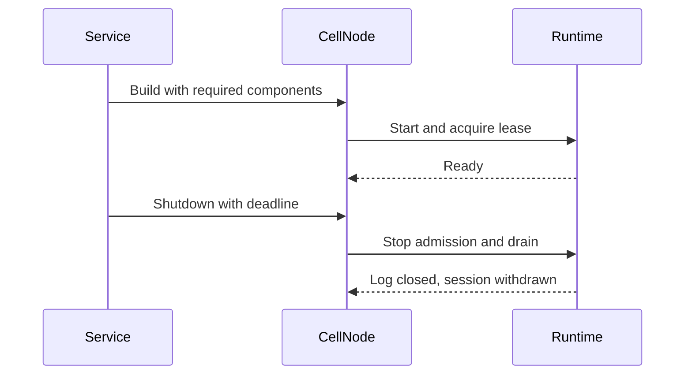

# Node lifecycle

| Component | Responsibility |
| --- | --- |
| `CellNodeBuilder` | Validate dependencies before starting runtime. |
| `CellNodeTaskGroup` | Bound and supervise ordinary tasks and lease maintenance. |
| `CellNode` | Report readiness, status, and shared runtime metrics. |
| Facilities | Register owned components before readiness. |
| Drain | Stop admission, finish accepted work, then close the node log. |
| Scale down | Serialize releases with shutdown through one drain lane. |

A deadline bounds releases started after acquiring the drain lane; it does not
bound waiting for that lane. Fleet-level pacing stays in the movement planner.
The node retains lease maintenance while accepted work and covered log tails
are drained. See [the framework integration guide](../../../docs/framework.md) for service
startup order.

The host retains one runtime shutdown task and its original result. A deadline
cancels the join waiter; accepted runtime drain continues. A later drain joins
that task instead of calling runtime shutdown twice. Facility failures remain
inspectable, and the host reaches Stopped only after every required phase
succeeds. A retained runtime failure preserves its original error as a source
on every subsequent observation.

## Journal bound fleet actions

### Fleet boot admission

For a fleet-managed host, load its retained `NodeIntent` and pass it to
`CellNodeBuilder::with_fleet_startup_intent` before building. The leased runtime
holds its shared writer, reader and follower gate before the application can
install a lease. An Active row must name this boot; a maintenance predecessor
can build with admission held until the journal validates its successor.
The offline unleased maintenance builder rejects this configuration.

| Startup boundary | Required behavior |
| --- | --- |
| Build | Validate the retained intent, hold new roles, and install its sticky Cordoned/Draining mode. Missing or ambiguous rows fail before build. |
| Enroll boot | Journal Pending before canonical directory creation. Only New permits first execution; an Existing request requires canonical inspection and its exact original evidence. |
| Confirm | Call `confirm_fleet_startup(journal, enrollment_key)` after Established publication and lease installation. `FleetEnrollmentJournal::load_boot` reads the exact established boot and current intent in one transaction. Missing, pending, retired or foreign evidence cannot open admission. |
| Start | Install required facilities/task supervision and finish probes, then call `start()`. Confirmation alone keeps the hold. Start checks the owned components and opens Active admission, or enters `NodeState::Maintenance` under retained cordon/drain. |
| Route requests | Serving probes use `is_ready()`. Authorized management uses `is_management_ready()`, which includes Maintenance. Fleet action/inspection endpoints remain available there; new roles stay closed. |
| Close | Join accepted work and runtime shutdown before fencing/withdrawing the boot and retiring its registry obligation. A canonical permanent session tombstone can settle a lost withdrawal reply; absence or expiry cannot. |

Confirmation is a cancellable read. Concurrent confirmations cannot overwrite a
newer checked intent with an older reply; a read that finishes after shutdown
cannot reopen the node. Local startup checks do not replace an application's
atomic enrollment policy, authentication, complete registry import or ongoing
intent supervision. A journal transition after confirmation must still reach
the shared local gate through the authorized maintenance action path.

The [reference example](../examples/fleet_operations/README.md) wires this order
to actual signed directory enrollment and one durable SQLite transaction domain.
Reader/follower producers and complete fleet observation remain integration work.

Install `CellNode::install_fleet_actions` during startup with a fleet/application
scope, stable physical NodeId, an application-owned `FleetActionJournal`, and
trusted `FleetCellProvider` inputs. The provider resolves catalog, replica,
canonical authority, private local destination, and this node's leased owner.
Its lookup performs no hydration or takeover; remote callers supply no local
paths or credentials.
For failed-source recovery, `recovery_inputs` supplies an existing canonical
`NodeTakeoverProof` and recovery manifest store. Ordinary node recovery first
fences the failed session and seals/pins its required tail; the provider lookup
performs none of those effects.
The application authenticates management requests. The journal atomically
checks the current controller epoch, head, permit, intent, endpoint, and
deadline when first accepting an action. `AcceptedFleetAction` validates its
shape and exact inputs; its Rust type supplies no remote authorization.

`apply_fleet_action` executes settled source Release with
`release_idle_cell_at`, actual receiver preparation, canonical activation,
resource cleanup and failed-source recovery. Maintenance Cordon closes the
same new-writer, reader, and follower admission gate after exact boot-bound
journal acceptance. Existing owners keep serving until their movement barrier.
Fresh inspection uses its separate request-bound method. The caller-driven
reconciler supports cordon and settled movement; complete observation wiring,
complete primitive maintenance coverage and role finalization remain under implementation in the
[fleet operations plan](../../../docs/fleet-operations-plan.md).

| Event | Action executor behavior |
| --- | --- |
| First acceptance | Commit exact acceptance before its effect. Movement Release rechecks deadline and invokes the canonical actor release for the exact session, generation, incarnation and epoch. |
| Prepare receiver | Validate catalog/Cell/incarnation and current release/schema support; reserve actual runtime/LTX resources before returning Reserved. A refusal preserves the original error and leaves the source serving. |
| Maintenance Cordon | Apply retained Draining intent through the shared admission gate. Replays retain the exact acceptance/result; a dropped waiter leaves publication owned. This preserves existing obligations and uses no shutdown lane. |
| Other maintenance effects | Refuse role settlement, finalization and maintenance inspection until their inventory and host barriers are implemented. A cordon receipt cannot establish Stopped or withdrawal. |
| Activate receiver | Confirm the exact Idle acquisition basis is durably retained before ordinary ownership CAS; consume prepared credit through canonical restore and actor activation. |
| Acquisition-basis reply lost | Keep authority untouched and the prepared credit charged. Repeating the same accepted action confirms the original basis and capture time before takeover. |
| Unused credit after release | Journal CleaningReceiver, cancel/join that credit, and retain the source position and fleet permit. Cleanup returns to Released, with no claim of pre-release cancellation. After confirmed cleanup, ordinary admitted acquisition may resume. |
| Ordinary acquisition on the preferred session | Free the unused preparation without closing the ordinary writer. Verify current authority, actor readiness, and the required release position. Matching session alone never proves prepared credit was consumed. |
| Recover unresolved source release | Journal Recovering, cancel proved-unused preparation, validate canonical failed-session proof, and confirm `RecoveryBasis` before ownership CAS. Confirm `RecoveryEvidence` after exact recovery publication and before actor admission. Return Recovered only with current actor/authority proof. |
| Recovery input reply lost | No ownership CAS starts. Retain the original input/time; an unchanged full canonical control permits confirming that basis and continuing the accepted action. |
| Recovery position reply lost | No actor is admitted. Canonical rollback preserves the materialized root; the attempt stays charged and Unknown. Ordinary acquisition can restore serving, after which inspection verifies it against the retained recovery evidence. |
| Duplicate | Compare the full immutable specification, including cost and physical identities. Join current work or return its committed result. |
| Dropped caller | Retain and finish execution plus journal publication independently of the caller. |
| Result publication failure | Retain the original checked result. Result delivery joins the owned task, so an immediate subsequent dispatch can retry publication. Drain also retries; neither repeats source release. |
| Existing acceptance without a result | Record Unknown and retain the fleet permit; never infer the original release root from current authority. |
| Node drain | Stop new action admission and join retained finite work before runtime shutdown. Keep task handles and checked results when a deadline cancels the drain waiter. |
| Action task fails | Join every accepted sibling job, settle resources, and retain the original join error across repeated drain calls. Runtime cleanup still runs; consuming a task handle cannot make a later shutdown report success. |

`FleetActionCompletion::committed` is true only after confirmed durable result
publication. Preserve its separate execution and journal errors in correlated
diagnostics. A committed Released result proves source release; destination
serving still requires fresh authority and actor evidence. A replay returns a
retained observation; it does not refresh that proof. The executor checks a
new serving observation through the normal FIFO query/lease boundary and
compares actor inventory with current authority. The receiver's local receipt
retires only after confirmed result publication and accepted-task completion.
Later inspection uses retained journal evidence after local retirement.

Clean release and recovery remain separate in status and history. A source-epoch
Idle root after a lost release reply can be a recovery input only with canonical
failed-session proof; a later root alone cannot manufacture Released. Recovery
uses `AcquisitionObserver` recording points through the same ordinary acquisition,
exact-root restoration, and rollback path. The journal atomically binds basis
and evidence to original acceptance, rejects changed inputs, and returns the
original time for identical writes.

The executor uses at most two retained action jobs and charges their envelopes,
results, and acquisition inputs to the existing node retained-byte ledger.
Unknown work retains its fleet permit in the journal. A missing local receipt,
caller timeout, or expired reservation alone proves neither resource settlement
nor successful movement. These local gates do not establish complete fleet
maintenance or process/provider qualification.

## Fresh fleet inspection

Use `CellNode::inspect_fleet_action` for current evidence. A retained
Inspect reply is historical and cannot establish current serving.
`apply_fleet_action` refuses raw Inspect dispatch; use the request-bound method.
Effects and observations use the same finite task owner, shared action bound and
runtime ledger; shutdown joins accepted inspections after dropped waiters.

| Boundary | Required behavior |
| --- | --- |
| Request | Build `FleetInspectionRequest` from the current head's Inspect action and exact `RegistryVersion`. Name the physical node/boot, a new nonce for this pass and an exclusive capture deadline. |
| Authorization | `FleetActionJournal::authorize_inspection` checks current head, registry revision and endpoint intent in one read transaction. Cached acceptance/result records cannot satisfy it. |
| Capture | Inspect actual actor/authority state. Recovery inspection cannot start acquisition; missing recovery position remains Unknown. Retained release and resource-settlement proofs remain historical facts. |
| Response | `FleetInspectionObservation` retains the original capture start/end and full request. `validate_for` rejects mismatched nonce, endpoint, payload, registry or authorization, future time, expired deadline and an over-age capture interval. |
| Dependent decision | Authenticate the reply, check its required position, and compare the head/registry versions again when committing the reducer transition. A failed inspection preserves the charged attempt. |

The observation codecs use new record kinds 17 and 18. Existing effect and
result encodings remain unchanged. Deploy readers before these producers;
decoding a record does not authenticate its origin or prove a complete roster.

## Caller driven fleet reconciliation

Construct `FleetReconciler::new(scope, claimant, profile, journal, observer,
transport)` with the same validated profile as the journal. Supervise one
application loop calling `reconcile_once(clock, deadline)`. The facade starts
no timer, runtime, or detached effect task. Time is logical milliseconds in the
node/journal clock domain. Supply a clock callback returning `Result<i64>`;
each boundary reads it directly and rejects regression. The deadline is a
Tokio monotonic instant.
Honor the report's suggested wake time: committed forward progress requests an
immediate next pass, while unresolved or cancelled work uses periodic retry.
Counts for clean release, fresh activation, canonical recovery, and cancellation
are separate and describe transitions committed during this pass.

| Boundary | Reconciler behavior |
| --- | --- |
| Controller | Claim or renew by CAS, preserving every charged attempt across lease replacement. |
| Existing work | Inspect uncertain phases first; commit each dependent transition against the complete head and registry version. |
| Maintenance | Dispatch Cordon from Requested, commit Cordoned only after a durable bound result, then commit BeginEvacuation on a later pass. These steps continue when optional scheduling is stopped. |
| Planning | Overlay retained intents before selecting donors or receivers. Verify signed inputs, require complete fresh membership for count moves, and project unresolved receive costs before relief uses any remaining shared budget. Partial fresh inputs can evacuate maintenance Cells at normal pressure using their configured peak cost; the exact runtime quiescence and release barrier remains required. |
| Dispatch | Commit the phase before sending; check full retained acceptance and result binding. Transport timeout retains the phase and permit. |
| Unaccepted action | Prove absence in the same journal CAS that advances the head revision, fencing delayed old requests before retry. Accepted work remains charged and is inspected. Expired preparation/release returns to cleanup. |
| Expired unused receiver | After proven release, cancel and join expired prepared credit before first activation. Retain the release position and fleet permits, then use canonical ordinary admission after committed cleanup. |
| Endpoint failure | Reserve bounded deadline shares for charged attempts, maintenance and planning. Retain attempt errors in `failures` and the maintenance error in `maintenance_failure`. After an ambiguous timeout, reread the journal and controller epoch before continuing. Journal errors stop the pass. |
| Serving | Consume request-bound fresh actor/authority evidence before activation or retirement. A historical receipt cannot replace the current check. |
| History | Atomically retire with progress; read incarnation-specific cooldown and the global post-batch time from committed history. |
| Operator stop | Disable new allocations while accepted work continues through inspection and cleanup. |
| Maintenance deadline | Keep the cordon; stop new maintenance allocations and bound their deadlines by the operation deadline. Already accepted effects remain retained. Empty movement permits cannot prove completed role evacuation or shutdown. |

`FleetObserver` owns authenticated membership and bounded page collection.
`FleetTransport` owns endpoint authorization and exact boot routing to the public
node action/inspection APIs. Driver models combine SQLite with simulated effects.
The `fleet_operations overload` command and its shared test now execute two
real moves across three leased nodes, reopen an independent controller client,
and verify original receipts and readback. `controller-restart` also loses both
source replies, waits for actual controller expiry, changes claimant/epoch,
adopts retained releases and joins expired receiver credit before activation.
Both scenarios verify empty resource ledgers after shutdown. Their fixed ownership-only collector
reports incomplete role coverage; production complete observations,
source/receiver failure adoption, busy maintenance, and role finalization remain
required by the [fleet plan](../../../docs/fleet-operations-plan.md).

## Shared fleet journal and enrollment transactions

`FleetJournal` extends the action and enrollment journal contracts. Its
`FleetJournalSnapshot` reads the head and shared `RegistryVersion` together.
`compare_exchange` checks both exact versions, controller fencing, and reducer
invariants in the same durable transaction. Allocate also checks scheduling
policy and current retained source/receiver intents. Maintenance changes retain
the physical-node row and operation; retirement commits exact history with its
permit release. Older completed operations and cordons remain reachable.

`FleetEnrollmentJournal` records Pending before starting ordinary boot, reader,
or follower enrollment. Only New authorizes first execution. Existing compares
the full spec and returns its original state; an unknown Pending record needs
inspection. Producers check intent revisions inside acceptance, retain failed
boots, and publish checked completion/refusal/closure evidence. Reboot lease
enrollment carries the retained mode and cannot open readiness under a cordon.

Registry pages require an exact shared revision and a limit in 1..=128. A changed
revision restarts the scan. Bootstrap requires a controlled pause and complete
import; an empty live directory does not establish coverage. Stop/resume updates
this same registry version and blocks only new planned allocations. Previously
accepted actions and their resource obligations still reconcile.

The application supplies the durable backend, authorization, and canonical
enrollment evidence. The [fleet journal example](../examples/fleet_operations/README.md)
implements all three journal contracts in one local SQLite transaction domain.
Its focused tests exercise independent clients, lost commit replies and
reconstruction. Boot production uses the startup barrier above. The
[managed reader producer](read-replicas.md#bind-the-durable-fleet-producer) binds
ordinary activation and joined closure to this journal. Install it after read
replicas and before start; configured fleet hosts require it for readiness.
Complete observer coverage, follower production, replacement policy,
maintenance finalization, and process/provider qualification remain required.

## Runtime maintenance quiescence checkpoint

The canonical runtime now exposes exact-source foreground quiescence and
separate primitive maintenance readiness. See
[foreground quiescence](../../cellule-runtime/docs/deployment.md#foreground-quiescence-for-planned-maintenance)
for admission and proof limits. Fleet observations hash the quiescence flag,
readiness presence and all blocker classes under planner input domain
`cellule.fleet-planner-inputs.v3`. Existing retained attempt digests remain
opaque and unchanged; this is a new producer domain, not a journal rewrite.
The v3 producer also binds the separate peak maintenance cost (presence and all
admission dimensions), role, executable identity and individual blocker classes.
The driver can plan busy demand only for an exact Evacuating maintenance node
and boot, within its retained deadline. It tolerates local execution, publication,
lease and unknown primitive readiness until canonical release rechecks them;
Blob and foreign reader/follower/facility blockers remain blocked. A Draining
advertisement alone cannot authorize this demand. Receiver projection and the
shared count/byte limits still apply. Full role evacuation remains incomplete.

## Explicit maintenance release checkpoint

The committed `BeginMaintenanceRelease` transition requires the exact Evacuating
maintenance operation, physical source node and boot. It retains
`AttemptPhase::MaintenanceReleasing` (tag 13) and dispatches
`MovementAction::ReleaseMaintenance` (tag 8). Existing ordinary Releasing/Release
records retain their original policy. Deploy readers that understand these new
tags before enabling their producers; older readers reject unknown tags.

The node-owned executor calls the canonical runtime maintenance release with the
minimum attempt/reservation deadline. A definite preflight refusal produces a
checked Rejected result and preserves its source error. Unresolved release keeps
both fleet permits and requires inspection or canonical recovery. Lost waiters
cannot cancel accepted work; source inspection loads the exact retained release
kind and never repeats an accepted release without evidence. These steps do not
prove reader/follower evacuation, Stopped, withdrawal or complete maintenance.
