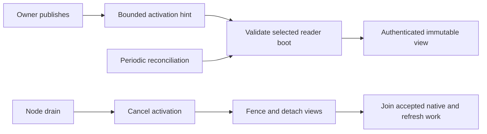

# Read replica lifecycle



| Boundary | Behavior |
| --- | --- |
| Memory | Snapshot reservations are separate from writer memory. |
| Installation | Manager starts after the node task group; dispatcher uses the same resolver. |
| Recruitment | Locally owned Cells send scoped hints through an authorized peer client. |
| Refresh | New view must prove its root and receipt before selection. |
| Periodic repair | Scan installed views and retained producer requests; replay original results and joined nonexecution exclusions without another hint. |
| Missing reader | Queries return a replica error; they do not trigger activation. |
| Drain | Cancels activation, closes admission, detaches views, and joins accepted work before removing ownership. |

Commands do not wait for readers. Reconciliation repairs dropped hints and
membership changes; it is not a freshness guarantee. See
[application read policies](../../cellule-app/docs/invocation.md).

## Bind the durable fleet producer

Install read replicas, then `CellNode::install_fleet_reader_enrollment` before
startup and the first activation. Hosts configured with a fleet startup intent
require this owned binding before readiness can open. A rejected activation
before binding creates no responsibility and does not prevent installation.

```rust
use std::sync::Arc;
use cellule_host::{CellNode, fleet::FleetJournal};
use cellule_runtime::{fleet::operations::FleetScope, identity::NodeId};

fn bind_reader_registry(
    node: &CellNode,
    scope: FleetScope,
    physical_node: NodeId,
    journal: Arc<dyn FleetJournal>,
) -> cellule_runtime::Result<()> {
    node.install_fleet_reader_enrollment(scope, physical_node, journal)
}
```

| Boundary | Bound manager behavior |
| --- | --- |
| Pending | Verify source and receiver signed physical boots, read bounded exact-version intent pages, and accept the pinned root and both intent revisions atomically. Only New starts native opening. |
| Ownership | Retain up to 32 finite activation jobs using the runtime byte ledger. A returned activation joins its exact task and byte-token release. Dropping the hint/prepared-activation or join waiter cannot cancel accepted opening or publication. |
| Established | Check the exact initial receipt and publish evidence binding the original request, source code/schema, owner endpoint and pinned root. A lost publication reply retains the same result for replay before refresh. |
| Removal | Join canonical closure before Retired. Keep the fenced view, original request and event across cancellation or failed publication. `remove` and `shutdown` return errors and can be retried. |
| Unknown acceptance | Preserve the original request. After its original activation releases the lane, periodic repair or removal atomically publishes the exact Refused exclusion for a never-started opening. Missing/Pending acceptance cannot authorize another opening. Unjoined native work remains blocked. |
| Diagnostics | `enrollment_completion(cell)` returns the original source/request, acceptance, current event and independently retained native/publication errors. These are diagnostic facts, not current serving or replacement-policy proof. |

Refresh, policy eviction, peer hints and shutdown share the existing manager
lane. New local roles check the shared admission gate before acceptance and
again at native opening. The manager bounds retained responsibilities at 10,000
and charges three record envelopes per entry; ordinary native view admission
still applies. A task failure cannot turn an unjoined native opening into
retirement. Shutdown joins healthy siblings and preserves the original task
failure.

The existing five-second reconciliation loop scans the sorted union of installed
views and retained enrollment requests, with at most 64 attempts per batch. It
charges the bounded temporary index to the runtime metadata ledger. The loop
may scan before lease installation and after local fencing; this charge grants
no native admission or lease authority. New openings and native inventory reads
retain their live-lease checks. A missing view is
reconciled only after acquiring the original activation lane; a still-owned
opening cannot be mistaken for nonexecution. Selected open views replay their
original Established evidence before refresh. Fenced views left by cancelled
removal resume canonical joining and the same Retired event before remote I/O.
A failed result does not erase its original error or prevent other rows from
progressing. Capacity refusal retains all responsibilities for a later tick.

On a managed Draining node, periodic reconciliation preserves an open reader
even when cordon removes it from placement. It repairs original establishment
without opening or refreshing a view. Explicit maintenance checks below govern
evacuation; fenced views still resume their original closure and retirement.

The journal retains failed-boot and Pending rows across restart. Reconstructing
a manager does not erase or automatically settle them. Applications still own
complete roster collection, evidence storage/validation, failed-process closure
proof, replacement redundancy and maintenance finalization. The reference
example tests this producer with real SQLite readers and its durable journal;
its movement commands still report incomplete role observation.

## Prepare exact enrollment inputs

| Method | Boundary |
| --- | --- |
| `prepare_source(target, origin)` | Observe canonical authority, verify the live signed owner boot and current reader selection, and return opaque `ReadReplicaSource` metadata. Reserve no view resources and create no reader. |
| `activate_source(source)` | Initially open the original pinned root through ordinary admitted activation. Recheck selection, incarnation/code, owner/epoch and signed boot identity. Refuse an already installed view without refreshing it. |
| `activate(target, origin)` | Ordinary authenticated hints retain their existing refresh behavior, using the same source preparation and native opening path. |

An enrollment adapter can derive immutable role inputs before Pending acceptance:

```rust
use cellule_runtime::ReadReplicaSource;
use cellule_runtime::fleet::operations::{EnrollmentRole, PublishedPosition};

fn reader_role(source: &ReadReplicaSource) -> EnrollmentRole {
    EnrollmentRole::Reader {
        target: source.target().clone(),
        position: PublishedPosition {
            incarnation: source.description().incarnation,
            epoch: source.epoch(),
            root: source.root().clone(),
        },
    }
}
```

Bind `source.node()`, `source.owner().session` and `source.fleet()` to the
source endpoint and fleet scope. Without a managed binding, the application must obtain current endpoint
intent revisions and journal Pending atomically before activation. Only New
acceptance permits first execution; an ambiguous or Existing reply requires
inspection. Later publication under the same owner does not change the root
opened by `activate_source`. Ordinary subsequent refresh remains available.
After entering the activation lane, prepared opening joins its work on manager
closure. The adapter must retain that future; dropping its waiter without an
owner still leaves an unknown enrollment outcome.

With the fleet binding, both activation methods use the owned producer above.
Without it, the adapter must retain accepted activation across waiter cancellation,
publish checked completion and retire only after joined closure. Source metadata
and snapshot receipts cannot establish complete enrollment coverage.

If the retained owner joins without ever starting native opening, removal uses
`refuse_unexecuted_enrollment` in the shared journal transaction domain. It retains
an exact Refused exclusion row whether acceptance is absent, Pending, or its reply
was lost. A delayed acceptance must replay that terminal row. Reading absence
alone cannot close this obligation. Established or differently settled rows
conflict; they require their original native closure evidence. Once native opening
started, joined opening/closure continues to publish the original Retired event.

## Join reader closure

`CellReadReplica::close()` fences new work across every clone.
`close_and_join().await` additionally detaches the shared snapshot and waits for
accepted queries, authority reads, refreshes and native SQLite opens. This
includes older snapshots still used by queries and native jobs whose request
waiters were cancelled. Retaining a peer clone cannot retain a detached view's
memory, descriptor or disk charges after joined closure.

The manager retains each reader until joined removal and, when bound, durable
retirement succeed. Cancelling a
removal or shutdown waiter leaves that obligation inventoried; a later call
joins the same work. Shutdown fences all views before joining up to 16 at once.
A host drain deadline can return while native work remains owned: the host
stays Draining until a later shutdown joins it.

The returned receipt and `receipt()` describe the last installed snapshot,
including after closure. They do not prove current authority, replacement
redundancy, or durable fleet registry retirement. Publish retirement only after
the canonical closure and the application's checked enrollment evidence.

## Evacuate a managed reader

Use `ReadReplicaManager::evacuate` with the original Established enrollment and
the current journal operation in Evacuating. The owner-side recruiter supplies
replacement activation through the existing authenticated peer path.

| Check | Required observation |
| --- | --- |
| Donor | Exact physical node/session, current Draining intent, Draining signed boot, and Established boot enrollment. |
| Journal | Complete bounded intent/enrollment traversal and unchanged head/registry before closure and after retirement. |
| Replacements | Current canonical policy selection on other physical nodes; exact Active managed boots and Established reader enrollments. |
| Native readiness | Authenticated status replies cover the original and current published prefixes. A second probe after closure also covers any refresh completed through a retained peer clone. |
| Closure | Canonical local joining followed by confirmed retirement of the exact original request. |
| Freshness | Same authority lifetime, nonregressing publication, unchanged policy, and fresh selected boot identity/liveness checks. |

```rust
use cellule_host::read_replicas::{ReadReplicaManager, ReaderEvacuation};
use cellule_runtime::{
    fleet::operations::{EnrollmentRecord, MaintenanceOperation},
    peer::ReplicaPeerClient,
};

async fn evacuate_reader(
    manager: &ReadReplicaManager,
    original: &EnrollmentRecord,
    operation: &MaintenanceOperation,
    peer: &ReplicaPeerClient,
    deadline: tokio::time::Instant,
) -> cellule_runtime::Result<ReaderEvacuation> {
    manager.evacuate(original, operation, peer, deadline).await
}
```

No adequate spare means no new local close. Zero desired readers permits checked
closure without replacement. An owner, policy, boot or registry change refuses
evidence; a change after closure can leave the original retired while the
operation remains incomplete. Cancellation, deadlines and lost retirement
replies preserve the original closure and producer event. Retry that same
Established request; absence from the local view map alone proves nothing.
The effective deadline is the earliest of the caller's monotonic deadline,
the operation's remaining wall-clock deadline and thirty-second capture bound. Timeout errors retain their
original source.

Roster pages, retained records, temporary boot observations and returned
evidence use the runtime's shared metadata ledger. Drop `ReaderEvacuation` when
finished consuming it to release its retained charge. Its capture interval
belongs to that attempt; replayed retirement keeps its original journal times.

This result settles one local reader. It does not settle foreign followers,
failed processes, writers, complete fleet membership, or terminal shutdown.
The controller must persist and revalidate the observed replacements and all
remaining obligations before finalization. A receiver can fail after capture.

The reference fixture exercises real managed boots, signed peer dispatch,
native readers, cancellation, lost replies and the post-probe refresh race:

```sh
cargo test -p cellule-host --example fleet_operations --locked reader_tests::evacuation
```

## Persist and revalidate reader replacement coverage

`ReaderEvacuation::durable_record` builds a `ReaderEvacuationRecord` and every
canonical replacement page. The manifest retains the original full head digest,
registry version, maintenance operation, retired request/history, authority,
policy revision/count, closed prefix and collection interval. Each replacement
binds its signed boot identity, exact Established enrollment digest and observed
native prefix. Pages hold at most 128 entries and cover the full 10,000-reader
policy bound; missing, reordered, foreign or duplicate entries refuse. Decoding
validates historical shape and supplies no authentication or readiness.

Implement `FleetReaderEvacuationJournal` in the same transaction domain as the
existing fleet/enrollment/action journal. Commit every immutable page, manifest
and latest operation/request pointer together, advancing the shared registry.
Compare the full original snapshot, current operation/controller, original
Retired row and replacement Established rows/intents inside that transaction.
Exact replay retains original times and cannot restore a superseded pointer.
The SQLite example supplies this implementation through its existing finite
backend jobs; cancellation does not cancel an accepted commit.

```rust
async fn persist_reader_evacuated(
    capture: &cellule_host::read_replicas::ReaderEvacuation,
    journal: &dyn cellule_host::fleet::FleetReaderEvacuationJournal,
    verifier: &cellule_host::fleet::FleetReaderEvacuationVerifier,
    deadline: tokio::time::Instant,
    clock: impl FnMut() -> cellule_runtime::Result<i64>,
) -> cellule_runtime::Result<cellule_host::fleet::FleetReaderEvacuationPublication> {
    cellule_host::fleet::FleetReaderEvacuationPublication::publish(
        capture, journal, verifier, deadline, clock,
    ).await
}
```

Construct the verifier from the existing `NodeDirectory`, `CellAuthority`,
`ReadPolicyStore` and authenticated `ReplicaPeerClient`. Publication performs
fresh pre/post checks. Inspect `record()` even if `confirmed()` fails: a lost
reply or subsequent policy/authority/boot change can leave committed history
with an independently retained source error. Reconstruct the client, load the
same digest or latest original request, then call `verifier.recheck`. It reloads
every page, traverses the complete current roster and probes native readiness
twice around authority, policy, selection and signed-boot rechecks. Fresh
confirmation has its own interval; it never restamps historical capture.

After policy, replacement boot, owner, deadline or operation-session changes,
`verifier.refresh` captures a new immutable policy candidate from the previously
committed original retirement. The ordinary recruiter must supply current ready
replacements. `publish_refreshed` commits the candidate under its new exact
barrier. This can repair coverage while Closing without repeating native reader
closure; old manifests and original retirement times remain retained. Missing
capacity, a changed incarnation or incomplete historical pages stay blocked.

Applications account these bounded copied metadata buffers and authenticate
provider/peer calls. One checked reader still supplies no complete role graph,
failed-process proof, affected-writer relocation or permission to finalize a
physical node. Persisted follower policy, aggregate controller settlement and
process/provider qualification remain required. The
[executable evidence](../minion/README.md#durable-reader-replacement-evidence)
uses real managed readers, signed status probes and independent SQLite clients.

## Observe managed reader obligations

`ReadReplicaManager::fleet_readers_page(cursor, limit, now_ms)` returns sorted
snapshot positions, canonical lifetime observations and the total managed-view
count. Choose 1 through 128 entries. Each page retains one MiB from the node's existing native-byte ledger
until dropped. The manager limits its collection to 10,000 views; ordinary
memory and descriptor admission can refuse a view sooner.

Observation waits in the existing activation/removal lane, so an accepted open
cannot disappear between its installation and the scan. Activation, removal,
replacement, or shutdown invalidates the continuation. Refreshing an existing
view updates its receipt without creating a new topology. Cordon remains
visible independently of reader count; stale remote advertisements cannot
admit a new local view.

```rust
use cellule_host::read_replicas::ReadReplicaManager;

async fn managed_reader_count(
    manager: &ReadReplicaManager,
    now_ms: i64,
) -> cellule_runtime::Result<usize> {
    let page = manager.fleet_readers_page(None, 128, now_ms).await?;
    Ok(page.total_views())
}
```

The continuation fingerprint covers the exact manager/session, node admission,
manager closure and every managed reader's receipt, lifetime count, admission
closure and snapshot attachment. Each page hashes the complete bounded set in
place, including rows outside that page; it copies at most the requested rows.
Refresh or closure through a retained peer handle can invalidate continuation
without changing the manager's view set. A changed scan must restart. Admission
is checked again after capture; its change rejects the page.

Matching fingerprints describe capture intervals. An open query can start and
finish between captures, returning to the same count. They do not establish an
atomic view or upgrade an open reader to joined. Closed, detached zero remains
the canonical stable local-join condition.

Each entry is a `cellule_runtime::client::ReadReplicaLifecycleObservation`.
`receipt()` returns its last installed position. `admission_closed()` and
`snapshot_attached()` report shared state across every retained reader clone.
`retained_lifetimes()` counts canonical guards for snapshots and accepted
operations, including native queries and refresh jobs whose callers cancelled.
It is neither a query count nor a count of handle copies.

`locally_joined()` requires closed admission, detached shared state and zero
original lifetimes. Closed plus zero cannot admit another operation or attach a
new snapshot. A closed reader with pending native work stays visible and reports
false. These local observations do not prove replacement policy, current remote
authority, durable producer retirement or successful host shutdown. Maintenance
must independently settle those obligations before declaring a node safe to stop.
