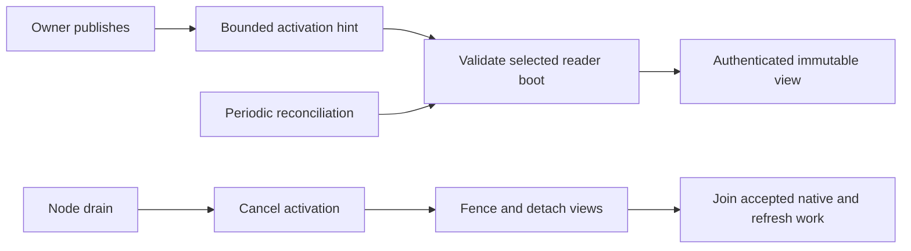

# Read replica lifecycle



| Boundary | Behavior |
| --- | --- |
| Memory | Snapshot reservations are separate from writer memory. |
| Installation | Manager starts after the node task group; dispatcher uses the same resolver. |
| Recruitment | Locally owned Cells send scoped hints through an authorized peer client. |
| Refresh | New view must prove its root and receipt before selection. |
| Missing reader | Queries return a replica error; they do not trigger activation. |
| Drain | Cancels activation, closes admission, detaches views, and joins accepted work before removing ownership. |

Commands do not wait for readers. Reconciliation repairs dropped hints and
membership changes; it is not a freshness guarantee. See
[application read policies](../../cellule-app/docs/invocation.md).

## Prepare exact enrollment inputs

| Method | Boundary |
| --- | --- |
| `prepare_source(target, origin)` | Observe canonical authority, verify the live signed owner boot and current reader selection, and return opaque `ReadReplicaSource` metadata. Reserve no view resources and create no reader. |
| `activate_source(source)` | Initially open the original pinned root through ordinary admitted activation. Recheck selection, incarnation/code, owner/epoch and signed boot identity. Refuse an already installed view without refreshing it. |
| `activate(target, origin)` | Ordinary authenticated hints retain their existing refresh behavior, using the same source preparation and native opening path. |

An enrollment adapter can derive immutable role inputs before Pending acceptance:

```rust
use cellule_runtime::ReadReplicaSource;
use cellule_runtime::fleet::operations::{EnrollmentRole, PublishedPosition};

fn reader_role(source: &ReadReplicaSource) -> EnrollmentRole {
    EnrollmentRole::Reader {
        target: source.target().clone(),
        position: PublishedPosition {
            incarnation: source.description().incarnation,
            epoch: source.epoch(),
            root: source.root().clone(),
        },
    }
}
```

Bind `source.node()`, `source.owner().session` and `source.fleet()` to the
source endpoint and fleet scope. The application must obtain current endpoint
intent revisions and journal Pending atomically before activation. Only New
acceptance permits first execution; an ambiguous or Existing reply requires
inspection. Later publication under the same owner does not change the root
opened by `activate_source`. Ordinary subsequent refresh remains available.
After entering the activation lane, prepared opening joins its work on manager
closure. The adapter must retain that future; dropping its waiter without an
owner still leaves an unknown enrollment outcome.

These methods supply exact inputs and opening, not a durable producer or result
owner. The adapter must retain accepted activation across waiter cancellation,
publish checked completion and retire only after joined closure. Source metadata
and snapshot receipts cannot establish complete enrollment coverage.

## Join reader closure

`CellReadReplica::close()` fences new work across every clone.
`close_and_join().await` additionally detaches the shared snapshot and waits for
accepted queries, authority reads, refreshes and native SQLite opens. This
includes older snapshots still used by queries and native jobs whose request
waiters were cancelled. Retaining a peer clone cannot retain a detached view's
memory, descriptor or disk charges after joined closure.

The manager retains each reader until joined removal succeeds. Cancelling a
removal or shutdown waiter leaves that obligation inventoried; a later call
joins the same work. Shutdown fences all views before joining up to 16 at once.
A host drain deadline can return while native work remains owned: the host
stays Draining until a later shutdown joins it.

The returned receipt and `receipt()` describe the last installed snapshot,
including after closure. They do not prove current authority, replacement
redundancy, or durable fleet registry retirement. Publish retirement only after
the canonical closure and the application's checked enrollment evidence.

## Observe managed reader obligations

`ReadReplicaManager::fleet_readers_page(cursor, limit, now_ms)` returns sorted
snapshot receipts and the total managed-view count. Choose 1 through 128
entries. Each page retains one MiB from the node's existing native-byte ledger
until dropped. The manager limits its collection to 10,000 views; ordinary
memory and descriptor admission can refuse a view sooner.

Observation waits in the existing activation/removal lane, so an accepted open
cannot disappear between its installation and the scan. Activation, removal,
replacement, or shutdown invalidates the continuation. Refreshing an existing
view updates its receipt without creating a new topology. Cordon remains
visible independently of reader count; stale remote advertisements cannot
admit a new local view.

```rust
use cellule_host::read_replicas::ReadReplicaManager;

async fn managed_reader_count(
    manager: &ReadReplicaManager,
    now_ms: i64,
) -> cellule_runtime::Result<usize> {
    let page = manager.fleet_readers_page(None, 128, now_ms).await?;
    Ok(page.total_views())
}
```

These receipts are advisory snapshot positions. They do not prove replacement
policy, live-owner readiness, or closure of accepted queries and retained peer
clones. Maintenance must settle those obligations and complete the canonical
host drain before claiming that the node is safe to take offline.
