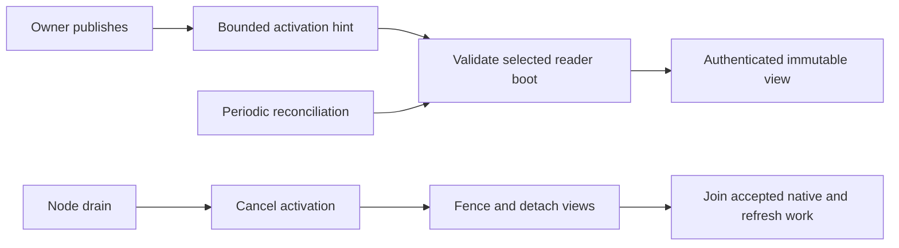

# Read replica lifecycle



| Boundary | Behavior |
| --- | --- |
| Memory | Snapshot reservations are separate from writer memory. |
| Installation | Manager starts after the node task group; dispatcher uses the same resolver. |
| Recruitment | Locally owned Cells send scoped hints through an authorized peer client. |
| Refresh | New view must prove its root and receipt before selection. |
| Missing reader | Queries return a replica error; they do not trigger activation. |
| Drain | Cancels activation, closes admission, detaches views, and joins accepted work before removing ownership. |

Commands do not wait for readers. Reconciliation repairs dropped hints and
membership changes; it is not a freshness guarantee. See
[application read policies](../../cellule-app/docs/invocation.md).

## Bind the durable fleet producer

Install read replicas, then `CellNode::install_fleet_reader_enrollment` before
startup and the first activation. Hosts configured with a fleet startup intent
require this owned binding before readiness can open. A rejected activation
before binding creates no responsibility and does not prevent installation.

```rust
use std::sync::Arc;
use cellule_host::{CellNode, fleet::FleetJournal};
use cellule_runtime::{fleet::operations::FleetScope, identity::NodeId};

fn bind_reader_registry(
    node: &CellNode,
    scope: FleetScope,
    physical_node: NodeId,
    journal: Arc<dyn FleetJournal>,
) -> cellule_runtime::Result<()> {
    node.install_fleet_reader_enrollment(scope, physical_node, journal)
}
```

| Boundary | Bound manager behavior |
| --- | --- |
| Pending | Verify source and receiver signed physical boots, read bounded exact-version intent pages, and accept the pinned root and both intent revisions atomically. Only New starts native opening. |
| Ownership | Retain up to 32 finite activation jobs using the runtime byte ledger. Dropping the hint/prepared-activation waiter cannot cancel accepted opening or publication. |
| Established | Check the exact initial receipt and publish evidence binding the original request, source code/schema, owner endpoint and pinned root. A lost publication reply retains the same result for replay before refresh. |
| Removal | Join canonical closure before Retired. Keep the fenced view, original request and event across cancellation or failed publication. `remove` and `shutdown` return errors and can be retried. |
| Unknown acceptance | Preserve the original request. Removal reads its exact key; it never creates a fresh acceptance. Pending can retire after proving this owner never began opening; no row plus that local proof settles the local entry. Unobserved establishment remains blocked. |
| Diagnostics | `enrollment_completion(cell)` returns the original source/request, acceptance, current event and independently retained native/publication errors. These are diagnostic facts, not current serving or replacement-policy proof. |

Refresh, policy eviction, peer hints and shutdown share the existing manager
lane. New local roles check the shared admission gate before acceptance and
again at native opening. The manager bounds retained responsibilities at 10,000
and charges three record envelopes per entry; ordinary native view admission
still applies. A task failure cannot turn an unjoined native opening into
retirement. Shutdown joins healthy siblings and preserves the original task
failure.

The journal retains failed-boot and Pending rows across restart. Reconstructing
a manager does not erase or automatically settle them. Applications still own
complete roster collection, evidence storage/validation, failed-process closure
proof, replacement redundancy and maintenance finalization. The reference
example tests this producer with real SQLite readers and its durable journal;
its movement commands still report incomplete role observation.

## Prepare exact enrollment inputs

| Method | Boundary |
| --- | --- |
| `prepare_source(target, origin)` | Observe canonical authority, verify the live signed owner boot and current reader selection, and return opaque `ReadReplicaSource` metadata. Reserve no view resources and create no reader. |
| `activate_source(source)` | Initially open the original pinned root through ordinary admitted activation. Recheck selection, incarnation/code, owner/epoch and signed boot identity. Refuse an already installed view without refreshing it. |
| `activate(target, origin)` | Ordinary authenticated hints retain their existing refresh behavior, using the same source preparation and native opening path. |

An enrollment adapter can derive immutable role inputs before Pending acceptance:

```rust
use cellule_runtime::ReadReplicaSource;
use cellule_runtime::fleet::operations::{EnrollmentRole, PublishedPosition};

fn reader_role(source: &ReadReplicaSource) -> EnrollmentRole {
    EnrollmentRole::Reader {
        target: source.target().clone(),
        position: PublishedPosition {
            incarnation: source.description().incarnation,
            epoch: source.epoch(),
            root: source.root().clone(),
        },
    }
}
```

Bind `source.node()`, `source.owner().session` and `source.fleet()` to the
source endpoint and fleet scope. Without a managed binding, the application must obtain current endpoint
intent revisions and journal Pending atomically before activation. Only New
acceptance permits first execution; an ambiguous or Existing reply requires
inspection. Later publication under the same owner does not change the root
opened by `activate_source`. Ordinary subsequent refresh remains available.
After entering the activation lane, prepared opening joins its work on manager
closure. The adapter must retain that future; dropping its waiter without an
owner still leaves an unknown enrollment outcome.

With the fleet binding, both activation methods use the owned producer above.
Without it, the adapter must retain accepted activation across waiter cancellation,
publish checked completion and retire only after joined closure. Source metadata
and snapshot receipts cannot establish complete enrollment coverage.

If the retained owner joins without ever starting native opening, removal uses
`refuse_unexecuted_enrollment` in the shared journal transaction domain. It retains
an exact Refused exclusion row whether acceptance is absent, Pending, or its reply
was lost. A delayed acceptance must replay that terminal row. Reading absence
alone cannot close this obligation. Established or differently settled rows
conflict; they require their original native closure evidence. Once native opening
started, joined opening/closure continues to publish the original Retired event.

## Join reader closure

`CellReadReplica::close()` fences new work across every clone.
`close_and_join().await` additionally detaches the shared snapshot and waits for
accepted queries, authority reads, refreshes and native SQLite opens. This
includes older snapshots still used by queries and native jobs whose request
waiters were cancelled. Retaining a peer clone cannot retain a detached view's
memory, descriptor or disk charges after joined closure.

The manager retains each reader until joined removal and, when bound, durable
retirement succeed. Cancelling a
removal or shutdown waiter leaves that obligation inventoried; a later call
joins the same work. Shutdown fences all views before joining up to 16 at once.
A host drain deadline can return while native work remains owned: the host
stays Draining until a later shutdown joins it.

The returned receipt and `receipt()` describe the last installed snapshot,
including after closure. They do not prove current authority, replacement
redundancy, or durable fleet registry retirement. Publish retirement only after
the canonical closure and the application's checked enrollment evidence.

## Observe managed reader obligations

`ReadReplicaManager::fleet_readers_page(cursor, limit, now_ms)` returns sorted
snapshot positions, canonical lifetime observations and the total managed-view count. Choose 1 through 128
entries. Each page retains one MiB from the node's existing native-byte ledger
until dropped. The manager limits its collection to 10,000 views; ordinary
memory and descriptor admission can refuse a view sooner.

Observation waits in the existing activation/removal lane, so an accepted open
cannot disappear between its installation and the scan. Activation, removal,
replacement, or shutdown invalidates the continuation. Refreshing an existing
view updates its receipt without creating a new topology. Cordon remains
visible independently of reader count; stale remote advertisements cannot
admit a new local view.

```rust
use cellule_host::read_replicas::ReadReplicaManager;

async fn managed_reader_count(
    manager: &ReadReplicaManager,
    now_ms: i64,
) -> cellule_runtime::Result<usize> {
    let page = manager.fleet_readers_page(None, 128, now_ms).await?;
    Ok(page.total_views())
}
```

Each entry is a `cellule_runtime::client::ReadReplicaLifecycleObservation`.
`receipt()` returns its last installed position. `admission_closed()` and
`snapshot_attached()` report shared state across every retained reader clone.
`retained_lifetimes()` counts canonical guards for snapshots and accepted
operations, including native queries and refresh jobs whose callers cancelled.
It is neither a query count nor a count of handle copies.

`locally_joined()` requires closed admission, detached shared state and zero
original lifetimes. Closed plus zero cannot admit another operation or attach a
new snapshot. A closed reader with pending native work stays visible and reports
false. These local observations do not prove replacement policy, current remote
authority, durable producer retirement or successful host shutdown. Maintenance
must independently settle those obligations before declaring a node safe to stop.
