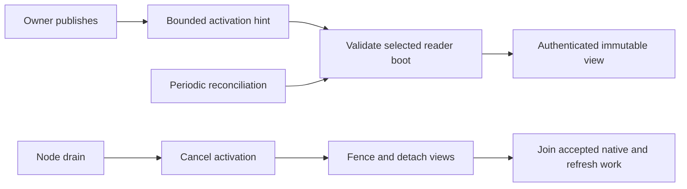

# Read replica lifecycle



| Boundary | Behavior |
| --- | --- |
| Memory | Snapshot reservations are separate from writer memory. |
| Installation | Manager starts after the node task group; dispatcher uses the same resolver. |
| Recruitment | Locally owned Cells send scoped hints through an authorized peer client. |
| Refresh | New view must prove its root and receipt before selection. |
| Missing reader | Queries return a replica error; they do not trigger activation. |
| Drain | Cancels activation, closes admission, detaches views, and joins accepted work before removing ownership. |

Commands do not wait for readers. Reconciliation repairs dropped hints and
membership changes; it is not a freshness guarantee. See
[application read policies](../../cellule-app/docs/invocation.md).

## Join reader closure

`CellReadReplica::close()` fences new work across every clone.
`close_and_join().await` additionally detaches the shared snapshot and waits for
accepted queries, authority reads, refreshes and native SQLite opens. This
includes older snapshots still used by queries and native jobs whose request
waiters were cancelled. Retaining a peer clone cannot retain a detached view's
memory, descriptor or disk charges after joined closure.

The manager retains each reader until joined removal succeeds. Cancelling a
removal or shutdown waiter leaves that obligation inventoried; a later call
joins the same work. Shutdown fences all views before joining up to 16 at once.
A host drain deadline can return while native work remains owned: the host
stays Draining until a later shutdown joins it.

The returned receipt and `receipt()` describe the last installed snapshot,
including after closure. They do not prove current authority, replacement
redundancy, or durable fleet registry retirement. Publish retirement only after
the canonical closure and the application's checked enrollment evidence.

## Observe managed reader obligations

`ReadReplicaManager::fleet_readers_page(cursor, limit, now_ms)` returns sorted
snapshot receipts and the total managed-view count. Choose 1 through 128
entries. Each page retains one MiB from the node's existing native-byte ledger
until dropped. The manager limits its collection to 10,000 views; ordinary
memory and descriptor admission can refuse a view sooner.

Observation waits in the existing activation/removal lane, so an accepted open
cannot disappear between its installation and the scan. Activation, removal,
replacement, or shutdown invalidates the continuation. Refreshing an existing
view updates its receipt without creating a new topology. Cordon remains
visible independently of reader count; stale remote advertisements cannot
admit a new local view.

```rust
use cellule_host::read_replicas::ReadReplicaManager;

async fn managed_reader_count(
    manager: &ReadReplicaManager,
    now_ms: i64,
) -> cellule_runtime::Result<usize> {
    let page = manager.fleet_readers_page(None, 128, now_ms).await?;
    Ok(page.total_views())
}
```

These receipts are advisory snapshot positions. They do not prove replacement
policy, live-owner readiness, or closure of accepted queries and retained peer
clones. Maintenance must settle those obligations and complete the canonical
host drain before claiming that the node is safe to take offline.
