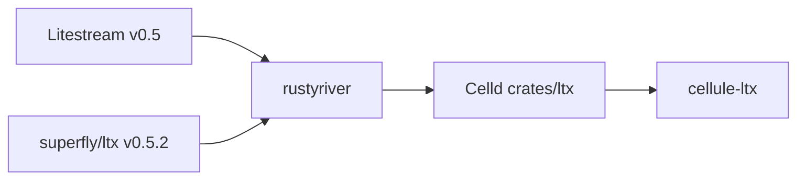

# Source lineage and licenses

`cellule-ltx` contains adapted upstream code. This page explains where it came
from, what Crab changed, which licenses must travel with it, and how to review a
future upstream import.

`cellule-ltx` contains adapted Apache-2.0 code, not a floating dependency or
vendor mirror. Cellule owns the implementation and its future changes. This
record preserves the original sources and compatibility boundary.



| Source | Revision or version | Role |
| --- | --- | --- |
| [Celld](https://github.com/denoland/celld/tree/10cb1303dac710dcb3b557e318e08c855261f68b/crates/ltx) | `10cb1303dac710dcb3b557e318e08c855261f68b`, imported 2026-09-13 | Direct Rust source snapshot. |
| [rustyriver](https://github.com/mikenomitch/rustyriver) | 2026-08-03 Celld snapshot | Earlier Rust LTX implementation. |
| [superfly/ltx](https://github.com/superfly/ltx/tree/v0.5.2) | v0.5.2 | Wire-format reference. |
| [Litestream](https://github.com/benbjohnson/litestream/releases/tag/v0.5.17) | v0.5.17 comparison | Decoder behavior reference, not shared replica protocol. |

For usage and the Litestream sidecar comparison, start with the
[LTX guide](docs/README.md).

<a id="contents"></a>
## Contents

- [Source lineage](#source-lineage)
- [Attribution](#attribution)
- [Licenses and attribution](#licenses-and-attribution)
- [What was adapted](#what-was-adapted)
- [Cellule changes](#cellule-changes)
- [Deliberate Crab changes](#deliberate-crab-changes)
  - [Embedded ownership](#embedded-ownership)
  - [Exact state selection](#exact-state-selection)
  - [Stronger verification](#stronger-verification)
  - [Capture representation and failure contract](#capture-representation-and-failure-contract)
  - [Cell replication](#cell-replication)
  - [Bounded execution](#bounded-execution)
- [Compatibility boundary](#compatibility-boundary)
- [Future imports](#future-imports)
- [Reviewing a future import](#reviewing-a-future-import)
- [See also](#see-also)

<a id="source-lineage"></a>
## Source lineage

The direct source snapshot is the unpublished `crates/ltx` package from
[`denoland/celld`](https://github.com/denoland/celld):

| Field | Value |
| --- | --- |
| Pinned revision | [`10cb1303dac710dcb3b557e318e08c855261f68b`](https://github.com/denoland/celld/tree/10cb1303dac710dcb3b557e318e08c855261f68b/crates/ltx) |
| Imported | 2026-09-13 |
| Original package | `celld-ltx` `0.0.0`, unpublished |
| Crab package | `cellule-ltx` `0.1.0`, unpublished |
| Ownership now | Modified, Crab-owned source; not a vendor mirror or floating dependency |

Celld's Rust implementation was informed by
[`rustyriver`](https://github.com/mikenomitch/rustyriver), a from-scratch Rust
implementation of Litestream v0.5 and LTX. The wire-format reference is
[`superfly/ltx` v0.5.2](https://github.com/superfly/ltx/tree/v0.5.2).

- **Behavioral comparison.** Checked against
  [Litestream v0.5.17](https://github.com/benbjohnson/litestream/releases/tag/v0.5.17).
  That release also uses `superfly/ltx` v0.5.2.
- **What it proves.** Sharing that dependency version means the current
  Litestream decoder understands the sized-block representation written by
  `cellule-ltx`.
- **What it does not prove.** It does not make the two replica layouts or
  publication protocols compatible.

```text
Litestream v0.5 ──────┐
                      ├── rustyriver ── Celld crates/ltx ── cellule-ltx
superfly/ltx v0.5.2 ──┘                                      │
                                                             └─ Crab Cell roots,
                                                                authority and storage
```

<a id="attribution"></a>
## Attribution

Required for any distribution containing `cellule-ltx`:

| Work | Copyright / attribution | License |
| --- | --- | --- |
| Celld | Celld contributors | Apache-2.0 |
| rustyriver | The rustyriver authors, 2026 | Apache-2.0 |
| Litestream | Ben Johnson and contributors | Apache-2.0 |
| LTX reference | Superfly, Inc. | Apache-2.0 |
| LZ4 block implementation | Pierre Curto, 2015 | BSD-3-Clause |

Ship both [LICENSE](LICENSE) and [LICENSE.pierrec-lz4](LICENSE.pierrec-lz4) with
source and binaries. The pinned Celld subtree has no `NOTICE`; no Tokio runtime
source was copied.

<a id="licenses-and-attribution"></a>
## Licenses and attribution

Distributions containing `cellule-ltx` must retain these attributions:

| Work | Attribution | License / version |
| --- | --- | --- |
| Celld | Celld contributors | Apache License 2.0; pinned revision above |
| rustyriver | Copyright 2026 The rustyriver authors | Apache License 2.0; Celld snapshot dated 2026-08-03 |
| Litestream | Copyright Ben Johnson and the Litestream authors | Apache License 2.0; v0.5 lineage |
| LTX reference implementation | Copyright Superfly, Inc. | Apache License 2.0; v0.5.2 |
| LZ4 block implementation | Copyright 2015 Pierre Curto | BSD 3-Clause; `pierrec/lz4` v4.1.23 lineage |

- **Texts.** The complete texts are [LICENSE](LICENSE) and
  [LICENSE.pierrec-lz4](LICENSE.pierrec-lz4).
- **Shipping.** Keep both with source and binary distributions that include this
  crate.
- **NOTICE.** The pinned Celld subtree has no `NOTICE` file.
- **Tokio.** Celld's root `LICENSE.tokio` applies to source outside this import;
  no Tokio runtime source was copied into `cellule-ltx`.

<a id="what-was-adapted"></a>
## What was adapted

The imported files were not kept as a parallel source tree. Their responsibilities
were moved behind Crab-owned APIs:

| Celld source | Crab disposition |
| --- | --- |
| `lib.rs`, `db.rs`, `wal.rs` | WAL validation and capture split across `lib.rs`, `capture.rs`, `capture/`, `wal.rs`, `db.rs`, and `types.rs` |
| `ltx.rs`, `codec.rs`, `lz4_block.rs` | Strict LTX parsing, dual decoding, sized-block encoding, and checked LZ4 helpers |
| `compactor.rs` | Exact-input local and Cell compaction with endpoint verification |
| `host.rs` | Injectable filesystem, clock, SQLite VFS, disk admission, telemetry, executor, and worker contracts in `environment.rs` |
| `paged.rs`, `paged_vfs.rs` | Private authenticated page access plus writable sparse and immutable read-only Cell VFS modes |
| `bundle.rs`, `client/bundle.rs` | Checked CRB1 bundles and exact Cell-scoped recovery overlays |
| `replica.rs`, `replica_compactor.rs` | Design reference only; the standalone epoch-head API was removed |
| `client/epochs.rs`, `client/mod.rs`, `client/object_store.rs` | Replaced by exact Cell roots and existing `cellule-store` transport |
| `compaction_level.rs` | Scheduling remains an embedding-runtime responsibility |

Source headers identify adapted files. The original-byte SHA-256 inventory used
for the import review remains recoverable from repository history at the import
commit; it is not a runtime or compatibility contract.

<a id="cellule-changes"></a>
## Cellule changes

| Area | Current contract |
| --- | --- |
| SQLite | Managed writer, WAL observation, fresh local session, exact capture. |
| Recovery | Explicit verified plan or authority-pinned root; no latest-object listing. |
| LTX | Checksum-bearing v3 files; strict page and rolling-checksum validation. |
| Cell objects | Immutable roots, directories, bundles, and BLAKE3 expectations. |
| Errors | Typed retry, capacity, permanent, ambiguous, and fenced classes. |
| Resources | Bounded file, disk, I/O, scratch, and blocking-job admission. |

The old standalone epoch-head, public page-map, and scheduler layouts are not
read. The one-time Crab-to-Cellule adaptation does not set future framework
policy.

<a id="deliberate-crab-changes"></a>
## Deliberate Crab changes

<a id="embedded-ownership"></a>
### Embedded ownership

- `Db` owns the SQLite writer, control connection, read lock, WAL commit
  observation, and fresh local session claim.
- No background daemon, provider URL parser, credential loader, HTTP service,
  retention loop, or scheduler is included.
- Local APIs are synchronous. The application supplies its database thread
  or bounded blocking executor.

<a id="exact-state-selection"></a>
### Exact state selection

- Recovery accepts an explicit verified plan or authority-pinned `RootRef`.
- Bucket listing, “latest” discovery, local leftovers, and mutable epoch heads
  never select authoritative state.
- Restore and compaction install only fresh destinations and verify the exact
  requested endpoint.

<a id="stronger-verification"></a>
### Stronger verification

- Writers emit checksum-bearing LTX v3 files using the v0.5.2 sized-block page
  representation. Readers also accept the older checksummed LZ4-frame encoding.
- Checksum-disabled LTX and zero-checksum continuation markers are rejected.
- Capture records the application's committed WAL boundary so a valid prefix
  cannot hide a corrupt later committed frame.
- Verification checks BLAKE3 metadata, the complete LTX structure, page order
  and coverage, every pre/post rolling database checksum, and the final image.

<a id="capture-representation-and-failure-contract"></a>
### Capture representation and failure contract

- A commit whose delta cannot fit `Limits::max_capture_bytes` is captured as a
  full database image bounded by `Limits::max_file_bytes` instead of failing
  after the commit. The image keeps the delivered TXID, pre-apply checksum, and
  chain position, so it stays a valid successor cut and no oversized write can
  strand a session.
- The publication path admits a segment above the incremental bound only when
  its index proves full-page coverage, in the native and bundle paths alike.
- `LtxError::classify()` publishes the retry, capacity, permanent, ambiguous,
  and fenced contract. Callers branch on the class, never on error text.

<a id="cell-replication"></a>
### Cell replication

- `CellReplica` writes immutable content-addressed LTX, index, directory, bundle,
  and root objects scoped to one Cell incarnation.
- Cell authority, ownership, leases, command acknowledgement, pinning, retention,
  and deletion stay in `cellule-runtime` and the server composition layer.
- `PreparedRoot` is only a proposal for authority CAS. It is never a mutable head
  and never authorizes an HTTP response by itself.
- Sparse reads authenticate directory paths, compressed frames, page numbers,
  and rolling checksums. Writable activation continues from the pinned root's
  exact TXID/checksum.

<a id="bounded-execution"></a>
### Bounded execution

- File and WAL reads are bounded by `Limits`; large Cell work uses file-backed
  scratch, range reads, bounded frame batches, and replayable upload sources.
- `Host` exposes shared I/O, blocking-job, recovery, dirty-job, scratch, local
  disk, and runtime-ledger admission.
- Cancellation does not pretend to roll back dispatched work. Admission and
  scratch stay owned until that work actually finishes.
- Each managed SQLite connection uses a 64 KiB page-cache target and an 8 KiB
  lookaside arena; one `Db` retains three connections. Runtime admission charges
  all three arenas in its 88 KiB native reservation per active Cell.

<a id="compatibility-boundary"></a>
## Compatibility boundary

- **Decoder overlap.** A current Litestream decoder can understand
  checksum-bearing LTX v3 files in the v0.5.2 sized-block representation.
- **Not shared.** This does **not** make Cell roots, authority records, object
  paths, CRB1 bundles, BLAKE3 manifests, or retention policies compatible.
- **Reader inputs.** The older checksummed LZ4-frame encoding remains a reader
  input; checksum-disabled files and zero-checksum continuation markers are
  rejected.

The following are compatible at the file-decoder level, subject to independent
fixture qualification:

- checksum-bearing LTX v3 headers and trailers;
- the v0.5.2 sized-block page representation; and
- the older checksummed LZ4-frame representation accepted by Crab's reader.

The following are Crab-specific and must not be inferred from Litestream or
Celld compatibility:

- `SegmentInfo` BLAKE3 expectations and verified plans;
- Cell object paths, root JSON, descriptor pages, and authenticated radix
  directories;
- CRB1 bundle routing and recovery overlays;
- owner/incarnation/sequence authority and response durability; and
- remote pinning, retention, and collection policy.

Older Litestream releases before the `superfly/ltx` v0.5.2 update cannot decode
the sized-block representation despite the unchanged LTX file-version number.
Use Litestream v0.5.16 or newer for format experiments, and do not treat that as
a supported shared-replica configuration.

- **Removed layouts.** The standalone Crab epoch-head, public page-map,
  read-only VFS, and scheduler layouts remain outside the Cell graph;
  `cellule-ltx` intentionally has no compatibility reader or alias for them.
- **Evidence.** The shipped-contract decision and historical object-layout
  evidence are recorded in the
  [`standalone-replication-audit.md`](../cellule-runtime/docs/standalone-replication-audit.md).

<a id="future-imports"></a>
## Future imports

Review any Celld or LTX change against Cellule's writer, restore, compaction,
provider, and failure callers.

- **Notices.** Check notices and licenses.
- **Tests.** Run real SQLite, malformed-input, external-vector, process-kill, and
  sparse-root tests before claiming compatibility.
- **Authority.** Cellule's repository remains the authority for its public API and
  persistence contracts.

<a id="reviewing-a-future-import"></a>
## Reviewing a future import

Do not replace the crate wholesale. For each upstream change:

1. Compare the changed function together with its WAL, checkpoint, restore, and
   compaction callers.
2. Recheck all licenses, notices, copied headers, and dependency versions.
3. Preserve mandatory checksums, the committed-WAL boundary, exact-plan
   validation, source errors, cancellation ownership, and drop ordering.
4. Keep provider construction, authority, retention, and scheduling outside this
   library unless Crab deliberately changes that architecture.
5. Run real-SQLite capture/checkpoint/recovery tests, malformed-input tests,
   process-kill recovery, Cell-root and sparse-VFS suites, and external format
   vectors before claiming compatibility.
6. Record the new revision and explain every retained, rejected, or modified
   upstream behavior here.

<a id="see-also"></a>
## See also

| Guide | Contents |
| --- | --- |
| [LTX guide](docs/README.md) | Capture, verification, recovery, and Cell-root publication. |
| [Local capture](docs/capture.md) | Managed writer, committed cuts, barriers, and checkpoints. |
| [Root publication](docs/publication.md) | Immutable preparation versus authoritative selection. |
| [Recovery](docs/recovery.md) | Verified plans, exact restore, and sparse activation. |
| [Safety and limits](docs/safety.md) | Failure classes, resource ownership, and verification. |
| [Crate entry](README.md) | Crate overview and runnable local round trip. |
| [External vectors](tests/vectors/README.md) | Upstream encoder fixtures replayed by the stable suite. |
| [Examples](examples/README.md) | Live RustFS publication, activation, and compaction runs. |
| [Standalone replication audit](../cellule-runtime/docs/standalone-replication-audit.md) | Shipped-contract decision for the removed layouts. |
| [cellule-runtime guide](../cellule-runtime/docs/README.md) | Authority CAS, leases, and response durability. |
