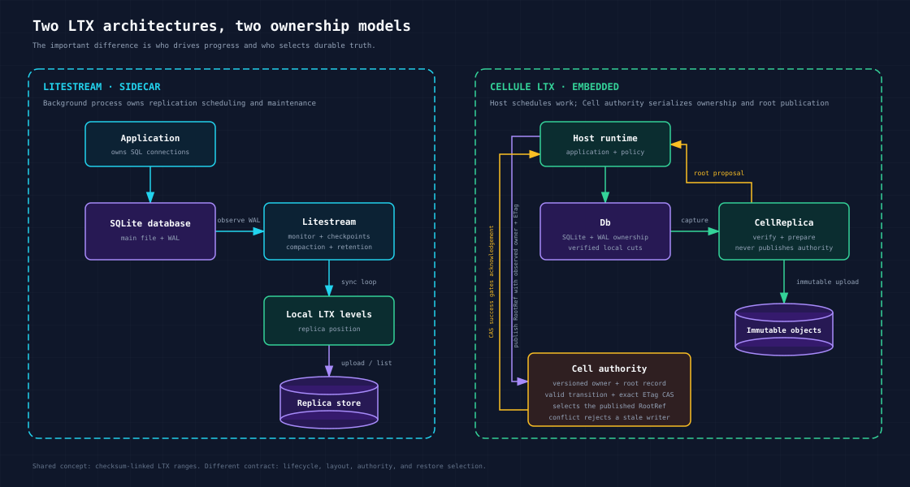
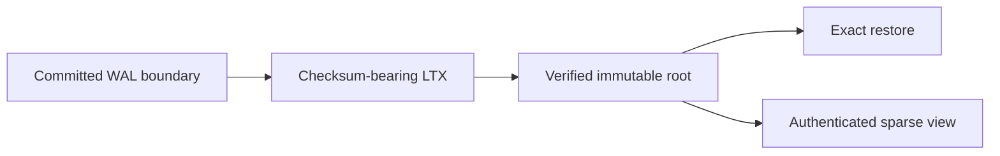
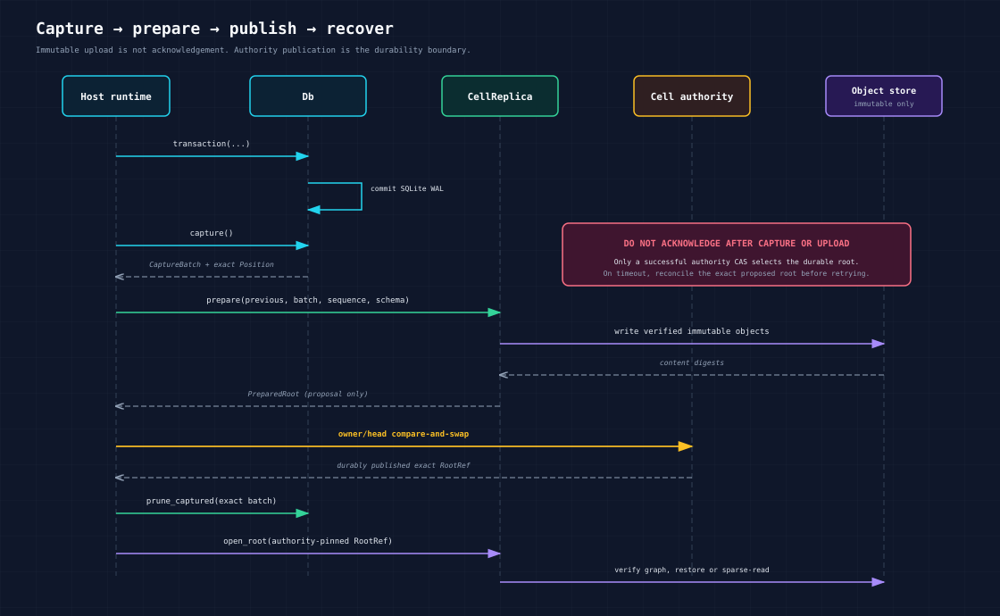
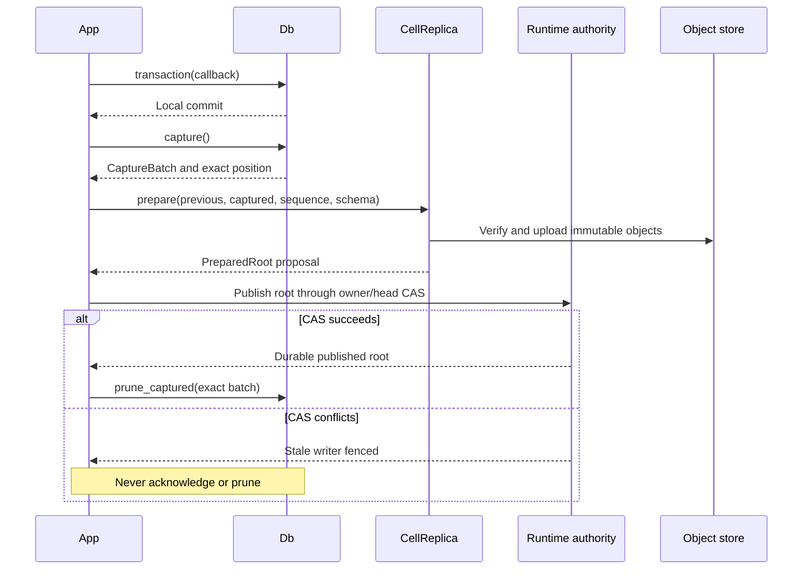

# LTX guide

`cellule-ltx` is an embeddable Rust library for capturing SQLite WAL commits as
checksum-bearing LTX files and recovering an exact, verified database state.
With the optional `replica` feature, it can prepare immutable Cell roots
in object storage and open them for exact restore or sparse SQL.

It is **not Litestream packaged as a Rust crate**. Litestream is a standalone
sidecar that monitors a database and operates its replication lifecycle.
`cellule-ltx` runs inside the application and leaves scheduling, storage
configuration, authority, retention, and request acknowledgement to its host.





| Read | For |
| --- | --- |
| [Local capture](capture.md) | Managed writer, committed cuts, and checkpoints. |
| [Root publication](publication.md) | Immutable proposal and Cell authority boundary. |
| [Recovery](recovery.md) | Exact restore, sparse activation, and continuation. |
| [Safety and limits](safety.md) | Verification, error classes, and resource ownership. |
| [Crate entry](../README.md) | Runnable local round trip. |
| [Provenance](../UPSTREAM.md) | Celld ancestry and licenses. |

LTX does not choose a Cell owner. [`cellule-runtime`](../../cellule-runtime/docs/README.md)
selects an exact root through authority CAS.

<a id="contents"></a>
## Contents

- [Choose the right tool](#choose-the-right-tool)
- [Litestream comparison](#litestream-comparison)
- [Lifecycle](#lifecycle)
  - [What Cell authority does](#what-cell-authority-does)
- [Features](#features)
- [Local capture and exact restore](#local-capture-and-restore)
- [Preserve application errors](#preserve-application-errors)
  - [Grouping capture durability barriers](#grouping-capture-durability-barriers)
- [Checkpoint without losing capture boundaries](#checkpoint)
- [Resume a verified lineage](#resume-verified-lineage)
- [Resume a local image without an origin read](#resume-local-image)
- [Local durability boundaries](#durability-boundaries)
- [Preparing a Cell root](#preparing-a-cell-root)
- [Reopen and restore an exact root](#reopen-exact-root)
- [Activate sparse writable SQL](#sparse-writable-sql)
- [Core API](#core-api)
  - [Local capture and recovery](#local-capture-and-recovery)
  - [Cell replication (`replica`)](#cell-replication-replica)
- [Safety model](#safety-model)
  - [Failure classes](#failure-classes)
- [Host responsibilities](#host-responsibilities)
- [Resource limits](#resource-limits)
- [Verification](#verification)
- [Provenance and compatibility](#provenance)
- [See also](#see-also)

<a id="choose-the-right-tool"></a>
## Choose the right tool

Use Litestream when you want an operational SQLite backup tool with a CLI,
configuration file, background synchronization, provider integrations,
compaction, snapshots, and retention.

Use `cellule-ltx` when a Rust service must:

- execute SQLite writes and capture their exact WAL commit boundary in one
  owned session;
- validate every LTX segment before selecting it for recovery;
- publish immutable objects behind an application-specific authority CAS;
- restore a caller-selected state without listing a bucket for “latest”; or
- lazily open an authenticated Cell root and hydrate it through SQLite.

Do not use `cellule-ltx` as a drop-in Litestream client or point the two systems at
the same replica prefix. They share LTX concepts, not a publication protocol.

<a id="litestream-comparison"></a>
## Litestream comparison

Checked against:

- the official [Litestream v0.5.17 release](https://github.com/benbjohnson/litestream/releases/tag/v0.5.17);
- its [`DB`](https://github.com/benbjohnson/litestream/blob/v0.5.17/db.go),
  [`Replica`](https://github.com/benbjohnson/litestream/blob/v0.5.17/replica.go),
  and [`Store`](https://github.com/benbjohnson/litestream/blob/v0.5.17/store.go)
  implementations; and
- the official [How it works](https://litestream.io/how-it-works/) guide.

| Concern | Litestream v0.5.17 | `cellule-ltx` |
| --- | --- | --- |
| Deployment | Standalone process next to the application | Library linked into a Rust process |
| Write ownership | Observes an application-owned SQLite database through SQLite and WAL files | All supported SQL writes pass through an exclusive `Db` session |
| Progress | Background monitor loops sync WAL, upload LTX, compact levels, create snapshots, and enforce retention | The host explicitly calls `capture`, `checkpoint`, `prepare`, compaction, and pruning |
| Remote state | `ReplicaClient` lists LTX levels and selects ranges for restore | `CellReplica` opens an exact `RootRef`; it never discovers truth by listing objects |
| Durability boundary | A successful replica sync advances Litestream's replica position | Uploaded immutable objects are only a proposal; the host must publish the root with Cell authority before acknowledging |
| Storage providers | Litestream owns its CLI/config provider integrations | The host supplies a `cellule-store` `Store`; `cellule-ltx` binds it to Cell paths with `CellStorageLayout` |
| Restore selection | Latest, TXID, or timestamp is resolved from replica LTX files | The caller supplies a verified plan or an authority-pinned Cell root |
| Retention | Built-in snapshot and LTX retention monitors | Remote pinning, retention, and garbage collection are host policy |
| Format | Uses `superfly/ltx` v0.5.2 | Writes checksum-bearing LTX v3 files using the v0.5.2 sized-block layout and reads that layout plus older checksummed LZ4-frame files |

- **Format overlap.** The matching LTX dependency means current Litestream can
  parse the sized-block encoding used here. It does **not** prove end-to-end
  interoperability: Crab adds its own BLAKE3-bound segment metadata,
  authenticated Cell directory, immutable root schema, and authority protocol.
- **Release gate.** External Litestream/Celld golden-vector qualification
  remains required.
- **Lineage.** [UPSTREAM.md](../UPSTREAM.md) records source lineage and the exact
  compatibility boundary.
- **Measurements.** The [performance harness](../perf/README.md) reproduces local
  capture, compaction, and restore measurements against the pinned Celld
  implementation.

<a id="lifecycle"></a>
## Lifecycle

The embedding runtime owns the steps around the library calls. In particular,
`prepare` does not publish a mutable head and `capture` does not mean remote
durability.



The safe write path is:

1. Run a transaction through `Db`.
2. Call `capture()` to produce one or more ordered local LTX segments.
3. Upload and verify them with `CellReplica::prepare()`.
4. Publish the returned root through the embedding runtime's owner/head CAS.
5. Only after that CAS is durable, acknowledge the mutation and prune the exact
   captured batch.

Recovery reverses the boundary: load the authority-pinned `RootRef`, verify its
complete immutable object graph, then restore it or activate sparse SQL.



**Read-only immutable views**

- **Placement.** `VerifiedRoot::open_read_only` opens a fresh immutable SQLite
  view over the exact root's authenticated pages. Call this synchronous opener
  on a SQLite worker, separately from the LTX blocking-I/O pool used by page
  fetches.
- **Cost.** The private local file is an empty placeholder; page bodies use the
  existing 8 MiB shared bounded cache and the managed 64 KiB SQLite cache.
- **No writable state.** No capture session, WAL, checksum sidecar, or writable
  database handle is created.
- **Enforcement.** SQLite's immutable VFS flag and read-only handle enforce the
  boundary even if a caller disables `query_only`.
- **Ownership.** The owned view closes SQLite before removing its placeholder. A
  dispatched opener whose waiter is cancelled must retain ownership until
  completion, then drop the unclaimed view.
- **Error cause.** Use `with_paged_io_deadline` around blocking SQL and
  `take_io_error` to retain the provider/checksum cause behind SQLite's I/O
  error. Cell authority and freshness checks remain the embedding runtime's
  responsibility.

<a id="what-cell-authority-does"></a>
### What Cell authority does

- **Owner.** Cell authority is the publication boundary implemented by
  `cellule-runtime`, not by `cellule-ltx`.
- **Record.** It stores one strict, versioned control record for a Cell: the
  current incarnation, owner, lifecycle state, revision, and published `RootRef`.
- **Update.** For each update, the runtime reads that exact record with its
  object-store ETag, builds a named and fully validated transition, and
  conditionally writes the complete successor using the observed ETag.
- **No discovery.** There is no blind overwrite or “latest root” discovery by
  listing objects.
- **Conflict.** If another owner wins first, the conditional write conflicts; the
  runtime reloads the record and rejects or fences the stale writer.

This separates two guarantees:

- `CellReplica` verifies and uploads immutable objects, then returns a root
  proposal.
- Cell authority atomically chooses which proposal is the published root for
  the current owner and incarnation.

Only a successful authority CAS makes the root durable truth. The host may then
acknowledge the mutation and prune the exact captured batch. An uploaded root
whose CAS did not succeed remains an unreferenced proposal, never an
acknowledged database state.

<a id="features"></a>
## Features

| Feature | Default | Adds |
| --- | --- | --- |
| none | yes | Local capture, checkpointing, snapshots, exact verification, restore, and compaction |
| `replica` | no | `cellule-store` transport, Cell roots, bundles, remote compaction, exact-root restore, sparse SQL, and hydration |

**Status.** The crate is currently an unpublished workspace library.

<a id="local-capture-and-restore"></a>
## Local capture and exact restore

The following example is compiled as a Rust doc test. Both destination
directories exist, and the restored database path does not.

```rust,no_run
use cellule_ltx::{Limits, Db, VerifiedPlan, restore_exact};

fn main() -> cellule_ltx::Result<()> {
    let source = tempfile::tempdir()?;
    let restored = tempfile::tempdir()?;
    let limits = Limits::default();
    let database_path = source.path().join("repository.sqlite");

    let mut database = Db::open(&database_path, limits)?;
    database.transaction(|transaction| {
        transaction.execute(
            "CREATE TABLE issues (number INTEGER PRIMARY KEY, title TEXT NOT NULL)",
            [],
        )?;
        transaction.execute(
            "INSERT INTO issues VALUES (1, 'Recover this issue from LTX')",
            [],
        )?;
        Ok(())
    })?;

    let captured = database.capture()?;
    let plan = VerifiedPlan::new(
        &captured.segments,
        captured.position,
        limits,
    )?;
    let restored_path = restored.path().join("repository.sqlite");
    let restored_position = restore_exact(&plan, &restored_path)?;

    assert_eq!(restored_position, captured.position);
    database.close()?;
    Ok(())
}
```

- **Untrusted input.** `LocalSegment::new` only describes a selected file and
  its expected metadata.
- **Proof.** It is not trusted until `VerifiedPlan::new` has read the bytes,
  checked the BLAKE3 digest and LTX structure, verified the complete
  checksum-linked chain, and reconstructed the requested endpoint.
- **Ownership.** The plan owns that verified database image, so source files may
  be removed or replaced afterward without changing what restore, resume, or
  compaction consumes.

Run the complete local demonstration from the repository root:

```sh
export CARGO_TARGET_DIR="$HOME/Workspace/crabbuild-target/crab-your-worktree"
cargo run -p cellule-ltx --example local_roundtrip --locked
```

It writes to real SQLite, copies the resulting LTX artifacts across the
transport boundary, deletes the source directory, restores the database, and
queries the recovered row.

<a id="preserve-application-errors"></a>
## Preserve application errors

Use `transaction_with` when the callback can reject a mutation for an
application reason.

- **Rejection.** `TransactionError::Operation` means the callback failed and the
  SQLite transaction was rolled back; commit ambiguity or capture failures use
  different variants and may fence the session.
- **Automatic rollback.** SQLite can automatically roll back the entire
  transaction on `SQLITE_FULL`, interruption, or a ROLLBACK constraint.
- **Recognition.** The managed writer recognizes that state only when autocommit
  is restored and its WAL observer recorded no commit.
- **Preserved state.** It preserves the original operation error, prior committed
  capture boundary, and disk admission; a redundant ROLLBACK must not turn a
  capacity refusal into a fenced session.
- **Contract.** See SQLite's
  [automatic rollback contract](https://www.sqlite.org/c3ref/get_autocommit.html).

```rust,no_run
use std::io;

use cellule_ltx::{Db, TransactionError};

fn rename_issue(
    database: &mut Db,
    number: i64,
    title: &str,
) -> Result<(), TransactionError<io::Error>> {
    database.transaction_with(|transaction| {
        if title.trim().is_empty() {
            return Err(io::Error::new(
                io::ErrorKind::InvalidInput,
                "an issue title cannot be empty",
            ));
        }

        transaction
            .execute(
                "UPDATE issues SET title = ?1 WHERE number = ?2",
                (title, number),
            )
            .map_err(io::Error::other)?;
        Ok(())
    })
}
```

A successful transaction is still only a local SQLite commit. Capture and
publication remain separate durability steps.

<a id="grouping-capture-durability-barriers"></a>
### Grouping capture durability barriers

`capture()` is the synchronous convenience path: it syncs the LTX file and its
published name before returning. A host that already has a higher-level
acknowledgement barrier can capture several batches with `capture_deferred()`,
then make all of their LTX files durable with one `durability_barrier()` call:

```rust,no_run
use cellule_ltx::Db;

fn capture_group(database: &mut Db) -> cellule_ltx::Result<()> {
    let first = database.capture_deferred()?;
    let second = database.capture_deferred()?;

    // Do not acknowledge local durability or close the session until this
    // flushes every completed file and seals their directory entries.
    database.durability_barrier()?;

    assert!(second.position.txid >= first.position.txid);
    Ok(())
}
```

The default `capture()` contract is unchanged. A failed barrier fences the
session, so the host must not acknowledge either batch. Checkpoint and snapshot
operations flush pending deferred files before changing the WAL lifecycle.

- **External proof.** An embedding protocol with a stronger external proof can
  instead publish the exact deferred bytes to that boundary and call
  `prune_captured()` only after publication succeeds.
- **Runtime precedent.** This is how `cellule-runtime` avoids duplicating a
  follower fsync or authoritative object-root CAS with a soon-to-be-deleted local
  file barrier.
- **Unknown outcome.** Failure before the external proof remains an unknown
  outcome; the runtime never acknowledges the local cut alone.
- **Cleanup.** Published-cut cleanup reverifies the local file through a
  buffered stream and unlinks it without making that deletion an
  acknowledgement barrier.
- **Quarantine.** A session always uses a fresh metadata directory, so
  crash-resurrected cleanup residue remains quarantined.
- **Streaming.** Streaming avoids retaining the complete compressed file;
  verification still decodes all pages and retains the observed page index on
  the caller's worker.
- **Footer and lookups.** Verification streams the footer through a bounded
  buffer and builds replica lookup entries only when the caller requests them;
  memory still grows with the number of observed pages.

<a id="checkpoint"></a>
## Checkpoint without losing capture boundaries

Call `checkpoint` instead of issuing SQLite checkpoint pragmas directly. The
returned batch includes the pending write cut and any additional cut created by
checkpoint maintenance; publish the whole batch before acknowledging it.

```rust,no_run
use cellule_ltx::{CaptureBatch, CheckpointMode, Db};

fn capture_and_truncate_wal(database: &mut Db) -> cellule_ltx::Result<CaptureBatch> {
    database.checkpoint(CheckpointMode::Truncate)
}
```

`CheckpointMode::Passive` avoids waiting for other readers. `Truncate` is the
stronger maintenance operation and should run only when the host has budgeted
for it.

<a id="resume-verified-lineage"></a>
## Resume a verified lineage

`Db::resume` installs a verified plan into a fresh path and seeds the
next capture with the plan's exact TXID and rolling checksum. It never infers
acknowledged state from an abandoned database directory.

```rust,no_run
use cellule_ltx::{Limits, Db, VerifiedPlan};

fn main() -> cellule_ltx::Result<()> {
    let source = tempfile::tempdir()?;
    let destination = tempfile::tempdir()?;
    let limits = Limits::default();

    let mut original = Db::open(&source.path().join("state.sqlite"), limits)?;
    original.transaction(|transaction| {
        transaction.execute("CREATE TABLE events (value TEXT NOT NULL)", [])?;
        transaction.execute("INSERT INTO events VALUES ('first')", [])?;
        Ok(())
    })?;
    let captured = original.capture()?;
    let plan = VerifiedPlan::new(&captured.segments, captured.position, limits)?;
    original.close()?;

    let mut resumed = Db::resume(
        &plan,
        &destination.path().join("state.sqlite"),
        limits,
    )?;
    resumed.transaction(|transaction| {
        transaction.execute("INSERT INTO events VALUES ('second')", [])?;
        Ok(())
    })?;
    let continuation = resumed.capture()?;

    assert!(continuation.position.txid > plan.position().txid);
    resumed.close()?;
    Ok(())
}
```

<a id="resume-local-image"></a>
## Resume a local image without an origin read

When a caller owns a local database it already proved against one published
position:

- **Record.** `Db::persist_continuation` records what a later session needs to
  continue it: the position, page size, page count, and the dense page
  checksums, written as two sidecars next to the database.
- **Resume.** `CellReplica::open_resumed` moves those files onto a fresh path and
  seeds the new capture session from them, so no origin object is read.
- **Structural only.** The record is structural, never authoritative.
- **Refusals.** It refuses a database whose WAL is not checkpointed (the file may
  sit behind the continuation) and a sparse activation that is not fully
  materialized (an unfaulted page is a hole, not data).
- **Writer proof.** The writing side proves the dense copy still folds to the
  aggregate it seeds.
- **Page check.** The resumed open also checks every checksum-bearing database
  page against the recorded dense checksums before SQLite can reuse the image.

Ownership and root identity stay with the caller: only open a resumed database
that a resume record has already matched against the authoritative
control, and discard it (`CellReplica::discard_resumed`) on any mismatch.

Opening a captured or restored database does not force a synthetic sequence
write.

- **No write, no drift.** If no application write occurs, a fully hydrated
  database can close and resume at the same exact position.
- **First capture.** The first capture creates a WAL frame only when needed, then
  binds the inherited checksum state to that WAL's complete committed prefix.
- **Later captures.** Later captures retain the usual salt and committed-boundary
  checks; SQLite `synchronous=FULL` and resume verification are unchanged.

<a id="durability-boundaries"></a>
## Local durability boundaries

| Operation | Local barrier | What it proves | May release a Cell response? |
| --- | --- | --- | --- |
| SQLite commit | SQLite WAL sync under `synchronous=FULL` | The local commit reached SQLite's WAL boundary | No |
| `capture()` | LTX file sync, rename, parent sync, then first-cut directory-chain sync | The returned standalone LTX cuts have durable bytes and names | No |
| `capture_deferred()` | No LTX file or name barrier; a sparse writer updates its mutable checksum sidecar without syncing it | The cut is readable for publication, but its LTX durability is pending | No |
| `durability_barrier()` | Pending LTX files, their parent directories, and the first-cut directory chain | Those deferred local cuts are durable | No |
| `persist_continuation()` | New dense checksum file and continuation, each with parent sync | A clean, drained local image can be considered for warm reuse | No |
| Cell root publication or selected follower proof | Runtime owned provider or fleet proof | The exact authoritative root or durable follower tail covers the command | Yes, when runtime checks the matching position |

The mutable checksum sidecar is local capture state, not a root selector. A
missing or invalid sidecar discards warm reuse; the runtime restores its
authority-pinned root. Process-kill tests do not prove physical power-loss
durability for SQLite, the LTX file, or the filesystem's sync implementation.

<a id="preparing-a-cell-root"></a>
## Preparing a Cell root

Enable `replica`, construct a `CellStorageLayout` from the application's
existing `cellule_store::Store`, then bind `CellReplica` to exactly one Cell and
incarnation. Provider credentials, leases, and authority stay outside this
crate.

```rust,ignore
use cellule_ltx::{CellReplica, CellStorageLayout, Limits};
use cellule_store::Store;
use object_store::path::Path;

fn bind_replica(store: Store) -> cellule_ltx::Result<CellReplica> {
    let layout = CellStorageLayout::new(
        store,
        Path::from("tenant-a"),
        [0x11; 16], // application ID
    );
    CellReplica::new(
        layout,
        [0x22; 32], // Cell ID
        [0x33; 16], // incarnation ID
        Limits::default(),
    )
}
```

```rust,ignore
use cellule_ltx::{CaptureBatch, CellReplica, Db, PreparedRoot, RootRef};

async fn prepare_root(
    database: &mut Db,
    replica: &CellReplica,
    previous: Option<&RootRef>,
    commit_sequence: u64,
    schema: u32,
) -> cellule_ltx::Result<(PreparedRoot, CaptureBatch)> {
    let captured = database.capture()?;
    let prepared = replica
        .prepare(previous, &captured, commit_sequence, schema)
        .await?;

    // `prepared.root()` is a proposal. The embedding runtime must publish it
    // with its owner/head CAS before acknowledging the mutation or pruning
    // `captured`.
    Ok((prepared, captured))
}
```

`CellReplica::prepare` writes only immutable, content-addressed objects. The
embedding runtime publishes `PreparedRoot::root()` through `cellule-runtime`
authority. After durable publication it may call
`Db::prune_captured(&captured)` for that exact acknowledged batch.

- **Pinned handle.** Preparation opens each selected capture once and keeps that
  exact file handle through verification and every provider retry. Replacing its
  path therefore cannot redirect the proposal.
- **Re-verified bytes.** The LTX inspection verifies the declared size,
  metadata, and digest; multipart upload hashes the complete source again before
  publishing the immutable object and rechecks its length afterward. An
  in-place mutation fails one of those gates.
- **Durability boundary.** This path needs no upload scratch or local write:
  immutable upload plus the embedding runtime's authority CAS remains the
  durability boundary.
- **Parallelism.** Up to four capture handles are opened and inspected in
  order-preserving parallel waves; predecessor verification progresses alongside
  that local work, and final chain validation still waits for both exact inputs.

- **Encoder page index.** `Db` also carries the page index produced while it
  encodes each fresh capture.
- **Fast path.** `CellReplica::prepare` can therefore publish that exact capture
  without decoding the complete LTX file a second time; the multipart
  whole-object hash still proves that the pinned bytes match the encoder's
  digest.
- **Fallback.** Segments created with the public `LocalSegment::new` constructor
  carry no trusted encoder state and continue through full structural inspection
  before upload.

The retained indexes share storage across `CaptureBatch` clones and are capped
at 1 MiB per captured batch; descriptor construction, directory updates, and
immutable upload reuse those same bytes without another full index copy. Larger
batches use the inspection fallback.

- **Overlap.** Immutable preparation overlaps independent uploads without
  weakening the root gate: each LTX body uploads alongside its index, changed
  directory nodes upload concurrently, initial directory construction streams
  nodes in eight-object waves, and the root document uploads alongside its
  segment pages.
- **Concurrency ceiling.** Up to four captured segments and eight small metadata
  objects progress concurrently; the shared host I/O permits remain the
  process-wide request ceiling.
- **All-or-nothing.** A root proposal is returned only after every dependency
  succeeds, so failed work can leave unreachable content-addressed objects but
  cannot publish an incomplete root.

The live RustFS example exercises Cell publication, sparse activation,
compaction, source deletion, and exact recovery. See the
[examples guide](../examples/README.md) before running it against a disposable
bucket.

<a id="reopen-exact-root"></a>
## Reopen and restore an exact root

The caller obtains `RootRef` from authenticated authority state. `open_root`
does not list storage or choose “latest”; it verifies the named root and its
complete metadata graph. `restore` then authenticates every page while writing
a fresh destination.

```rust,ignore
use std::path::Path;

use cellule_ltx::{CellReplica, RootRef};

async fn restore_published_root(
    replica: &CellReplica,
    published: &RootRef,
    destination: &Path,
) -> cellule_ltx::Result<()> {
    let verified = replica.open_root(published).await?;
    let restored = verified.restore(destination).await?;
    assert_eq!(restored, published.position);
    Ok(())
}
```

For backup pinning or garbage-collection marking, traverse the same verified
graph instead of reconstructing object names. The result uses `RootObjectRef`
because each entry is authenticated as a dependency of that exact root.

```rust,ignore
use cellule_ltx::{CellReplica, RootObjectRef, RootRef};

async fn objects_to_pin(
    replica: &CellReplica,
    published: &RootRef,
) -> cellule_ltx::Result<Vec<RootObjectRef>> {
    replica.reachable_objects(published).await
}
```

<a id="sparse-writable-sql"></a>
## Activate sparse writable SQL

- **Async preparation.** A verified root can become writable without first
  downloading every page. `prepare_writable` fetches the authenticated checksum
  directory asynchronously and dispatches local checksum creation, buffered
  writes, metadata checks, and failure cleanup through the bounded host
  executor.
- **Cancellation.** Dispatched jobs retain their admission until completion even
  if the caller cancels.
- **Durability.** Checksum bases and sparse/immutable placeholders are derived
  session files, so activation does not sync them or their names. SQLite retains
  its normal WAL durability policy; warm reuse separately writes and syncs a
  verified continuation.
- **Worker placement.** `open_writable` must then run on the Cell's dedicated
  SQLite worker. Page faults fetch and verify missing pages.
- **Direct embedders.** Direct synchronous embedders can use `hydrate_step` on
  their database worker.
- **Runtime path.** The Cell runtime instead uses `prepare_hydration` to select
  at most 64 missing pages, fetches through `db::HydrationRead::fetch` outside
  its SQL worker, then returns the resulting `db::HydrationBatch` to
  `install_hydration` on the owning activation.
- **Admission.** The caller admits retained page bytes before fetching and
  retains that reservation through installation, including canceled installation
  waiters.
- **Reuse and skip.** Demand-prefetched pages are reused. Installation verifies
  activation identity and skips pages superseded by checkpointed writes or
  truncation.
- **Failure.** Abandoning a fetch does not advance progress; an installation
  error fences the database.
- **Blocking.** SQLite demand faults remain synchronous, and local page
  installation can still delay the worker on a slow disk.

```rust,ignore
use std::path::Path;

use cellule_ltx::{CellReplica, Hydration, Db, RootRef};

async fn activate_sparse(
    replica: &CellReplica,
    published: &RootRef,
    destination: &Path,
) -> cellule_ltx::Result<Db> {
    let verified = replica.open_root(published).await?;
    let writable = verified.paged().prepare_writable(destination).await?;
    let mut database = writable.open_writable(destination)?;

    let Hydration { resolved, total, .. } = database.hydrate_step(128)?;
    assert!(resolved <= total);
    Ok(database)
}
```

The sparse database remains pinned to the selected root. New writes still use
`Db::transaction`, `capture`, immutable preparation, and authority CAS
in that order.

Sparse opening claims its canonical path under a short registry lock.

- **Registration.** File creation, syncs, bridge startup and allocations happen
  outside that lock, so one slow activation does not hold up another Cell's
  registration or teardown.
- **Failed setup.** Failed setup releases its registry claim and leaves created
  local files quarantined; it never deletes or adopts an interrupted sparse
  database.

<a id="core-api"></a>
## Core API

<a id="local-capture-and-recovery"></a>
### Local capture and recovery

| API | Contract |
| --- | --- |
| `Db::open` | Claims a fresh exclusive session and owns the writer, owner reader, control, and capture read-lock SQLite connections |
| `Db::transaction` | Commits one local SQL transaction; does not claim remote durability |
| `Db::query_with` | Runs a synchronous callback in a fresh read-only transaction on the same serialized owner; ends the snapshot before returning |
| `Db::interrupt_handle` | Returns a `DbInterruptHandle` that interrupts either active owner SQL connection; the caller still waits for completion or reconciliation |
| `Db::capture` | Returns every new ordered cut plus its exact TXID/checksum endpoint |
| `Db::capture_deferred` | Returns complete, readable LTX files whose durability remains pending |
| `Db::durability_barrier` | Flushes deferred files concurrently, then syncs their parent and the new directory chain once; failure fences the session |
| `Db::checkpoint` | Captures a barrier, runs the selected SQLite checkpoint, and returns every generated cut |
| `Db::snapshot` | Returns an independent full snapshot plus any pending captured cuts |
| `VerifiedPlan::new` | Verifies the complete selected snapshot-plus-delta chain and owns its exact reconstructed image |
| `restore_exact` | Installs a fresh database at exactly the verified endpoint; never overwrites |
| `compact_exact` | Produces a verified full snapshot without deleting its inputs |
| `Db::resume` | Restores a verified plan into a fresh session and continues its TXID/checksum lineage |
| `Db::persist_continuation` | Records the local continuation and dense page checksums a later resumed open seeds from |
| `Db::open_resumed` | Opens a cleanly checkpointed, fully materialized local image and continues its lineage without reading an origin object |

<a id="cell-replication-replica"></a>
### Cell replication (`replica`)

| API | Contract |
| --- | --- |
| `CellReplica::prepare` | Verifies captured cuts and prepares an immutable successor root |
| `CellReplica::prepare_bundle` | Selects and verifies this Cell's rows from a shared bundle |
| `CellReplica::prepare_compaction` | Rewrites an exact range into a representation-only prepared root |
| `CellReplica::open_root` | Reopens one exact root and verifies its scope, chain, metadata, and directory |
| `VerifiedRoot::restore` | Streams an exact verified database into a fresh destination |
| `VerifiedRoot::paged` | Opens authenticated page and page-run reads |
| `CellPagedDatabase::prepare_writable` | Seeds a fresh sparse writable activation at the root's exact position |
| `Db::hydrate_step` | Resolves a bounded number of missing sparse pages on the owner-controlled database worker |
| `Db::prepare_hydration` / `db::HydrationRead::fetch` / `Db::install_hydration` | Splits bounded page selection and owner installation from asynchronous authenticated fetch; caller owns memory admission and scheduling |
| `CellReplica::reachable_objects` | Returns `RootObjectRef` values for the verified immutable dependency set |
| `CellReplica::open_resumed` | Moves a resumable local image onto a fresh path and continues its capture session |
| `CellReplica::discard_resumed` | Removes a local image and its resume sidecars that the caller refused |

<a id="safety-model"></a>
## Safety model

`cellule-ltx` fails closed around state selection and reconstruction:

- The first plan segment must be a full snapshot. Later segments must be
  contiguous, checksum-linked, ordered, and consistent in page size.
- A commit whose delta cannot fit `Limits::max_capture_bytes` is captured as a
  full database image bounded by `Limits::max_file_bytes`, not refused after the
  commit: the image keeps the commit's TXID, pre-apply checksum, and chain
  position, so a large write can never leave a local commit the session cannot
  capture.
- Every segment's declared size, BLAKE3 digest, LTX checksum, page ordering,
  page coverage, and pre/post database checksum is verified.
- Restore and compaction create a new destination and never replace an existing
  database or consult sidecars, local listings, or object listings for truth.
- A capture/checkpoint error fences the managed handle when the commit boundary
  can no longer be proven.
- Cell objects are scoped to one Cell incarnation. A `PreparedRoot` is not a
  lease, authority update, or durable response gate.
- Cancellation does not roll back work already dispatched to blocking or
  object-store workers. The host must await or reconcile the exact root before
  retrying.

<a id="failure-classes"></a>
### Failure classes

`LtxError::classify()` returns the contract a caller branches on:

| Class | Caller action |
| --- | --- |
| `Retryable { after }` | Retry within the caller's own attempt budget, honoring `after` when the provider named one |
| `Capacity` | The request was refused before an acknowledged side effect; free the resource, raise the bound, or split the request |
| `Permanent` | The request cannot succeed with the same inputs or selected state |
| `Ambiguous` | Work may have taken effect; reconcile before retrying |
| `Fenced` | Close the handle and restore authoritative state |

- **No message dispatch.** Callers must not dispatch on error messages, and a
  declared `Limit` failure is never a fence.
- **Pending capture.** A capture failure raised before the cut writer starts
  leaves the session usable with `Db::has_pending_capture()` set; the host must
  not acknowledge or serve that commit until a capture succeeds or the session is
  discarded.

LTX CRC64 protects file structure and rolling database state. It is not a
cryptographic authenticator. Crab manifests and Cell objects add BLAKE3 digests;
the application remains responsible for authenticating the manifest or
authority record that selects them.

<a id="host-responsibilities"></a>
## Host responsibilities

The application must provide the policy a sidecar would normally own:

- serialize SQL and publication for each database;
- keep all mutations inside `Db` and avoid direct checkpoints, `ATTACH`,
  pager-changing pragmas, and edits to `_litestream_seq` or `_litestream_lock`;
- publish roots through owner/incarnation/sequence authority before responding;
- schedule capture, checkpoint, hydration, compaction, and retries;
- configure provider access through `cellule-store`;
- budget local disk, scratch space, blocking work, remote I/O, and active SQLite
  connections; and
- pin live roots and own remote retention and garbage collection.

Local calls are synchronous and should run on a dedicated database thread or a
bounded blocking executor. `&mut Db` serializes access within one handle;
it does not create a distributed lock.

The database path, SQLite sidecars, and private
`.<filename>-cellule-ltx` directory must have one owner. Parent directories must
already exist. Reopening a prior session directory is intentionally refused;
recover the authoritative plan or Cell root into a fresh directory instead.

<a id="resource-limits"></a>
## Resource limits

`Limits::default()` admits a 512 MiB database, 64 MiB per capture, 512 MiB per
input/output file, 1 GiB across a plan or retained captures, and 1,024 segments.
These are per-operation correctness bounds, not an RSS quota.

- **Incremental bound.** `max_capture_bytes` bounds one incremental cut; a commit
  that cannot fit it is captured as a full database image bounded by
  `max_file_bytes`, and the publication path admits each captured segment up to
  `max_file_bytes` only when its index proves full-page coverage.
- **Publication cost.** One command that publishes a fresh root uploads a bounded
  set of immutable objects: the segment body, its index, the changed directory
  node, the root document, and any segment page.
- **Cost reporting.** `CellReplica::publication_cost` and
  `take_publication_cost` report the exact object count and bytes per root, so a
  host can budget object-store cost per command instead of inferring it from the
  database size.
- **Measured cost.** The local measurement frozen in `tests/cell/roots/lifecycle.rs`
  is five objects per small append (about 7 KiB for a 4 KiB payload);
  provider-scale cost distributions remain outstanding.
- **Plan memory.** Each live `VerifiedPlan` retains one reconstructed database
  image, bounded by `max_database_bytes`, plus its checksum state and segment
  metadata.
- **Plan lifetime.** Drop plans after restore, resume, or compaction; services
  that build several plans at once must admit their combined decoded size rather
  than only their compressed LTX input size.
- **Checksum candidates.** Checksum candidates retain an isolated overlay until
  their LTX cut is sealed. The successful merge retires the predecessor and
  reuses an exclusively owned memory array for fixed-size updates.
- **Allocation behavior.** Growth and retained shared snapshots may still
  allocate; large truncations release excess capacity. Restored capture reads
  overwritten checksums through one 4 KiB local window per cut, while truncation
  and clean-handoff scans retain their 64 KiB sequential buffers.
- **Sealed merge.** A sealed merge consumes the changed-page overlay, releasing
  its hash-table allocation so later small cuts do not clone historical capacity.
  Unmerged recovery overlays retain their normal clone semantics.
- **Failed merge.** A failed sidecar merge fences the session. This changes local
  bookkeeping, not the LTX format or the authenticated metadata walk required for
  activation.
- **Connections and caches.** Each open `Db` retains four SQLite connections
  with a 64 KiB page-cache target per connection, or 256 KiB in total. `Host` can share disk, I/O,
  blocking-job, recovery, dirty-job, scratch, and telemetry admission across many
  databases. Sparse page read-ahead is capped at 64 pages or 1 MiB per request,
  and the shared decoded page cache is capped at 8 MiB.

- **Owner reader.** `query_with` uses a separate read-only connection with
  `query_only` enabled once at open. Reads and writes remain serialized by the
  caller; each callback gets a fresh transaction that ends before return, so
  an idle reader does not retain an old WAL snapshot. The callback must not
  change pragmas, control transactions, or retain borrowed SQLite values.
  An application failure preserves its error after the transaction ends;
  failure to establish or end the managed transaction fences the session.
- **Sparse reader.** The owner reader uses the same authenticated sparse VFS.
  Its backing file permits internal installation of verified missing pages,
  while SQLite sees a read-only main database and the VFS rejects SQL writes
  and truncation. This live owner connection does not use immutable-view flags.
- **Interrupt ownership.** `Db::interrupt_handle` now returns
  `DbInterruptHandle`, rather than a single `rusqlite::InterruptHandle`.
  Update callers that store the explicit type. Its `interrupt()` reaches the
  active writer or reader, becomes inert after close, and does not prove that
  dispatched work has finished.

- **Demand reads.** Demand reads and asynchronous hydration stop a missing prefix
  before pages already cached in the same view. This avoids transferring and
  decoding an overlapping prefetched suffix when SQLite visits fragmented page
  ranges.
- **Eviction.** Eviction can cause later misses; cache bytes never replace
  exact-root page authentication. New immutable views still have separate
  demand-cache identities.
- **Directory cache membership.** Concurrent fills serialize membership snapshots
  through index installation, so an older fill cannot erase a newer entry on
  restart. `Host::with_directory_cache(root).await?` opens
  persistent cache membership on an admitted blocking job. Restart reads at most
  16 MiB of index input and retains at most 16,384 entries within the shared disk
  budget.
- **Cache ownership.** The runtime creates one cache owner beside the
  activation's database and shares its host through recovery, SQLite and
  publication. Cancellation keeps dispatched work and its reservations alive
  until completion. Local capture APIs remain synchronous and retain their
  caller-owned worker contract.
- **Fill admission.** Verified directory reads release object-store admission
  before persisting a cache fill. Fills use immediate blocking-job admission and
  skip persistence when that pool is busy, keeping pending node buffers bounded
  without a second queue. Verified bytes return after dispatch, without waiting
  for local syncs.
- **Deduplication.** Concurrent fills of one key are deduplicated, and cache
  lookups skip busy jobs or fill locks.
- **Fill lifetime.** Accepted fills retain their buffers, job and disk accounting
  until completion, including canceled readers, dispatch rejection and panics.
  Reopening a cache excludes outstanding fills from temporary-file cleanup.
- **Drain.** Call `Host::drain_cache_fills().await` after stopping replica work
  and before reusing its local directories or stopping its executor.
  `CellRuntime::shutdown` does this after draining Cells and workers.
- **Drain retry.** A canceled drain can be retried; the host can subsequently
  serve a new runtime. Cache persistence is best effort, so skipped entries may
  require another verified origin read.
- **Known cache limits.** Fills still share the blocking pool with required work;
  this does not establish foreground latency isolation or reduce membership-index
  rewrite cost.
- **Compaction budget.** Cell compaction buffers sequential index reads within a
  combined 960 KiB budget and dispatches bounded merge batches through `Host`
  jobs. Scratch files and admission remain owned through canceled jobs and
  cleanup.
- **Range compaction.** Range compaction spools only selected indexes/bodies,
  then streams new locators through the authenticated directory. It retains
  newer page versions, including disjoint segments in one bundle, and reuses
  unchanged branches.
- **Traversal bounds.** Traversal retains bounded state per tree level and at
  most eight pending node uploads.
- **Scratch sizing.** Scratch covers the selected inputs, worst-case encoded
  output and both index copies; it does not reserve two complete database images.
  Full-range compaction still visits the full directory.
- **Known compaction limits.** These bounds do not establish foreground latency
  isolation or sustained publisher capacity.
- **Unproven claims.** Large-database and multi-tenant capacity still require
  workload-specific measurement. The existing tests prove bounded correctness
  behavior; they do not establish a 10,000-database or 1,000-TPS production
  capacity claim.

<a id="verification"></a>
## Verification

From the repository root, choose a target directory unique to this checkout:

```sh
export CARGO_TARGET_DIR="$HOME/Workspace/crabbuild-target/crab-your-worktree"

cargo test -p cellule-ltx --locked
cargo test -p cellule-ltx --features replica --locked
cargo test -p cellule-ltx --doc --features replica --locked
cargo clippy -p cellule-ltx --all-targets --locked -- -D warnings
cargo clippy -p cellule-ltx --features replica --all-targets --locked -- -D warnings
cargo fmt -p cellule-ltx -- --check
```

The suite covers:

- real SQLite commits and rollbacks, checkpoints, database growth and
  truncation, and cold restore;
- process death followed by source loss, snapshot/compaction byte identity, both
  supported page encodings, malformed chains, and checksum failures; and
- exact Cell roots, bundles, sparse activation, hydration, remote compaction,
  and provider/cache lifecycle boundaries.

After configuring the existing [RustFS test environment](../examples/README.md),
run the cache-admission fault test against its real object store:

```sh
CARGO_TARGET_DIR="$HOME/Workspace/crabbuild-target/crab-your-worktree" \
  cargo test -p cellule-ltx --features replica --locked --test host \
  rustfs_directory_cache_fill -- --ignored --nocapture
```

The run pauses cache fsync with one origin permit and one/two blocking slots,
verifies the original and concurrent reads return, and restores exact SQLite
state. A canceled drain retains admission; cache reopen waits for persistence.

- **Prefix.** Each run uses a unique `cellule-ltx-tests/cache-admission/` prefix
  and retains its objects.
- **Scope.** The pause/deadline assertions are concurrency proof, not latency
  percentiles.

The sparse-activation isolation test uses the same environment:

```sh
CARGO_TARGET_DIR="$HOME/Workspace/crabbuild-target/crab-your-worktree" \
  cargo test -p cellule-ltx --features replica --locked --test host \
  rustfs_sparse_activation_io -- --ignored --nocapture
```

The test pauses file sync, parent sync and bridge startup in turn while a
different Cell opens and another reads and closes. Each Cell must return its own
value from the exact selected root.

- **Prefix.** Each run retains objects under a unique
  `cellule-ltx-tests/activation-registry/` prefix.
- **Coverage.** The regular activation suite also covers conflicting path claims,
  setup failures and refusal of leftover files.

Range compaction can also be checked against that real object store:

```sh
CARGO_TARGET_DIR="$HOME/Workspace/crabbuild-target/crab-your-worktree" \
  cargo test -p cellule-ltx --features replica --locked --test cell \
  rustfs_range_compaction_preserves_exact_native_and_bundled_roots -- --ignored --nocapture
```

The check compacts two updates on larger bases with a cold metadata cache and
one MiB of scratch admission. Native and shared-bundle inputs, 512/4096-byte
pages, multiple directory levels, and a newer overwrite must restore
byte-identically.

- **Bounds.** It bounds origin reads and uploaded objects, retaining its unique
  `cellule-ltx-tests/range-compaction/` prefix.
- **Scope.** These are work and correctness checks, not service latency
  percentiles.

The demand-read regression uses the same RustFS environment:

```sh
CARGO_TARGET_DIR="$HOME/Workspace/crabbuild-target/crab-your-worktree" \
  cargo test -p cellule-ltx --features replica --locked --test cell \
  rustfs_fragmented_snapshot_demand_reads_do_not_refetch_cached_frames -- --ignored --nocapture
```

The regression changes a separate counter, opens the resulting immutable view,
and reads the unchanged payload at 512/4096-byte page sizes. Payload hashes must
match, origin byte ranges must not overlap while the working set fits the
isolated cache, and a repeated scan must issue no range reads.

- **Prefix.** Objects remain under a unique `cellule-ltx-tests/read-ahead/`
  prefix.
- **Scope.** This proves bounded transfer work, not a service latency percentile
  or cache reuse across different views.

The suite also ships the independent half of the format proof:

- `tests/vectors/` holds snapshot files written by the pinned upstream Celld
  encoder and by the `superfly/ltx` v0.5.2 Go reference writer Litestream uses;
  `src/format_tests.rs` decodes them, restores their exact image, and requires
  the sized-block files to be byte-identical to this crate's writer.
- `tests/ltx/vectors.rs` replays every truncation and deterministic mutation of
  those vectors through the same decoders `fuzz/fuzz_targets/` drives, so a
  decoder panic fails the stable-toolchain test run.
- `tests/host/hooks/matrix.rs` injects ordered failures at the capture, barrier,
  checkpoint, restore, compaction, and publication seams and asserts the error
  class plus the durable outcome.

The nightly [`cellule-ltx fuzz`](https://github.com/crabbuild/crab/blob/beb439039cb37e750afe6625a2358101c70d1191/.github/workflows/crab-ltx-fuzz.yml) workflow
runs the same targets on a schedule and per pull request, seeded from these
vectors, and the stable replay stays in the normal test run.

Still required before a broad production-readiness claim: exhaustive filesystem
and power-loss faults beyond the injected matrix, broader platform/provider CI,
and measured latency, memory, scratch, and concurrency qualification at fleet
scale.

<a id="provenance"></a>
## Provenance and compatibility

This is Crab-owned, modified source derived from the Apache-2.0 Celld LTX
implementation—not an unmodified vendor directory or a floating dependency. The
readable source inventory, upstream revisions, deliberate adaptations, license
obligations, and future-import checklist live in [UPSTREAM.md](../UPSTREAM.md).

Compatibility summary:

- readers accept checksum-bearing sized-block LTX and the older checksummed
  LZ4-frame representation;
- writers emit only the v0.5.2 sized-block representation;
- checksum-disabled LTX is rejected;
- retired standalone Crab epoch-head and page-map layouts are not read; and
- Cell root JSON, authenticated directories, bundle envelopes, and authority
  records are Crab-specific contracts.

<a id="see-also"></a>
## See also

| Guide | Contents |
| --- | --- |
| [Local capture](capture.md) | Managed writer, committed cuts, deferred barriers, and checkpoints. |
| [Root publication](publication.md) | Immutable preparation versus authoritative selection. |
| [Recovery](recovery.md) | Verified plans, exact restore, and sparse activation. |
| [Safety and limits](safety.md) | Failure classes, resource ownership, and verification. |
| [Crate entry](../README.md) | Runnable local round trip and crate overview. |
| [Provenance and licenses](../UPSTREAM.md) | Celld ancestry, adaptations, and compatibility boundary. |
| [Examples](../examples/README.md) | Live RustFS publication, activation, and compaction runs. |
| [External vectors](../tests/vectors/README.md) | Upstream encoder fixtures replayed by the stable suite. |
| [Performance harness](../perf/README.md) | Reproducible capture, compaction, and restore measurements. |
| [Fuzz targets](../fuzz/README.md) | Decoder and mutation campaigns driven from the vectors. |
| [Runtime LTX audit](../../cellule-runtime/docs/ltx-performance-audit.md) | Performance findings and remaining qualification work. |
| [cellule-runtime guide](../../cellule-runtime/docs/README.md) | Authority CAS, leases, and response durability. |
