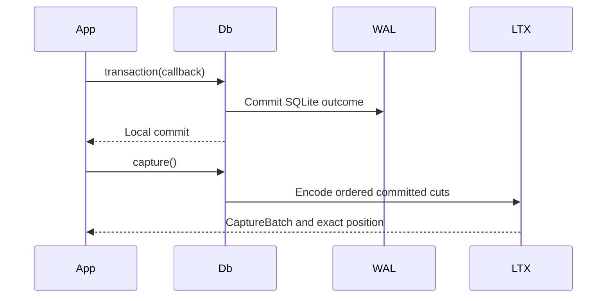

# Managed capture

`Db` owns one exclusive SQLite writer plus its capture session. Use a fresh
metadata directory; no external writer may change the database or retained
LTX files.

| API | Boundary |
| --- | --- |
| `Db::open` | Claims a fresh managed session. |
| `Db::transaction` | Commits one local transaction; no remote durability claim. |
| `Db::transaction_with` | Preserves application rejection separately from capture/commit errors. |
| `Db::capture` | Returns ordered cuts and a verified position after local barrier. |
| `Db::capture_deferred` | Returns readable cuts with pending local durability. |
| `Db::durability_barrier` | Flushes pending cuts and their directory chain. |
| `Db::checkpoint` | Captures the boundary before SQLite checkpoint. |
| `Db::snapshot` | Builds an independent full image. |

A single delta too large for `max_capture_bytes` becomes a full image bounded
by `max_file_bytes`. The committed transaction is never silently omitted from
the lineage. Deferred capture must cross its barrier or a published-root proof
before acknowledgement.

Run [the local example](../examples/local_roundtrip.rs) to see write, capture,
source removal, restore, and read-back.

## Local disk admission

Managed connections use a per-session wrapper around the host's selected SQLite
VFS. It admits database, WAL, shared-memory and temporary-file growth before
I/O, and keeps uncertain write residue charged. Sparse inherited pages retain
the sparse VFS's materialization accounting. Closing the session releases its
handles and unregisters its wrapper.

Transaction admission reserves capture credit from the database image bound.
Before COMMIT, a second check admits remaining dirty-page and checkpoint I/O.
A refusal after the callback returns `TransactionError::RolledBack` only after
SQLite proves rollback; it retains the resource cause and any operation error.
The runtime can then reuse the owner and retry the original identity. Ambiguous
COMMIT, rollback, and capture failures still fence. Pruning an older published
cut retains credit for newer pending commits.
