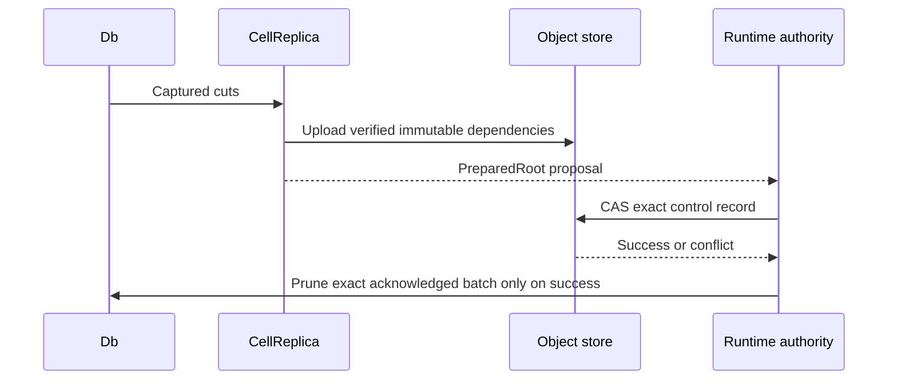

# Immutable root publication

The `replica` feature prepares Cell-scoped objects. Preparation does not grant
a lease or make a root authoritative.

| Step | Contract |
| --- | --- |
| `CellReplica::prepare` | Verifies cuts and writes immutable root dependencies. |
| `prepare_bundle` | Selects this Cell's exact rows from a shared bundle. |
| `prepare_compaction` | Rewrites representation without changing logical state. |
| `prepare_after_compaction` | Appends to a private compaction while retaining its original authority predecessor. |
| Runtime CAS | Names the authoritative owner and exact root. |
| `Db::prune_captured` | Removes only the successfully published batch. |

A failed CAS leaves unreachable content, never an acknowledged state. Provider
retry pins and rechecks the selected capture bytes, so path replacement cannot
change an in-flight proposal. The host owns request admission, deadlines, and
reconciliation after ambiguous results.

Preparation reuses byte-identical descriptor pages from the verified predecessor
instead of uploading them again. Cached predecessor metadata still requires
origin presence checks; a missing page fails preparation. New bodies, indexes,
directory nodes, descriptor pages, and the root finish uploading before a
proposal returns. Object formats and authority publication are unchanged.

A representation-only compaction can remain private while its successor append
uploads. `prepare_after_compaction` verifies that the compaction preserves the
predecessor's position, commit sequence, Cell and incarnation. The runtime selects
the append's schema and can choose the final root with one CAS
against the original authority record. Every immutable dependency still finishes
uploading before the successor proposal is returned.

Compaction overlaps the independent LTX and index output flushes through the
host's bounded job admission. Both barriers complete before either output can
upload. The verified local index also allows directory and root metadata to
upload alongside the compacted body and index. Preparation waits for every
branch, including errors and scratch cleanup, before returning a proposal;
authority CAS remains the publication boundary.
