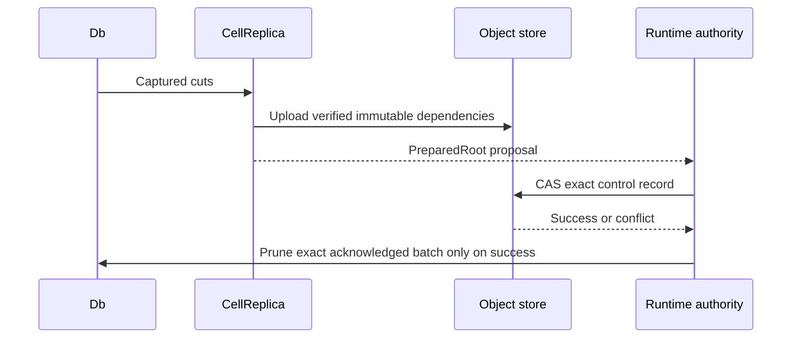

# Immutable root publication

The `replica` feature prepares Cell-scoped objects. Preparation does not grant
a lease or make a root authoritative.

| Step | Contract |
| --- | --- |
| `CellReplica::prepare` | Verifies cuts and writes immutable root dependencies. |
| `prepare_bundle` | Selects this Cell's exact rows from a shared bundle. |
| `prepare_compaction` | Rewrites representation without changing logical state. |
| `prepare_after_compaction` | Appends to a private compaction while retaining its original authority predecessor. |
| `try_admit_scheduled_compaction` | Returns a scoped clone with existing dirty/recovery admission, or defers without waiting behind a queued cohort. |
| `prepare_scheduled_compaction_append` | Composes a bounded promotion and append without uploading intermediate root metadata. |
| `with_root_metadata` | Joins caller-supplied verified derivation metadata with immutable uploads; both must succeed before `PreparedRoot` returns. |
| Runtime CAS | Names the authoritative owner and exact root. |
| `Db::prune_captured` | Removes only the successfully published batch. |

A failed CAS leaves unreachable content, never an acknowledged state. Provider
retry pins and rechecks the selected capture bytes, so path replacement cannot
change an in-flight proposal. The host owns request admission, deadlines, and
reconciliation after ambiguous results.

`RootPreparation` identifies a native verified derivation while uploads may still
be running. Its construction is private and it grants no uploaded-root, restore,
serving, authority or acknowledgement rights. A `RootPreparationMetadata` future
runs inline under the enclosing preparation owner and shares its native origin
I/O admission; cancellation drops it and releases its permit. It adds no task or
scheduler. Its source error is retained as `RootPreparation`,
classified Ambiguous for caller reconciliation. The runtime recovers its original
typed storage error and uses the existing publisher retry policy. Failed work
can leave proposal metadata or immutable objects; neither selects authority.

The current development root format embeds a final descriptor group of at most
32 entries directly in the authenticated root. Larger tails use descriptor
pages of at most 96 entries; full page boundaries stay stable for reuse.
The root's existing 32 KiB limit, 64 KiB page limit and 4,096-descriptor graph
limit remain enforced. Inline descriptors undergo the same scope, range,
checksum, extent and published-object validation as external descriptors.

Preparation reuses byte-identical descriptor pages from the verified predecessor
instead of uploading them again. Cached predecessor metadata still requires
origin presence checks; a missing root or page fails preparation. Inline metadata
is covered by the authenticated root and its origin check. New bodies, indexes,
directory nodes, descriptor pages, and the root finish uploading before a
proposal returns. This is the one current development format, updated together
with its readers and writers under the [format policy](../../cellule-runtime/docs/storage.md#format-policy).
Authority publication is unchanged.

A representation-only compaction can remain private while its successor append
uploads. `prepare_after_compaction` verifies that the compaction preserves the
predecessor's position, commit sequence, Cell and incarnation. The runtime selects
the append's schema and can choose the final root with one CAS
against the original authority record. Every immutable dependency still finishes
uploading before the successor proposal is returned.

When one scheduled promotion plus the incoming captures fits the caller's
existing segment ceiling, `prepare_scheduled_compaction_append` prepares the
final append directly from the verified compaction state. It keeps directory
relocation bounded and uploads every directory node the final root may need.
Only final descriptor pages and root metadata are constructed; the proposal
retains the original authority predecessor and the same persisted bytes as the
two-step path. `None` leaves the caller's existing cascade policy in charge.
No unuploaded intermediate state can be used as a `PreparedRoot`.

The verified compaction composition sets the original predecessor in the native
factory before derivation metadata runs. Metadata and the complete proposal name
the same input. That private preparation context is removed from the immutable
read view; subsequent preparations cannot inherit an earlier rebase.

For this composed operation, root preparation admission includes recovery
admission, and root work includes compaction and the final append. The compaction
phase spans the composed attempt. These overlapping phase populations differ
from standalone append timing; compare HTTP latency and provider operations
rather than adding phase values.

Compaction overlaps the independent LTX and index output flushes through the
host's bounded job admission. Both barriers complete before either output can
upload. The verified local index also allows directory and root metadata to
upload alongside the compacted body and index. Preparation waits for every
branch, including errors and scratch cleanup, before returning a proposal;
authority CAS remains the publication boundary.

Compaction body and index transfers each retain a four-transfer window. A
completed transfer immediately admits the next input even when an earlier
source is slow. Results return to descriptor order before merging or selecting
an error; source checksums, disjoint scratch offsets, and cleanup remain intact.

## Verify current origin dependencies

`CellReplica::reachable_objects` authenticates the exact root's complete current
origin graph, including root metadata, descriptor pages, directory coverage and
all body/index bytes. A process cache cannot certify availability.
`reachable_objects_bounded` uses the same walk with a caller-selected maximum
inventory count. Zero or excess objects refuse with
`LimitKind::RootInventoryObjects`; callers never receive a truncated inventory.
Directory digests obey that bound while descriptor work keeps the existing fixed
root/segment ceilings. The caller owns memory admission, bounded Store stream
chunks and the enclosing deadline. This graph proof grants no selected authority,
retention pin or current serving.
