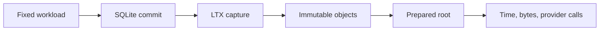

# LTX performance harnesses

These harnesses measure local capture and Cell-root costs. Results depend on
payload entropy, provider, hardware, cache state, and activation history; no
number here is a production SLO.

| Harness | Measures | Entry |
| --- | --- | --- |
| Local comparison | Matched capture/restore against the Celld lineage. | [`run.sh`](run.sh) |
| Cell publication | Root preparation, provider calls, sparse activation, and compaction. | [`replica-cost`](replica-cost/) |
| Publish provider split | Provider operations inside one incremental publish, priced with recorded p95 latencies. | [`tests/cell/roots/prepare_cost.rs`](../tests/cell/roots/prepare_cost.rs) |
| Historical measurements | Dated experiments and qualification limits. | [September 2026 record](history/2026-09-benchmark-notes.md) |
| RustFS comparison | Alternating local and remote processes, two payload sizes and entropy patterns, retained command percentiles. | [`run-rustfs.sh`](run-rustfs.sh), [`compare.py`](compare.py) |

The [October 2 RustFS comparison](history/2026-10-02-rustfs-comparison.md)
records the current evaluation and verified descriptor-page reuse improvement.

## Reproduce the RustFS comparison

With Docker, the AWS CLI, Python 3, Cargo, and the mounted Workspace volume:

```sh
bash crates/cellule-ltx/perf/run-rustfs.sh
```

The script derives a separate target directory per checkout beneath the mounted
Workspace volume, builds locked release binaries, and starts a dedicated pinned RustFS
1.0.0 instance and bucket, and removes only its own container and volume after
the run. Evidence stays in the external target. It never uses application
storage. The default matrix alternates three independent processes per mode,
with 4 KiB and 64 KiB periodic or reproducible high-entropy payloads. Local
processes warm one round and measure three 128-command rounds. Remote processes
warm eight commands and measure 128 more. Every run verifies restored payload
bytes; the Celld remote runner deletes its local database and cuts before restore.

To use an existing test provider or shorten the matrix, set AWS credentials and
run the driver after building the three runner packages:

```sh
python3 crates/cellule-ltx/perf/compare.py \
  --target-dir "$CARGO_TARGET_DIR" --output "$CARGO_TARGET_DIR/evidence" \
  --endpoint http://127.0.0.1:9000 --bucket cellule-ltx-perf \
  --processes 3 --commands 128 --payloads 4096 65536
```

`summary.json` retains per-process rates, pooled nearest-rank command percentiles,
phase timings, recovery samples, and amplification. Rates are the median of
per-process rates derived from measured phase time; local rates include schema
bootstrap, remote rates exclude bootstrap and warmup. Fixture generation and
post-run verification are excluded. These closed-loop, serial measurements do
not establish offered-load capacity or application response tails. `metadata.json`
records executable and harness hashes; keep the raw JSON and provider inspection.

| Mode | Measured completion boundary |
| --- | --- |
| Cellule local immediate | SQLite commit plus file and parent-directory durability. |
| Celld local default | SQLite commit plus file durability, without parent-directory sync. |
| Celld local `--sync-parent` | Runner adds parent-directory barriers for comparison. |
| Cellule local batch 8 | Shared barrier for eight captures; no independently durable command percentile. |
| Cellule remote | SQLite commit, deferred capture, immutable `PreparedRoot`, and local cut cleanup. |
| Celld remote | SQLite commit, immediate capture, and native L0 object upload; local cuts remain during measurement. |

Remote protocols differ. Celld writes one LTX object per command; Cellule also
maintains authenticated indexes, directories, and exact roots. Neither runner
performs authority CAS, leases, HTTP, or application acknowledgements. The
runners retain each implementation's bundled SQLite version and object-store
client version. Compare phases and provider operations before attributing a gap.
Automatic compaction is absent from the append matrix, so longer runs expose
history growth rather than a production compaction schedule. Sparse, hydrated,
and resumed writer diagnostics remain available through `replica-cost`.

The publish provider split answers where an incremental publish spends its
provider budget. Run it with the ignored flag and read the counted operations,
not the wall clock, which depends on the throttle model:

```sh
cargo test -p cellule-ltx --features replica --locked \
  --test cell prepare_cost -- --ignored --nocapture
```

Measured on 2026-09-30 against the in-memory provider with recorded p95
latencies (GET 2 ms, PUT 7 ms): a cold publish costs 8 writes and one multipart
start, while each incremental publish costs **6 writes and 2 HEADs with no
body reads**. Predecessor verification therefore already runs from the process
metadata cache and revalidates origin with one bounded HEAD wave, so the
remaining provider budget is object writes rather than verification.




Use a unique `CARGO_TARGET_DIR` on the mounted workspace volume. The
[Cellule LTX guide](../docs/README.md) defines correctness; a faster root
proposal does not change the authority CAS required for acknowledgement.
