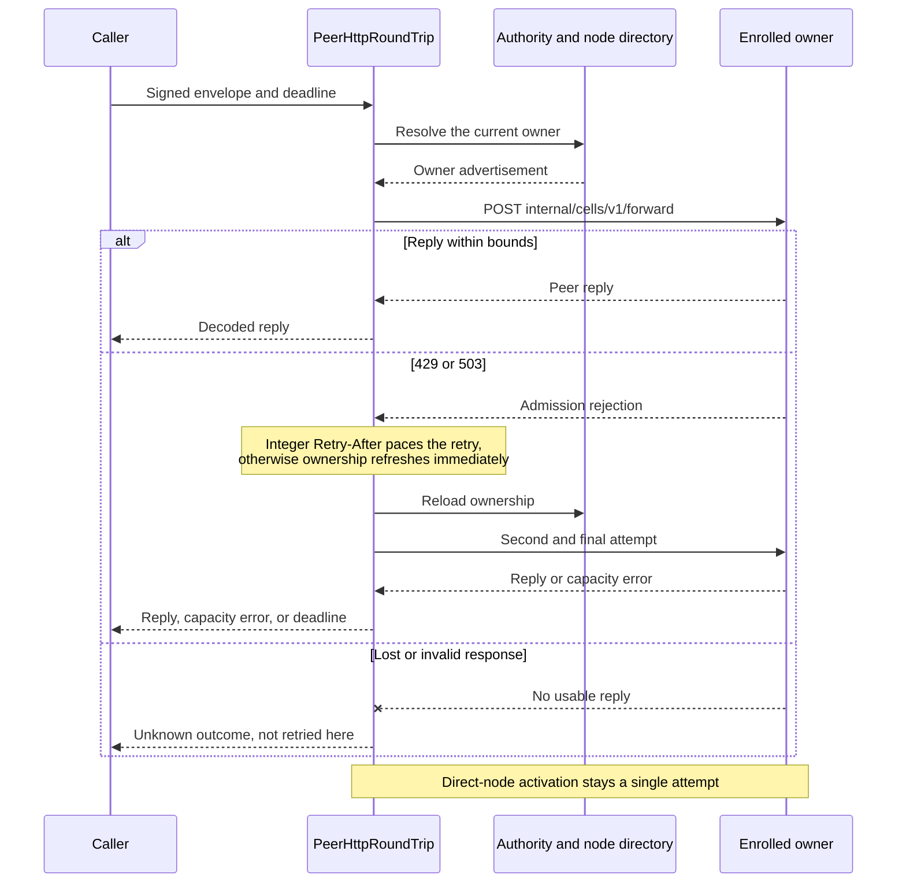

# Peer HTTP guide

`PeerHttpRoundTrip` sends authenticated Cell peer envelopes to the current
enrolled owner. This crate sends peer envelopes; it does not expose a public Cell
endpoint.

| Field | Value |
| --- | --- |
| Content type | Guide and crate reference |
| Audience | Application authors wiring peer transport |
| Goal | Route peer requests with bounded retries and honest unknown outcomes |
| Status | Transport mechanics current; the embedding application owns ingress, enrollment, and authorization |

| Document | For |
| --- | --- |
| [Routing and outcomes](routing.md) | Retry and unknown-result semantics. |
| [Security boundary](security.md) | Identity, scope, and ingress ownership. |
| [Crate entry](../README.md) | Overview and verification. |

## Contents

- [Overview](#overview)
- [Owner-routed attempts](#owner-routed-attempts)
- [Outcome and deadline rules](#outcome-and-deadline-rules)
- [Security boundary](#security-boundary)
- [Admission bounds](#admission-bounds)
- [Verification](#verification)
- [Historical notes](#historical-notes)
- [See also](#see-also)

## Overview

- Reloads the authority and node directory on a retry.
- Bounds responses.
- Distinguishes an unknown outcome from a request that never started.
- Caches HTTP clients by enrolled session, certificate, and public key.

## Owner-routed attempts

Owner-routed requests make at most two attempts:

## Outcome and deadline rules

| Response or condition | Transport behavior |
| --- | --- |
| HTTP 429/503 with an integer `Retry-After` | Pace the retry within the original deadline, then reload ownership. |
| HTTP 429/503 without that header | Retain the immediate owner-refresh behavior used by existing receivers. |
| Persistent admission rejection | Returns a capacity error. |
| A delay that leaves no request budget | Returns a deadline error without sleeping. |
| Lost or invalid response | Remains an unknown outcome and is not retried here. |
| Direct-node activation | Stays a single attempt; its caller owns scheduling and retries and receives the same capacity distinction. |

## Security boundary

- The product supplies `PeerTargetScope` and `PeerHttpClientFactory`.
- The factory must authenticate its local client identity and pin the remote
  certificate and public key passed to it.
- The receiver must verify the peer envelope, enrollment, and product
  authorization before dispatching through `PeerDispatcher`.
- The crate provides no public ingress or credential discovery.
- Install a receiver at `internal/cells/v1/forward` only after the application
  has wired its identity, enrollment, authorization, and readiness checks.

## Admission bounds

Both owner-routed and direct-node requests reject bodies above
`MAX_PEER_REQUEST_BYTES` and a zero deadline before provider lookup or dispatch.

## Verification

`cargo test -p cellule-peer-http --locked` covers both routes' admission bounds,
real local HTTP retry/unknown-outcome classification, and TLS fleet identity
canonicalization.

The HTTP fixtures do not qualify deployed mTLS enrollment or certificate
rotation; those require the application's fleet tests.

## Historical notes

The original synthesis documented this transport as part of the Crab HTTP
server. Those product routes, listeners, and deployment steps are not Cellule
requirements; this crate keeps only the owner-resolving transport mechanics
above.

## See also

| Document | What it covers |
| --- | --- |
| [Routing and outcomes](routing.md) | Retry and unknown-result semantics. |
| [Security boundary](security.md) | Identity, scope, and ingress ownership. |
| [Crate entry](../README.md) | Overview and verification. |
| [Follower durability and owner loss](../../cellule-runtime/docs/failover-and-followers.md) | Owner moves, follower proof, and recovery. |
| [Authority, storage, and recovery](../../cellule-runtime/docs/storage.md) | Control records and owner-fenced authority. |
| [Embed and operate Cellule](../../cellule-runtime/docs/deployment.md) | Peer TLS identity and fleet wiring. |
| [Architecture overview](../../../docs/architecture.md) | Where peer transport sits in Cellule. |
