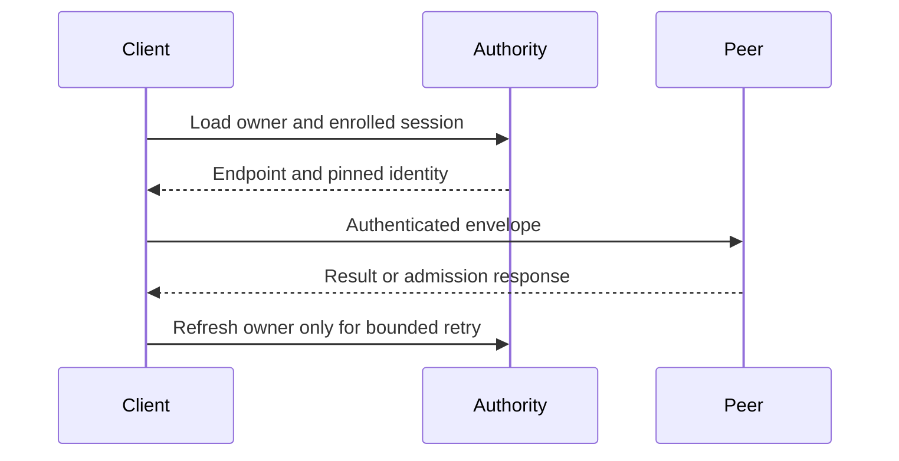

# Routing and outcomes

`PeerHttpRoundTrip` resolves the currently enrolled owner, sends one signed
envelope, and bounds request and response bytes. Both owner-routed and
direct-node calls reject oversized requests and zero deadlines before lookup.

The sender shares private, bounded owner and session hints across its clones. A
hint is populated only after exact control and signed node-record validation.

| Hint state | Sender behaviour |
| --- | --- |
| Fresh (within 15 s and one second inside the signed lease) | Resolve the endpoint with no object read. |
| Past its refresh window but inside the lease | Use the hint and run one background refresh per Cell. |
| Refresh landing on the same owner session | Reuse the enrolled node record; read control only. |
| Cold route, or any route after a refusal | Re-read control and the signed node record. A retired session fails closed. |
| Proven not-started refusal | Drop the attempted session, leave a short tombstone, and refresh once inside the original deadline. |

An invalid or lost response remains an unknown outcome and is never resent
blindly. The receiver still authorizes the peer and fences stale owners, and a
receiver that already owns the Cell resolves it from its live actor map without
reading catalog or control.

| Response | Meaning |
| --- | --- |
| Valid reply | Return the exact peer result. |
| 429/503 with integer `Retry-After` | Pace one owner-route retry within the original deadline. |
| Persistent admission rejection | Return capacity error. |
| Lost or invalid response | Return unknown outcome; caller reconciles. |
| Direct-node activation | One attempt; caller owns scheduling/retry. |



The same timeout governs resolution, sending, and pacing. A delay that consumes
the budget returns a deadline error without sleeping. Other invalid results
are never guessed to have failed before execution.

## Transport protocol

The client offers `h2` then `http/1.1` on the pinned mTLS connection, so a hot
owner multiplexes concurrent peer requests over one connection instead of
opening one connection per request. A peer that speaks only HTTP/1.1 selects
`http/1.1` from that list, so the offer never forces a protocol the peer cannot
serve.

The listener default stays HTTP/1.1. ALPN selects the protocol before any
request bytes flow, so a listener that advertises `h2` in front of an
HTTP/1.1-only server fails the first request instead of falling back. An
embedding that serves HTTP/2 enables it explicitly:

```rust
let identity = identity.with_http2()?;
let listener = identity.listener(listener);
```

Both paths are covered end to end over a generated mTLS identity: the default
listener negotiates HTTP/1.1, and `with_http2` negotiates HTTP/2
(`tests::default_listener_negotiates_http_1_1`,
`tests::http2_listener_negotiates_http_2`).

## Ingress routing table

`PeerHttpRoundTrip::routes` returns a `CellRouteTable` that shares the sender's
owner hints, so an ingress can resolve the owner once and dial it directly
instead of forwarding through another node — and the forwarding path then
reuses the same observation rather than looking the owner up again.

| Decision | Meaning | What it costs |
| --- | --- | --- |
| `RouteDecision::Local` | This session owns the Cell; serve it here. | One exact control observation. Ownership is a transition, never a hint. |
| `RouteDecision::Remote(route)` | Another enrolled session owns it. The route carries the session, endpoint, pinned certificate and public key, and its lease bound. | Zero object reads while the hint is fresh; one background refresh per Cell past its window. |
| `RouteDecision::Unowned` | No reachable peer owner: idle, tombstoned, absent, or the owner session is not enrolled. | One exact control observation. |

`CellRouteTable::invalidate` drops a hinted route after a refusal or a known
ownership change. A refusal reported for an older session leaves the current
route in place, and a route is never served past the signed node lease. Every
route stays a hint: the receiving node still authorizes the peer and fences a
stale owner.

```rust
let routes = round_trip.routes();
let decision = routes.route(&target).await?;
```

`tests::routing_table_shares_owner_hints_with_the_round_trip` asserts the
sharing and the invalidation, and
`tests::routing_table_reports_local_and_unowned_cells` asserts that a local or
unowned decision always rests on an exact control observation.

## Local adapter comparison, 2026-09-29

Run the ignored `tests::owner_lookup_performance` benchmark exactly once per
invocation after checking its selector with `-- --list`:

```sh
CARGO_TARGET_DIR="$HOME/Workspace/crabbuild-target/cellule-route-5ca5" \
  cargo test -p cellule-peer-http tests::owner_lookup_performance --locked \
  -- --ignored --exact --nocapture
```

The baseline used `dc387a8` in an isolated source snapshot with only the
benchmark fixture and its test dependency added. The candidate used the same
revision plus the worktree's owner-hint change. Both used a validated signed
owner advertisement, a counting in-memory object store, and local mTLS Axum
peer. Each lane has 1,024 requests at concurrency 1 and 16. The full-adapter
lane calls `send_inner`; the lookup and HTTP lanes isolate its components.
The server returns an encoded peer reply without running receiver dispatch or
checking the request envelope. The raw TSVs and binary digests are retained under
`$HOME/Workspace/crabbuild-target/cellule-route-5ca5/evidence`.

| Pair | Full adapter p95, c=1 baseline → candidate | p99, c=1 | p95, c=16 | p99, c=16 |
| --- | ---: | ---: | ---: | ---: |
| 1 | 5.874 → 1.887 ms | 8.378 → 3.714 ms | 38.966 → 9.543 ms | 68.701 → 11.669 ms |
| 2 | 9.395 → 2.215 ms | 18.612 → 4.689 ms | 56.168 → 21.710 ms | 82.897 → 35.607 ms |
| 3 | 12.864 → 4.798 ms | 34.210 → 7.957 ms | 92.130 → 25.913 ms | 128.453 → 38.042 ms |

All three final pairs cleared the 10% p95 gate at both concurrency levels,
improved p99, and raised fully successful concurrency-16 adapter throughput
from 245–409 to 1,106–2,547 requests/s. Warm full-adapter sender reads fell
from two body reads per request to zero while the hint remained live. One of
six candidate warm lanes had two reads across 1,024 calls because its
five-second hint expired during the measurement. Cold sends still made two
metadata reads in both builds. Earlier exploratory runs, including one with
a candidate p99 network spike, remain in the evidence directory; this shared
workstation is not a production latency profile. Local HTTP/TLS is now the
dominant measured adapter phase. This fixture does not measure product ingress,
RustFS, a remote network, or owner SQL/publication time.

The embedding application maintainer should check whether its ingress route
shares the sender hint and passes a known description through
`with_observed_description`. A product comparison should schedule the same
local and forwarded actions across hot and many-Cell stages, retain owner-loss
and receipt evidence, and count object-store requests per action. Write
throughput attribution is tracked separately by the entity workload and the
[write-capacity report](../../cellule-app/performance/2026-09-29-write-capacity.md).

## Client-side reuse

`cellule-runtime` keeps two bounded, advisory caches per client capability:

| Reuse | Bound | What it removes | What still fences it |
| --- | --- | --- | --- |
| Local route (`CellId` → catalog proof + control) | 2 s, 4,096 Cells | The catalog and authority reads a repeated local invocation used to pay | The actor revalidates the expected description on every dispatch; a release or takeover drops the route |
| Observed description (`CellId` → description) | 30 s, 4,096 Cells | The Describe hop of every routed invocation | Every receiver validates the shipped description; a fenced refusal drops the entry |

A receiver can also resolve from its live actor map with
`ResidentPeerCellResolver`, which reads no catalog or control on a resident hit
and falls back to the storage path on a miss.

Measured locally on the `perf/routing-tier1` branch, using the counting in-memory
provider plus a 2 ms per-GET throttle that matches the small-object GET p95 in
the write-capacity run:

| Invocation | Provider reads | Latency |
| --- | ---: | ---: |
| First local query (route and description cold) | 3 (catalog head and page, control) | 8.7–9.7 ms |
| Repeated local query | 0 | 0.55–0.62 ms p50, 1.3–1.4 ms p95 |
| Forwarded command, first | 2 peer hops (Describe, then dispatch) | — |
| Forwarded command, repeated | 1 peer hop | — |

Run `cargo test -p cellule-runtime --features test-support --test protocol
client::routing -- --include-ignored --nocapture` to reproduce. The counts are
deterministic; the latency depends on the throttle model, not on a provider.
