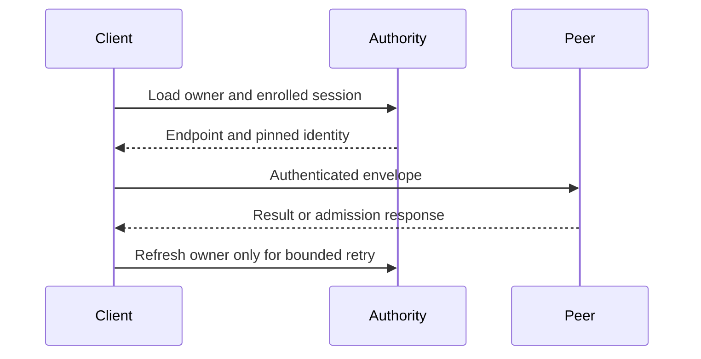

# Routing and outcomes

`PeerHttpRoundTrip` resolves the currently enrolled owner, sends one signed
envelope, and bounds request and response bytes. Both owner-routed and
direct-node calls reject oversized requests and zero deadlines before lookup.

The sender shares private, bounded owner and session hints across its clones. A
hint is populated only after exact control and signed node-record validation.

| Hint state | Sender behaviour |
| --- | --- |
| Fresh (within 15 s and one second inside the signed lease) | Resolve the endpoint with no object read. |
| Past its refresh window but inside the lease | Use the hint and run one background refresh per Cell. |
| Refresh landing on the same owner session | Reuse the enrolled node record; read control only. |
| Cold route, or any route after a refusal | Re-read control and the signed node record. Concurrent misses share a successful lookup per Cell; a retired session fails closed. |
| Proven not-started refusal | Drop the attempted session, leave a short tombstone, and refresh once inside the original deadline. |

An invalid or lost response remains an unknown outcome and is never resent
blindly. The receiver still authorizes the peer and fences stale owners, and a
receiver with a live node-session guard resolves a resident Cell from actor
admission without reading catalog or control. An object-only runtime checks
fresh authority because it has no session guard.

| Response | Meaning |
| --- | --- |
| Valid reply | Return the exact peer result. |
| 429/503 with integer `Retry-After` | Pace one owner-route retry within the original deadline. |
| Persistent admission rejection | Return capacity error. |
| Lost or invalid response | Return unknown outcome; caller reconciles. |
| Direct-node activation | One attempt; caller owns scheduling/retry. |



The same timeout governs resolution, sending, and pacing. A delay that consumes
the budget returns a deadline error without sleeping. Other invalid results
are never guessed to have failed before execution.

## Transport protocol

The private mTLS listener enables `TCP_NODELAY` on accepted sockets before the
handshake. Small TLS records and peer replies are sent promptly across both
HTTP/1.1 and HTTP/2; they do not wait for Nagle buffering and delayed TCP
acknowledgements. Socket setup failures reject the connection and retain the
I/O error in the listener log. A real mTLS accept test verifies the socket
option for both protocols.

The TLS stream wrapper preserves scatter/gather writes so the HTTP server can
submit response headers and bodies together without flattening them first.
A real mTLS response test verifies that delegation.

The client offers `h2` then `http/1.1` on the pinned mTLS connection, so a hot
owner multiplexes concurrent peer requests over one connection instead of
opening one connection per request. A peer that speaks only HTTP/1.1 selects
`http/1.1` from that list, so the offer never forces a protocol the peer cannot
serve.

The listener default stays HTTP/1.1. ALPN selects the protocol before any
request bytes flow, so a listener that advertises `h2` in front of an
HTTP/1.1-only server fails the first request instead of falling back. An
embedding that serves HTTP/2 enables it explicitly:

```rust
let identity = identity.with_http2()?;
let listener = identity.listener(listener);
```

Both paths are covered end to end over a generated mTLS identity: the default
listener negotiates HTTP/1.1, and `with_http2` negotiates HTTP/2
(`tests::default_listener_negotiates_http_1_1`,
`tests::http2_listener_negotiates_http_2`).

## Ingress routing table

`PeerHttpRoundTrip::routes` returns a `CellRouteTable` that shares the sender's
owner hints, so an ingress can resolve the owner once and dial it directly
instead of forwarding through another node — and the forwarding path then
reuses the same observation rather than looking the owner up again.

| Decision | Meaning | What it costs |
| --- | --- | --- |
| `RouteDecision::Local` | This session owns the Cell; serve it here. | One exact control observation. Ownership is a transition, never a hint. |
| `RouteDecision::Remote(route)` | Another enrolled session owns it. The route carries the session, endpoint, pinned certificate and public key, and its lease bound. | Zero object reads while the hint is fresh; one background refresh per Cell past its window. |
| `RouteDecision::Unowned` | No reachable peer owner: idle, tombstoned, absent, or the owner session is not enrolled. | One exact control observation. |

`CellRouteTable::invalidate` drops a hinted route after a refusal or a known
ownership change. A refusal reported for an older session leaves the current
route in place, and a route is never served past the signed node lease. Every
route stays a hint: the receiving node still authorizes the peer and fences a
stale owner.

```rust
let routes = round_trip.routes();
let decision = routes.route(&target).await?;
```

`tests::routing_table_shares_owner_hints_with_the_round_trip` asserts the
sharing and the invalidation, and
`tests::routing_table_reports_local_and_unowned_cells` asserts that a local or
unowned decision always rests on an exact control observation.

## Local adapter comparison, 2026-09-29

Run the ignored `tests::owner_lookup_performance` benchmark exactly once per
invocation after checking its selector with `-- --list`:

```sh
CARGO_TARGET_DIR="$HOME/Workspace/crabbuild-target/cellule-route-5ca5" \
  cargo test -p cellule-peer-http tests::owner_lookup_performance --locked \
  -- --ignored --exact --nocapture
```

The baseline used `dc387a8` in an isolated source snapshot with only the
benchmark fixture and its test dependency added. The candidate used the same
revision plus the worktree's owner-hint change. Both used a validated signed
owner advertisement, a counting in-memory object store, and local mTLS Axum
peer. Each lane has 1,024 requests at concurrency 1 and 16. The full-adapter
lane calls `send_inner`; the lookup and HTTP lanes isolate its components.
The server returns an encoded peer reply without running receiver dispatch or
checking the request envelope. The raw TSVs and binary digests are retained under
`$HOME/Workspace/crabbuild-target/cellule-route-5ca5/evidence`.

| Pair | Full adapter p95, c=1 baseline → candidate | p99, c=1 | p95, c=16 | p99, c=16 |
| --- | ---: | ---: | ---: | ---: |
| 1 | 5.874 → 1.887 ms | 8.378 → 3.714 ms | 38.966 → 9.543 ms | 68.701 → 11.669 ms |
| 2 | 9.395 → 2.215 ms | 18.612 → 4.689 ms | 56.168 → 21.710 ms | 82.897 → 35.607 ms |
| 3 | 12.864 → 4.798 ms | 34.210 → 7.957 ms | 92.130 → 25.913 ms | 128.453 → 38.042 ms |

All three final pairs cleared the 10% p95 gate at both concurrency levels,
improved p99, and raised fully successful concurrency-16 adapter throughput
from 245–409 to 1,106–2,547 requests/s. Warm full-adapter sender reads fell
from two body reads per request to zero while the hint remained live. One of
six candidate warm lanes had two reads across 1,024 calls because its
five-second hint expired during the measurement. Cold sends still made two
metadata reads in both builds. Earlier exploratory runs, including one with
a candidate p99 network spike, remain in the evidence directory; this shared
workstation is not a production latency profile. Local HTTP/TLS is now the
dominant measured adapter phase. This fixture does not measure product ingress,
RustFS, a remote network, or owner SQL/publication time.

The embedding application maintainer should check whether its ingress route
shares the sender hint and passes a known description through
`with_observed_description`. A product comparison should schedule the same
local and forwarded actions across hot and many-Cell stages, retain owner-loss
and receipt evidence, and count object-store requests per action. Write
throughput attribution is tracked separately by the entity workload and the
[write-capacity report](../../cellule-app/performance/2026-09-29-write-capacity.md).

## Client-side reuse

`cellule-runtime` reuses lease-fenced actor admission and a bounded description cache:

| Reuse | Bound | What it removes | What still fences it |
| --- | --- | --- | --- |
| Local actor capability | 4,096 Cells, live node lease and actor admission | Catalog and authority reads, periodic cache refreshes, and repeated actor lookups | Session fencing and closure of the exact admission token stop reuse; unleased runtimes read fresh authority |
| Unleased resident catalog identity | 4,096 Cells, actor admission | Repeated catalog head and page reads | Every invocation still reads fresh Cell authority and rechecks actor identity/admission after I/O |
| Observed description (`CellId` → description) | 30 s, 4,096 Cells | The Describe hop of every routed invocation | Every receiver validates the shipped description; a fenced refusal drops the entry |

A receiver can also use `ResidentPeerCellResolver`: a resident hit under a live
node lease reads no catalog or control. An unleased resident hit reuses its
immutable catalog identity and reads control once per invocation; its ownership
observation is never cached. A miss reads catalog and control. Cached descriptions are invalidated on local fencing or
the corresponding decoded peer refusal; ambiguous commands are reconciled.
Drain, migration and handoff close the cached capability's admission token.
The next lookup can resolve a replacement actor; every SQL dispatch still checks
its token and node lease. Single-Cell local and peer dispatch avoid allocating a
temporary handle map. A nonowner forwarding runtime checks local presence once
and skips the additional resident lookup.

`performance_tests::rustfs_object_only_routing_latency_throughput` runs the same
SQL, mTLS forwarding, concurrency, write-proof and recovery workload as the
lease-backed benchmark with an unleased owner. Keep both modes in a performance
comparison: zero-read ownership reuse requires a node-session lease, while the
unleased path pays one authority round trip for each invocation. The ordinary
protocol test `unleased_local_and_peer_routes_reuse_catalog_but_read_fresh_control`
checks exact read counts and origin failures; takeover, release/replacement and
session-fencing tests cover refusal and invalidation.

Cold owner lookups use bounded per-Cell gates shared by the routing table and
HTTP adapter. After waiting, a caller checks the signed lease of the populated
hint. Cancellation releases its gate; failed lookups retain their original
errors. Local and unowned decisions still require fresh control observations.

Historical measurements from PR #27's `perf/routing-tier1` branch, using the counting in-memory
provider plus a 2 ms per-GET throttle that matches the small-object GET p95 in
the write-capacity run:

| Invocation | Provider reads | Latency |
| --- | ---: | ---: |
| First local query (route and description cold) | 3 (catalog head and page, control) | 8.7–9.7 ms |
| Repeated local query | 0 | 0.55–0.62 ms p50, 1.3–1.4 ms p95 |
| Forwarded command, first | 2 peer hops (Describe, then dispatch) | — |
| Forwarded command, repeated | 1 peer hop | — |

Current routing regressions run with `cargo test -p cellule-runtime --features
test-support --test protocol client::routing -- --include-ignored --nocapture`.
The ignored throttle model compares unleased authority reads with leased
resident routing; it does not reproduce the historical revision's timings.

## RustFS routing measurement

The ignored `performance_tests::rustfs_owner_routing_latency_throughput` test
uses an explicit RustFS endpoint, bucket, and unique prefix. It measures local
and signed forwarded queries and commands at concurrency 1 and 16 through an
empty ingress runtime's local-or-peer client and a
generated pinned mTLS endpoint and the canonical receiver dispatcher. Repeated
query bursts cross the former two-second route-cache lifetime. Separate local
lanes measure the first request through a fresh client at concurrency 1 and 16.
Every command
checks its receipt, the final root is authenticated at origin, and a separate
runtime reconstructs that root and checks the counter value.
Forced cold owner-hint bursts count duplicate discovery reads. Adjacent
direct-handle controls alternate order for both reads and durable writes;
publication telemetry separates immutable preparation and authority CAS. A
second receiver using uncached resident resolution supplies an adjacent
forwarded-query control on the same runtime and mTLS connection.

Set `CELLULE_TEST_ENDPOINT`, `CELLULE_TEST_BUCKET`, `CELLULE_TEST_PREFIX`,
`AWS_ACCESS_KEY_ID`, and `AWS_SECRET_ACCESS_KEY` to an isolated local fixture.
Set `CELLULE_PERF_EVIDENCE` to an existing external directory to retain samples.
Then run:

```sh
CARGO_TARGET_DIR="$HOME/Workspace/crabbuild-target/<checkout>" \
  cargo test --release -p cellule-peer-http --locked \
  performance_tests::rustfs_owner_routing_latency_throughput \
  -- --exact --ignored --nocapture
```

The burst throughput includes its deliberate pacing. Other lanes report
completed calls per elapsed workload second. All measurements include the
fixture's owner renewals and signed membership heartbeats that occur during
active measurement windows; burst sleep intervals are excluded from the
counters and included in elapsed time. Use identical
workloads and alternating baseline/candidate runs before attributing changes.

The reference Compose workflow also runs a matched routing job on its own
runner. It builds isolated baseline and candidate snapshots with identical
test wiring, freezes the release binaries, and alternates three runs per
version in both leased and object-only modes. Artifacts retain revisions,
digests, every raw latency sample, object-read/hop counts, and exact recovery
results. The gate requires median-run p95/p99 within 10% and completed-call
throughput within 10%; paced throughput is excluded because it includes sleep.
Historical unleased zero-read routing is reported but cannot qualify a fresh
authority latency target.

Warm queries use the fixture's observed description. Twelve paced bursts per
route cross the old two-second resident-cache window; the sender is enrolled
before each timed forwarded burst so its independent refresh does not obscure
receiver latency. Cold and fresh-client lanes still include discovery and
Describe. Manual workflow runs accept `routing_baseline` and `routing_only`
to repeat a specific comparison without repeating Compose scaling.

### Local RustFS results, 2026-09-30

Three release runs per version alternated baseline/candidate, candidate/baseline,
baseline/candidate against the same pinned RustFS image, with its data on a
Colima ext4 volume. Baseline was merged `70bd25f`; both versions used the
identical measurement harness with 4,096 queries per lane and 128 commands per
write lane. Each run reconstructed its final root and verified all 768
acknowledged mutations, including the paired write control (4,608 in total).
The owner used a published signed advertisement, a live node lease, and lease
renewals. The forwarding ingress was an empty object-only runtime; a separate
regression covers Required-node forwarding without the redundant resident probe.
The table reports medians of three runs, not production SLOs.

| Query workload | Requests/s, baseline → candidate | p50 ms, baseline → candidate | Provider GETs |
| --- | ---: | ---: | ---: |
| Fresh local client, concurrency 1 | 248 → 6,405 | 3.533 → 0.121 | 12,288 → 0 per 4,096 queries |
| Fresh local client, concurrency 16 | 1,279 → 11,386 | 9.477 → 0.713 | 12,288 → 0 per 4,096 queries |
| Warm local, concurrency 1 | 6,654 → 9,231 | 0.104 → 0.080 | 3 → 0 per 4,096 queries |
| Warm local, concurrency 16 | 9,398 → 14,833 | 0.698 → 0.524 | 0 → 0 per 4,096 queries |
| Local bursts after two-second expiry, concurrency 16 | Paced | 9.635 → 1.062 | 192 → 0 per 64 queries |
| Forced cold forwarded routes, concurrency 16 | 920 → 1,529 | 14.878 → 8.302 | 128 → 8 per 64 queries |
| Warm forwarded, concurrency 1 | 1,999 → 2,305 | 0.430 → 0.384 | 0 → 0 per 4,096 queries |
| Warm forwarded, concurrency 16 | 2,713 → 2,699 | 3.442 → 3.394 | 0 → 0 per 4,096 queries |

Cold forwarded bursts share two discovery GETs among 16 callers. Queries then
use one peer hop each. The local paired routed/direct latency ratio fell from
1.295 to 1.036; the forwarded cached/uncached receiver ratio was 1.005 and 0.999.
This control shows no material receiver-cache overhead over the peer connection.
Earlier matched runs had lower candidate warm-forwarded throughput; their
samples are retained. These shared-workstation runs do not establish a general
warm-forwarded throughput win.

| Durable command workload | Commands/s, baseline → candidate |
| --- | ---: |
| Local, concurrency 1 | 39.434 → 41.985 |
| Local, concurrency 16 | 39.114 → 39.878 |
| Forwarded, concurrency 1 | 39.653 → 34.647 |
| Forwarded, concurrency 16 | 34.140 → 35.246 |

The paired routed/direct durable-write ratio was 1.004 and 0.988. These results
do not establish a write-throughput gain; immutable preparation and authority
publication dominate. A description expiry can add a Describe hop; command
phase counters also include the concluding readback. The fixture verifies
mTLS, envelope signatures and static application authorization, but does not
qualify production caller enrollment, a remote network, or a production fleet.

Raw samples, run logs, executable digests, matched source manifests and the
isolated verification logs are retained outside the repository under
`$HOME/Workspace/crabbuild-target/cellule-harden-routing-evidence-5ca5/pr-qualification`.
To reproduce the comparison, copy the test module, test registration and its
only additional dev dependencies (`blake3`, `tempfile`) into the baseline
snapshot; keep production source at `70bd25f`, use identical command settings,
and alternate three baseline and three candidate runs against the same fixture.
