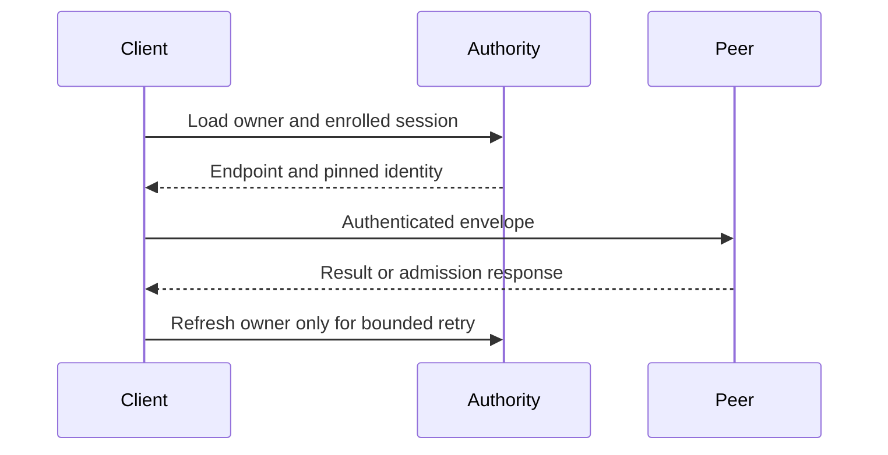

# Routing and outcomes

`PeerHttpRoundTrip` resolves the currently enrolled owner, sends one signed
envelope, and bounds request and response bytes. Both owner-routed and
direct-node calls reject oversized requests and zero deadlines before lookup.

The sender shares a private, 4,096-entry owner hint across its clones. A hint
is populated only after exact control and signed node-record validation. It
expires after at most five seconds, and at least one second before the signed
node lease. A proven not-started refusal drops the attempted session and
forces one exact refresh within the original deadline. An invalid or lost
response remains an unknown outcome and is never resent blindly. The receiver
still authorizes the peer and fences stale owners.

| Response | Meaning |
| --- | --- |
| Valid reply | Return the exact peer result. |
| 429/503 with integer `Retry-After` | Pace one owner-route retry within the original deadline. |
| Persistent admission rejection | Return capacity error. |
| Lost or invalid response | Return unknown outcome; caller reconciles. |
| Direct-node activation | One attempt; caller owns scheduling/retry. |



The same timeout governs resolution, sending, and pacing. A delay that consumes
the budget returns a deadline error without sleeping. Other invalid results
are never guessed to have failed before execution.

## Local adapter comparison, 2026-09-29

Run the ignored `tests::owner_lookup_performance` benchmark exactly once per
invocation after checking its selector with `-- --list`:

```sh
CARGO_TARGET_DIR="$HOME/Workspace/crabbuild-target/cellule-route-5ca5" \
  cargo test -p cellule-peer-http tests::owner_lookup_performance --locked \
  -- --ignored --exact --nocapture
```

The baseline used `dc387a8` in an isolated source snapshot with only the
benchmark fixture and its test dependency added. The candidate used the same
revision plus the worktree's owner-hint change. Both used a validated signed
owner advertisement, a counting in-memory object store, and local mTLS Axum
peer. Each lane has 1,024 requests at concurrency 1 and 16. The full-adapter
lane calls `send_inner`; the lookup and HTTP lanes isolate its components.
The server returns an encoded peer reply without running receiver dispatch or
checking the request envelope. The raw TSVs and binary digests are retained under
`$HOME/Workspace/crabbuild-target/cellule-route-5ca5/evidence`.

| Pair | Full adapter p95, c=1 baseline → candidate | p99, c=1 | p95, c=16 | p99, c=16 |
| --- | ---: | ---: | ---: | ---: |
| 1 | 5.874 → 1.887 ms | 8.378 → 3.714 ms | 38.966 → 9.543 ms | 68.701 → 11.669 ms |
| 2 | 9.395 → 2.215 ms | 18.612 → 4.689 ms | 56.168 → 21.710 ms | 82.897 → 35.607 ms |
| 3 | 12.864 → 4.798 ms | 34.210 → 7.957 ms | 92.130 → 25.913 ms | 128.453 → 38.042 ms |

All three final pairs cleared the 10% p95 gate at both concurrency levels,
improved p99, and raised fully successful concurrency-16 adapter throughput
from 245–409 to 1,106–2,547 requests/s. Warm full-adapter sender reads fell
from two body reads per request to zero while the hint remained live. One of
six candidate warm lanes had two reads across 1,024 calls because its
five-second hint expired during the measurement. Cold sends still made two
metadata reads in both builds. Earlier exploratory runs, including one with
a candidate p99 network spike, remain in the evidence directory; this shared
workstation is not a production latency profile. Local HTTP/TLS is now the
dominant measured adapter phase. This fixture does not measure product ingress,
RustFS, a remote network, or owner SQL/publication time.

The embedding application maintainer should check whether its ingress route
shares the sender hint and passes a known description through
`with_observed_description`. A product comparison should schedule the same
local and forwarded actions across hot and many-Cell stages, retain owner-loss
and receipt evidence, and count object-store requests per action. Write
throughput attribution is tracked separately by the entity workload and the
[write-capacity report](../../cellule-app/performance/2026-09-29-write-capacity.md).
