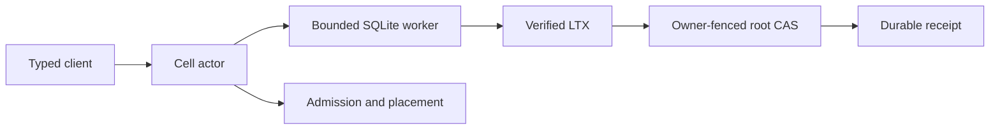

# cellule-runtime

Embedded Cell runtime: identities, fenced authority, one writer per Cell,
transactional outcomes, exact-root publication, follower durability, placement,
and distributed primitives. An application owns HTTP, authentication, and
provider construction.



| Guide | Topic |
| --- | --- |
| [Runtime guide](docs/README.md) | Reading map for every subsystem. |
| [Overview](docs/overview.md) | Concepts, ownership, and reading order. |
| [Execution](docs/runtime.md) | Actor, worker, deadlines, and receipts. |
| [Storage](docs/storage.md) | Identity, control, exact roots, and recovery. |
| [Primitives](docs/primitives.md) | SQL, KV, Blob, Queue, Workflow, Cron, and Effects. |
| [Failover](docs/failover-and-followers.md) | Follower logs and takeover. |
| [Native authoring](docs/rust-api.md) | Modules, typed commands, codecs, and activities. |
| [Embedding](docs/deployment.md) | Service-owned wiring and rollout. |
| [Qualification](docs/delivery.md) | Proof levels and test map. |

The small root prelude is inventoried in [api-prelude.txt](api-prelude.txt).
Crate-private tests sit beside their modules; public scenarios are grouped by
behavior in `tests/`.

```sh
cargo test -p cellule-runtime --features test-support --locked
```
