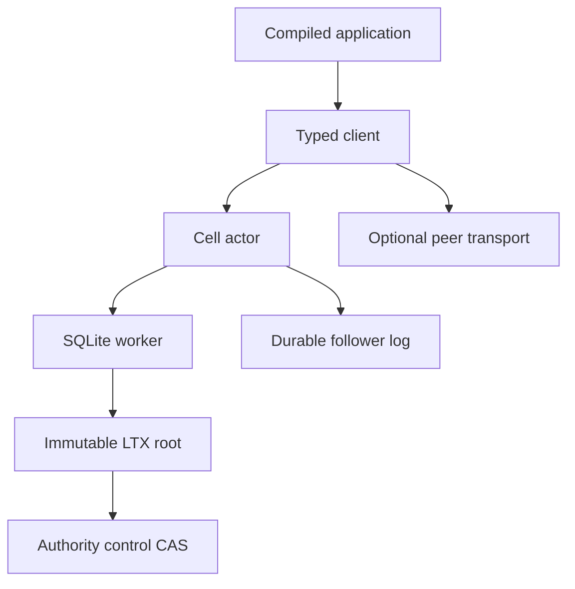
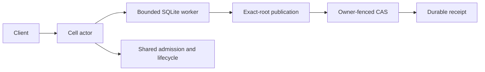

# Runtime guide

Cellule owns the reusable Cell framework. A service supplies identity,
ingress, authorization, credentials, and deployment policy.

| Field | Value |
| --- | --- |
| Content type | Reading map and crate reference |
| Audience | Embedders and runtime contributors |
| Goal | Pick the right subsystem guide, then work inside the crate |
| Scope | Cell identity, authority CAS, actor and SQL execution, follower durability, placement, primitives, qualification |

<a id="contents"></a>
## Contents

- [Overview](#overview)
- [Guide map](#guide-map)
- [Module map](#module-map)
- [Tests](#tests)
- [Contracts and validators](#contracts)
- [See also](#see-also)

<a id="overview"></a>
## Overview

`cellule-runtime` is the embedded SQLite Cell runtime for applications. It owns
Cell identities, control/CAS authority, one single-writer actor per Cell, schema
installation, exact-root LTX publication, follower durability, fleet placement,
and qualification receipts.

- The application owns HTTP ingress, authentication, and provider construction.
- A successful command returns a durable receipt: an exact published root or a
  recoverable follower proof.

**System shape.**



**Runtime path.**



**Opt-in read path.** `CellReadReplica` can open an exact S3-rooted, read-only
Cell view. Its view and replacement refresh are charged to the node runtime's
memory, descriptor, and disk ledgers.

**Native serving observation.** `CellRuntime::observe_serving` joins the existing
actor FIFO and captures the exact current authority root and native generation
at an epoch strictly after the caller's original epoch. Repeat it after prefix
or origin I/O and compare `CellServingObservation::same_writer`; demand samples
remain advisory. Movement and the host's
[original-writer collector](../../cellule-host/docs/original-writers.md) share
this path. It starts no acquisition and grants no retention or maintenance rights.

`close()` fences new reader work. `close_and_join()` also detaches snapshots
from every peer clone and joins accepted query/refresh work, including native
jobs whose waiters were cancelled. Its receipt preserves the last installed
position; it does not establish current authority or fleet retirement. See the
[host reader lifecycle](../../cellule-host/docs/read-replicas.md).

`lifecycle_observation()` reads the same irreversible admission word and shared
snapshot state. It exposes accepted native lifetimes after caller cancellation
and detachment. Local joining requires closed admission, detached state and zero
lifetimes; this supplies no remote authority, enrollment or replacement-policy
proof. The host's bounded reader pages include these original observations.

`prepare_source()` observes an opaque exact root, owner/epoch, code/schema and
signed physical boot scope without reserving a view. `open_source()` opens that
pinned root through the same admitted native path, even if the owner publishes
a newer root meanwhile. Installation still checks current authority and the
original signed boot identity. Source metadata grants no admission or readiness.

Those charges are provisional: product routing and measured capacity
qualification remain open under
[Plan 036](https://github.com/crabbuild/crab/blob/beb439039cb37e750afe6625a2358101c70d1191/advisor-plans/036-cell-read-replicas-and-fenced-promotion.md).

<a id="guide-map"></a>
## Guide map

Each guide is the complete reference for its topic: it opens with an overview
and then carries the contracts, limits, diagrams, and runnable examples.

| Topic | Guide |
| --- | --- |
| Concepts, ownership, and reading order | [Understand the embedded Cell runtime](overview.md) |
| Request path and receipts | [Execution and receipts](runtime.md) |
| Control, roots, and recovery | [Authority, storage, and recovery](storage.md) |
| SQL and distributed primitives | [Cell primitives](primitives.md) |
| Follower durability and owner loss | [Follower durability and owner loss](failover-and-followers.md) |
| Native authoring | [Native Rust authoring](rust-api.md) |
| Service integration | [Embed and operate Cellule](deployment.md) |
| Test and evidence levels | [Verification and qualification](delivery.md) |

```text
docs/README.md                 this page: topic map and crate reference
├── overview.md                concepts, ownership, and reading order
├── runtime.md                 actor, worker, deadlines, and receipts
├── storage.md                 authority, roots, and recovery
├── primitives.md              SQL, KV, Blob, Queue, Cron, Workflow, Effects
├── failover-and-followers.md  follower proof, owner loss, and recovery
├── rust-api.md                native modules, codecs, and activities
├── deployment.md              embed, route, release, and drain
├── delivery.md                tests, receipts, and qualification levels
└── technical-reference.md     design and audit records
```

- The guides retain the framework mechanics and examples from the original
  synthesis.
- Mentions of Crab HTTP routes or deployment are historical embedding examples,
  not Cellule requirements.
- The [technical reference map](technical-reference.md) also links the original
  design and audit records.

<a id="module-map"></a>
## Module map

| Module | Responsibility |
| --- | --- |
| `identity` | Cell, tenant, session, namespace, node, and digest identities |
| `control` | Control record, transitions, and CAS authority |
| `codec` | Bounded wire codec used by modules and peers |
| `registry` | Module/command/query descriptors and the compiled registry |
| `cell` | Actor, executor, worker pool, catalog, schema, application identity |
| `client` | Typed client, prepared commands, state streams |
| `primitives` | SQL, KV, Blob, Queue, Cron, Workflow, Effects, activity pool |
| `publication` | Exact-root LTX publication |
| `follower` | Follower store, lanes, and tail pages |
| `node` | Signed advertisements, node log, recovery, durability, leases |
| `recovery` | Recovery manifests, artifacts, releases, pins, retention |
| `fleet` | Placement, pressure, admission accounting, eviction, scheduling |
| `peer` | Authenticated peer protocol |
| `qualification` | Qualification profiles, workloads, and receipts |
| `ltx` | LTX types this crate exposes to embedders |

The root also re-exports a small prelude for embedders, frozen in
[`api-prelude.txt`](../api-prelude.txt).

<a id="tests"></a>
## Tests

`tests/` holds one binary per suite with shared fixtures in `tests/support/`:

- Suites: `runtime`, `primitives`, `protocol`, `contracts`, `fleet`,
  `qualification`.
- Modules whose tests must assert crate-private behavior are recorded in the
  retired `tests-allow-list.txt` inventory.
- Current module ownership is checked by
  [`check-module-layout.py`](../../../scripts/check-module-layout.py).

```sh
CARGO_TARGET_DIR=$HOME/Workspace/crabbuild-target/<checkout> \
  cargo test -p cellule-runtime --features test-support --locked
```

<a id="contracts"></a>
## Contracts and validators

| Artifact | Contract |
| --- | --- |
| [Runtime SQLite schema](contracts/runtime.sql) | Persisted tables, receipts, and the ledger shape. |
| [Peer wire format](contracts/peer.proto) | Signed peer messages and the codec contract. |
| [Contract validator](validate.mjs) | SQL, peer wire, fence, whitespace, and link assertions. |

The [crate entry](../README.md) has the workspace commands. This page is the
runtime design map (`docs/README.md`); `AGENTS.md` holds contributor rules.

<a id="see-also"></a>
## See also

| Document | What it covers |
| --- | --- |
| [Understand the embedded Cell runtime](overview.md) | Concepts, ownership, and reading order. |
| [Execution and receipts](runtime.md) | Actor, worker, deadlines, and receipts. |
| [Authority, storage, and recovery](storage.md) | Identity, control, exact roots, and recovery. |
| [Cell primitives](primitives.md) | SQL, KV, Blob, Queue, Cron, Workflow, and Effects. |
| [Follower durability and owner loss](failover-and-followers.md) | Follower proof, owner loss, and takeover. |
| [Native Rust authoring](rust-api.md) | Modules, typed commands, codecs, and activities. |
| [Embed and operate Cellule](deployment.md) | Node setup, routing, release, and observation. |
| [Verification and qualification](delivery.md) | Tests, receipts, and qualification levels. |
| [Technical reference map](technical-reference.md) | Design and audit records. |
| [Runtime module rules](../AGENTS.md) | Module layout, invariants, and verification. |
| [Qualification harness](../qualification/README.md) | Profiles, workloads, and receipts. |
| [Store guide](../../cellule-store/docs/README.md) | Provider-neutral object-store transport. |
| [System architecture diagram](diagram/system-architecture.svg) | Historical Crab embedding view. |
