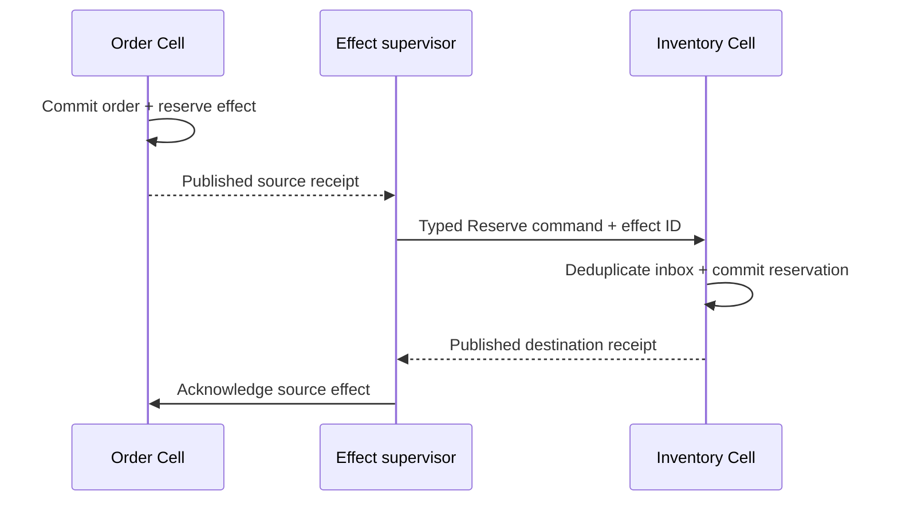
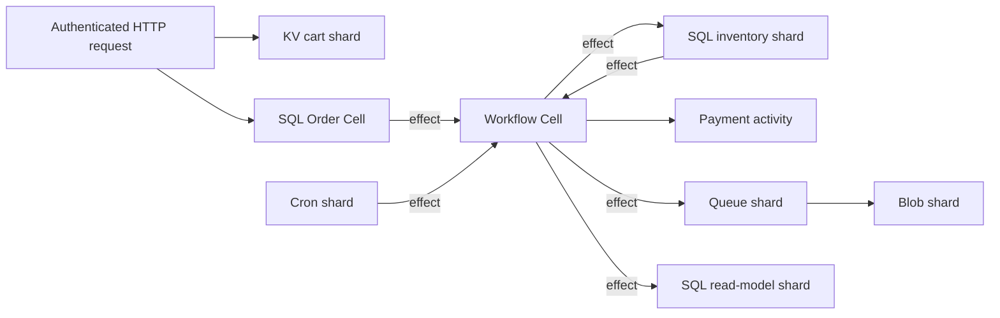
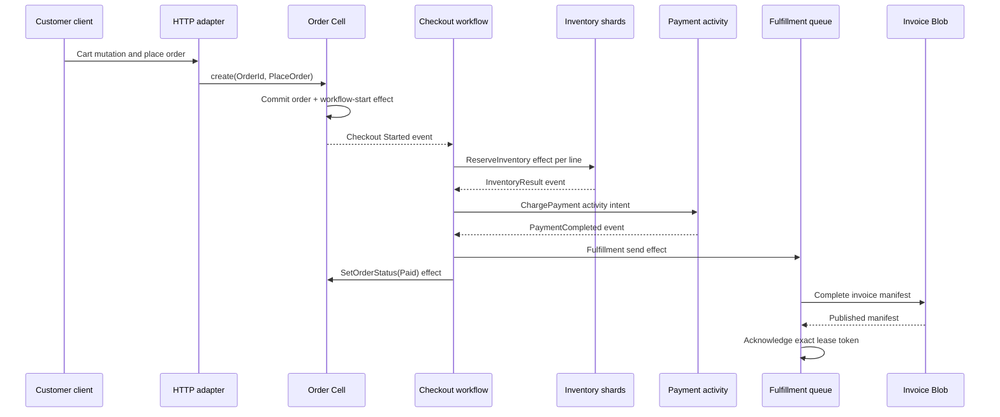
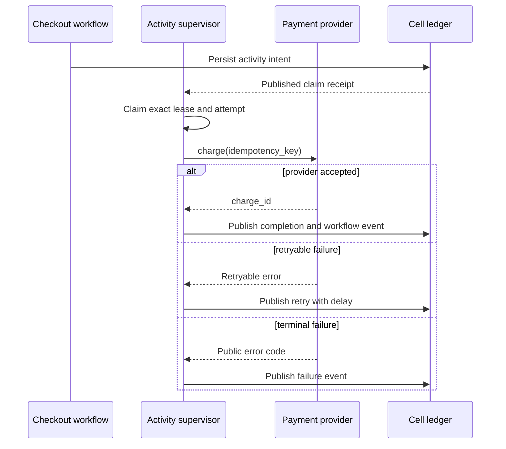
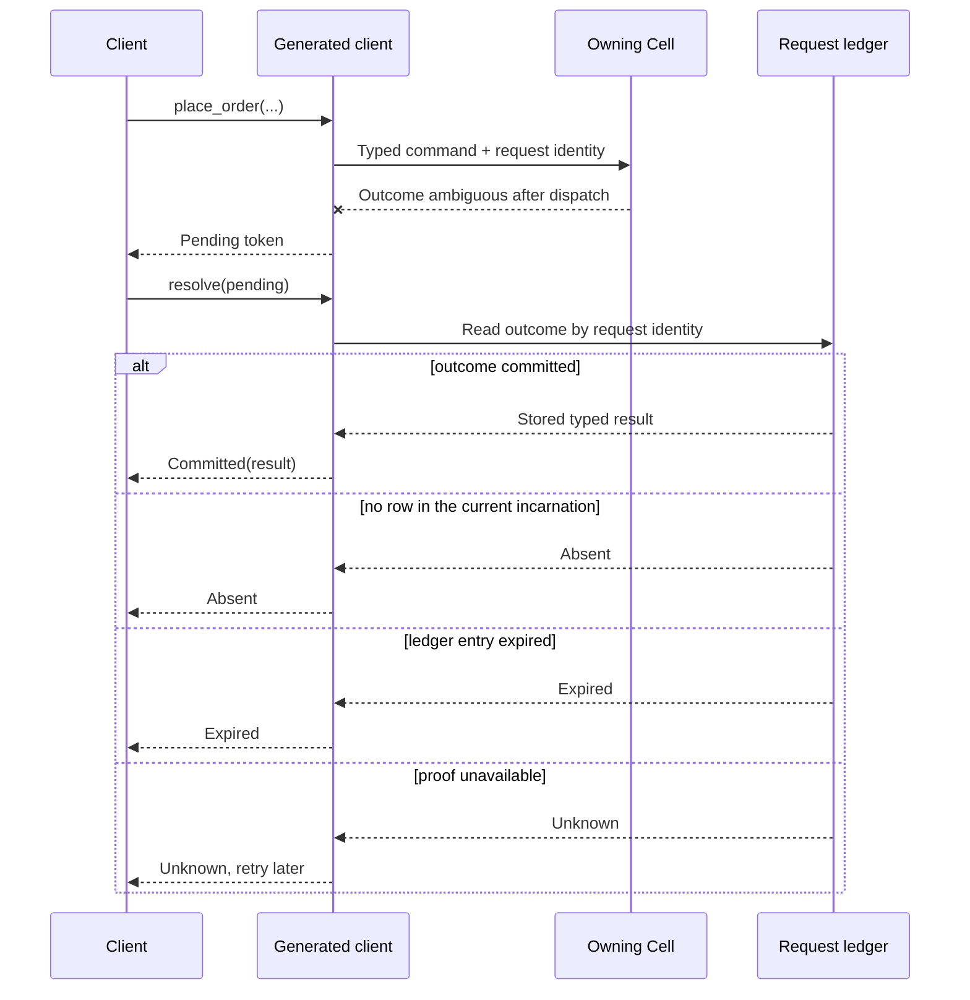
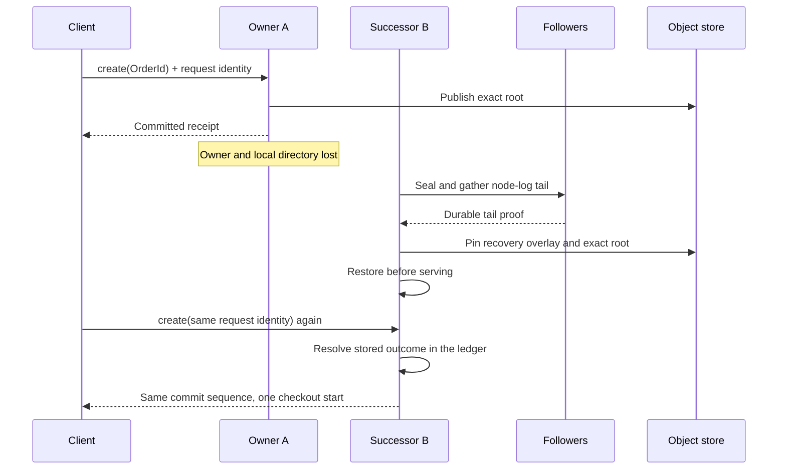

# Build large applications on the Cell runtime

<a id="contents"></a>
## Contents

**Framework design**

- [Design for application owners](#design-for-application-owners)
- [Use four topology patterns](#topology-patterns)
- [Separate the author and operator APIs](#author-and-operator-apis)
- [Declare one application](#declare-one-application)
- [Declare an entity Cell](#declare-an-entity-cell)
- [Write deterministic commands](#deterministic-commands)
- [Write receipted queries](#receipted-queries)
- [Generate an application client](#generated-client)
- [Make provisioning explicit](#explicit-provisioning)
- [Compose built-in primitives](#compose-primitives)
- [Coordinate across Cells](#coordinate-across-cells)
- [Run external work as activities](#activities)
- [Host applications through one node facade](#node-facade)
- [Keep deployment artifacts canonical](#deployment-artifacts)
- [Make local development representative](#local-development)
- [Apply one resource model](#resource-model)
- [Preserve explicit consistency contracts](#consistency-contracts)
- [Keep security at the correct boundary](#security-boundary)
- [Deliver in vertical slices](#vertical-slices)
- [Reject convenient but unsafe shortcuts](#unsafe-shortcuts)
- [Define success from the owner's perspective](#owner-success)

**Worked example: Commerce**

- [Build a complete Commerce application](#commerce-example)
- [Follow the application flow](#commerce-application-flow)
- [Organize the application crate](#commerce-crate-layout)
- [Declare stable values and identifiers](#commerce-values-and-ids)
- [Register the complete application](#commerce-registration)
- [Store the Order aggregate in a SQL Cell](#commerce-order-cell)
- [Store shopping carts in KV](#commerce-carts-kv)
- [Reserve inventory in sharded SQL Cells](#commerce-inventory-shards)
- [Coordinate checkout with Workflow](#commerce-checkout-workflow)
- [Charge through an external activity](#commerce-payment-activity)
- [Project customer queries into a read-model Cell](#commerce-read-model)
- [Deliver fulfillment through Queue](#commerce-fulfillment-queue)
- [Store invoices through Blob](#commerce-invoice-blob)
- [Trigger subscription renewals through Cron](#commerce-renewals-cron)
- [Compose and start a Cell node](#commerce-node-composition)
- [Adapt an authenticated HTTP route](#commerce-http-route)
- [Resolve an ambiguous mutation](#commerce-ambiguous-mutation)
- [Exercise the public application surface](#commerce-application-test)
- [Prove owner loss and retry safety](#commerce-owner-loss)
- [Understand what each primitive contributes](#commerce-primitive-contributions)

Cellule exposes an application framework above `cellule-runtime`. An application
owner defines durable Cell types, typed operations, partitioning, and cross-Cell
workflows without constructing catalogs, authority records, LTX replicas, worker
pools, or peer routes.

The framework keeps the existing single-writer and exact-root contracts; it does
not turn Cells into a globally distributed relational database.

| Field | Value |
| --- | --- |
| Content type | Target design with an implemented boundary slice, plus a worked Commerce example |
| Audience | Application framework, runtime, and product contributors |
| Goal | Define the application-owner programming model and the platform API needed to host it |
| Status | Boundary slice implemented: `cellule-app` supplies deterministic author compilation and a handwritten all-primitive reference application; `cellule-host` supplies the provider-neutral lifecycle shell and the historical `crab-http-server` embedding uses it for serving and offline maintenance. Code generation, full operator ownership, and protected qualification remain open |
| Provenance | Historical design and audit record from the original Cellule synthesis. Read the [current runtime guide](README.md) for present framework boundaries |

[`crates/cellule-app/examples/basic.rs`](../../cellule-app/examples/basic.rs)
compiles two modules and Cell types, then exercises KV and Queue through a
local runtime. The prose snippets stay illustrative; the example is what CI
compiles and runs.

<a id="design-for-application-owners"></a>
## Design for application owners

An application owner should make five durable decisions:

1. Which state must change atomically?
2. Which stable key selects that state?
3. Which commands and queries may access it?
4. Which operations cross a Cell boundary?
5. Which external work requires an idempotent activity?

The framework turns those decisions into compiled module descriptors, catalog
entries, typed clients, and release evidence. It owns the mechanics after the
application declares them.

```text
application source
  -> Cell type declarations
  -> commands, queries, workflows and activities
  -> compiled registry and typed client
  -> CellNode application host
  -> cellule-runtime
  -> cellule-ltx
  -> cellule-store
```

Application code does not open SQLite files, select owners, publish LTX roots,
interpret peer messages, or retry ambiguous SQL mutations. Product adapters
continue to own authentication, authorization, HTTP or RPC policy, and mapping
external identities to application identities.

<a id="topology-patterns"></a>
## Use four topology patterns

Large applications compose four Cell patterns. The application declares the
pattern for each namespace rather than treating every record as a separate
database.

| Pattern | Partition | Use | Main tradeoff |
| --- | --- | --- | --- |
| Entity Cell | Stable aggregate ID | Orders, repositories, projects, accounts, game sessions | Strong local invariants; one hot entity remains one writer |
| Shard Cell | Stable hash modulo fixed shard count | KV, queues, counters, rate limits, small records | Shares lifecycle overhead; shard contention must be sized |
| Workflow Cell | Workflow or business-process ID | Checkout, deployment, merge, provisioning | Durable orchestration; cross-Cell work is not one transaction |
| Read-model Cell | Query-domain shard | Search, dashboards, feeds, secondary indexes | Fast queries; updated asynchronously from source Cells |

State that must commit together belongs in one Cell. State that can be retried,
compensated, or projected may cross Cells through durable effects, workflows,
and activities.

The framework cannot transparently split a hot Cell, because arbitrary SQLite
state carries application-defined invariants:

- Repartitioning is a declared schema and data migration with explicit source and destination ownership.
- Increasing a namespace's shard count is therefore a release operation, not a live tuning knob.

The implemented `CellType::with_entity_partitions` mode addresses distinct entity
Cells by a stable 33-byte partition digest under a namespace declared with one
shard:

- Generated accessors and `ApplicationHandle::target_for_scope` derive that partition from the entity key.
- `CellType::entity_partition` exposes the same derivation for provisioning, and `ApplicationHandle` checks its encoding.
- This provides an application-validated target for an application's own split protocol; it does not repartition or migrate data automatically.

<a id="author-and-operator-apis"></a>
## Separate the author and operator APIs

The public framework has two capability levels.

### Application author API

Application authors use:

- `CellApplication` to assemble modules into one release
- `CellType` to declare namespace, partitioning, schema, and limits
- `Command` and `Query` for deterministic in-Cell behavior
- typed primitive capabilities for KV, Queue, Blob, Cron, and Workflow
- `EffectContext` for typed cross-Cell commands
- `Activity` for external asynchronous work
- generated application clients for targeting and invocation

These APIs never expose `CellAuthority`, `CellReplica`, `PreparedRoot`, object
store credentials, database paths, or peer signing material.

### Platform operator API

Platform operators use:

- `CellNodeBuilder` to compose storage, local paths, runtime resources, and the registry
- one cluster transport for authenticated peer requests
- node identity, lease, follower, and placement configuration
- release activation and migration controls
- backup, retention, telemetry, and graceful shutdown controls

The operator API owns the current `CellCatalog`, `CellAuthority`, `CellRuntime`,
`CellReplica`, scheduler, supervisors, node durability, and routing composition.
It returns an application-bound client instead of exposing those parts
individually.

Binding an `ApplicationHandle` is fallible:

- Its author type must name the compiled application.
- Its `CellClient` must carry the same release digest as the compiled registry.

The host checks both before returning the handle, so a client assembled with a
different release cannot dispatch through an application descriptor that
validated a different set of operations.

<a id="declare-one-application"></a>
## Declare one application

The initial framework remains statically linked Rust. Attributes reduce
descriptor boilerplate but do not introduce uploaded code, dynamic libraries,
JavaScript, WebAssembly, or subprocess handlers.

The following API is illustrative:

```rust,ignore
use cellule_app::{CellApplication, CellApplicationBuilder};

pub struct Commerce;

impl CellApplication for Commerce {
    const NAME: &'static str = "commerce";

    fn register(builder: &mut CellApplicationBuilder) -> cellule_app::Result<()> {
        builder.entity::<Orders>()?;
        builder.sharded::<Inventory>()?;
        builder.queue::<Fulfillment>()?;
        builder.workflow::<Checkout>()?;
        builder.read_model::<CustomerOrderIndex>()?;
        Ok(())
    }
}
```

The implemented `cellule-app::ApplicationBuilder::finish` produces the
existing canonical runtime registry plus an application topology descriptor:

- Registration order changes neither digest.
- Every namespace in the compiled registry must have exactly one matching `CellType` declaration.
- Undeclared runtime namespaces fail closed before the descriptor is emitted.

Every namespace declaration contains:

- Stable 16-byte namespace ID
- Human-readable name
- Topology pattern
- Partition codec and version
- Fixed shard count when sharded
- Initial schema and ordered migration digests
- Commands, queries, workflows, activities, and effect targets
- Input, output, state, database, and capture limits
- Provisioning policy
- Retained code and codec versions required for rolling rollout

Names are diagnostic. IDs, partition bytes, operation IDs, codec versions, and
migration digests are persistent contracts.

<a id="declare-an-entity-cell"></a>
## Declare an entity Cell

An entity Cell co-locates one aggregate's transactional state. The application
declares its stable partition encoding and installs its schema through checked
migrations.

```rust,ignore
use cellule_app::{CellEntity, EntityKey};

pub struct Orders;

impl CellEntity for Orders {
    const MODULE: &'static str = "orders";
    const NAMESPACE: NamespaceId = NamespaceId::from_bytes(*b"commerce-orders1");
    const DATABASE_LIMIT_BYTES: u64 = 64 * 1024 * 1024;

    type Key = OrderId;

    fn partition(key: &Self::Key) -> EntityKey {
        EntityKey::new(key.as_bytes())
    }

    fn register(registry: &mut RegistryBuilder) -> Result<()> {
        registry.bind_command::<PlaceOrder>()?;
        registry.bind_command::<ConfirmOrder>()?;
        registry.bind_query::<GetOrder>()?;
        Ok(())
    }
}
```

Partition encoders must be canonical, bounded, and covered by byte fixtures:

- Changing an entity key's encoding requires a new namespace or an explicit repartitioning migration.
- The implemented entity mode stores a domain-separated digest of the scope as its partition bytes.
- The application retains the mapping from logical entity ID to target; the catalog retains the target bytes needed for routing and recovery.

<a id="deterministic-commands"></a>
## Write deterministic commands

The framework reuses the current typed `Command` contract. Attributes may
generate descriptor entries, but operation IDs and codec versions remain
explicit in source so renaming or reordering code cannot change stored work.

```rust,ignore
#[cell_command(id = 1, codec = 1, input_limit = "64KiB", output_limit = "64KiB")]
pub struct PlaceOrder;

impl Command for PlaceOrder {
    const MODULE: &'static str = Orders::MODULE;
    const ID: u32 = 1;
    const CODEC_VERSION: u32 = 1;

    type Input = PlaceOrderInput;
    type Output = PlaceOrderOutcome;

    fn execute(
        context: &mut CommandContext<'_, '_>,
        input: Self::Input,
    ) -> Result<CommandResult<Self::Output>> {
        let existing = load_order(context, input.order_id)?;
        if existing.is_some() {
            return Ok(CommandResult::Rejected(
                PlaceOrderOutcome::AlreadyExists,
            ));
        }

        insert_order(context, &input)?;
        context.emit_effect(&Inventory::reserve_effect(input.inventory_request())?)?;

        Ok(CommandResult::Success(PlaceOrderOutcome::Placed))
    }
}
```

A command may:

- Read and mutate its current Cell through bounded authorized SQL
- Use the runtime's sampled logical time
- Allocate deterministic transition-local identities
- Insert typed cross-Cell effects
- Start or signal a workflow in the same Cell
- Return a durable success or durable business rejection

A command may not perform network I/O, call object storage, spawn work, read the
system clock directly, commit or roll back the transaction, change SQLite
configuration, or access another Cell synchronously.

The handler's application savepoint and the runtime request ledger commit in
one SQLite transaction. A business rejection rolls back application writes but
still records and publishes its typed outcome.

<a id="receipted-queries"></a>
## Write receipted queries

Queries are typed, bounded, and read-only. Generated clients expose consistency
as an input instead of making callers manually reconstruct receipt checks.

```rust,ignore
let placed = commerce
    .orders(order_id)
    .place_order(request, input)
    .await?;

let observed = commerce
    .orders(order_id)
    .get_order(ReadConsistency::After(placed.receipt), order_id)
    .await?;
```

The initial consistency choices are:

```rust,ignore
pub enum ReadConsistency {
    CurrentOwner,
    After(Receipt),
}
```

`CurrentOwner` uses the current owner and its actor-ordered query path.
`After(receipt)` additionally requires the same Cell and incarnation and a
commit sequence at or beyond the receipt. The framework does not expose an
unfenced local-file read or a global timestamp spanning Cells.

The implemented client API uses `client::ReadPolicy::{CurrentOwner, Replica}`
on a cloned capability and an optional minimum `Receipt` on each typed query.
`CellClient::with_read_policy` and `ApplicationHandle::with_read_policy` select
the policy; generated clients retain it when deriving scoped accessors.

Commands, resolution, state streams, and Queue/Effects/Workflow activity lease
validation still use the owner. Replica queries
report their actual snapshot receipt, reject a newer minimum with
`ReplicaBehind`, and never fall back when readers are unavailable.

The public host installs two pieces:

- `ReadReplicaManager` for admitted-view refresh and drain
- `CellNode::install_read_replica_recruitment` for owner recruitment across the application's compiled namespaces

Products supply scope, signed membership, and an authenticated activation
client. Both the reference app and repository service use this host loop and the
shared peer activation/status dispatch.

Reader selection remains advisory: each recipient rechecks owner, policy,
membership, and resource admission before opening a snapshot.

Host code supplies `CellClient::with_read_replicas` with:

- The shared runtime `ReplicaReadRouter`, built from its existing instrumented `CellAuthority` and live directory
- An authenticated peer client
- An optional local admitted-view resolver

The same router serves explicit HTTP issue-detail reads. It:

- Loads authority and the S3 desired count concurrently
- Rejects a policy from a different incarnation
- Consults signed live membership
- Prefers lower ingress-observed in-flight load
- Bounds selection and all attempts by one five-second deadline; peer attempts carry the remaining budget

Advisory reader discovery shares a bounded one-second membership snapshot across
directory clones and Cells, with one concurrent refresh. Selection filters
expired advertisements each time; a failed expired refresh returns an error.
Successful local enrollment and withdrawal invalidate this discovery snapshot.

The same signed snapshot supplies the owner's immutable boot identity for
physical-node exclusion; an absent owner is inspected directly, including its
retirement tombstone.

Authority, peer authentication, and offline maintenance scans remain fresh. The
author handle does not expose storage, local files, or routing internals.

Fresh authority checks remain mandatory before a replica releases a result. Blob
queries hydrate content-addressed parts with digest and length checks; missing or
reclaimed parts fail instead of returning unverified bytes.

The object durability profile supplies the all-node-loss contract;
[Plan 036](https://github.com/crabbuild/crab/blob/beb439039cb37e750afe6625a2358101c70d1191/advisor-plans/036-cell-read-replicas-and-fenced-promotion.md)
tracks remaining qualification work. Per replica view:

- Views fault authenticated pages from their exact root, with no full local database restore.
- Each view provisionally reserves 12 MiB and four descriptors, including a conservative charge for the shared page cache.
- Refresh retains both views until old queries finish.
- Sparse I/O uses the query deadline and preserves its source error.

<a id="generated-client"></a>
## Generate an application client

The generated client binds tenant, application, registry, and routing once.
Each namespace accessor accepts only its declared key type.

The current Rust `cellule_app::cell_client!` binding generates namespace
accessors and typed command, prepare, query, and resolution methods from
explicit stable IDs:

- Construction checks the compiled registry and operation traits.
- Each accessor accepts a declared `CellKey` whose canonical bytes feed the compiled `CellType` entity or fixed-shard contract.
- Namespace-level primitive helpers require fixed shards; explicitly targeted SQL and effect handles accept entity Cells.

The reference application's independent descriptor-byte test, compile-fail
examples, and three-node `CellNode` suite cover this initial binding. The rollout
test then:

- Adds a generated query and retains predecessor code while old and new clients overlap.
- Publishes a code-only migration.
- Rejects stale capabilities and predecessor clients.
- Recovers exact receipts on a fresh host.

The RustFS variant uses the same path with real object storage.

Current limits:

- This is a correctness gate with one process hosting the nodes.
- Additive schema changes and continuous traffic during rolling container replacement remain unqualified.
- A general schema-driven generator and generated transport adapters remain open.

```rust,ignore
let commerce = CommerceClient::new(node.application::<Commerce>()?);

let order = commerce.orders(order_id);
let result = order
    .place_order(
        Request::new(request_id).expires_in(Duration::from_minutes(5))?,
        PlaceOrderInput {
            order_id,
            customer_id,
            lines,
        },
    )
    .await;

match result {
    Ok(committed) => return_order(committed.output, committed.receipt),
    Err(ApplicationInvocationError::Rejected(rejection)) => {
        return_conflict(rejection.output, rejection.receipt)
    }
    Err(ApplicationInvocationError::Pending(pending)) => {
        enqueue_resolution(pending)
    }
    Err(ApplicationInvocationError::Unavailable(error)) => return_unavailable(error),
}
```

The client:

1. Canonically encodes the entity or shard key.
2. Constructs the deterministic `CellTarget`.
3. Validates the operation against the compiled registry.
4. Routes to a resident local actor or one authenticated peer.
5. Activates from exact authority when no usable owner exists.
6. Preserves the caller's request identity across transport retries.
7. Converts an ambiguous started mutation into `Pending`, never a blind replay.
8. Resolves a pending outcome through the durable request ledger.

Generated clients are internal application capabilities. They do not generate
a public HTTP authorization model. A product may add generated Axum, tonic, or
other transport adapters later, but those adapters must require an explicit
authorization function before constructing an application invocation.

<a id="explicit-provisioning"></a>
## Make provisioning explicit

Queries never create state. A mutating API chooses one of two declared
provisioning modes:

| Mode | Behavior | Intended use |
| --- | --- | --- |
| Explicit | An administrator or trusted workflow provisions the target before use | Repositories, projects, regulated entities |
| Create command | One named command may provision an absent target and execute after the empty root publishes | Orders, sessions, user-created entities |

The generated API keeps the distinction visible:

```rust,ignore
let orders = commerce.orders();
let order = orders
    .create(order_id, request, PlaceOrderInput { /* ... */ })
    .await?;

let existing = orders.open(order_id).await?;
```

Provisioning publishes the catalog entry before creating control, reserves node
resources before claiming ownership, installs runtime and application schemas,
publishes the initial root, and only then executes later mutations. Concurrent
create attempts adopt only the exact same catalog and control result.

<a id="compose-primitives"></a>
## Compose built-in primitives

Applications should use primitive capabilities when their contract fits rather
than recreate queue, lease, expiry, or workflow state machines.

```rust,ignore
pub struct CommercePrimitives;

impl CellModule for CommercePrimitives {
    fn register(self, registry: &mut RegistryBuilder) -> Result<()> {
        register_kv::<ShoppingCarts>(registry)?;
        register_queue::<FulfillmentJobs>(registry)?;
        register_blob::<InvoiceDocuments>(registry)?;
        register_cron::<SubscriptionRenewals>(registry)?;
        register_workflow::<CheckoutRuns>(registry)?;
        Ok(())
    }
}
```

The application client exposes pre-bound typed capabilities:

```rust,ignore
let updated = commerce
    .shopping_carts()
    .atomic(request, cart_mutation)
    .await?;

let sent = commerce
    .fulfillment_jobs()
    .send(request, FulfillOrder { order_id })
    .await?;

let claim = commerce
    .fulfillment_jobs()
    .claim(claim_request, shard, 16, Duration::from_secs(30))
    .await?;
```

Primitive registration contributes its schema, maintenance work, operations,
and effect targets to the same application descriptor. It does not start a
second runtime or durability path.

<a id="coordinate-across-cells"></a>
## Coordinate across Cells

Cross-Cell effects use a transactional outbox and destination inbox:



This supplies durable at-least-once delivery and idempotent destination
execution. It does not supply an atomic transaction across Order and Inventory.
`EffectSource::status(effect_id, minimum_receipt)` reads the source state,
attempt, lease deadline, expiry, and recorded result through the typed host.

It reports whether a lease token exists without returning the token. A source
effect can be removed after its delivery horizon, so callers must treat an
absent status as unknown rather than proof that delivery never happened.

Application owners choose one of three outcomes:

- Accept asynchronous convergence for projections and notifications.
- Use a workflow to wait, retry, compensate, and expose business progress.
- Co-locate the state in one Cell when the invariant truly requires atomicity.

The registry rejects undeclared destination namespaces and cross-tenant effect
targets before writes.

<a id="activities"></a>
## Run external work as activities

Activities are the only application extension that may call external systems.
The workflow or command first publishes an activity intent. A supervisor then
claims the exact lease, validates its published receipt, invokes the registered
activity, and publishes completion or retry.

```rust,ignore
#[cell_activity(name = "charge-payment", input_limit = "64KiB")]
impl Activity for ChargePayment {
    async fn execute(
        context: ActivityContext,
        input: ChargePaymentInput,
    ) -> ActivityExecution<ChargePaymentOutput> {
        payment_provider
            .charge(input, context.idempotency_key())
            .await
            .into_activity_result()
    }
}
```

The external destination must honor the supplied idempotency key when duplicate
execution is unacceptable. A Cell transaction cannot roll back an external
side effect, and activity lease expiry can cause another attempt.

<a id="node-facade"></a>
## Host applications through one node facade

`CellNode` is the missing public composition boundary. It owns the current
runtime facilities and exposes application clients plus lifecycle operations.

```rust,ignore
let node = CellNode::builder()
    .identity(application_identity)
    .storage(store, root_prefix)
    .data_directory(data_directory)
    .registry(Commerce::compile(build_descriptor)?)
    .resources(NodeResources {
        memory_bytes,
        local_disk_bytes,
        file_descriptors,
        sql_workers,
        primitive_jobs,
    })
    .cluster(cluster_transport, node_signer, node_endpoint)
    .durability(Durability::FollowersOrObjectStore { followers: 2 })
    .telemetry(telemetry)
    .build()
    .await?;

node.start().await?;
let commerce = CommerceClient::new(node.application::<Commerce>()?);
```

The builder validates all process-wide facilities before readiness. It must
not provide partially configured modes that silently fall back to weaker
durability or unfenced local execution.

`CellNode` owns these operations:

```rust,ignore
impl CellNode {
    pub fn application<A: CellApplication>(&self) -> Result<ApplicationHandle<A>>;
    pub async fn provision<A: CellApplication, C: CellType>(
        &self,
        key: &C::Key,
    ) -> Result<CellReceipt>;
    pub async fn prepare_release(&self, release: ReleaseArtifact) -> Result<ReleasePlan>;
    pub async fn activate_release(&self, plan: ReleasePlan) -> Result<()>;
    pub async fn status(&self) -> NodeStatus;
    pub async fn drain(&self, deadline: Instant) -> Result<()>;
    pub async fn shutdown(self) -> Result<()>;
}
```

Application code cannot obtain the internal runtime handle from
`ApplicationHandle`. This prevents a generated client from bypassing namespace,
schema, codec, or authorization boundaries with an arbitrary closure.

<a id="deployment-artifacts"></a>
## Keep deployment artifacts canonical

One application build produces:

| Artifact | Purpose |
| --- | --- |
| Release descriptor | Canonical modules, operations, codecs, schemas, workflows, activities, namespaces, and limits |
| Topology descriptor | Cell patterns, partition codecs, shard counts, and provisioning policies |
| Migration inventory | Ordered SQL and content digests |
| Compatibility inventory | Retained code, codec, workflow, and activity versions |
| Typed Rust client | Compile-time targeting and invocation |
| Qualification identity | Source revision, lockfile digest, image digest, and test evidence bindings |

The runtime persists and validates canonical descriptor bytes. A deployment is
rolling-compatible only when it can execute every code, schema, codec,
workflow, activity, and stored effect referenced by authoritative Cells.

An incompatible rollout uses maintenance activation and an explicit transform.
The framework does not retain aliases, fallback readers, or dual-write paths
for unreleased formats.

<a id="local-development"></a>
## Make local development representative

The framework supplies a single-process development host that uses the same
registry, actor, SQLite, LTX, control, and typed client path as production.

```rust,ignore
#[tokio::test]
async fn checkout_survives_owner_loss() -> Result<()> {
    let cluster = TestCluster::<Commerce>::new(3).await?;
    let client = cluster.client();

    let placed = client.orders(order_id).create(request, input).await?;
    cluster.kill_owner(placed.receipt.cell).await?;

    let restored = client
        .orders(order_id)
        .get_order(ReadConsistency::After(placed.receipt), order_id)
        .await?;

    assert_eq!(restored.output.status, OrderStatus::Pending);
    Ok(())
}
```

The test host supports deterministic failure points for:

- Cancellation before and after SQL begins
- Lost object-store CAS responses
- Owner fencing and takeover
- Source-directory loss
- Follower unavailability and recovery overlays
- Disk admission and filesystem failure
- Duplicate effects and activity attempts
- Rolling-compatible and incompatible releases

An in-memory object store is useful for fast tests but does not count as
provider, filesystem, process-loss, or power-loss qualification.

<a id="resource-model"></a>
## Apply one resource model

Application declarations provide bounds, not separate resource schedulers. The
node converts declared maximums and observed local state into its existing
shared resource ledger.

Admission covers:

- Active Cells and SQLite connections
- Page-cache and fixed native state
- File descriptors
- Queued and executing commands
- Encoded inputs and results
- WAL, retained LTX, sparse pages, and directory cache
- Page faults and object-store I/O
- Hydration, compaction, recovery, and scratch disk
- Effect, activity, and maintenance jobs
- Follower node-log tails

Per-application or per-namespace quotas may reserve a share of the node-wide
envelope, but they cannot create capacity outside it. Admission failure happens
before a command handler starts whenever the runtime can know the required
capacity in advance.

Metrics aggregate by application, namespace, operation, role, and outcome.
They do not use Cell ID as an unbounded metric label. Traces and bounded debug
status may include a Cell ID when authorized.

<a id="consistency-contracts"></a>
## Preserve explicit consistency contracts

The application API documents these guarantees:

| Scope | Guarantee |
| --- | --- |
| One command | Application state, request outcome, effects, workflow intents, sequence, and due summary commit together |
| Command retry | Same request ID and operation digest resolves one stored outcome |
| Query after receipt | Same Cell/incarnation at the receipt's commit sequence or later |
| One Cell | Serialized accepted mutations through one actor and SQLite writer |
| Cross-Cell effect | Durable at-least-once delivery with destination inbox deduplication |
| Activity | Retryable leased execution; external idempotency remains destination-owned |
| Workflow | Deterministic durable transition plus retryable activities and effects |
| Failover | Successor opens exact authority and consumes any pinned recovery overlay before serving |

The API does not claim:

- Multi-Cell ACID transactions
- A global serial order or global receipt
- Exactly-once external side effects
- Transparent hot-key splitting
- Synchronous global secondary indexes
- Reads from stale local SQLite files
- Success after a local SQLite commit without a durability proof

<a id="security-boundary"></a>
## Keep security at the correct boundary

The application framework validates compiled capability relationships. The
product or service boundary authenticates users and authorizes actions.

```text
external request
  -> transport authentication
  -> application authorization
  -> bounded typed input
  -> generated application capability
  -> CellClient
  -> local actor or authenticated peer
```

Peer transport is private to compatible nodes. A peer accepts only signed,
bounded, registered operations for the same fleet and release compatibility
window. Application SQL, handler closures, credentials, and raw database paths
never cross that protocol.

Tenant and application IDs are bound into every target Cell ID. Generated
clients bind those IDs once and cannot construct a target for another tenant
without receiving a different authorized `ApplicationHandle`.

<a id="vertical-slices"></a>
## Deliver in vertical slices

### Phase 1: stabilize the author surface

- Define `CellApplication`, `CellType`, entity and shard partition contracts.
- Generate descriptors and typed clients from explicit stable IDs.
- Reuse the existing `Command`, `Query`, `WireValue`, and primitive APIs.
- Add compile-fail and canonical-byte tests for generated bindings.
- Keep current server composition unchanged.

Completion proof: a small application uses only the author API after receiving
an existing `ApplicationHandle`; generated release bytes match an independently
constructed current `Registry`.

### Phase 2: add the node facade

- Introduce `CellNodeBuilder`, `CellNode`, and `ApplicationHandle`.
- Move current server assembly behind that facade without adding another runtime.
- Keep HTTP authentication and provider construction in the product boundary.
- Expose explicit provision, status, drain, and shutdown operations.

Completion proof: `crab-http-server` uses the facade, and architecture checks
reject direct production composition around it.

### Phase 3: complete application lifecycle

- Add explicit and create-command provisioning.
- Generate migration and compatibility inventories.
- Integrate effects, activities, scheduler work, backup, and retention through
  the application descriptor.
- Add a three-node deterministic test host.

Completion proof: an entity plus queue plus workflow application survives
source loss, owner loss, duplicate delivery, activity retry, and rolling
compatible deployment through only public framework APIs.

### Phase 4: qualify scale and operations

- Run entity-heavy, shard-heavy, workflow-heavy, and mixed workloads.
- Measure resident Cells, aggregate throughput, hot-key behavior, object-store
  operations, WAL/LTX amplification, local disk, RSS, file descriptors, and
  takeover latency.
- Exercise pressure shedding, paced movement, follower loss, disk-full,
  ambiguous CAS, compaction, backup, and restore under load.
- Bind signed evidence to source, image, provider, topology, and workload.

Completion proof: published limits describe measured profiles rather than the
current target envelope.

### Phase 5: publish a supported framework

- Make crate publication and semantic-versioning decisions.
- Freeze the supported author and operator contracts.
- Publish upgrade, rollback, migration, and deprecation policy.
- Retain low-level LTX and authority surfaces as implementation APIs unless a
  separate expert contract is explicitly approved.

<a id="unsafe-shortcuts"></a>
## Reject convenient but unsafe shortcuts

- Do not expose `CellHandle::execute` as the normal application API.
- Do not let generated clients submit arbitrary SQL or operation IDs.
- Do not infer current state by listing local files or object prefixes.
- Do not acknowledge a command merely because SQLite committed locally.
- Do not retry a mutation after an ambiguous start without resolving its ledger entry.
- Do not hide shard-count changes behind configuration.
- Do not run network I/O inside command or workflow transition callbacks.
- Do not describe effects or activities as exactly once.
- Do not create a second primitive-specific durability or scheduler path.
- Do not make routing, placement, or cached metadata an ownership authority.
- Do not advertise target scale before the application workload matrix passes.

<a id="owner-success"></a>
## Define success from the owner's perspective

The application framework is complete when an owner can:

1. Declare entity, shard, workflow, and read-model Cells with stable keys.
2. Implement typed commands and queries without touching runtime internals.
3. Compose built-in primitives through the same application client.
4. Coordinate Cells with typed effects and workflows whose delivery semantics
   are visible in the API.
5. Run external activities with framework-supplied durable identity and leases.
6. Test failover, ambiguity, retries, and rollout locally through public APIs.
7. Deploy one canonical artifact through a `CellNode` host.
8. Observe bounded application and namespace metrics without operating one
   SQLite service per Cell.
9. Scale by adding nodes and distributing Cells while preserving one-writer
   semantics for every individual Cell.
10. Diagnose a hot Cell as an application partitioning problem rather than have
    the framework silently weaken its invariants.

Until the node facade, generated author API, lifecycle tests, and capacity
qualification exist, application modules remain internal Crab integrations
rather than a supported general application platform.

<a id="commerce-example"></a>
## Build a complete Commerce application

The Commerce walkthrough remains the target qualification shape for custom SQL
Cells, KV, Blob, Queue, Cron, Workflow, effects, activities, generated clients,
node composition, HTTP adaptation, and owner-loss qualification.

It is not a production evidence claim until the full-primitive workload and
protected provider gates pass.

| Field | Value |
| --- | --- |
| Content type | End-to-end target API example |
| Audience | Application owners and framework implementers |
| Goal | Make the proposed application framework concrete enough to implement and evaluate |
| Status | Mixed status: the handwritten `cellule-app` reference test registers SQL, KV, Blob, Queue, Cron, Workflow, Activity, and Effects through one descriptor, and `CellNode` is used by the server; the Commerce snippets below remain an illustrative target while generated clients, full operator ownership, and protected owner-loss evidence remain open |

This example exercises the complete proposed application framework over the
Cell runtime. It covers:

- Custom SQL entity and read-model Cells
- KV, Blob, Queue, Cron, and Workflow
- Cross-Cell effects and external activities
- Generated clients, node composition, and authenticated HTTP adaptation
- Receipted reads, ambiguous-result resolution, and owner-loss recovery

The example is an executable design target, not a claim that every snippet
compiles today. What is implemented:

- Existing low-level contracts named here — `Command`, `Query`, `CellClient`, primitive mechanics, receipts, effects, activities, exact roots, and runtime publication — are implemented.
- The current `cellule-app` reference test proves registration and one successful typed invocation for SQL, KV, Blob, Queue, Cron, Workflow, Activity, and Effects through a bounded local multi-Cell router.
- `cellule-host` and `crab-http-server` prove the initial node-facade adoption.
- Generated clients, complete operator ownership, and protected provider qualification still require the remaining plans.

<a id="commerce-application-flow"></a>
## Follow the application flow

The Commerce application uses every persistence and coordination primitive for
one coherent request:



1. A customer builds a cart in sharded KV.
2. `PlaceOrder` commits the order and a workflow-start effect in one Order Cell.
3. The Checkout workflow sends typed reservation effects to inventory shards.
4. Inventory shards deduplicate reservations and signal the workflow.
5. A payment activity calls the external provider with a stable idempotency key.
6. The workflow sends a fulfillment job and customer-index projection effects.
7. A worker claims the job, renders and stores an invoice through Blob, sends
   mail, and acknowledges the exact queue lease.
8. Cron starts the same workflow contract for subscription renewals.

The same path as a sequence of durable hops:



There is no multi-Cell transaction. Each arrow is either a published command,
a durable effect with inbox deduplication, or a leased activity with an explicit
external idempotency contract.

<a id="commerce-crate-layout"></a>
## Organize the application crate

The application keeps domain code separate from node and transport policy:

```text
commerce/
├── Cargo.toml
├── migrations/
│   ├── orders/0001.sql
│   ├── inventory/0001.sql
│   └── customer_order_index/0001.sql
└── src/
    ├── lib.rs
    ├── ids.rs
    ├── values.rs
    ├── orders.rs
    ├── inventory.rs
    ├── carts.rs
    ├── invoices.rs
    ├── fulfillment.rs
    ├── renewals.rs
    ├── checkout.rs
    ├── customer_order_index.rs
    ├── activities.rs
    ├── worker.rs
    ├── http.rs
    └── main.rs
```

The generated module contributes `generated::CommerceClient`, descriptor
fixtures, typed namespace accessors, operation dispatch, and release bytes. It
does not contain application authorization or provider credentials.

<a id="commerce-values-and-ids"></a>
## Declare stable values and identifiers

All values that cross the runtime boundary use a bounded canonical codec. The
derive is proposed syntax for generating the existing `WireValue` contract.

```rust,ignore
use cellule_app::CellValue;

#[derive(Clone, Copy, CellValue, PartialEq, Eq)]
pub struct OrderId(pub [u8; 16]);

#[derive(Clone, Copy, CellValue, PartialEq, Eq)]
pub struct CustomerId(pub [u8; 16]);

#[derive(Clone, CellValue, PartialEq, Eq)]
pub struct LineItem {
    #[cell(max_bytes = 64)]
    pub sku: String,
    pub quantity: u32,
    pub unit_price_cents: u64,
}

#[derive(Clone, CellValue, PartialEq, Eq)]
pub struct PlaceOrderInput {
    pub order_id: OrderId,
    pub customer_id: CustomerId,
    #[cell(max_items = 64)]
    pub lines: Vec<LineItem>,
}

#[derive(Clone, CellValue, PartialEq, Eq)]
pub enum PlaceOrderOutcome {
    Placed,
    AlreadyExists,
    Empty,
}
```

The application stores stable identifiers in source rather than deriving them
from names or registration order:

```rust,ignore
pub const ORDERS: NamespaceId = NamespaceId::from_bytes([0x01; 16]);
pub const INVENTORY: NamespaceId = NamespaceId::from_bytes([0x02; 16]);
pub const CARTS: NamespaceId = NamespaceId::from_bytes([0x03; 16]);
pub const INVOICES: NamespaceId = NamespaceId::from_bytes([0x04; 16]);
pub const FULFILLMENT: NamespaceId = NamespaceId::from_bytes([0x05; 16]);
pub const RENEWALS: NamespaceId = NamespaceId::from_bytes([0x06; 16]);
pub const CHECKOUTS: NamespaceId = NamespaceId::from_bytes([0x07; 16]);
pub const CUSTOMER_ORDER_INDEX: NamespaceId = NamespaceId::from_bytes([0x08; 16]);
```

Changing a constant creates a different namespace and therefore different Cell
IDs. A rename leaves the constant unchanged.

<a id="commerce-registration"></a>
## Register the complete application

The application registry includes every target before a node becomes ready.
The builder verifies migrations, bindings, byte limits, effect targets,
workflow definitions, activities, primitive roles, and shard topology.

```rust,ignore
use cellule_app::{CellApplication, CellApplicationBuilder};

pub struct Commerce;

impl CellApplication for Commerce {
    const NAME: &'static str = "commerce";

    fn register(builder: &mut CellApplicationBuilder) -> Result<()> {
        builder.entity::<Orders>()?;
        builder.sharded_sql::<Inventory>()?;
        builder.kv::<ShoppingCarts>()?;
        builder.blob::<InvoiceDocuments>()?;
        builder.queue::<FulfillmentJobs>()?;
        builder.cron::<SubscriptionRenewals>()?;
        builder.workflow::<CheckoutRuns>()?;
        builder.read_model::<CustomerOrderIndex>()?;

        builder.activity::<ChargePayment>()?;
        builder.activity::<SendOrderEmail>()?;
        builder.finish_module::<CommerceModule>()
    }
}
```

The resulting generated client exposes only the declared capabilities:

```rust,ignore
// The generated surface; bodies are elided because the generator writes them.
pub struct CommerceClient;

impl CommerceClient {
    pub fn orders(&self, id: OrderId) -> OrderClient {
        todo!()
    }
    pub fn inventory(&self, sku: &str) -> InventoryClient {
        todo!()
    }
    pub fn shopping_carts(&self) -> KvNamespace<ShoppingCarts> {
        todo!()
    }
    pub fn invoice_documents(&self) -> BlobNamespace<InvoiceDocuments> {
        todo!()
    }
    pub fn fulfillment_jobs(&self) -> QueueNamespace<FulfillmentJobs> {
        todo!()
    }
    pub fn subscription_renewals(&self) -> CronNamespace<SubscriptionRenewals> {
        todo!()
    }
    pub fn checkout_runs(&self) -> WorkflowNamespace<CheckoutRuns> {
        todo!()
    }
    pub fn customer_orders(&self, customer: CustomerId) -> CustomerOrderIndexClient {
        todo!()
    }
}
```

<a id="commerce-order-cell"></a>
## Store the Order aggregate in a SQL Cell

Each order is an entity Cell selected by `OrderId`. Its SQL migration is
application-owned and digest-checked:

```sql
CREATE TABLE orders (
    order_id BLOB PRIMARY KEY CHECK(length(order_id) = 16),
    customer_id BLOB NOT NULL CHECK(length(customer_id) = 16),
    status INTEGER NOT NULL,
    total_cents INTEGER NOT NULL,
    created_at_ms INTEGER NOT NULL
) STRICT;

CREATE TABLE order_lines (
    line_number INTEGER PRIMARY KEY,
    sku TEXT NOT NULL CHECK(length(sku) BETWEEN 1 AND 64),
    quantity INTEGER NOT NULL CHECK(quantity > 0),
    unit_price_cents INTEGER NOT NULL CHECK(unit_price_cents >= 0)
) STRICT;
```

The Cell type declares the persistent partition and effect targets:

```rust,ignore
pub struct Orders;

impl CellEntity for Orders {
    const MODULE: &'static str = "commerce.orders";
    const NAMESPACE: NamespaceId = ORDERS;
    const DATABASE_LIMIT_BYTES: u64 = 64 * MIB;
    const EFFECT_TARGETS: &'static [NamespaceId] = &[
        CHECKOUTS,
        CUSTOMER_ORDER_INDEX,
    ];

    type Key = OrderId;

    fn partition(id: &OrderId) -> EntityKey {
        EntityKey::new(&id.0)
    }

    fn register(registry: &mut RegistryBuilder) -> Result<()> {
        registry.migration(1, include_str!("../migrations/orders/0001.sql"))?;
        registry.bind_command::<PlaceOrder>()?;
        registry.bind_command::<SetOrderStatus>()?;
        registry.bind_query::<GetOrder>()?;
        Ok(())
    }
}
```

`PlaceOrder` changes only its Order Cell and records a typed workflow-start
effect in the same transaction:

```rust,ignore
pub struct PlaceOrder;

impl Command for PlaceOrder {
    const MODULE: &'static str = Orders::MODULE;
    const ID: u32 = 1;
    const CODEC_VERSION: u32 = 1;

    type Input = PlaceOrderInput;
    type Output = PlaceOrderOutcome;

    fn execute(
        context: &mut CommandContext<'_, '_>,
        input: Self::Input,
    ) -> Result<CommandResult<Self::Output>> {
        if input.lines.is_empty() {
            return Ok(CommandResult::Rejected(PlaceOrderOutcome::Empty));
        }
        if order_exists(context, input.order_id)? {
            return Ok(CommandResult::Rejected(
                PlaceOrderOutcome::AlreadyExists,
            ));
        }

        insert_order(context, &input)?;
        insert_lines(context, &input.lines)?;

        context.emit_effect(&CheckoutRuns::start_effect(
            input.order_id,
            CheckoutState::new(&input),
        )?)?;

        Ok(CommandResult::Success(PlaceOrderOutcome::Placed))
    }
}
```

The handler does not call the workflow Cell. It writes an effect row beside the
order so a crash can lose neither the order nor its workflow intent.

The query uses an optional write receipt supplied by the generated client:

```rust,ignore
pub struct GetOrder;

impl Query for GetOrder {
    const MODULE: &'static str = Orders::MODULE;
    const ID: u32 = 1;
    const CODEC_VERSION: u32 = 1;

    type Input = ();
    type Output = Option<Order>;

    fn execute(context: &mut QueryContext<'_>, _: ()) -> Result<Self::Output> {
        load_order_with_lines(context)
    }
}
```

<a id="commerce-carts-kv"></a>
## Store shopping carts in KV

Carts are small scoped records, so they share fixed KV shards rather than
opening one SQLite database per cart.

```rust,ignore
pub struct ShoppingCarts;

impl KvModule for ShoppingCarts {
    const MODULE: &'static str = "commerce.carts";
    const NAMESPACE: NamespaceId = CARTS;
    const SHARDS: u32 = 256;
    const ATOMIC_COMMAND_ID: u32 = 1;
    const GET_QUERY_ID: u32 = 1;
    const LIST_QUERY_ID: u32 = 2;
}
```

An HTTP command adds an item with optimistic concurrency:

```rust,ignore
let carts = commerce.shopping_carts();
let scope = customer_id.0.to_vec();

let updated = carts
    .atomic(
        request.mutation_identity()?,
        KvAtomicRequest {
            scope: scope.clone(),
            checks: vec![KvCheck {
                key: b"version".to_vec(),
                condition: KvCondition::Version(expected_version),
            }],
            mutations: vec![
                KvMutation::Put {
                    key: format!("line/{sku}").into_bytes(),
                    value: encode(&line)?,
                    expires_at_ms: Some(request.now_ms() + CART_LIFETIME_MS),
                },
                KvMutation::Put {
                    key: b"version".to_vec(),
                    value: next_version.to_be_bytes().to_vec(),
                    expires_at_ms: Some(request.now_ms() + CART_LIFETIME_MS),
                },
            ],
        },
    )
    .await?;
```

Both mutations and the version check execute in one KV shard transaction. The
fixed 256-shard count is part of the release topology.

<a id="commerce-inventory-shards"></a>
## Reserve inventory in sharded SQL Cells

Inventory needs an atomic quantity invariant and therefore uses custom SQL.
The SKU hash selects one of 1,024 Cells.

```rust,ignore
pub struct Inventory;

impl ShardedSqlCell for Inventory {
    const MODULE: &'static str = "commerce.inventory";
    const NAMESPACE: NamespaceId = INVENTORY;
    const SHARDS: u32 = 1024;
    const EFFECT_TARGETS: &'static [NamespaceId] = &[CHECKOUTS];

    type Scope = String;

    fn shard(sku: &String) -> Result<u32> {
        shard_for_scope(Self::NAMESPACE, sku.as_bytes(), Self::SHARDS)
    }
}
```

The reservation command uses a stable reservation ID derived from the order and
line. A duplicate effect returns the first result:

```rust,ignore
impl Command for ReserveInventory {
    const MODULE: &'static str = Inventory::MODULE;
    const ID: u32 = 1;
    const CODEC_VERSION: u32 = 1;

    type Input = ReserveInventoryInput;
    type Output = ReserveInventoryOutcome;

    fn execute(
        context: &mut CommandContext<'_, '_>,
        input: Self::Input,
    ) -> Result<CommandResult<Self::Output>> {
        let outcome = reserve_if_available(context, &input)?;
        context.emit_effect(&CheckoutRuns::inventory_result_effect(
            input.order_id,
            input.line_number,
            outcome.clone(),
        )?)?;

        Ok(match outcome {
            ReserveInventoryOutcome::Reserved => CommandResult::Success(outcome),
            ReserveInventoryOutcome::Unavailable => CommandResult::Rejected(outcome),
        })
    }
}
```

Inventory and checkout do not commit atomically. The workflow retains the
pending-line set and compensates already reserved lines if another line fails.

<a id="commerce-checkout-workflow"></a>
## Coordinate checkout with Workflow

The workflow Cell is selected by `OrderId`. Its deterministic transition emits
effects and activities but performs no network I/O.

```rust,ignore
pub struct CheckoutRuns;

impl WorkflowModule for CheckoutRuns {
    const MODULE: &'static str = "commerce.checkout";
    const NAMESPACE: NamespaceId = CHECKOUTS;
    const SHARDS: u32 = 256;
    const START_COMMAND_ID: u32 = 1;
    const SIGNAL_COMMAND_ID: u32 = 2;
    const GET_QUERY_ID: u32 = 1;
}

pub struct CheckoutV1;

impl WorkflowDefinition for CheckoutV1 {
    fn digest(&self) -> Digest {
        CHECKOUT_V1_DIGEST
    }

    fn effect_targets(&self) -> &'static [NamespaceId] {
        &[INVENTORY, ORDERS, FULFILLMENT, CUSTOMER_ORDER_INDEX]
    }

    fn transition(
        &self,
        state: &[u8],
        event: &[u8],
        context: WorkflowContext,
    ) -> Result<WorkflowDecision> {
        let mut state = CheckoutState::decode(state)?;
        match CheckoutEvent::decode(event)? {
            CheckoutEvent::Started => {
                for line in &state.lines {
                    context.effect(Inventory::reserve_command(
                        line.sku.clone(),
                        state.order_id,
                        line,
                    )?)?;
                }
                state.phase = CheckoutPhase::Reserving;
                Ok(context.continue_with(state))
            }
            CheckoutEvent::InventoryResult { line, outcome } => {
                state.record_inventory(line, outcome)?;
                if state.has_failure() {
                    for reservation in state.successful_reservations() {
                        context.effect(Inventory::release_command(reservation)?)?;
                    }
                    context.effect(Orders::set_status_command(
                        state.order_id,
                        OrderStatus::InventoryFailed,
                    )?)?;
                    return Ok(context.complete(state.failed()));
                }
                if state.inventory_complete() {
                    context.activity::<ChargePayment>(state.payment_input())?;
                    state.phase = CheckoutPhase::Charging;
                }
                Ok(context.continue_with(state))
            }
            CheckoutEvent::PaymentCompleted(payment) => {
                context.effect(Orders::set_status_command(
                    state.order_id,
                    OrderStatus::Paid,
                )?)?;
                context.effect(FulfillmentJobs::send_command(
                    state.fulfillment_job(payment)?,
                )?)?;
                context.effect(CustomerOrderIndex::upsert_command(
                    state.customer_projection(OrderStatus::Paid),
                )?)?;
                Ok(context.complete(state.paid()))
            }
            CheckoutEvent::PaymentFailed(reason) => {
                for reservation in state.successful_reservations() {
                    context.effect(Inventory::release_command(reservation)?)?;
                }
                context.effect(Orders::set_status_command(
                    state.order_id,
                    OrderStatus::PaymentFailed,
                )?)?;
                Ok(context.complete(state.payment_failed(reason)))
            }
        }
    }
}
```

The workflow definition digest is pinned when a run starts. A rolling release
retains `CheckoutV1` while any stored run still names that digest.

<a id="commerce-payment-activity"></a>
## Charge through an external activity

The activity runs only after its claim root publishes. The payment provider
receives the stable activity attempt identity as its idempotency key.

```rust,ignore
pub struct ChargePayment;

impl Activity for ChargePayment {
    const TYPE: &'static str = "commerce.charge-payment";
    type Input = ChargePaymentInput;
    type Output = ChargePaymentOutput;

    async fn execute(
        context: ActivityContext,
        input: Self::Input,
    ) -> ActivityExecution<Self::Output> {
        let result = payment_provider()
            .charge(ChargeRequest {
                customer: input.customer,
                amount_cents: input.amount_cents,
                idempotency_key: context.idempotency_key(),
            })
            .await;

        match result {
            Ok(charge) => ActivityExecution::complete(
                ChargePaymentOutput::Paid { charge_id: charge.id },
            ),
            Err(error) if error.retryable() => {
                ActivityExecution::retry(error.retry_after())
            }
            Err(error) => ActivityExecution::fail(error.public_code()),
        }
    }
}
```

The supervisor publishes the completion event back into the workflow. Dropping
the worker future does not erase the durable claim or make an external charge
exactly once; provider idempotency closes that boundary.



<a id="commerce-read-model"></a>
## Project customer queries into a read-model Cell

Customer history is not queried by scanning Order Cells. A projection command
updates the customer's read-model shard after checkout changes state.

```rust,ignore
pub struct CustomerOrderIndex;

impl ReadModelCell for CustomerOrderIndex {
    const MODULE: &'static str = "commerce.customer-order-index";
    const NAMESPACE: NamespaceId = CUSTOMER_ORDER_INDEX;
    const SHARDS: u32 = 256;
    type Scope = CustomerId;
}

impl Command for UpsertCustomerOrder {
    const MODULE: &'static str = CustomerOrderIndex::MODULE;
    const ID: u32 = 1;
    const CODEC_VERSION: u32 = 1;
    type Input = CustomerOrderProjection;
    type Output = ();

    fn execute(
        context: &mut CommandContext<'_, '_>,
        projection: Self::Input,
    ) -> Result<CommandResult<()>> {
        upsert_projection(context, projection)?;
        Ok(CommandResult::Success(()))
    }
}
```

Projection identity derives from the source order and source commit sequence,
so repeated effect delivery is harmless. The API documents that this read model
is asynchronous and cannot satisfy an Order Cell receipt.

<a id="commerce-fulfillment-queue"></a>
## Deliver fulfillment through Queue

Fulfillment is at least once. Producers hash by order ID; workers claim one
explicit shard at a time.

```rust,ignore
pub struct FulfillmentJobs;

impl QueueModule for FulfillmentJobs {
    const MODULE: &'static str = "commerce.fulfillment";
    const NAMESPACE: NamespaceId = FULFILLMENT;
    const SHARDS: u32 = 128;
    const SEND_COMMAND_ID: u32 = 1;
    const CLAIM_COMMAND_ID: u32 = 2;
    const LEASE_COMMAND_ID: u32 = 3;
    const VALIDATE_QUERY_ID: u32 = 1;
    const CONTROL_COMMAND_ID: u32 = 4;
    const INFO_QUERY_ID: u32 = 2;
}
```

The worker validates the published lease before external work, writes the
invoice, sends mail with an idempotency key, and then acknowledges the exact
lease token:

```rust,ignore
pub async fn run_fulfillment_shard(
    commerce: CommerceClient,
    shard: u32,
    cancellation: CancellationToken,
) -> Result<()> {
    while !cancellation.is_cancelled() {
        let claim = commerce
            .fulfillment_jobs()
            .claim(
                Request::new_random()?,
                shard,
                QueueClaimRequest {
                    limit: 16,
                    lease_ms: 30_000,
                },
            )
            .await?;

        let valid = commerce
            .fulfillment_jobs()
            .validate_claim(shard, claim.output.clone(), Some(claim.receipt))
            .await?;
        if !valid.output {
            continue;
        }

        for message in claim.output {
            match fulfill(&commerce, &message).await {
                Ok(()) => {
                    commerce
                        .fulfillment_jobs()
                        .ack(
                            Request::new_random()?,
                            shard,
                            message.message_id,
                            message.token,
                        )
                        .await?;
                }
                Err(error) if error.retryable() => {
                    commerce
                        .fulfillment_jobs()
                        .retry(
                            Request::new_random()?,
                            shard,
                            message.message_id,
                            message.token,
                            10_000,
                        )
                        .await?;
                }
                Err(error) => return Err(error),
            }
        }
    }
    Ok(())
}
```

The application supplies a stable request identity for every ack or retry. A
worker crash after external work but before ack repeats `fulfill`, so each
external destination must deduplicate by the job or order identity.

<a id="commerce-invoice-blob"></a>
## Store invoices through Blob

Invoice metadata and its manifest live in one Blob shard transaction domain;
invoice bytes live in the configured object store. The worker uses multipart
publication even though this example produces a small document, keeping the
same bounded path for larger invoices.

```rust,ignore
pub struct InvoiceDocuments;

impl BlobModule for InvoiceDocuments {
    const MODULE: &'static str = "commerce.invoices";
    const NAMESPACE: NamespaceId = INVOICES;
    const SHARDS: u32 = 128;
    const MUTATE_COMMAND_ID: u32 = 1;
    const QUERY_QUERY_ID: u32 = 1;
}

async fn store_invoice(
    commerce: &CommerceClient,
    order: OrderId,
    bytes: Vec<u8>,
) -> Result<BlobMetadata> {
    let blobs = commerce.invoice_documents();
    let key = format!("orders/{}/invoice.pdf", encode_hex(&order.0)).into_bytes();
    let upload = blobs
        .begin(Request::derived(order.0, b"invoice-begin"), key.clone())
        .await?;

    for (index, part) in bytes.chunks(256 * KIB).enumerate() {
        blobs
            .put_part(
                Request::derived(order.0, &(index as u32).to_be_bytes()),
                upload.output.upload_id,
                index as u32 + 1,
                part.to_vec(),
            )
            .await?;
    }

    let completed = blobs
        .complete(
            Request::derived(order.0, b"invoice-complete"),
            upload.output.upload_id,
            BlobCondition::CreateOnly,
        )
        .await?;
    Ok(completed.output)
}
```

Part digests are verified on write and range read. `complete` publishes the
manifest atomically with request outcome and Blob state. It does not expose a
separate uncommitted body path.

<a id="commerce-renewals-cron"></a>
## Trigger subscription renewals through Cron

Cron stores the schedule and advances one occurrence in the same transaction
that records its workflow-start effect.

```rust,ignore
pub struct SubscriptionRenewals;

impl CronModule for SubscriptionRenewals {
    const MODULE: &'static str = "commerce.renewals";
    const NAMESPACE: NamespaceId = RENEWALS;
    const SHARDS: u32 = 64;
    const MUTATE_COMMAND_ID: u32 = 1;
    const QUERY_QUERY_ID: u32 = 1;
    type Target = CheckoutRuns;
}

let scheduled = commerce
    .subscription_renewals()
    .upsert(
        Request::new(request_id)?,
        SubscriptionId(subscription_id),
        CronSchedule::every(Duration::from_days(30))
            .starting_at(first_renewal_ms),
        RenewalInput {
            customer_id,
            subscription_id,
        },
    )
    .await?;
```

The registry verifies the Cron target command, codec, namespace, and input
limit before readiness. An owner crash cannot lose an occurrence after its
schedule advance publishes, and destination inbox deduplication prevents the
same occurrence from starting the workflow twice.

<a id="commerce-node-composition"></a>
## Compose and start a Cell node

The service binary constructs one node. Application code never assembles
`CellRuntime`, `CellAuthority`, or `CellReplica` directly.

```rust,ignore
#[tokio::main]
async fn main() -> Result<()> {
    let config = Config::load()?;
    let provider = build_storage_provider(&config.storage).await?;
    let identity = load_application_identity(&provider, &config.root).await?;
    let registry = Commerce::compile(BuildDescriptor {
        source_revision: build_revision().to_owned(),
        cargo_lock_digest: cargo_lock_digest(),
    })?;

    let node = CellNode::builder()
        .identity(identity)
        .storage(provider, config.root)
        .data_directory(config.data_directory)
        .registry(registry)
        .resources(config.resources)
        .cluster(
            config.peer_transport()?,
            config.node_signer()?,
            config.private_endpoint,
        )
        .durability(Durability::FollowersOrObjectStore { followers: 2 })
        .telemetry(config.telemetry()?)
        .build()
        .await?;

    node.start().await?;
    let commerce = CommerceClient::new(node.application::<Commerce>()?);
    let workers = FulfillmentWorkers::start(commerce.clone(), node.resources())?;
    let http = serve_http(config.public_listener, commerce, node.readiness()).await?;

    shutdown_signal().await;
    http.close_admission();
    http.drain().await?;
    workers.stop().await?;
    node.drain(config.shutdown_deadline()).await?;
    node.shutdown().await
}
```

Provider construction, credentials, public listeners, authentication, and
process signals remain service concerns. The node owns Cell admission,
activation, peer routing, followers, publication, recovery, scheduling,
placement, eviction, backup integration, and ordered shutdown.

<a id="commerce-http-route"></a>
## Adapt an authenticated HTTP route

The external route authorizes the product action before calling the generated
application capability. It maps durable outcomes explicitly.

```rust,ignore
pub async fn place_order_route(
    State(state): State<HttpState>,
    Authenticated(principal): AuthenticatedPrincipal,
    Json(input): Json<PlaceOrderRequest>,
) -> HttpResult<Response> {
    state
        .authorizer
        .require(&principal, Action::PlaceOrder, input.customer_id)
        .await?;

    let request = Request::new(input.request_id)?
        .issued_at(input.issued_at_ms)
        .expires_at(input.expires_at_ms)
        .build()?;
    let order_id = OrderId(input.order_id);

    match state
        .commerce
        .orders(order_id)
        .create(order_id, request, input.into_domain())
        .await
    {
        Ok(committed) => Ok(created(committed.output, committed.receipt)),
        Err(ApplicationInvocationError::Rejected(rejection)) => {
            Ok(conflict(rejection.output, rejection.receipt))
        }
        Err(ApplicationInvocationError::Pending(pending)) => {
            Ok(accepted_for_resolution(pending))
        }
        Err(ApplicationInvocationError::Unavailable(error)) => Err(error.into()),
    }
}
```

The HTTP request ID is stable across client retries. A `Pending` response means
the mutation may have started and must be resolved; the adapter must not create
a new request ID and submit the business operation again.

<a id="commerce-ambiguous-mutation"></a>
## Resolve an ambiguous mutation

The generated pending token contains the target, incarnation, request identity,
operation digest, and result bound. It contains no storage credential or raw
SQL input.

```rust,ignore
pub async fn resolve_order(
    commerce: &CommerceClient,
    pending: PendingApplicationMutation<PlaceOrder>,
) -> Result<Resolution<PlaceOrderOutcome>> {
    loop {
        match commerce.resolve(&pending).await? {
            Resolution::Committed(result) => return Ok(result),
            Resolution::Absent => return Ok(Resolution::Absent),
            Resolution::Expired => return Ok(Resolution::Expired),
            Resolution::Unknown => tokio::time::sleep(RETRY_DELAY).await,
        }
    }
}
```

`Absent` means the authoritative current incarnation has no matching ledger
row. `Unknown` means the framework cannot yet prove absence or a committed
outcome. Incarnation change fails closed rather than searching stale local
state.



<a id="commerce-application-test"></a>
## Exercise the public application surface

An ordinary application test uses generated APIs and observes every primitive:

```rust,ignore
#[tokio::test]
async fn customer_checkout_reaches_a_queryable_invoice() -> Result<()> {
    let cluster = TestCluster::<Commerce>::new(3).await?;
    let commerce = cluster.client();
    let customer = CustomerId([1; 16]);
    let order = OrderId([2; 16]);

    commerce
        .shopping_carts()
        .atomic(cart_request(), add_line(customer, "sku-1", 2))
        .await?;

    let placed = commerce
        .orders(order)
        .create(order, place_request(), order_input(customer, order))
        .await?;

    let observed = commerce
        .orders(order)
        .get_order(ReadConsistency::After(placed.receipt))
        .await?;
    assert_eq!(observed.output.status, OrderStatus::Pending);

    cluster.activities().complete_next::<ChargePayment>(paid()).await?;
    cluster.workers().run_fulfillment_once().await?;

    let invoice = commerce
        .invoice_documents()
        .read_range(invoice_key(order), 0..4096, None)
        .await?;
    assert!(invoice.output.starts_with(b"%PDF"));

    let history = commerce
        .customer_orders(customer)
        .list(CurrentRead, first_page())
        .await?;
    assert_eq!(history.output.items[0].order_id, order);
    Ok(())
}
```

The test may poll workflow and projection state because those paths are
asynchronous. It uses the Order receipt only for an Order query, not for the
customer read model or Blob namespace.

<a id="commerce-owner-loss"></a>
## Prove owner loss and retry safety

The application qualification test kills the owner after the command is
accepted, loses its local directory, and verifies exact recovery through public
APIs:

```rust,ignore
#[tokio::test]
async fn acknowledged_order_survives_owner_and_local_disk_loss() -> Result<()> {
    let cluster = TestCluster::<Commerce>::new(3).await?;
    let commerce = cluster.client();
    let order = OrderId([7; 16]);
    let request = place_request();

    let committed = commerce
        .orders(order)
        .create(order, request.clone(), order_input(customer(), order))
        .await?;

    cluster
        .kill_owner_and_remove_local_state(committed.receipt.cell)
        .await?;

    let restored = commerce
        .orders(order)
        .get_order(ReadConsistency::After(committed.receipt))
        .await?;
    assert_eq!(restored.output.id, order);

    let replay = commerce
        .orders(order)
        .create(order, request, order_input(customer(), order))
        .await?;
    assert_eq!(replay.receipt.commit_sequence, committed.receipt.commit_sequence);

    cluster.assert_one_checkout_start(order).await?;
    Ok(())
}
```

Additional qualification injects:

- Lost control-CAS responses after publication
- Object-store timeout with follower proof available
- Follower loss with object-store proof available
- Duplicate inventory and projection effects
- Payment completion after activity lease expiry
- Fulfillment worker death after invoice publication but before queue ack
- Blob part corruption and range-read checksum failure
- Cron owner death between occurrence publication and delivery
- Workflow definition retention across rolling deployment
- Disk-full activation, capture, compaction, and hydration
- Pressure eviction followed by exact-root reacquisition

Every acknowledged order must remain queryable. Every duplicate request must
return the same durable decision or an explicit unresolved state. Corruption,
fencing, and incompatible releases fail closed.



<a id="commerce-primitive-contributions"></a>
## Understand what each primitive contributes

| Primitive | Commerce use | Boundary demonstrated |
| --- | --- | --- |
| Custom SQL | Order aggregate, inventory invariant, customer read model | Serializable state within one Cell |
| KV | Shopping carts | Atomic checks and mutations within one scope-derived shard |
| Blob | Invoice documents | Object-store parts and manifest references in one transactional shard |
| Queue | Fulfillment jobs | Published leases and at-least-once worker delivery |
| Cron | Subscription renewals | Failover-safe occurrence effect and schedule advance |
| Workflow | Checkout | Durable deterministic saga, timers, effects, and activities |
| Effects | Order, inventory, projection, and queue transitions | Transactional outbox and idempotent destination inbox |
| Activities | Payment and mail | Retryable external work after published claim |
| Receipts | Order create followed by Order query | Same-Cell read watermark |
| LTX and exact roots | All stateful primitives | Verified publication, source-loss recovery, and takeover |

The framework is successful when this application contains no object-store
path, owner election, peer message, LTX segment, control CAS, SQLite file,
runtime task, or recovery branch in its domain modules.

Those mechanics remain observable through outcomes and metrics but are owned by
the node facade and runtime.

<a id="see-also"></a>
## See also

| Next step | Read |
| --- | --- |
| Present framework boundaries and subsystem guides | [Runtime guide](README.md) |
| Concepts, ownership, and reading order | [Understand the embedded Cell runtime](overview.md) |
| Author-facing module and client API | [Native Rust authoring](rust-api.md) |
| Primitive contracts and limits | [Cell primitives](primitives.md) |
| Durable publication and owner loss | [Follower durability and owner loss](failover-and-followers.md) |
| Proof levels for the target shape | [Verification and qualification](delivery.md) |
| Runnable application crate and examples | [Application guide](../../cellule-app/docs/README.md) and [examples](../../cellule-app/docs/examples.md) |
