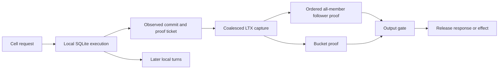

# celld architecture and Cellule performance decisions

Prioritize write latency and throughput parity. The pooled follower fixture and
paired host-admission fix passed the complete write audit, but the small-KV
Docker point still failed latency. The corrected audit still fails latency and selects maintenance/provider cost
for the next controlled experiment; attribute receiver authorization and
submission waits alongside it;
then qualify persistent authenticated transport and ordered shipping. On
durable disks, measure owner WAL and follower sync chains. Keep exact outcomes,
fencing, and recovery as release gates.

| Field | Value |
| --- | --- |
| Reviewed | 2026-10-05 |
| celld source | `f2bf648663a610eefde71f3547ad61e9b896b1f0`; also remote `main` when checked |
| Cellule source | `e07670e2348231ed401cc7280a47e3ab97596ffe` plus the current optimization worktree; latest audited write snapshot `80abeff288070673191d46346422852647b2f4f60c0c50638513ff02d298677c`; later `main` integration remains |
| Evidence type | Source inspection, user-reported celld measurements, and previously retained Cellule diagnostics |
| Result | Architecture decisions, proposed acceptance criteria and Cellule diagnostics; no qualified gain or matched celld result |
| Delivery plan | [Write performance design](write-performance-design.md), including the unchanged 2,000-Cell simultaneous node target |
| Implementation evidence | [Optimization record](../../cellule-app/performance/2026-10-05-write-optimization.md) |

## Reference measurements and their scope

The user reports approximately these rates on a separate laptop with an
8-vCPU / 16-GB environment, 1,000 Cells, KV values under about 100 bytes, and
local state on tmpfs. These are useful reference observations. The benchmark
commit, concurrency, key working set, bucket endpoint, latency distribution,
read/write overlap, and whether each rate is per owner or fleet aggregate are
not yet recorded. Do not invent those fields or treat these observations as a
controlled Cellule/celld comparison.

| celld posture | Reported writes/s | Reported reads/s |
| --- | ---: | ---: |
| Bucket durability | About 2,000 | About 50,000 |
| Fleet durability, three nodes | About 15,000 | About 30,000 |

The values alone do not identify the bottleneck. In particular, the lower
fleet read rate could involve concurrent writes, output-gate waits, placement,
replication work, or a different benchmark setup. Test those explanations
separately. A read-only warm run should not be assumed to incur a follower
append for every read.

For a provisional reproducible small-KV profile, use **96-byte values and
1,000 resident Cells**. This is a new declared profile, not a claim about the
exact original workload. Replace it with the actual workload when available,
then freeze both systems' manifests before comparison. Preserve the existing
**2,000 Cells, 1 KiB values, simultaneous 10,000 durable new writes/s and
50,000 point reads/s for 30 minutes** as a separate qualification.

At 15,000 writes/s, 96-byte logical values amount to only about 1.37 MiB/s.
That arithmetic does not include SQL pages, outcomes, indexes, LTX encoding,
replica copies, or publication. Small logical payloads can still cause large
page and metadata amplification. Record actual bytes per new command at every
boundary rather than estimating replication bandwidth from value size.

### tmpfs and the durability comparison

Tmpfs stores filesystem contents in virtual memory and discards them when
unmounted. File sync calls on that mount do not create a persistent disk copy.
A surviving follower can still preserve a write after another peer process
fails, but restarting the machines holding all unpublished copies loses that
tail. Swapping tmpfs pages does not turn them into a recoverable durable log.
[Linux tmpfs documentation](https://docs.kernel.org/filesystems/tmpfs.html)

Use three explicitly labelled storage experiments:

| Owner state | Selected follower logs | Meaning |
| --- | --- | --- |
| tmpfs | tmpfs | CPU/transport and process-failure diagnostic; not persistent fleet durability |
| tmpfs | Persistent volumes | External follower proof can be persistent; restart must recover before trusting owner-local state |
| Persistent volumes | Persistent volumes | Full durable-storage comparison, including owner WAL and follower barriers |

Record the bucket separately. A persistent bucket proof remains the bucket
boundary even when the owner's working files are volatile. An object service
whose own storage is tmpfs cannot supply a machine-restart durability test.
Three Docker containers on one VM also share its machine and storage failure
domain; their process-loss tests do not establish three independent machines.

## What celld does

The response boundary permits execution to get ahead of proof. The capture
ticket identifies which committed state must be made durable before output.

### Local execution and reads

Each Cell has a SQLite database. Storage calls execute synchronously while
the runtime holds the isolate turn; they do not dispatch each SQLite call
through a separate SQL worker channel. Isolates belong to a pool rather than
to permanent per-Cell threads. Async permits precede isolate entry so the
blocking isolate lock is uncontended. A shared multithreaded Tokio runtime
drives sockets and turns. This saves handoffs for small storage operations,
but a long synchronous operation can still occupy a runtime worker.
[celld storage](https://github.com/denoland/celld/blob/f2bf648663a610eefde71f3547ad61e9b896b1f0/crates/celld/storage.rs#L49),
[isolate pool](https://github.com/denoland/celld/blob/f2bf648663a610eefde71f3547ad61e9b896b1f0/crates/celld/pool.rs#L7)

Fixed KV get/put/delete statements use the connection's prepared-statement
cache. The storage layer also caches schema-cookie observations when its
change and preparation counters prove reuse safe. These mechanisms avoid
repeated SQL compilation and some metadata queries. They are concrete source
optimizations; their comments' historical lab rates are not this benchmark.
[KV statements and schema cookies](https://github.com/denoland/celld/blob/f2bf648663a610eefde71f3547ad61e9b896b1f0/crates/celld/storage.rs#L146)

Read responses pass an output gate. A reader that observes an unproven local
commit waits for a proof covering that observation; an already proven read
need not manufacture a new write. Error responses, streamed chunks, and
outbound effects also participate. Executing a read locally is therefore
different from releasing its result.
[celld output gate](https://github.com/denoland/celld/blob/f2bf648663a610eefde71f3547ad61e9b896b1f0/crates/logic/output_gate.rs#L77)

### Local writes and proof tickets

Steady-state SQLite uses WAL and `synchronous=NORMAL`, which avoids the
per-transaction WAL sync. Initialization temporarily uses `OFF` for its own
rebuildable schema before restoring `NORMAL`. The local SQLite commit is
not the external acknowledgement boundary. A response obtains a ticket and
waits until captured replication proves that ticket. Multiple already
committed writes on a Cell can be covered by one later capture/upload.
[SQLite posture](https://github.com/denoland/celld/blob/f2bf648663a610eefde71f3547ad61e9b896b1f0/crates/celld/storage.rs#L368),
[replication ticket state](https://github.com/denoland/celld/blob/f2bf648663a610eefde71f3547ad61e9b896b1f0/crates/celld/ltx_repl.rs#L720)

This does **not** mean celld eliminates every local sync. The examined LTX
writer syncs its captured temporary file before rename. Capture can combine
several SQL commits, so commits and captured files must be counted separately.
Do not infer a production lazy-sync path from a telemetry field's comment.
[LTX capture write](https://github.com/denoland/celld/blob/f2bf648663a610eefde71f3547ad61e9b896b1f0/crates/ltx/src/db.rs#L1514)

### Bucket proof

The background sync loop schedules independent per-Cell tasks within a shared
concurrency bound. Each task stages captured bytes while holding its replica
mutex, releases the mutex before bucket I/O, uploads, and credits only the
tickets captured. A busy Cell reschedules itself instead of making every
completion trigger a complete resident-Cell scan. Contiguous staged LTX rows
can be folded into one upload. Bucket acknowledgement additionally verifies
current ownership.
[sync loop](https://github.com/denoland/celld/blob/f2bf648663a610eefde71f3547ad61e9b896b1f0/crates/celld/ltx_repl.rs#L4274),
[staging and upload](https://github.com/denoland/celld/blob/f2bf648663a610eefde71f3547ad61e9b896b1f0/crates/celld/ltx_repl.rs#L3800),
[acknowledgement rule](https://github.com/denoland/celld/blob/f2bf648663a610eefde71f3547ad61e9b896b1f0/docs/guarantees.md#the-acknowledgement-rule-rpo0)

### Fleet proof and tiering

The shipping loop gathers dirty Cells, captures across up to eight blocking
workers, assigns ordered node-log sequences, and submits rounds without first
awaiting each round's receipt. Completed rounds apply in submission order;
failure prevents later rounds from releasing an unproven suffix. Per-member
lanes preserve append order, and all selected members must confirm a round.
[shipping loop](https://github.com/denoland/celld/blob/f2bf648663a610eefde71f3547ad61e9b896b1f0/crates/celld/ltx_repl.rs#L4530)

The default round pipeline is **four**. The default transport is HTTP using
a shared `reqwest::Client`; the ordered stream is opt-in with
`CELLD_LOG_TRANSPORT=stream`. `CELLD_LOG_WINDOW` defaults to zero, so its
special stream-window admission is also opt-in. Do not attribute the user's
15,000 writes/s to stream mode without the actual configuration. Four queued
rounds do not mean four concurrent durable disk commits in each ordered lane.
[peer client](https://github.com/denoland/celld/blob/f2bf648663a610eefde71f3547ad61e9b896b1f0/crates/celld/node_log.rs#L2462),
[transport and pipeline defaults](https://github.com/denoland/celld/blob/f2bf648663a610eefde71f3547ad61e9b896b1f0/crates/celld/node_log.rs#L5816)

The follower commits an accepted contiguous burst to a checksummed batch file
containing both entries and the resulting follower state. It syncs that file
and its directory, then updates its in-memory state. Covered files can be
collected after the durable base advances. Stream reception can gather several
requests into this one sync chain. This reduces barriers per received request,
but is a different persisted format from Cellule's appendable chunks.
[follower append batch](https://github.com/denoland/celld/blob/f2bf648663a610eefde71f3547ad61e9b896b1f0/crates/celld/node_log.rs#L1816)

With healthy fleet shipping, bucket upload is paced; the examined default
flush interval is **2,000 ms**. An active bundle sink combines dirty Cells'
captured entries into one node object per flush. Per-Cell materialization and
compaction still cost work later. Recovery and collection track bundle
coverage; this is not permission to delete an object referenced by another
Cell. Degraded fleet shipping restores bucket proof to the response path.
[flush default](https://github.com/denoland/celld/blob/f2bf648663a610eefde71f3547ad61e9b896b1f0/crates/celld/ltx_repl.rs#L1320),
[node bundle loop](https://github.com/denoland/celld/blob/f2bf648663a610eefde71f3547ad61e9b896b1f0/crates/celld/ltx_repl.rs#L4401)

Celld also renews a node lease and checks that authority for serving. Its
ownership model differs from Cellule's per-Cell progress/control renewals.
Copying the lease cadence alone would not copy its fencing protocol.
[node self-fencing](https://github.com/denoland/celld/blob/f2bf648663a610eefde71f3547ad61e9b896b1f0/docs/guarantees.md#self-fencing)

## Where Cellule currently pays more work

These are implementation differences, not measured percentage contributions.

| Boundary | Current Cellule path | Performance implication to test |
| --- | --- | --- |
| Owner commit | SQLite WAL `FULL` | A WAL sync can occupy one SQL shard and delay unrelated Cells on that shard |
| Same-Cell order | Next command and owner query require a durable logical head | Proof latency limits a hot Cell; many independent Cells can still overlap |
| Shipping | Collect up to 64 frames for up to 1 ms, then await the batch | Collection/loading cannot fully overlap outstanding batches |
| Qualification transport | Initial D2 fixture candidate retains one serialized signed TCP connection per member; receiver separately obtains enrollment for verification and authorization | Connection setup can be amortized; production mTLS and single-observation authorization remain outstanding |
| Warm follower | Tracked byte deltas, verified index, data sync; covered pruning can delete/recreate open file | Recounts are removed; remaining directory/data barriers and pruning merit attribution |
| Typed owner read | Client routing, runtime actor queue, bounded native FIFO, assigned SQL-worker admission, callback, and reply | R3 fixes submitter-dependent native handoff with caps and control progress preserved; its 2,000-Cell sparse Docker ramp passed 5,000/s and failed 10,000/s on refusals; a sustained gain is unqualified |
| Primitive SQL | Generic SQL retains scoped authorizers; fixed runtime/KV/deadline SQL now uses the bounded statement cache | Warm write reuse survives owner reads; generic SQL policy changes still force reprepare |
| Query protection | Separate read-only owner connection with `query_only` set once; fresh transaction per callback | Preserves the writer's prepared statements while keeping serialized owner order; generic SQL policy changes still expire that connection's statements |
| New command bookkeeping | Durable outcome, runtime metadata, capacity checks, schema-cookie capability reuse and minimum-deadline queries | Repeated schema scans are removed from unchanged-schema executor writes; required content checks remain |
| Publication | Exact immutable root plus fenced per-Cell CAS; existing follower-backed root coalescing | More dependency operations than celld's staged LTX PUT; basic coalescing already exists |
| Management | Per-Cell control renewal at a three-second cadence; resident scan every 100 ms | At 2,000 idle publishers the nominal renewal demand is about 667/s, before successful publication resets and scheduler effects |

Source map: [SQLite configuration and query boundary](../../cellule-ltx/src/db/mod.rs),
[executor](../src/cell/executor/mod.rs), [actor requests](../src/cell/actor/requests.rs),
[worker pool](../src/cell/worker/mod.rs), [worker execution](../src/cell/worker/run.rs),
[shipper](../src/node/log_shipper/mod.rs), [follower append](../src/follower/records/append.rs),
[SQL primitive](../src/primitives/sql/mod.rs), [KV primitive](../src/primitives/kv/mod.rs),
[deadline calculation](../src/fleet/scheduler.rs),
[renewal scheduling](../src/cell/actor/lifecycle/scheduling.rs),
[publisher](../src/publication/mod.rs),
[test transport](../../cellule-app/tests/process_follower.rs).

The executor now shares one schema-cookie capability observation between
capacity validation and scheduler summaries, recording it only after the
outer transaction commits. Unchanged-schema writes avoid both schema scans.
Five runtime deadline indexes and installed primitives' indexes are still
evaluated. Direct standalone scheduler/capacity helpers discover schema for
their own connection. These content checks protect retention, maintenance,
and capacity; caching capabilities does not cache their results. This is
initial R1 implementation, with no qualified gain yet.

Cellule's retained one-frame persistent-volume diagnostics observed data and
directory-sync intervals accounting for 89–96% of append wall time after warm
recounts were removed. Those intervals include syscall wait and descheduling.
They do not prove that physical disk latency dominates a tmpfs KV workload.
The Docker A/A controls failed repeatability, so the diagnostics establish
structural work and phase observations, not a qualified TPS gain.

## Recommended delivery order

Use the existing D0–D6 ownership and release gates. The additions below make
the read and small-KV work explicit. Targets are proposed engineering gates,
not predictions. Do not add the expected gains of separate packages.

| Priority | Deliverable | Measurement and proposed gate |
| --- | --- | --- |
| 0: D0 plus R0 | Matched small-KV manifests; read actor/worker timings; bounded independent evidence export | Existing five-pair A/A and <=3% telemetry overhead; no missing arrivals or evidence |
| 1: R1 | Cache fixed runtime/KV SQL and schema capability observations; reduce deadline-query preparation | >=20% lower median new-command worker CPU at a fixed common rate; retain all correctness and end-to-end gates |
| 2: D2 + D3 | Persistent authenticated transport and four-round ordered pipeline | Existing D2 connection/latency and D3 >=25% fleet-TPS gates; no greater memory bound or early suffix proof |
| 3: R2 | Stable protected owner-read/cache boundary, then attributed dispatch work | >=20% more sustainable owner reads/s; mixed-write p99 regression <=5%; unchanged read consistency |
| 4: D1 follow-up | Reuse fully covered open file; evaluate bounded receiver burst sync | Exact byte accounting, sync/fault matrix, and controlled persistent-volume comparisons |
| 5: D4 | Reduce measured immutable upload waves and bounded publication cadence cost | Existing root preparation, 30-minute debt, final coverage, and compaction gates |
| 6: M1 | Deadline-driven management scheduling and measured renewal contention reduction | Lower management CPU with no missed renewal or delayed fencing; record provider operations and loaded p99 |
| Separate decisions | External local-durability mode, execution ahead of proof, node bundles or node-scoped authority | Explicit protocol/format decisions and failure models before implementation |

### R0: attribute reads and remove benchmark interference

Record intended arrival, dispatch, actor enqueue/start, worker-permit wait,
worker dequeue/start, callback completion, and response release. Measure SQL
prepare/step and codec CPU, `query_only` work, queue occupancy per shard,
publication/renewal interference, and exporter duration. Existing command
timings cannot stand in for read timings. Use local monotonic clocks and do
not add phase quantiles to estimate an end-to-end quantile.

The owner-read diagnostic now requests sample export once per second through
a dedicated owner-process writer with one queued request, one executing flush,
and a 512 KiB stack reservation. Each window acknowledges drain and records
queue/flush duration, accepted/completed/refused requests, and final drain CPU.
A full queue fails the evidence gate. Existing 65,536-event trace bounds and
zero-loss checks remain. `CellTelemetry::query_completed` records actor wait,
assigned-worker admission and dequeue wait, native execution, reply wait, and
total at the single runtime reply attempt. Missing deadline phases stay absent;
disabled telemetry allocates no per-query trace. Phase timings include SQL and
codec work together; separate prepare/step/codec CPU and shard occupancy still
need attribution. The first attributed Docker rerun verified 2,000 Cells and
all 600,000 arrivals, but its measured 5,000/s point failed scheduled p99
(52.560 ms) and generator p99 (7.045 ms). Worker admission dominated the slowest
runtime queries; native execution p99 was 0.808 ms. See the
[R0 result](../../cellule-app/performance/2026-10-05-write-optimization.md#r0-docker-owner-read-result).
The slot-traced follow-up audited 2.7 million arrivals, passed the measured
5,000/s and 10,000/s sparse read gates, and failed 25,000/s (143.946 ms p99,
77,362 client-full arrivals). Its selected slowest queries spent 64.33% of
their runtime in actor waiting. Recorded blockers of admission were other
queries; no reserved background-work blocker appeared in that selected tail.
See the [slot result](../../cellule-app/performance/2026-10-05-write-optimization.md#sql-slot-docker-result)
for correlated spans and limits. The differing 5,000/s outcomes are not a
controlled gain measurement.
These changes have no qualified throughput result yet.
Isolate the driver from the owner for final
capacity runs, and also record an in-process path to attribute application
ingress overhead. Compare instrumented and no-op runs before taking a baseline.

### R1: reduce SQL work without changing semantics

Initial implementation now caches fixed runtime, KV and deadline SQL using
the connection's existing 16-entry statement cache. A fixed-size capability
cache follows the executor and checks `main.schema_version` after handler
execution. Bootstrap, commands, effects and migrations credit observations
only after successful outer commit, so rolled-back DDL cannot poison a later
transaction that reuses its cookie. See the
[implementation record](../../cellule-app/performance/2026-10-05-write-optimization.md#r1-schema-and-fixed-statement-reuse).
CPU and sustainable-throughput gates remain outstanding.

First cache constant internal and KV statements per connection, with a bounded
cache. Keep request identity, atomic `sys_requests` outcome, sequence updates,
KV version/expiry checks, and scheduler/capacity results. At 96-byte values,
those required semantics can dominate payload work. Include equivalent
deduplication and audit work in the celld application; report its bare KV rate
separately if it lacks those contracts.

Discover scheduler/capacity table capabilities at bootstrap/restore and
invalidate on successful migration or any supported schema change. Initially
continue evaluating all required deadline indexes, using cached statements.
Evaluate a single prepared minimum query only if profiling still shows query
dispatch cost; it can reduce compilations without reducing the underlying
index probes. Incremental deadline state is a later design: every insertion,
expiry, lease update, rollback, and deletion of the current minimum must
invalidate or update it in the same transaction.

Cache lifetime is part of this change. The workspace bundles SQLite 3.49.1
through `libsqlite3-sys` 0.32.0. Its flag-pragma implementation emits statement
expiry when changing `query_only`; installing a non-null authorizer also
expires prepared statements. In the earlier single-connection path, an
intervening owner query undid writer reuse even for constant internal SQL.
R2 now isolates owner reads on a protected connection; generic SQL policy
changes still expire statements on the connection they use. Record both explicit
prepare and SQLite reprepare counts; a cache hit is not proof of saved parsing.
[SQLite flag pragmas](https://github.com/sqlite/sqlite/blob/version-3.49.1/src/pragma.c),
[authorizer installation](https://github.com/sqlite/sqlite/blob/version-3.49.1/src/auth.c#L67),
[workspace dependency pin](../../../Cargo.lock)

Arbitrary author SQL needs additional care. SQLite authorizes during
preparation, including schema reprepare. A cache entry compiled under a
broader policy must not authorize a later restricted operation. Begin with
known internal/primitive SQL and measure reuse across mixed reads/writes;
retain the current generic SQL path until a policy-aware cache design covers
schema changes, protected tables, triggers, read-only mode, and step-time
reprepare. Keep generic SQL policy invalidation even when internal statements
have a stable cache lifetime.
[SQLite authorizer contract](https://www.sqlite.org/c3ref/set_authorizer.html)

### D2/D3: separate collection from ordered durability completion

Use one application-owned persistent mTLS client and bounded member queues.
Reuse one fresh receiver enrollment observation for signature verification
and append authorization. Retain freshness checks per admitted append;
connection reuse is not cached authority. The optional HTTP adapter already
has pooled request/TLS machinery, but that does not establish a node-log
adapter or ordered stream contract.

Start with the existing proposed four-round window, serial ordering within
each member, and contiguous all-selected-member proof advancement. Overlap
collection, frame loading, and independent member work. A window does not
divide a serial member's disk-sync time by four. Measure fill, queue wait,
active bytes, and each member's slowest contribution.

Receiver burst sync is a separate follow-up to this pipeline. It may gather
already authorized contiguous requests within existing frame/byte limits,
append once, sync once, and answer each request only for the verified durable
prefix covering it. Start by comparing no added wait against a bounded 1 ms
collection window in qualification builds. Test an invalid middle request,
lost receipt, duplicate, deadline, seal, cancellation, and partial write.
Preserve accounting for copies and every outstanding caller. Do not count a
single burst as one application transaction or silently expand batch limits.

### R2: optimize the proven owner-read path first

Use owner reads for the 2,000-Cell primary target. The current immutable view
reservation is 12 MiB per view; 2,000 such reservations exceed 16 GiB before
other node costs. Raising memory limits or serving older roots cannot satisfy
the same primary contract.

The initial implementation opens a read-only owner connection on the **same
SQL shard**, with a bounded cache and `query_only` set once. It retains actor
order and the durable-head gate. Each callback starts a fresh transaction,
performs the existing sequence and identity checks, and ends the snapshot
before returning. It does not toggle the writer's `query_only` state, reuse
the capture guard's snapshot, or bypass the sparse VFS. This is still serialized
owner execution. The initial mixed KV regression observes no further writer
table-statement compilation after a read between warm writes; this establishes
cache lifetime, not a throughput gain.

Four managed connections charge 256 KiB of page-cache targets per Cell, and
active-Cell admission now reserves 160 KiB native memory, including the four
8 KiB lookaside arenas, and eleven descriptors. The original R2 probe below
used the 128 KiB native allowance before lookaside integration.
The added reader adds 125 MiB of page-cache targets at 2,000 Cells. Its Linux
population probe observed about 671 MiB process RSS, 972 MiB cgroup memory,
and ten SQLite descriptors per Cell, with complete drain. Nonempty RSS
marginals exceeded the former 64 KiB native charge plus cache targets, so the
native reservation was increased to 128 KiB. The R0 rerun verified that charge
with all 2,000 Cells and sparse timed reads; full-dataset, mixed-load and
platform-specific resource qualification remain outstanding. Both SQL
connections are covered by the managed interrupt handle. The earlier
eight-descriptor population result describes the old connection count.
A stable authorizer policy is still required: internal KV helpers and arbitrary
SQL have different protected-table permissions. Generic SQL keeps its current
scoped authorizer and preparation path. Require mixed traffic to preserve
statements except for declared schema/policy invalidation, while wrong-policy
reuse and writes through the read handle fail. See the
[R2 implementation record](../../cellule-app/performance/2026-10-05-write-optimization.md#r2-owner-read-connection)
for verification and resource evidence.

R0 found worker admission and actor waiting in the tail, with modest shard
load imbalance and low native-query execution time. Pool-local slot tracing
now records finite job-kind/shard fields, request, acquisition, worker entry
and release, with each query linked to its reservation. The audit partitions
tail-query admission by overlapping recorded holders and gaps. It includes
reserved hydration/inventory work; snapshot reservations have no native span.
Release observers run after freeing the permit and accounting reservation.
Gaps include async resumption, admission bookkeeping and exempt messages;
they do not prove worker idleness. Verification and the traced Docker run
passed their correctness audits. At the failed 25,000/s point, 74.17% of
selected-tail admission overlapped recorded query holders; 25.83% had no
recorded holder. Actor waiting dominated total tail time, so separate global
ingress, per-Cell work/renewal coordination and task-start delay before
choosing a dispatch change. Native CPU and renewal overlap remain to
attribute. Run a
controlled no-op/instrumented comparison and isolate the generator before
inferring a throughput limit from the shared-host result.

If those observations confirm scheduler/handoff cost, let a SQL shard drain a bounded set of
already admitted jobs per wake, preserving per-Cell order and checking each
deadline before SQLite starts. Compare 1/4/8-job limits with no intentional
delay; charge every queued job and retain shutdown ownership. The current
single worker-job permit per shard must be addressed explicitly: pulling
from its channel alone cannot create batching of admitted user jobs. Keep
one writer and prevent long callbacks from starving other Cells. Keep active
native jobs within the existing worker count, preserve idle-slot borrowing by
immutable reads, and retain current aggregate admitted-byte bounds. Verify
queued expiry, running interruption, cancellation, Cell fencing and complete
shutdown drain before measuring the existing R2 gates: at least 20% more
sustainable reads with mixed-write p99 regression at most 5%, unchanged
receipts, and complete evidence. This candidate is not implemented or qualified.

If mixed writes cause head-of-line blocking at WAL sync, first evaluate the
write-side changes below. Parallel read connections require an explicit
snapshot and observed-sequence protocol: validate ownership generation and
the minimum receipt, run against a pinned snapshot, then release only when
the observation is proven. Do not redirect current owner reads to a stale
published root. Keep generic callbacks protected; removing `query_only` needs
a replacement enforced read-only boundary.

Avoid a general value cache initially. SQL statement reuse has a smaller
coherence surface. A later value cache must bind Cell/incarnation/generation,
proven sequence, key, and TTL; invalidate on mutations, migration, fencing,
and takeover, and charge its memory. It cannot become recovery authority.

### Owner WAL durability: a separate high-value decision

On persistent storage, `FULL` can occupy a fixed SQL shard during each commit.
For illustration, eight workers spending 1 ms per write in a serialized sync
have at most 8,000 such writes/s before other work; this is arithmetic, not a
measured Cellule limit. The same stall also affects reads sharing that shard.
Tmpfs substantially changes that experiment.

An **externally durable local mode** could eventually use WAL `NORMAL` while
success still requires the existing exact bucket root or all-selected durable
follower proof. This is a promising candidate for removing duplicate owner
durability work, not an immediate pragma change. Keep `FULL` as the current
default and preserve the original D0–D4 scope. SQLite documents that WAL
`NORMAL` can lose local commits after machine/power loss, whereas `FULL`
adds the commit barrier.
[SQLite synchronous modes](https://www.sqlite.org/pragma.html#pragma_synchronous)

The decision must make local files disposable after uncertain restart;
recover the authority-pinned root and certified follower tail before serving;
retain exact outcomes/captures until external proof; handle fallback, failed
capture, checkpoints, fencing, and shutdown; and qualify complete loss of
owner-local state. A tmpfs follower cannot supply the persistent proof for
this mode. Test power-loss semantics in the storage failure model and on
persistent systems; Docker process kills alone are insufficient.

### D5: distinguish hot Cells from many Cells

At 1,000 uniformly accessed Cells, 15,000 writes/s averages 15 writes/Cell/s.
The 2,000-Cell node target averages five writes/Cell/s. A hot-Cell proof gate
can therefore matter much less than shared SQL/transport/management work.
Measure the 1/16/64/1,000/2,000-Cell curves before changing that gate.

If proof serialization dominates, model separate executed, proven, and
published heads with `published <= proven <= executed`. Execute strictly in
Cell order, retain bounded exact outcomes and captures for the unproven
suffix, and release responses/reads/effects only through the same proof gate.
An error does not reveal an unproven value. A later successful batch cannot
acknowledge around a failed earlier prefix. The suffix must resolve safely
through object fallback, recovery, duplicate retry, migration, and drain.
This follows the existing D5 decision requirement; it is not delivered here.

### D4/M1: keep publication and management bounded

Celld's node bundles explain an architectural opportunity, but Cellule's
exact roots and authority-pinned references are compatibility contracts.
First overlap independent uploads within current bounds, retain existing
root coalescing, and measure requests and bytes through final materialization
and compaction. Publication pacing must stay within the existing five-second
oldest-debt and 30-second final-drain gates. It must switch appropriately when
object proof becomes the response boundary.

A node-bundle implementation requires a separate format/recovery design for
per-Cell references, object ranges, checksums, complete reference sets,
quiesced deletion, and grace boundaries. Combining body PUTs does not
automatically remove per-Cell authority CAS or future drain operations.

Replace repeated resident scans with a bounded deadline structure only if
measured CPU justifies it. Generation-tagged entries must be removed or
replaced on renewal, publication, fencing, release, and migration; do not
accumulate stale heap entries. Smooth existing renewal dispatch within safe
deadlines and isolate its provider admission from proof-critical work.
Replacing per-Cell progress with node-scoped authority is a protocol change,
not a longer renewal interval or a removal of fencing checks.

## Qualification and success criteria

Use the existing [all-arrival, SLO, and debt gates](write-performance-design.md#schedule-and-acceptance)
and [fault gates](write-performance-design.md#failure-qualification)
without relaxing them. Freeze additional small-KV scenarios before running:

| Dimension | Required experiments |
| --- | --- |
| Population/payload | 1,000 Cells / declared 96-byte value reference; unchanged 2,000 Cells / 1 KiB node target; actual user workload when available |
| Traffic | Reads only, writes only, then simultaneous load; uniform and single-hot separately |
| Read contract | Durable owner reads with identical minimum-receipt behavior; published-root reads separately labelled |
| Topology | One measured 8-vCPU / 16-GiB owner and two followers; also three co-resident owner/follower nodes matching celld, with per-node and aggregate rates |
| Storage | tmpfs diagnostic, tmpfs owner with persistent followers, persistent owner/followers; bucket mount/backend recorded |
| Transport | Pooled HTTP and opt-in celld stream separately; compare against the faster qualified celld configuration with equivalent deployment security |
| Semantics | Unique command ID and equivalent atomic outcome/audit work; raw KV-only celld ceiling separately if unmatched |
| Evidence | All arrivals, failures, unique new successes, scheduled/service latency, CPU, queues, syncs, bytes, publication/debt, exact readback and recovery |

Provisional **25%-above-reference arithmetic** is 18,750 fleet writes/s versus
the reported 15,000, and 2,500 bucket writes/s versus 2,000. For read engineering
headroom, 62,500 versus 50,000 and 37,500 versus 30,000 are useful test points.
These numbers are not qualified comparative targets until workload, SLO,
topology, durability, and counting units match. The existing comparative win
requires five paired sustainable-rate ratios against measured celld evidence.

The primary objective remains one owner sustaining **10,000 new durable
writes/s plus 50,000 point reads/s, together, across 2,000 resident Cells**.
At 80% utilization, eight CPUs provide about 107 microseconds of CPU per
action at 60,000 actions/s. If all 60,000 pass one serial runtime dispatch
lane, that lane has about 16.7 microseconds wall time per action before its
other responsibilities. These bounds motivate attribution; neither implies
that actor dispatch or CPU is the measured bottleneck.

Required failures include owner loss before/after each proof boundary,
follower sync failure, missing or corrupt tail, full tmpfs/volume, bucket
outage and fallback, withdrawal/expiry on a reused connection, late or
reordered receipts, interrupted prune/rotation, migration, cancellation, and
shutdown. Audit every acknowledged command, not only each key's final value.
Sustained load must cross checkpoint, compaction, pruning, and outcome
retention boundaries rather than merely fill memory with deferred work.

## Decision

For the reported small tmpfs workload, start with **R0/R1 and D2/D3**, then
choose R2 from read attribution. For persistent disks, add the owner WAL
durability decision and complete covered-file reuse/sync batching. Continue
D4 and management work to make the result sustainable at 2,000 Cells.

Replacing the follower log with RocksDB is not the leading recommendation.
RocksDB synchronous WAL writes still require a sync; group commit and log
reuse reduce barriers and metadata work, which Cellule can evaluate in its
existing log. RocksDB would additionally introduce an engine and its
maintenance costs without fixing Cellule's actor handoffs, SQL preparation,
proof serialization, or authority/publication work.
[RocksDB WAL performance](https://github.com/facebook/rocksdb/wiki/WAL-Performance)

This review changes implementation priorities and adds measurable read/KV
deliverables. It does not establish a qualified gain, complete D0–D6, or prove
that Cellule surpasses celld. The retained Docker controls and primary
simultaneous node qualification remain open.
