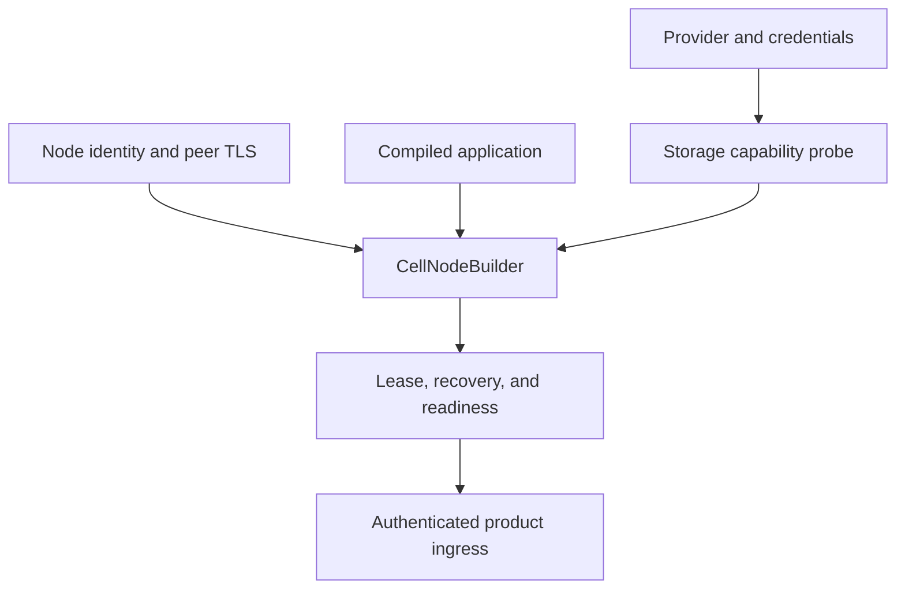
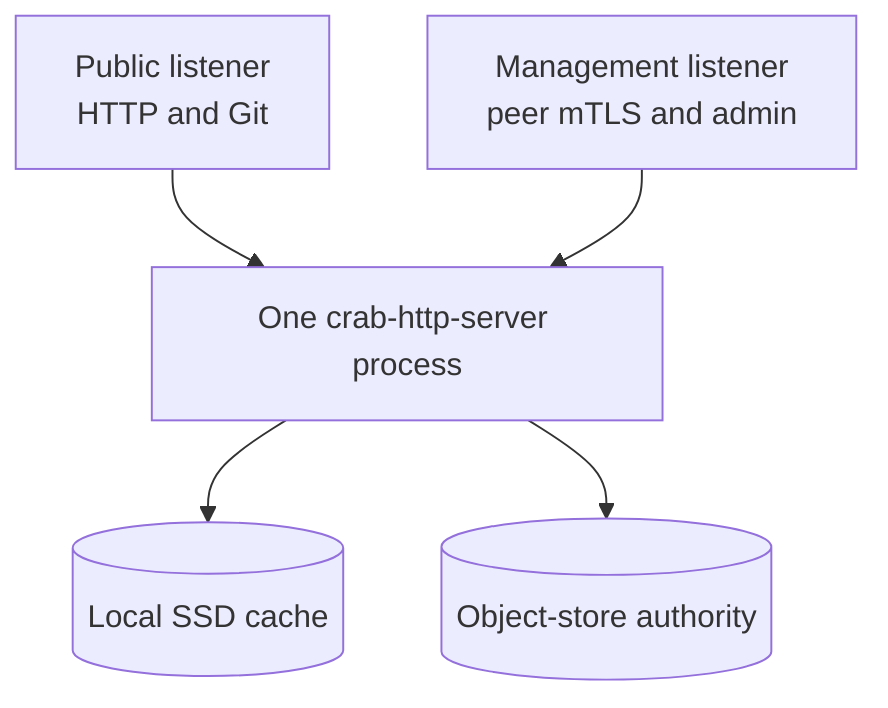
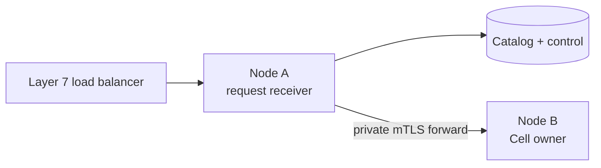
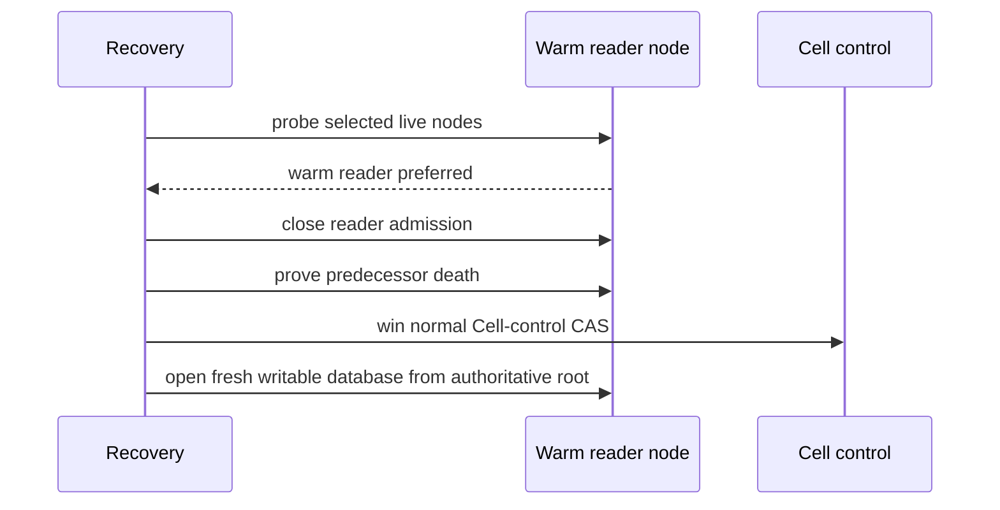
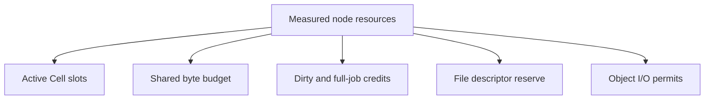
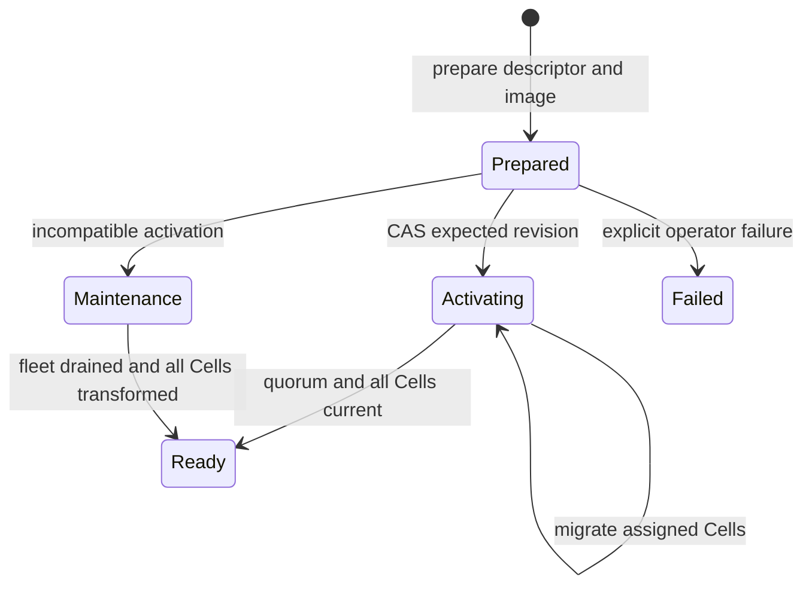
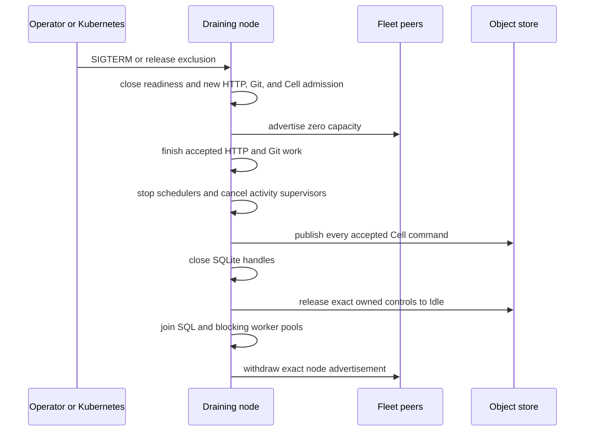

# Embed and operate Cellule

Embed the runtime in one process per node, then operate the fleet: ownership
boundaries, node sizing, release activation, Kubernetes topology, drain, backup,
cutover, and observation.

| Field | Value |
| --- | --- |
| Content type | How-to and operations reference |
| Audience | Operators and release engineers |
| Goal | Configure, size, roll out, drain, restore, and observe a Cell fleet |
| Status | Historical operations reference: framework mechanics remain current; `crab-http-server` routes and deployment examples are historical |

## Contents

- [Overview](#overview)
- [Configure one process per node](#configure-one-process-per-node)
- [Route through any healthy node](#route-through-any-healthy-node)
- [Serve reads from admitted replicas](#replica-reads)
- [Advertise node health and capacity](#advertise-node-health-and-capacity)
- [Size node profiles and admission](#size-node-profiles-and-admission)
- [Build one canonical release](#build-one-canonical-release)
- [Activate compatible releases](#activate-compatible-releases)
- [Use maintenance for incompatible changes](#maintenance-for-incompatible-changes)
- [Deploy on Kubernetes](#deploy-on-kubernetes)
- [Drain without split ownership](#drain-without-split-ownership)
- [Back up immutable roots and release metadata](#back-up-immutable-roots)
- [Apply the repository hard cut](#repository-hard-cut)
- [Monitor the fleet](#monitor-the-fleet)
- [See also](#see-also)

<a id="overview"></a>
## Overview

The service owns providers, authentication, ingress, tenant authorization,
secrets, and deployment. Cellule owns reusable execution and node lifecycle.



| Before readiness | Owner |
| --- | --- |
| Validate conditional writes and ranged reads | Application with `cellule-store` probe. |
| Freeze application descriptor and compatible release | `cellule-app` and service. |
| Install authority, follower store, node log, limits, and peer transport | Service through `cellule-host`. |
| Recover pinned state and acquire lease | Runtime and host. |
| Advertise endpoint and capacity | Host and service. |

Fleet shape:

- **Any entry node.** A request may enter any healthy node; the client dispatches
  locally when this node owns the Cell, otherwise through an authenticated peer.
- **One process per node.** Run one `crab-http-server` process per Kubernetes Pod
  or virtual machine.
- **Shared origin.** Nodes share one object-store origin, forward private requests
  over mutual TLS (mTLS), and advertise release and capacity state in the origin.
- **Graceful shutdown.** Shutdown stops admission first, drains accepted work
  while maintaining coverage, then withdraws the node session.

Configuration is an application contract. Cellule does not provide a
Kubernetes chart or product HTTP routes. See [host lifecycle](../../cellule-host/docs/lifecycle.md),
[peer security](../../cellule-peer-http/docs/security.md), and the
[workspace framework integration guide](../../../docs/framework.md).

<a id="configure-one-process-per-node"></a>
## Configure one process per node

The existing HTTP server owns Cell runtime construction. Configuration supplies the authoritative object store, local volume, public listener, management listener, and peer identity.

The deployment enables follower fsync as one response-durability proof:

- Creates the local follower store.
- Exposes authenticated append/seal/tail handling on the private mTLS listener.
- Starts recovery-only before serving public traffic.

Object-root publication remains a valid alternative proof, and all recovery
still goes through the existing claim, witness, pin, control-CAS, and
fresh-database activation gates described in
[Follower durability and warm failover](failover-and-followers.md).



Startup fails before readiness when any required boundary is invalid:

- Object storage cannot prove strict create and conditional update behavior
- Root identity differs from configured tenant or application
- Compiled registry differs from the selected release descriptor
- Local memory, disk, or file-descriptor floor is unavailable
- Peer certificate, fleet, release, or node advertisement is invalid
- The first complete scheduler scan has not finished

The server doesn't open a second public primitive listener.

<a id="route-through-any-healthy-node"></a>
## Route through any healthy node

The external load balancer doesn't need Cell affinity. Any node can receive a public request.



The receiving node resolves the exact owner from `control.json` and its signed live advertisement. It dispatches locally when it owns the Cell, otherwise it forwards once.

A stale endpoint retry is allowed only when the first attempt definitely did not start. An ambiguous mutation returns evidence for `Resolve`.

<a id="replica-reads"></a>
## Serve reads from admitted replicas

Owner queries remain the default. In object durability mode, the server
reconciles a desired-reader policy and serves explicit authenticated reads from
admitted, verified snapshots.

This is local implementation evidence for
[Plan 036](https://github.com/crabbuild/crab/blob/beb439039cb37e750afe6625a2358101c70d1191/advisor-plans/036-cell-read-replicas-and-fenced-promotion.md),
not a qualified production deployment.

- The issue-detail route is the first public product consumer.
- Fleet-only acknowledgements do not provide the plan's all-secondary-loss guarantee.

### Set the desired reader count

An administrator sets a repository Cell's desired read-replica count with
`PUT /api/repos/{owner}/{name}/settings/read-replicas`.

| Operation | Request | Result |
| --- | --- | --- |
| First policy | `PUT` with `{"expected_revision":0,"desired_readers":1}` | The S3 policy CAS completes; the update's `convergence` field is `pending`. |
| Later change | `PUT` with the returned revision | Same contract; a stale revision returns HTTP 409. |
| Read the target | `GET` on the same path | Current target and revision, plus probe results. |

`GET` probes the selected nodes and reports selected, proven-ready, and
unverified reader counts plus the lowest proven sequence. A selected-node count
below the target is a placement `shortfall`.

| Probe limit | Value |
| --- | --- |
| Concurrency | At most 16 concurrent requests |
| Budget | Five seconds |
| Failed or timed-out probes | Remain unverified |
| View activation | Never; probes do not activate views |

The server sends an authenticated owner hint after the CAS and also reconciles
owned Cells periodically. This API is available only in the object durability
profile.

### Read issue detail from a replica

`GET /api/repos/{owner}/{name}/issues/{number}?read=replica` selects an admitted
reader and returns headers naming the serving node and the issue query's observed
position:

| Header | Meaning |
| --- | --- |
| `x-crab-cell-reader` | Serving node. |
| `x-crab-cell-incarnation` | Cell incarnation. |
| `x-crab-cell-sequence` | The issue query's observed position. |

Supply both `after_incarnation` (32 lowercase hex digits) and `after_sequence` on
a later replica request to require at least that position.

| Outcome | Response |
| --- | --- |
| Reader behind the requested position | `replica_behind` (409) |
| No reader can serve | `replica_unavailable` (503) |
| Owner fallback | Never; the route never runs the issue query on the owner |

The default issue route still reads from the owner. Issue and label metadata use
one typed query against the same snapshot; assignee metadata comes from the
authorized repository configuration.

### Take over a warm reader

After the owner session expires, verified snapshots remain warm but cannot answer
queries. Recovery probes the selected live nodes and prefers a warm reader, after
any mandatory durability-log successor.



The destination never turns a read-only connection into a writer. A missing warm
reader only removes the placement preference; the existing cold recovery path
retains every session, old-log, and authority gate.

<a id="advertise-node-health-and-capacity"></a>
## Advertise node health and capacity

Each node publishes a signed advertisement every three seconds. The record binds:

- Fleet and session IDs
- Certificate subject public key info
- Image and release digests
- Compiled registry inventory
- Publicly routable peer endpoint
- Free memory, disk, and job credits
- Scheduler progress

The service chooses each signed advertisement lifetime, up to 30 seconds. An expired node or one advertising zero capacity leaves rendezvous assignment until it reports progress and capacity again.

Local admission remains authoritative. An advertisement cannot force a node to accept work after its measured budget is exhausted.

<a id="size-node-profiles-and-admission"></a>
## Size node profiles and admission

The runtime derives active-Cell limits from measured resources. Profile names are operator guidance, not fixed performance claims.

| Profile | vCPU | Memory | Local SSD | Intended use |
| --- | ---: | ---: | ---: | --- |
| Small | 1 to 2 | 2 to 4 GiB | 50 to 100 GB | Development and low-traffic fleets |
| Medium | 4 to 8 | 8 to 16 GiB | 100 to 200 GB | General production nodes |
| Large | 16 | 32 to 64 GiB | 500 GB to 1 TB | Dense ownership and high aggregate throughput |

Startup rejects less than 2 GiB memory or 20 GiB usable disk.

Resource admission accounts these consumers:



Each open `Db` charges:

- Three SQLite connection page caches at 64 KiB each
- Eight file descriptors
- Runtime actor and mailbox bytes
- Sparse-page cache allowance
- Native handler allowance

The shared byte budget covers SQLite files, WAL, retained LTX, sparse pages, and
Git/LFS/Release staging. Full restore and compaction use a separate weighted
scratch budget. After admission, the server remeasures actual free space against
both budgets and the node reserve before any remote body download.

Large jobs:

- Reserve two database sizes plus 64 MiB scratch and 64 MiB memory.
- Cap concurrency at the smaller of vCPU count and two, then apply byte admission.

The 1,000 to 10,000 open-Cell and 1,000 command/s aggregate targets require
[capacity qualification](delivery.md#capacity-qualification). A profile does not
guarantee either number before measurement.

<a id="build-one-canonical-release"></a>
## Build one canonical release

The deployable unit is the complete `crab-http-server` image.

```text
Rust modules + migrations + Cargo.lock + React assets
                         |
                         v
              crab-http-server image
                         |
                         v
             canonical registry descriptor
```

The descriptor includes:

| Field | Contract |
| --- | --- |
| `version` | Integer `1` |
| `runtime` | `crab-http-server` |
| `peer_versions` | Sorted unique versions; V1 supports `1` |
| `modules` | At most 128 canonical module entries |
| `namespaces` | At most 128 stable namespace entries |
| `build` | Source revision and `Cargo.lock` digest |

The descriptor has a 256 KiB limit. Its BLAKE3 digest identifies the compiled release. The operator records the OCI image SHA-256 digest in release state.

<a id="activate-compatible-releases"></a>
## Activate compatible releases

The administrative commands operate through the existing server binary:

```text
crab-http-server --config config.toml cells release inspect --json
crab-http-server --config config.toml cells capacity --json --live
crab-http-server --config config.toml cells release bootstrap --image sha256:1234567890
crab-http-server --config config.toml cells release prepare \
  --expected-revision 7 --image sha256:1234567890
crab-http-server --config config.toml cells release activate \
  --expected-revision 8 --strategy compatible \
  --minimum-eligible-nodes 3
crab-http-server --config config.toml cells release status
crab-http-server --config config.toml cells status --owner team --name repository
```

The repository status command reads the durable control object without opening
the Cell or changing ownership. Use its versioned JSON to map a serving endpoint
to a fleet member during takeover qualification.

The capacity command with `--live` reads the startup envelope retained by the
running server:

- Process memory limit, free local disk, and file descriptor limit
- The configured local-disk limit
- CPU-derived job credits
- The resulting admission budgets

`disk_capacity_bytes` is the smaller of that limit and the backing filesystem
total. The limit is Crab's admission ceiling and, in the Helm deployment, the
same byte count configures `emptyDir.sizeLimit`.

Without `--live`, the command calculates a preflight envelope for its
short-lived process instead. Neither mode claims a throughput result. Capture
the live report before every capacity run and compare it with the node-wide
gauges during the workload.

```json
{
  "version": 1,
  "resources": {
    "memory_bytes": 2147483648,
    "disk_limit_bytes": 64424509440,
    "disk_capacity_bytes": 64424509440,
    "free_disk_bytes": 53687091200,
    "available_file_descriptors": 1048570,
    "job_credits": 2
  },
  "admission": {
    "active_cells": 2457,
    "retained_bytes": 80530636,
    "blocking_jobs": 2,
    "dirty_jobs": 2,
    "recovery_jobs": 2,
    "scratch_bytes": 14316208128,
    "local_disk_bytes": 28632416256,
    "disk_reserve_bytes": 10737418240
  },
  "reservations": {
    "active_cell_page_cache_bytes": 196608,
    "active_cell_native_bytes": 65536,
    "active_cell_file_descriptors": 8,
    "dirty_job_memory_bytes": 67108864,
    "maximum_recovery_jobs": 2
  }
}
```

Compatible activation follows this state machine:



Before `Ready`, activation verifies:

1. Candidate descriptor bytes equal the running binary
2. The requested number of eligible nodes advertises the exact release
3. Every catalog shard remains revision-stable during the scan
4. Every non-tombstoned Cell uses current code and maximum schema
5. The eligible-node quorum still holds immediately before the final CAS

Prepare never changes the current release.

<a id="maintenance-for-incompatible-changes"></a>
## Use maintenance for incompatible changes

Maintenance activation stops normal serving, drains the fleet, and runs one signed zero-capacity maintenance executor.

The executor owns one SQL worker and one active-Cell slot. It walks the catalog sequentially through the same exact-root migration path used by normal nodes.

Before final `Ready`, it checks persisted work that may reference removed behavior:

- `sys_requests`
- `sys_inbox`
- `sys_effects`
- Queue messages and producer dedup rows
- Workflow runs
- Blob objects
- Cron schedules

Any matching row keeps the release in maintenance. The runtime doesn't guess payload compatibility. Operators must drain retention or compile a purpose-built transform.

The same fence can reclaim unreachable immutable Cell objects after migration:

```bash
crab-http-server --config config.toml cells release activate \
  --expected-revision 8 \
  --strategy maintenance \
  --retention-grace-hours 168 \
  --retention-max-deletes 10000
```

Omit both retention flags to run migration only. `--retention-max-deletes`
requires a nonzero grace and accepts 1 through 100,000; omitting the limit while
supplying a grace uses 10,000. The grace is measured from each object's provider
modification time.

Collection runs only after the executor proves it is the sole advertised
session and every current control is unowned. It then:

- Verifies live controls and all retained backup pins into a disk-backed mark set
  before streaming the object inventory.
- Skips unknown layouts.
- Records listed, candidate, reachable, grace, eligible, and deleted counts in
  the structured completion log.

Deletion bounds:

- If eligible objects exceed the selected deletion bound, the command returns an
  incomplete-retention error and deliberately leaves the release in `Maintenance`.
- Repeat the identical activation command and expected revision; the operation
  re-marks authority before deleting the next bounded batch.
- Each retry selects the same next unused session identity as competing
  executors; conditional creation admits only one.
- It advances past permanently retired identities and never revives a withdrawn
  session.
- After advertising, it checks the exact maintenance release again before opening
  any Cell.
- The executor closes its runtime through its owning `CellNode` before collecting
  objects; final host cleanup is idempotent.

Start the fleet only after the activation returns a `Ready` release.

<a id="deploy-on-kubernetes"></a>
## Deploy on Kubernetes

Use a `Deployment` for stateless process identity and a per-Pod local volume for cache data. Object storage remains authoritative.

```yaml
apiVersion: apps/v1
kind: Deployment
metadata:
  name: crab-http-server
spec:
  replicas: 3
  template:
    spec:
      terminationGracePeriodSeconds: 180
      containers:
        - name: crab
          image: registry.example/crab@sha256:1234567890
          args:
            - --config
            - /etc/crab/server.toml
            - --peer-advertise-host
            - $(CRAB_POD_IP)
          readinessProbe:
            exec:
              command: [crab-http-server, --config, /etc/crab/server.toml, healthcheck]
          volumeMounts:
            - { name: cell-cache, mountPath: /var/lib/crab }
```

The snippet shows topology, not a complete production manifest. The shipped
chart adds:

- A Downward API Pod IP and a stable peer TLS server name
- Peer Secret mounts
- Exec readiness and TCP liveness
- A three-replica floor and PDB `minAvailable: 2`
- Same-selector management ingress

Supply object-store identity, resource requests, edge ingress, and
provider-specific placement through the deployment environment.

Readiness requires:

- Runtime startup completed
- Release permits this compiled registry
- Node advertisement is live
- First scheduler pass completed
- Terminal drain has not started

Liveness should report process health, not temporary capacity exhaustion.

<a id="drain-without-split-ownership"></a>
## Drain without split ownership

On SIGTERM or release exclusion, the server:

1. Closes readiness and new HTTP, Git, and Cell admission
2. Advertises zero capacity while draining
3. Finishes accepted HTTP and Git work
4. Stops schedulers and cooperatively cancels activity supervisors
5. Publishes every accepted Cell command
6. Closes SQLite handles
7. Releases exact owned controls to `Idle`
8. Joins SQL and blocking worker pools
9. Withdraws its exact node advertisement



Set the Kubernetes grace period above the server's bounded drain budget. A forced
kill remains recoverable through stale-owner takeover, but it increases
unavailable time.

Drain ordering against reader admission:

- On shutdown, the host cancels work producers and closes reader admission, then
  drains accepted runtime work and seals the covered node log.
- This includes admitted replica SQL and snapshot-open jobs whose callers were
  cancelled.
- Heartbeat maintenance remains live through that barrier.
- Session withdrawal follows runtime drain; withdrawing earlier fences the log
  authority and prevents a clean fleet-to-object transition.
- Every phase uses the same absolute shutdown deadline.
- A failed drain must not authorize a durability-mode change.

<a id="back-up-immutable-roots"></a>
## Back up immutable roots and release metadata

A backup records object-store data, not local cache volumes.

Include:

- Root identity
- Release records and immutable descriptors
- Catalog heads and immutable pages
- Cell control records
- Every immutable object reachable from pinned roots
- Node-independent application configuration needed to recreate the fleet

Backup traversal pins its start revisions and strict-creates the pin only after
every referenced object verifies. Restore verifies that pin before copying.

Create a nonzero 16-byte pin ID and verify it independently:

```bash
crab-http-server --config /etc/crab/server.toml cells backup create \
  --pin 11112222333344445555666677778888
crab-http-server --config /etc/crab/server.toml cells backup verify \
  --pin 11112222333344445555666677778888
crab-http-server --config /etc/crab/server.toml cells backup restore \
  --pin 11112222333344445555666677778888 \
  --destination-prefix recovery/restore-2026-09-16
```

Both commands print versioned JSON with the application and pin IDs, creation
time, control count, nonempty catalog-shard count, release-snapshot digest, and
`verified: true`. Creation is idempotent by pin ID.

Verification rereads the release metadata, catalog pages, canonical controls, and
every immutable LTX dependency; it does not trust local SQLite files or caches.

Restore accepts only a canonical prefix different from the configured source
root and only a pin whose selected release was `Ready`. The command:

1. Verifies the source graph.
2. Uses same-bucket conditional copies.
3. Re-verifies every destination root.
4. Removes captured owners from restored controls.
5. Publishes the destination release and pin pointers last.

Run it while the destination is offline; an exact interrupted attempt is
resumable, but a destination used by a fleet has intentionally diverged and is
rejected.

Start the restored fleet with the compiled release named by the pin. Its first
request acquires each `Idle` Cell and rebuilds disposable SQLite files from the
exact root.

Not Cell backup contents:

- Repository catalog configuration
- Git/Xet/LFS objects
- Release assets
- Other product data outside `cells/v1`

Restore or reference those through their owning runbooks. Cross-provider archive
export still requires a separate transport step.

<a id="repository-hard-cut"></a>
## Apply the repository hard cut

There is no legacy application-data importer.


Do not enable dual-read, dual-write, or fallback behavior. Repository adoption creates and verifies new empty collaboration state.

<a id="monitor-the-fleet"></a>
## Monitor the fleet

At minimum, export these metric groups:

| Group | Signals |
| --- | --- |
| Ownership | Active Cells, renewals, self-fences, takeover duration |
| Commands | Accepted, committed, rejected, unknown, resolved, deadline exceeded |
| Publication | Prepare latency, CAS conflicts, ambiguous CAS adoption, compaction |
| Storage | Object requests, verified bytes, sparse faults, cache hits, disk reservations |
| Scheduler | Pass duration, due lag, progress counter, excluded sessions |
| Activities | Claims, lease loss, heartbeat, retry, panic, duration |
| Capacity | Free memory, free disk, job credits, file descriptors, rejected admission |
| Releases | State, eligible nodes, pending migrations, terminal migration failures |

Alert on stalled scheduler progress, repeated owner fencing, publication backlog, control renewal delay, disk reserve breaches, and release-state exclusion.

<a id="see-also"></a>
## See also

| Topic | Document |
| --- | --- |
| Runtime entry point and module map | [Cell runtime guide](README.md) |
| Follower durability, claim/witness/pin gates, and warm failover | [Follower durability and warm failover](failover-and-followers.md) |
| Storage roots, control authority, and compaction | [Storage and object layout](storage.md) |
| Verification, capacity qualification, and the production gate | [Verification and qualification](delivery.md) |
| Node lifecycle, lease, and host cleanup | [Host lifecycle](../../cellule-host/docs/lifecycle.md) |
| Peer mTLS transport and routing | [Peer security](../../cellule-peer-http/docs/security.md) |
| Repository-wide doc index | [Technical reference](technical-reference.md) |
| Embedding application contract | [Workspace framework integration guide](../../../docs/framework.md) |
