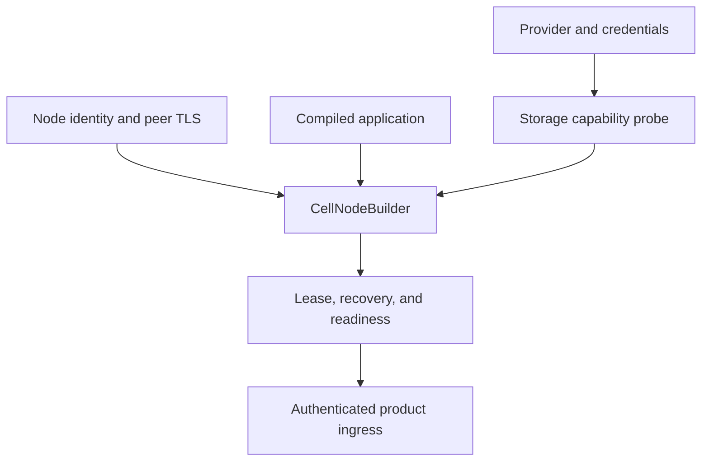
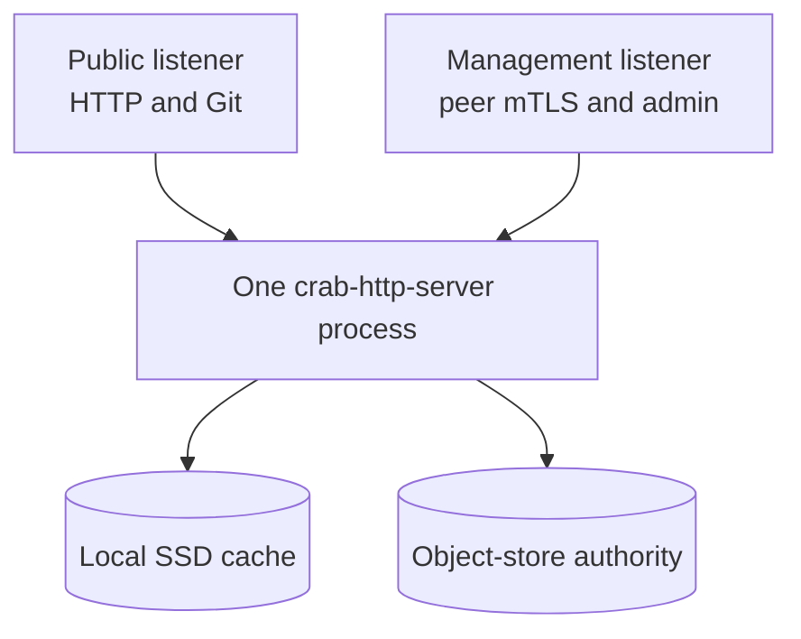
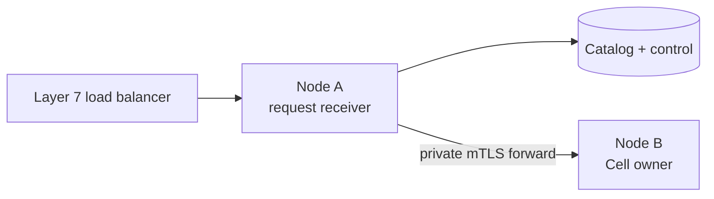
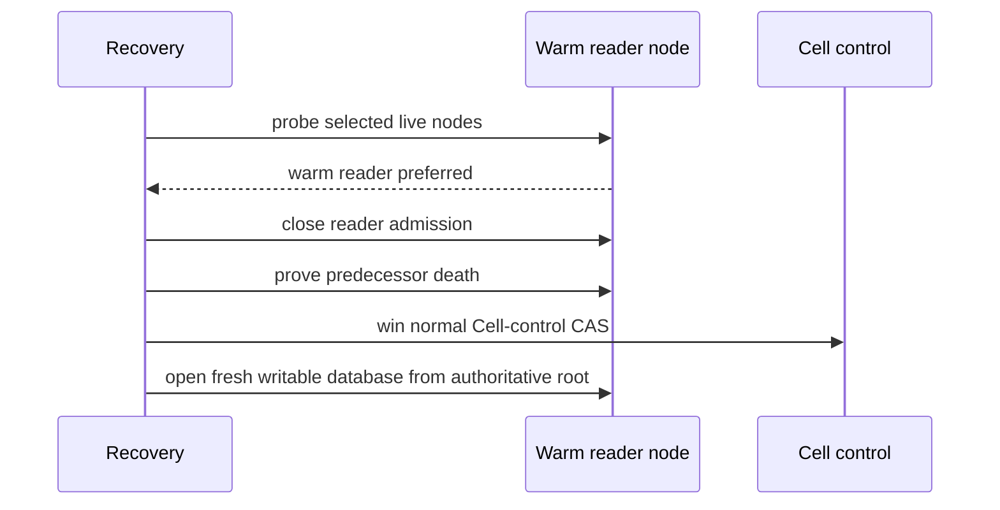
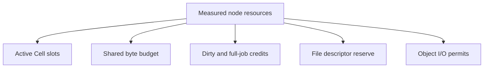
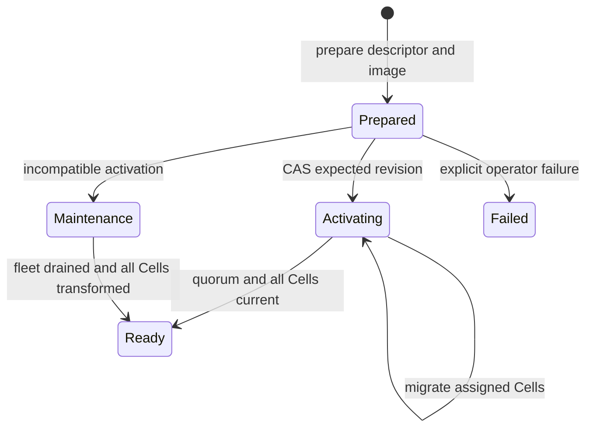
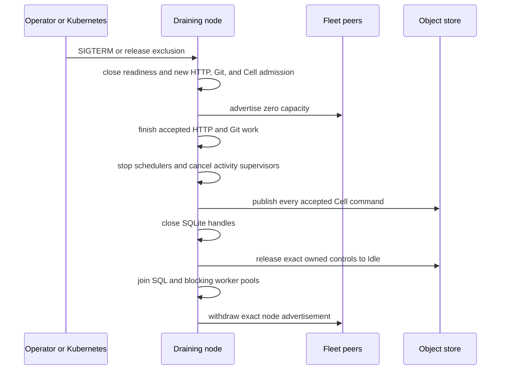

# Embed and operate Cellule

Embed the runtime in one process per node, then operate the fleet: ownership
boundaries, node sizing, release activation, Kubernetes topology, drain, backup,
cutover, and observation.

| Field | Value |
| --- | --- |
| Content type | How-to and operations reference |
| Audience | Operators and release engineers |
| Goal | Configure, size, roll out, drain, restore, and observe a Cell fleet |
| Status | Historical operations reference: framework mechanics remain current; `crab-http-server` routes and deployment examples are historical |

## Contents

- [Overview](#overview)
- [Configure one process per node](#configure-one-process-per-node)
- [Route through any healthy node](#route-through-any-healthy-node)
- [Serve reads from admitted replicas](#replica-reads)
- [Advertise node health and capacity](#advertise-node-health-and-capacity)
- [Size node profiles and admission](#size-node-profiles-and-admission)
- [Build one canonical release](#build-one-canonical-release)
- [Activate compatible releases](#activate-compatible-releases)
- [Use maintenance for incompatible changes](#maintenance-for-incompatible-changes)
- [Deploy on Kubernetes](#deploy-on-kubernetes)
- [Drain without split ownership](#drain-without-split-ownership)
- [Back up immutable roots and release metadata](#back-up-immutable-roots)
- [Apply the repository hard cut](#repository-hard-cut)
- [Monitor the fleet](#monitor-the-fleet)
- [See also](#see-also)

<a id="overview"></a>
## Overview

The service owns providers, authentication, ingress, tenant authorization,
secrets, and deployment. Cellule owns reusable execution and node lifecycle.



| Before readiness | Owner |
| --- | --- |
| Validate conditional writes and ranged reads | Application with `cellule-store` probe. |
| Freeze application descriptor and compatible release | `cellule-app` and service. |
| Install authority, follower store, node log, limits, and peer transport | Service through `cellule-host`. |
| Recover pinned state and acquire lease | Runtime and host. |
| Advertise endpoint and capacity | Host and service. |

Fleet shape:

- **Any entry node.** A request may enter any healthy node; the client dispatches
  locally when this node owns the Cell, otherwise through an authenticated peer.
- **One process per node.** Run one `crab-http-server` process per Kubernetes Pod
  or virtual machine.
- **Shared origin.** Nodes share one object-store origin, forward private requests
  over mutual TLS (mTLS), and advertise release and capacity state in the origin.
- **Graceful shutdown.** Shutdown stops admission first, drains accepted work
  while maintaining coverage, then withdraws the node session.

Configuration is an application contract. Cellule does not provide a
Kubernetes chart or product HTTP routes. See [host lifecycle](../../cellule-host/docs/lifecycle.md),
[peer security](../../cellule-peer-http/docs/security.md), and the
[workspace framework integration guide](../../../docs/framework.md).

<a id="configure-one-process-per-node"></a>
## Configure one process per node

The existing HTTP server owns Cell runtime construction. Configuration supplies the authoritative object store, local volume, public listener, management listener, and peer identity.

The deployment enables follower fsync as one response-durability proof:

- Creates the local follower store.
- Exposes authenticated append/seal/tail handling on the private mTLS listener.
- Starts recovery-only before serving public traffic.

Object-root publication remains a valid alternative proof, and all recovery
still goes through the existing claim, witness, pin, control-CAS, and
fresh-database activation gates described in
[Follower durability and warm failover](failover-and-followers.md).



Startup fails before readiness when any required boundary is invalid:

- Object storage cannot prove strict create and conditional update behavior
- Root identity differs from configured tenant or application
- Compiled registry differs from the selected release descriptor
- Local memory, disk, or file-descriptor floor is unavailable
- Peer certificate, fleet, release, or node advertisement is invalid
- The first complete scheduler scan has not finished

The server doesn't open a second public primitive listener.

<a id="route-through-any-healthy-node"></a>
## Route through any healthy node

The external load balancer doesn't need Cell affinity. Any node can receive a public request.



The receiving node resolves the exact owner from `control.json` and its signed live advertisement. It dispatches locally when it owns the Cell, otherwise it forwards once.

`CellClient::runtime_with_peer` forwards without a local dispatcher lookup when
the runtime has no active or activating Cells. The shared resource ledger proves
that miss; the destination still checks its own authority and admission.

A stale endpoint retry is allowed only when the first attempt definitely did not start. An ambiguous mutation returns evidence for `Resolve`.

<a id="replica-reads"></a>
## Serve reads from admitted replicas

Owner queries remain the default. In object durability mode, the server
reconciles a desired-reader policy and serves explicit authenticated reads from
admitted, verified snapshots.

This is local implementation evidence for
[Plan 036](https://github.com/crabbuild/crab/blob/beb439039cb37e750afe6625a2358101c70d1191/advisor-plans/036-cell-read-replicas-and-fenced-promotion.md),
not a qualified production deployment.

- The issue-detail route is the first public product consumer.
- Fleet-only acknowledgements do not provide the plan's all-secondary-loss guarantee.

### Set the desired reader count

An administrator sets a repository Cell's desired read-replica count with
`PUT /api/repos/{owner}/{name}/settings/read-replicas`.

| Operation | Request | Result |
| --- | --- | --- |
| First policy | `PUT` with `{"expected_revision":0,"desired_readers":1}` | The S3 policy CAS completes; the update's `convergence` field is `pending`. |
| Later change | `PUT` with the returned revision | Same contract; a stale revision returns HTTP 409. |
| Read the target | `GET` on the same path | Current target and revision, plus probe results. |

`GET` probes the selected nodes and reports selected, proven-ready, and
unverified reader counts plus the lowest proven sequence. A selected-node count
below the target is a placement `shortfall`.

| Probe limit | Value |
| --- | --- |
| Concurrency | At most 16 concurrent requests |
| Budget | Five seconds |
| Failed or timed-out probes | Remain unverified |
| View activation | Never; probes do not activate views |

The server sends an authenticated owner hint after the CAS and also reconciles
owned Cells periodically. This API is available only in the object durability
profile.

### Read issue detail from a replica

`GET /api/repos/{owner}/{name}/issues/{number}?read=replica` selects an admitted
reader and returns headers naming the serving node and the issue query's observed
position:

| Header | Meaning |
| --- | --- |
| `x-crab-cell-reader` | Serving node. |
| `x-crab-cell-incarnation` | Cell incarnation. |
| `x-crab-cell-sequence` | The issue query's observed position. |

Supply both `after_incarnation` (32 lowercase hex digits) and `after_sequence` on
a later replica request to require at least that position.

| Outcome | Response |
| --- | --- |
| Reader behind the requested position | `replica_behind` (409) |
| No reader can serve | `replica_unavailable` (503) |
| Owner fallback | Never; the route never runs the issue query on the owner |

The default issue route still reads from the owner. Issue and label metadata use
one typed query against the same snapshot; assignee metadata comes from the
authorized repository configuration.

### Take over a warm reader

After the owner session expires, verified snapshots remain warm but cannot answer
queries. Recovery probes the selected live nodes and prefers a warm reader, after
any mandatory durability-log successor.



The destination never turns a read-only connection into a writer. A missing warm
reader only removes the placement preference; the existing cold recovery path
retains every session, old-log, and authority gate.

<a id="advertise-node-health-and-capacity"></a>
## Advertise node health and capacity

Each node publishes a signed advertisement every three seconds. The record binds:

- Fleet and session IDs
- Certificate subject public key info
- Image and release digests
- Compiled registry inventory
- Publicly routable peer endpoint
- Free memory, disk, and job credits
- Scheduler progress

The service chooses each signed advertisement lifetime, up to 30 seconds. An expired node or one advertising zero capacity leaves rendezvous assignment until it reports progress and capacity again.

Local admission remains authoritative. An advertisement cannot force a node to accept work after its measured budget is exhausted.

Canonical advertisement decoding checks shape, the identity and any understood
placement signature, and exact JSON bytes. Canonical byte comparison serializes that same verified,
immutable value without repeating signature verification. Storage encoding
still verifies before emission, and directory reads independently enforce
scope and current lease validity. Legacy, schema-2 and schema-3 record bytes
remain unchanged.

### Operational observations and the reader rollout

`NodeAdvertisement::with_placement_capacity` continues to emit schema 2.
Upgraded readers also understand schema 3 through
`NodeAdvertisement::with_operational_placement`. Schema 3 signs the node's
`Active`, `Cordoned`, or `Draining` mode, stable pressure tier, and measurement
sequence/time. Pressure and lifecycle mode are separate; measured free capacity
is retained on cordoned nodes. Writer, reader, follower, and recovery-executor
selection reject a schema 3 node whose mode or pressure closes new admission.

Use `CellRuntime::operational_sample` for the local classifier output. It is
unknown until the first successful observation. Reading it or republishing a
heartbeat does not refresh its time. A changed measurement needs a new
sequence; directory refresh rejects regressing samples and changed capacity
under an unchanged sequence. The transient `Recovering` marker cannot be signed.

The runtime's shared `NodeAdmission` gate closes new writer and reader
acquisition during pressure and keeps a cordon sticky after pressure recovery.
The host installs it on its follower store before readiness. Direct follower
store integrations must install `runtime.node_admission()` using
`FollowerStore::with_node_admission` before sharing the store. Existing enrolled
tail appends and existing reader refreshes continue under their normal fences.

Pressure transfers on an Active donor prefer recently used settled Cells using
the actor's `last_used_ms`. Local emergency eviction continues closing oldest
idle Cells under its existing movement budget. Drains and normal balancing
retain their Cell identity order. Recency conveys no reservation: a racing
source close can still invalidate a proposal, and exact action validation must
refuse it and join unused receiver credit. Demand timestamps must be nonnegative
and no later than the planner's observation time.

Fleet-managed hosts additionally hold this same gate with
`NodeAdmission::hold_startup` before installing a lease. While held, an otherwise
Active node reports Cordoned. `confirm_startup(mode)` removes only that hold;
it preserves a racing cordon/drain and pressure, increments the measurement
sequence, and leaves the original sample time unchanged. The host calls it only
after atomic boot/intent confirmation and required startup checks. These local
methods supply no remote authorization or canonical enrollment proof. See
[fleet boot admission](../../cellule-host/docs/lifecycle.md#fleet-boot-admission).

`CellRuntime::try_reserve_node_metadata_bytes` charges bounded lifecycle
metadata to the same retained-byte ledger before lease admission or after
fencing. This token authorizes no native work or role. Native byte admission
still checks the node lease; terminal drain closes both allocation paths.
The host uses metadata credit for its retained supervisor observation owner.

Old strict JSON readers reject the added schema 3 field. Deploy upgraded
readers throughout the fleet while continuing schema 2 output, then enable
schema 3 production through application rollout policy. Complete the
[fleet operations plan](../../../docs/fleet-operations-plan.md) before enabling
automatic movement. The operation records and local gate are foundations;
the full executor, busy-Cell maintenance, and foreign follower evacuation still
require the remaining work packages and qualification.

### Observe local ownership in bounded pages

`CellRuntime::fleet_cells_page(cursor, limit)` observes all local owners,
including busy/draining actors and outstanding activation/close/release tasks.
Choose a limit from 1 through 128. Each returned page holds one MiB of native
byte admission until dropped; cancellation retains that admission until the
actor finishes or discards its response.

The opaque cursor is bound to the runtime session and ownership topology.
Restart a scan when topology changes. SQL activity can change advisory row
details between pages; a complete topology scan never authorizes release.
Actions still need fresh Cell authority, session, and generation checks.

| Observation | Interpretation |
| --- | --- |
| `Owned` | Verified target and generation, distinct residence/last-use times, available published position, and local blockers. |
| `Transitioning` | A local lifecycle task still owns this Cell's obligation; include it in drain diagnostics. |
| Missing cost | Receiver demand is unknown; block proactive movement until worker/resource accounting establishes a conservative bound. |

Worker probes measure logical SQLite bytes, persisted-work classes, and commit
sequence through the serialized SQL path. `database_bytes` is the current
logical size; `cost` reserves conservative restore demand derived from the
validated LTX limits. Native-memory cost is admission accounting, not measured
process RSS. A mutation invalidates the sample. A late probe from an older
inventory revision cannot recreate demand or clear newer unknown work.

`sampled_at_ms` belongs to the worker probe; reading a page does not refresh it.
`stable_observations` counts distinct unchanged worker samples and is capped at
two. Ordinary movement needs two fresh samples. Unknown schema, failed probes,
unpublished sequence mismatch, clock regression, and samples at least 30
seconds old keep costs unknown. The existing background loop admits at most
32 inventory probes at once through the shared worker-job ledger.

The counts include obligations outside the returned page. For a bounded status
sample, callers can read them without collecting every row:

```rust
use cellule_runtime::cell::actor::CellRuntime;

async fn remaining_local_obligations(runtime: &CellRuntime) -> cellule_runtime::Result<usize> {
    let page = runtime.fleet_cells_page(None, 128).await?;
    Ok(page.owned_cells().saturating_add(page.transitioning_cells()))
}
```

Zero local obligations does not prove relocation, reader replacement, foreign
follower safety, or successful host shutdown. The fleet completion contract
requires each of those separate proofs.

### Observe foreign follower obligations

`FollowerStore::fleet_lanes_page(cursor, limit, now_ms)` reports persisted
leader/epoch lanes, including cold lanes after store reopen. Pages contain at
most 128 entries and retain one MiB from the existing follower-index memory
budget until dropped. Cancelled calls keep that charge until the blocking scan
finishes. The scan serializes with existing lane creation, append, seal,
retirement, and collection. Commit cordon before using it as a local enrollment
barrier. Changed topology or a newly opened store invalidates its cursor.

Open and sealed lanes remain obligations. Retired lanes retain their durable
append fence, even after canonical retirement removes their chunks. Quarantine
and malformed filesystem entries require diagnosis; they cannot establish an
empty safe-to-stop node. Observation never seals, retires, or deletes a tail.

Pair local pages with
`NodeDirectory::follower_logs_page(member, cursor, limit, now_ms)`. That scan
includes current log references in inactive/expired advertisements and
fenced/recovering tombstones. It retains a bounded window and refuses more than
10,000 directory records. Heartbeat and coverage updates preserve topology;
epoch or ensemble changes require restarting pagination. Apply the caller's
deadline and obtain the fleet observer's membership/enrollment barrier:
object-store listing alone is not an atomic proof that no reference exists.

Recheck each exact epoch through the existing directory authorization and
recovery path before settling it. Zero local writer count, a dead leader, or
zero unretired local lanes alone cannot authorize maintenance shutdown.

<a id="size-node-profiles-and-admission"></a>
## Size node profiles and admission

The runtime derives active-Cell limits from measured resources. Profile names are operator guidance, not fixed performance claims.

| Profile | vCPU | Memory | Local SSD | Intended use |
| --- | ---: | ---: | ---: | --- |
| Small | 1 to 2 | 2 to 4 GiB | 50 to 100 GB | Development and low-traffic fleets |
| Medium | 4 to 8 | 8 to 16 GiB | 100 to 200 GB | General production nodes |
| Large | 16 | 32 to 64 GiB | 500 GB to 1 TB | Dense ownership and high aggregate throughput |

Startup rejects less than 2 GiB memory or 20 GiB usable disk.

Resource admission accounts these consumers:



Each open `Db` charges:

- Three SQLite connection page caches at 64 KiB each
- Four SQLite lookaside arenas at 8 KiB each, included in the 160 KiB native reservation
- Eight file descriptors
- Runtime actor and mailbox bytes
- Sparse-page cache allowance
- Native handler allowance

The shared byte budget covers SQLite files, WAL, retained LTX, sparse pages, and
Git/LFS/Release staging. Full restore and compaction use a separate weighted
scratch budget. After admission, the server remeasures actual free space against
both budgets and the node reserve before any remote body download.

Large jobs:

- Reserve two database sizes plus 64 MiB scratch and 64 MiB memory.
- Cap concurrency at the smaller of vCPU count and two, then apply byte admission.

The 1,000 to 10,000 open-Cell and 1,000 command/s aggregate targets require
[capacity qualification](delivery.md#capacity-qualification). A profile does not
guarantee either number before measurement.

<a id="build-one-canonical-release"></a>
## Build one canonical release

The deployable unit is the complete `crab-http-server` image.

```text
Rust modules + migrations + Cargo.lock + React assets
                         |
                         v
              crab-http-server image
                         |
                         v
             canonical registry descriptor
```

The descriptor includes:

| Field | Contract |
| --- | --- |
| `version` | Integer `1` |
| `runtime` | `crab-http-server` |
| `peer_versions` | Sorted unique versions; V1 supports `1` |
| `modules` | At most 128 canonical module entries |
| `namespaces` | At most 128 stable namespace entries |
| `build` | Source revision and `Cargo.lock` digest |

The descriptor has a 256 KiB limit. Its BLAKE3 digest identifies the compiled release. The operator records the OCI image SHA-256 digest in release state.

<a id="activate-compatible-releases"></a>
## Activate compatible releases

The administrative commands operate through the existing server binary:

```text
crab-http-server --config config.toml cells release inspect --json
crab-http-server --config config.toml cells capacity --json --live
crab-http-server --config config.toml cells release bootstrap --image sha256:1234567890
crab-http-server --config config.toml cells release prepare \
  --expected-revision 7 --image sha256:1234567890
crab-http-server --config config.toml cells release activate \
  --expected-revision 8 --strategy compatible \
  --minimum-eligible-nodes 3
crab-http-server --config config.toml cells release status
crab-http-server --config config.toml cells status --owner team --name repository
```

The repository status command reads the durable control object without opening
the Cell or changing ownership. Use its versioned JSON to map a serving endpoint
to a fleet member during takeover qualification.

The capacity command with `--live` reads the startup envelope retained by the
running server:

- Process memory limit, free local disk, and file descriptor limit
- The configured local-disk limit
- CPU-derived job credits
- The resulting admission budgets

`disk_capacity_bytes` is the smaller of that limit and the backing filesystem
total. The limit is Crab's admission ceiling and, in the Helm deployment, the
same byte count configures `emptyDir.sizeLimit`.

Without `--live`, the command calculates a preflight envelope for its
short-lived process instead. Neither mode claims a throughput result. Capture
the live report before every capacity run and compare it with the node-wide
gauges during the workload.

```json
{
  "version": 1,
  "resources": {
    "memory_bytes": 2147483648,
    "disk_limit_bytes": 64424509440,
    "disk_capacity_bytes": 64424509440,
    "free_disk_bytes": 53687091200,
    "available_file_descriptors": 1048570,
    "job_credits": 2
  },
  "admission": {
    "active_cells": 2457,
    "retained_bytes": 80530636,
    "blocking_jobs": 2,
    "dirty_jobs": 2,
    "recovery_jobs": 2,
    "scratch_bytes": 14316208128,
    "local_disk_bytes": 28632416256,
    "disk_reserve_bytes": 10737418240
  },
  "reservations": {
    "active_cell_page_cache_bytes": 262144,
    "active_cell_native_bytes": 163840,
    "active_cell_file_descriptors": 8,
    "dirty_job_memory_bytes": 67108864,
    "maximum_recovery_jobs": 2
  }
}
```

Compatible activation follows this state machine:



Before `Ready`, activation verifies:

1. Candidate descriptor bytes equal the running binary
2. The requested number of eligible nodes advertises the exact release
3. Every catalog shard remains revision-stable during the scan
4. Every non-tombstoned Cell uses current code and maximum schema
5. The eligible-node quorum still holds immediately before the final CAS

Prepare never changes the current release.

<a id="maintenance-for-incompatible-changes"></a>
## Use maintenance for incompatible changes

Maintenance activation stops normal serving, drains the fleet, and runs one signed zero-capacity maintenance executor.

The executor owns one SQL worker and one active-Cell slot. It walks the catalog sequentially through the same exact-root migration path used by normal nodes.

Before final `Ready`, it checks persisted work that may reference removed behavior:

- `sys_requests`
- `sys_inbox`
- `sys_effects`
- Queue messages and producer dedup rows
- Workflow runs
- Blob objects
- Cron schedules

Any matching row keeps the release in maintenance. The runtime doesn't guess payload compatibility. Operators must drain retention or compile a purpose-built transform.

The same fence can reclaim unreachable immutable Cell objects after migration:

```bash
crab-http-server --config config.toml cells release activate \
  --expected-revision 8 \
  --strategy maintenance \
  --retention-grace-hours 168 \
  --retention-max-deletes 10000
```

Omit both retention flags to run migration only. `--retention-max-deletes`
requires a nonzero grace and accepts 1 through 100,000; omitting the limit while
supplying a grace uses 10,000. The grace is measured from each object's provider
modification time.

Collection runs only after the executor proves it is the sole advertised
session and every current control is unowned. It then:

- Verifies live controls and all retained backup pins into a disk-backed mark set
  before streaming the object inventory.
- Skips unknown layouts.
- Records listed, candidate, reachable, grace, eligible, and deleted counts in
  the structured completion log.

Deletion bounds:

- If eligible objects exceed the selected deletion bound, the command returns an
  incomplete-retention error and deliberately leaves the release in `Maintenance`.
- Repeat the identical activation command and expected revision; the operation
  re-marks authority before deleting the next bounded batch.
- Each retry selects the same next unused session identity as competing
  executors; conditional creation admits only one.
- It advances past permanently retired identities and never revives a withdrawn
  session.
- After advertising, it checks the exact maintenance release again before opening
  any Cell.
- The executor closes its runtime through its owning `CellNode` before collecting
  objects; final host cleanup is idempotent.

Start the fleet only after the activation returns a `Ready` release.

<a id="deploy-on-kubernetes"></a>
## Deploy on Kubernetes

Use a `Deployment` for stateless process identity and a per-Pod local volume for cache data. Object storage remains authoritative.

```yaml
apiVersion: apps/v1
kind: Deployment
metadata:
  name: crab-http-server
spec:
  replicas: 3
  template:
    spec:
      terminationGracePeriodSeconds: 180
      containers:
        - name: crab
          image: registry.example/crab@sha256:1234567890
          args:
            - --config
            - /etc/crab/server.toml
            - --peer-advertise-host
            - $(CRAB_POD_IP)
          readinessProbe:
            exec:
              command: [crab-http-server, --config, /etc/crab/server.toml, healthcheck]
          volumeMounts:
            - { name: cell-cache, mountPath: /var/lib/crab }
```

The snippet shows topology, not a complete production manifest. The shipped
chart adds:

- A Downward API Pod IP and a stable peer TLS server name
- Peer Secret mounts
- Exec readiness and TCP liveness
- A three-replica floor and PDB `minAvailable: 2`
- Same-selector management ingress

Supply object-store identity, resource requests, edge ingress, and
provider-specific placement through the deployment environment.

Readiness requires:

- Runtime startup completed
- Release permits this compiled registry
- Node advertisement is live
- First scheduler pass completed
- Terminal drain has not started

Liveness should report process health, not temporary capacity exhaustion.

<a id="drain-without-split-ownership"></a>
## Drain without split ownership

On SIGTERM or release exclusion, the server:

1. Closes readiness and new HTTP, Git, and Cell admission
2. Advertises zero capacity while draining
3. Finishes accepted HTTP and Git work
4. Stops schedulers and cooperatively cancels activity supervisors
5. Publishes every accepted Cell command
6. Closes SQLite handles
7. Releases exact owned controls to `Idle`
8. Joins SQL and blocking worker pools
9. Withdraws its exact node advertisement



Set the Kubernetes grace period above the server's bounded drain budget. A forced
kill remains recoverable through stale-owner takeover, but it increases
unavailable time.

Drain ordering against reader admission:

- On shutdown, the host cancels work producers and closes reader admission, then
  drains accepted runtime work and seals the covered node log.
- This includes admitted replica SQL and snapshot-open jobs whose callers were
  cancelled.
- Heartbeat maintenance remains live through that barrier.
- Session withdrawal follows runtime drain; withdrawing earlier fences the log
  authority and prevents a clean fleet-to-object transition.
- Every phase uses the same absolute shutdown deadline.
- A failed drain must not authorize a durability-mode change.

### Observe an original session's terminal fence

Before terminal log retirement, `NodeDirectory::recovered_session` reads the
exact permanent boot fence and complete Sealed/Retired log. Open/Recovering logs
refuse, including inactive logs. Its original manifest digest identifies the
whole recovered suffix set across applications. This starts no recovery and
grants no process closure, bundle availability, log retirement or node settlement.
The [host original-writer recipe](../../cellule-host/docs/original-writers.md)
binds that complete manifest to committed original owner metadata and fresh
process/operation barriers before successor verification.

`NodeDirectory::closed_session` returns an opaque `NodeSessionClosure` only
from the exact physical node/session's permanent tombstone with no enrolled
leader log or an exact Retired log. A live claimant and fresh canonical read
are required. Missing/expired advertisements and Open/Recovering/Sealed logs
refuse, including inactive logs awaiting native retirement. The closure retains
original fencing/expiry times, epoch, ensemble, coverage and pinned manifest;
mutable recovery claim renewal does not change this identity.

This read starts no retirement or process effect. It proves no process joining,
affected Cell relocation, foreign role settlement or planned withdrawal. The
[host failed-boot publication](../../cellule-host/docs/lifecycle.md#publish-an-original-failed-boots-closure)
combines it with complete original enrollment closure and application-authenticated
durable process/accepted external work evidence. Grace retention and the
existing single-writer/recovery protocols still apply.

### Prepare capacity before releasing a Cell

`CellRuntime::prepare_receiver` binds an exact movement attempt, catalog proof,
receiver session, destination, cost, and expiry. It reserves an actual Cell
slot, conservative native memory and descriptors, the Cell's affine SQL worker,
and disk credit through the ordinary node ledgers. A partial refusal returns
its tokens and leaves source authority untouched. Cost must cover the incoming
replica's validated LTX bounds. Catalog target and replica Cell/incarnation
must match the immutable attempt before any resource admission.

```rust
use std::path::PathBuf;
use cellule_runtime::cell::actor::{CellRuntime, PreparedCellReceiver};
use cellule_runtime::cell::catalog::CatalogProof;
use cellule_runtime::fleet::operations::MoveAttemptSpec;
use cellule_runtime::ltx::CellReplica;

fn prepare_receive(
    runtime: &CellRuntime,
    attempt: MoveAttemptSpec,
    catalog: CatalogProof,
    replica: CellReplica,
    destination: PathBuf,
    now_ms: i64,
) -> cellule_runtime::Result<PreparedCellReceiver> {
    let expires_at_ms = attempt.deadline_ms;
    runtime.prepare_receiver(attempt, catalog, replica, destination, expires_at_ms, now_ms)
}
```

The runtime retains at most two local receipts. Dropping the opaque reference
does not cancel credit; `prepared_receiver(attempt_id)` recovers a lost reply.
An exact duplicate returns the existing lifecycle without another charge.
Expiry permits explicit cancellation; it does not free credit automatically.

| API | Contract |
| --- | --- |
| `activate_prepared_receiver` | Checks the exact Idle incarnation and receiver session, and an authority epoch at least as new as the source, then transfers tokens through canonical takeover, root verification, SQLite open, and actor activation. Accepted work survives a dropped waiter. |
| `cancel_prepared_receiver` | Returns unused credit synchronously. Refuses after activation was accepted; inspect authority and actor readiness to reconcile that work. |
| `PreparedCellReceiver::state` | Local lifecycle hint. `Activated` requires fresh authority and actor checks; `Failed` does not prove ownership is absent. |
| `retire_prepared_receiver` | Removes a joined terminal receipt after the application durably records and reconciles its result. Never reuses an attempt identity or closes its serving actor. |
| `shutdown` | Cancels unused preparation and joins accepted acquisition before closing actors and workers, including canonical rollback of a failed claim. Retained opaque references do not keep resources alive. |

These are trusted local mechanisms. The host fleet executor binds scope/session,
retains accepted work, and journals exact source release and receiver results.
It records the checked Idle acquisition input before its ownership CAS; an
ambiguous basis-write reply prevents takeover. After release, unused-credit
cleanup preserves relocation state and the fleet permit. Receiver readiness
and resource settlement are independent proofs, including when ordinary cold
acquisition wins on the preferred session.

The application supplies authentication and durable adapter semantics. A cached
action result still needs fresh authority and actor checks before being counted
as currently serving. `CellNode::inspect_fleet_action` captures that check using
`FleetInspectionRequest` and `FleetInspectionObservation`. Bind the complete
request to a new nonce, exact head action, retained registry version, endpoint
and capture deadline. Validate the original interval when consuming the reply;
republication cannot refresh it. The adapter checks current journal authorization
in one read transaction; the host performs actor/authority checks without using
cached Inspect success or starting recovery. Recheck both journal versions when
committing a dependent transition. A failed inspection retains the permit.
After a proven clean release, a fresh inspection may target another established
node or a new boot of the preferred node that acquired the Cell normally. The
reconciler selects a possible serving endpoint from authenticated actor rows
under the current durable roster; native authority and actor checks then prove
the exact successor position. This read creates no effect acceptance. Cleanup
continues to require the original receiver's independent resource proof.
Old inspection readers refuse the additional endpoint shape; deploy and qualify
upgraded readers before enabling this path in a mixed-version fleet.
Recovery across receiver sessions, the recurring reconciler,
busy maintenance, role evacuation, and deployment qualification remain work in
the
[fleet operations plan](../../../docs/fleet-operations-plan.md).

### Retain failed source recovery evidence

`AcquisitionObserver` supplies two confirmed recording points on canonical
`acquire_idle_restored_observed` and `takeover_restored_observed`:

| Recording point | Required behavior |
| --- | --- |
| `before_claim` | Retain the exact input before ownership CAS. A changed predecessor is another input that the recorder explicitly accepts or rejects. A lost write reply aborts before CAS. |
| `before_activation` | Retain that same input and the actual control after optional pinned-overlay publication, before actor admission. Failure uses canonical acquisition rollback and cannot admit a writer. |

The ordinary methods delegate to these same paths without a recorder. These
trusted callbacks grant no authority and authenticate no caller. Their caller
must own acquisition independently of transport cancellation; the host fleet
executor provides that finite-task ownership.

`resume_takeover_restored_observed` resumes this boot's original interrupted
claim without another ownership CAS. It requires the exact original fenced
control, current Recovering control and takeover proof. The current control must
be that original takeover or its exact pinned-overlay materialization; a changed
generation, scope, owner or publication is refused. A committed materialization
is derived again from the original manifest and compared in full before it can
be retained as native acquisition history. The recorder reconfirms the original
input, then records the actual materialized position before actor admission.
Fresh takeover and resumption share the same materialization, activation,
admission credits and rollback owner. Inspection does not call this method.

`RecoveryBasis` binds an accepted recovery action to its exact failed source,
canonical control, and original capture time. Construction requires existing
`NodeTakeoverProof`. `RecoveryEvidence` checks the exact takeover and optional
canonical recovery-publication transition. Its root is the required recovery
position, not a current-serving witness. Recovered completion also checks the
live successor actor and current authority. Receiver cleanup remains an
independent prerequisite for retiring the charged fleet permit.

Local host tests exercise source loss, an unobserved release CAS, lost recording
replies, later root advancement, and dropped waiters. Public runtime tests
exercise the callbacks with a pinned follower tail. These tests do not establish
controller restart durability, cross-session receiver failover, or the fleet
plan's process/provider campaign.

### Retain intent and enrollment before fleet orchestration

The pure `fleet::operations` registry records define these adapter contracts:

| Record or gate | Contract |
| --- | --- |
| `NodeIntent::advance_maintenance` | Conditionally advances the retained physical-node row with the head transaction. A different maintenance operation cannot overwrite a cordon. Reboot adoption advances the intent revision. |
| `RegistryVersion` | One revision shared by every intent and enrollment mutation. Record the controlled bootstrap barrier; recheck this same version after collecting observations. A marker alone does not prove coverage. |
| `RegistryVersion::set_scheduling` | Revision-checked stop/resume. A new registry starts stopped; enabling requires bootstrap. Stopping preserves accepted work, charged permits, and retained cordons. |
| `RegistryVersion::authorize_allocation` | Invoke inside the allocation transaction with exact current intent rows. Reject a cordoned receiver, changed boot, stopped policy, or a draining source outside its current evacuation operation. The head reducer still checks fencing and budgets. |
| `EnrollmentRecord` | First Pending acceptance checks exact source/target boot and intent revisions. Retain unknown work after lease expiry. Compare the full spec on duplicate request identities. |
| `IntentPage` and `EnrollmentPage` | At most 128 sorted rows and one MiB per page. Keep older cordons and failed-session obligations; carry the same registry version through every cursor request. |

Reader records name the exact Cell and published position. Follower records name
the source boot and node-log epoch. Boot enrollment records carry the retained
mode: a reboot may enroll its maintenance lease in Draining mode while writer,
reader, and follower admission remains closed. Boot enrollment does not open
readiness or clear intent.

Only checked ordinary enrollment, definite refusal, or canonical role retirement
advances an enrollment record. Evidence digests identify the application's
retained proofs; decoding them supplies no authority or authentication. Duplicates
return the original proof and transition time. A timeout is not refusal, and
expiry never retires an unknown obligation.

The host exposes `FleetJournal` and `FleetEnrollmentJournal` alongside the action
journal. Implement all three against the same transaction domain. Conditional
head publication must retain intent/operation changes and progress atomically;
enrollment acceptance must linearize current intent checks with Pending. These
records and pure tests do not establish complete fleet observation. The host's
[fleet journal example](../../cellule-host/minion/README.md)
implements these contracts in one local SQLite transaction domain, with focused
lost-reply and reconstruction evidence. The host's caller-driven reconciler now
uses the existing planner and reducer for settled movement; its initial tests
use simulated effects against that journal. The `overload` executable additionally
moves two real Cells across three leased nodes, reconstructs its controller
client and checks original receipts, restored state and joined resource ledgers.
Its fixed collector reports incomplete role coverage. Enrollment producers, complete
observation collection, leased-node failure integration and maintenance execution
remain implementation work. Local SQLite evidence
does not qualify a distributed journal provider or process-crash behavior.

<a id="back-up-immutable-roots"></a>
## Back up immutable roots and release metadata

A backup records object-store data, not local cache volumes.

Include:

- Root identity
- Release records and immutable descriptors
- Catalog heads and immutable pages
- Cell control records
- Every immutable object reachable from pinned roots
- Node-independent application configuration needed to recreate the fleet

Backup traversal pins its start revisions and strict-creates the pin only after
every referenced object verifies. Restore verifies that pin before copying.

Create a nonzero 16-byte pin ID and verify it independently:

```bash
crab-http-server --config /etc/crab/server.toml cells backup create \
  --pin 11112222333344445555666677778888
crab-http-server --config /etc/crab/server.toml cells backup verify \
  --pin 11112222333344445555666677778888
crab-http-server --config /etc/crab/server.toml cells backup restore \
  --pin 11112222333344445555666677778888 \
  --destination-prefix recovery/restore-2026-09-16
```

Both commands print versioned JSON with the application and pin IDs, creation
time, control count, nonempty catalog-shard count, release-snapshot digest, and
`verified: true`. Creation is idempotent by pin ID.

Verification rereads the release metadata, catalog pages, canonical controls, and
every immutable LTX dependency; it does not trust local SQLite files or caches.

Restore accepts only a canonical prefix different from the configured source
root and only a pin whose selected release was `Ready`. The command:

1. Verifies the source graph.
2. Uses same-bucket conditional copies.
3. Re-verifies every destination root.
4. Removes captured owners from restored controls.
5. Publishes the destination release and pin pointers last.

Run it while the destination is offline; an exact interrupted attempt is
resumable, but a destination used by a fleet has intentionally diverged and is
rejected.

Start the restored fleet with the compiled release named by the pin. Its first
request acquires each `Idle` Cell and rebuilds disposable SQLite files from the
exact root.

Not Cell backup contents:

- Repository catalog configuration
- Git/Xet/LFS objects
- Release assets
- Other product data outside `cells/v1`

Restore or reference those through their owning runbooks. Cross-provider archive
export still requires a separate transport step.

<a id="repository-hard-cut"></a>
## Apply the repository hard cut

There is no legacy application-data importer.


Do not enable dual-read, dual-write, or fallback behavior. Repository adoption creates and verifies new empty collaboration state.

<a id="monitor-the-fleet"></a>
## Monitor the fleet

At minimum, export these metric groups:

| Group | Signals |
| --- | --- |
| Ownership | Active Cells, renewals, self-fences, takeover duration |
| Commands | Accepted, committed, rejected, unknown, resolved, deadline exceeded |
| Publication | Prepare latency, CAS conflicts, ambiguous CAS adoption, compaction |
| Storage | Object requests, verified bytes, sparse faults, cache hits, disk reservations |
| Scheduler | Pass duration, due lag, progress counter, excluded sessions |
| Activities | Claims, lease loss, heartbeat, retry, panic, duration |
| Capacity | Free memory, free disk, job credits, file descriptors, rejected admission |
| Releases | State, eligible nodes, pending migrations, terminal migration failures |

Alert on stalled scheduler progress, repeated owner fencing, publication backlog, control renewal delay, disk reserve breaches, and release-state exclusion.

<a id="see-also"></a>
## See also

| Topic | Document |
| --- | --- |
| Runtime entry point and module map | [Cell runtime guide](README.md) |
| Follower durability, claim/witness/pin gates, and warm failover | [Follower durability and warm failover](failover-and-followers.md) |
| Storage roots, control authority, and compaction | [Storage and object layout](storage.md) |
| Verification, capacity qualification, and the production gate | [Verification and qualification](delivery.md) |
| Node lifecycle, lease, and host cleanup | [Host lifecycle](../../cellule-host/docs/lifecycle.md) |
| Peer mTLS transport and routing | [Peer security](../../cellule-peer-http/docs/security.md) |
| Repository-wide doc index | [Technical reference](technical-reference.md) |
| Embedding application contract | [Workspace framework integration guide](../../../docs/framework.md) |


## Foreground quiescence for planned maintenance

After retaining and authorizing a maintenance intent, an embedding application
can call `CellRuntime::quiesce_cell_at` with the exact Cell ID, runtime boot,
local generation, incarnation and ownership epoch. A mismatch fails before
closing admission. The transition is sticky for that activation and returns
when the actor installs the gate; it does not wait for accepted work to finish.
The activation's immutable admission fence remains available while accepted
publication owns its publisher, so closing admission does not require a quiet
publication gap. A wrong epoch or generation remains fenced. Publisher return,
accepted work and exact-root publication still gate final release.

| Work | During Cell quiescence |
| --- | --- |
| Previously actor-admitted commands/queries | Finish through the existing serialized worker and publication gates. |
| New foreground commands, queries, migrations and claims | Refused with CellDraining. |
| Native Queue/Effect lease operations; Activity completion/extension | Continue with their existing exact-token, expiry and durability checks. |
| Native lease validation and original outcome resolution | Continue on the current owner. |
| New hydration and compaction | Suppressed; required inventory can refresh. |
| Fencing, final drain and transfer preflight | Close completion admission as well. |

Only private native registry bindings carry completion admission. Raw handlers,
application bindings and peer requests cannot supply an exemption flag. These
calls use the ordinary request, byte and worker bounds. Duplicate binding errors
leave the original handler intact. Registry descriptors, release bytes, command
IDs and peer formats are unchanged.

`OwnedCellObservation` reports `quiescing` and optional `maintenance_work` from
the serialized worker inventory. Absence means unknown. The latter reports all
live Effect, Queue and Activity lease classes together; malformed leases block.
Valid expired leases remain unchanged for canonical destination reclamation.
Pending durable messages, Effects, timers and Workflow waits can be carried in
an exact root after claims close. Blob stream/upload/pin coverage remains an
explicit blocker.

Public behavior cases now cover live Queue/Effect/Activity completion and exact
receiver restoration. Effect expiry preserves the existing retry backoff and
inbox deduplication; Activity expiry preserves its pinned definition and rejects
stale completion tokens. Unclaimed Effects and Activities resume through the
registered native drivers. Restored Workflow waits accept deduplicated signals,
and preserved due timers advance through the normal Tick. These local fixtures
are recorded in the [execution evidence](../../../docs/fleet-operations-progress.md);
provider/process faults, Cron and Blob owners still require qualification.

A transferable primitive snapshot grants no release authority and does not
establish actor settlement or complete role coverage. Ordinary idle transfer
keeps its conservative readiness checks.

`CellRuntime::release_maintenance_cell_at` accepts the same exact source identity
and a preflight deadline. The actor owns the request after acceptance, including
when its caller drops the reply waiter. It closes foreground admission, gives a
serialized readiness read a bounded worker slot behind accepted SQL, then closes
native completion admission and joins accepted work/publication. A second fresh
read must prove readiness before the existing canonical release starts. Lease
renewal continues until that confirmation. A live lease found on the second read
restores native completion only and retries within the deadline.

| Result | Meaning |
| --- | --- |
| `MaintenanceCellRelease::Released(position)` | Canonical release completed with the exact final authority root and epoch. Ordinary exact-root receiver activation can consume it. |
| `MaintenanceCellRelease::Refused { blocker, error }` | This request started no canonical release. Preserve any source error; foreground quiescence stays installed if already accepted, and native completion remains available. |
| Other error or lost reply | Release may be unresolved. Retain fleet permits and inspect retained evidence or use canonical failed-session recovery. |

The deadline bounds preflight; it does not cancel a confirmed release. A Blob
Cell refuses before closing admission because external stream/upload/pin owners
are not covered. `OwnedCellObservation::maintenance_cost` is a separate peak
receiver envelope derived from validated per-Cell LTX limits. It stays available
while mutations invalidate measured worker samples; it establishes no readiness.
`OwnedCellObservation::owner_fence` retains the activation incarnation/epoch even
when `position` is unavailable during publication. An observer can retain that
exact writer's maintenance demand after independently rechecking its native
generation, canonical owner, boot, executable contract and configured envelope.
Root advancement still invalidates complete counts and ordinary movement demand;
this advisory identity supplies neither final release nor role-settlement proof.
The driver can plan with it only for the exact boot/node of a retained Evacuating
maintenance operation and a fresh authenticated collection barrier. Receiver
preparation precedes source quiescence and rechecks the actual cost. Ordinary
pressure/count moves retain their settled-sample rules. Complete primitive
acceptance, reader/follower producer wiring and role finalization remain required by the
[fleet implementation plan](../../../docs/fleet-operations-plan.md).
