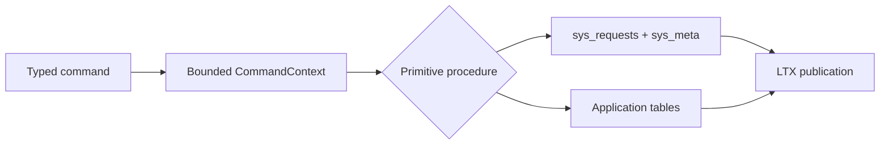
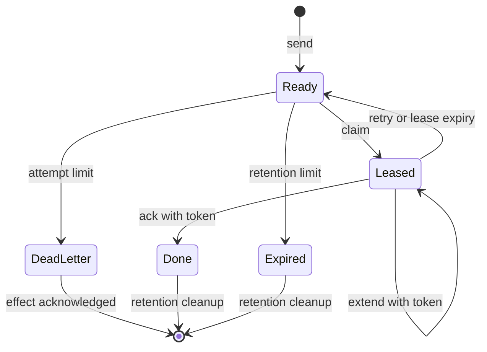
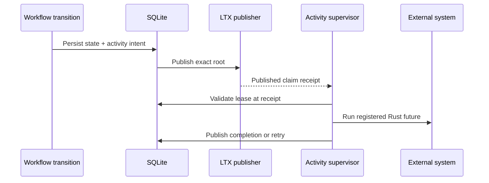
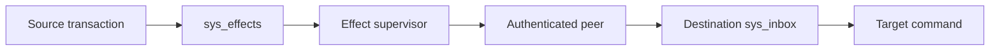

# Implement SQL, KV, Blob, Queue, Cron, Timer, and Workflow primitives

All primitives execute through typed Rust bindings and the same Cell actor. They share request deduplication, SQLite transactions, LTX publication, exact-root recovery, admission, and receipts.

| Document intent | Value |
| --- | --- |
| Content type | Reference |
| Audience | Native module authors and runtime contributors |
| Goal | Choose and use a primitive without creating a second durability path |

[Back to the Cell runtime index](README.md)

## Use one common transaction boundary

Commands receive `CommandContext`; queries receive `QueryContext`. Neither exposes a raw connection.



Runtime tables use the `sys_` prefix; native primitive tables use reserved
`kv_`, `blob_`, `queue_`, `cron_`, and `workflow_` prefixes. The SQLite
authorizer denies application SQL access to every reserved table, transaction
control, connection configuration, and schema changes.

## Deduplicate every mutation

Application requests use a 16-byte request ID and a canonical operation digest. The ledger stores the encoded outcome before commit.

| Existing row | New request | Result |
| --- | --- | --- |
| No row | Valid identity and digest | Execute once |
| Same ID and digest | Any retry | Return stored outcome |
| Same ID, different digest | Conflicting reuse | Durable rejection |
| Expired identity | Any payload | Reject before handler |

Destination effects use `sys_inbox` and a 32-byte effect ID. Internal scheduler operations use short-lived identities that public listeners cannot submit.

## Use SQL for repository-local relational state

`SqlCell<M>` runs bounded parameterized batches against an explicit Cell with the SQL role.

```rust,ignore
let batch = SqlBatch {
    statements: vec![SqlStatement {
        sql: "INSERT INTO issues(title, state) VALUES(?, ?)".into(),
        parameters: vec![
            SqlValue::Text(title),
            SqlValue::Text("open".into()),
        ],
    }],
};

let committed = sql.batch(identity, batch).await?;
```

The SQL boundary enforces:

- 128 statements per batch
- 1 MiB encoded input
- 1,000 result rows
- 1 MiB encoded output
- Read-only statements on the query path
- Mutating statements on the command path
- No transaction or schema-control statements

Repository handlers should prefer typed command and query types over exposing arbitrary SQL at the HTTP boundary.

## Use KV for scoped atomic metadata

`KvNamespace<M>` hashes the scope to a fixed shard. Keys and list prefixes never cross that shard.

```rust,ignore
let request = KvAtomicRequest {
    scope: b"repo:123".to_vec(),
    checks: vec![KvCheck {
        key: b"settings/version".to_vec(),
        condition: KvCondition::Version(expected),
    }],
    mutations: vec![KvMutation::Put {
        key: b"settings/default_branch".to_vec(),
        value: b"main".to_vec(),
        expires_at_ms: None,
    }],
};

let outcome = kv.atomic(identity, request).await?;
```

The KV procedure applies all checks before any mutation. A failed check returns a durable `PreconditionFailed` outcome.

| KV contract | Limit or behavior |
| --- | --- |
| Atomic items | 128 checks and mutations combined |
| Value | 4 MiB |
| Atomic operation | 4 MiB plus 64 KiB for keys and framing |
| List page | 1 MiB ordinarily; one larger value occupies its own page |
| Version | Incarnation plus sequence, 28 bytes |
| Expiry | Logical timestamp evaluated inside the Cell |
| List order | Binary key order within one scope and prefix |
| Cleanup | Bounded scheduler Tick |

KV values remain in the Cell's SQLite database and LTX history. A module that
uses the 4 MiB maximum must declare an atomic input limit and get/list output
limits of at least 4 MiB plus 64 KiB for framing. The aggregate atomic and
list-page budgets prevent a batch of maximum-sized values from bypassing
admission. For frequently replaced large bodies, use Blob to avoid repeated
SQLite and LTX writes.

Deleting and recreating a key produces a new version. An old version cannot match the new incarnation and sequence.

## Use Queue for at-least-once work

Queue sends hash the producer ID to a shard. Consumers claim one explicit shard at a time.

```rust,ignore
let sent = queue
    .send(identity, QueueSendRequest {
        producer_id: request_id,
        payload,
        available_at_ms: now_ms,
    })
    .await?;

let claimed = queue
    .claim(
        claim_identity,
        shard,
        QueueClaimRequest {
            limit: 16,
            lease_ms: 30_000,
            max_batch_timeout_ms: 5_000,
        },
    )
    .await?;
```

`max_batch_timeout_ms` forms the batch before anything is leased: a batch closes
when it reaches `limit`, or when the oldest ready message has waited that long.
Zero claims every ready message immediately. A deferred claim leases nothing,
so it neither burns an attempt nor hides a message from another consumer.

Queue state transitions are:



The claim command publishes its lease before returning payloads. Consumers validate the exact token at the claim receipt before starting external work.

| Queue contract | Limit or behavior |
| --- | --- |
| Payload | 256 KiB |
| Claim batch | Bounded by registered command output and item limit |
| Batch timeout | Up to 60 seconds for a partial batch |
| Lease | 5s to 300s |
| Attempts | 20 |
| Retention | 30 days from enqueue |
| Ordering | No FIFO guarantee |
| Delivery | At least once |

A dead-letter transition inserts a typed durable effect in the same transaction. The source row retains its payload until that effect reaches a terminal state.

Queue controls are shard-scoped and use the same request ledger as sends and leases:

- Pause stops new claims and makes published-claim revalidation fail, while live leases may still ack, retry, or extend.
- Resume reopens claims and advances a monotonic control generation.
- Purge deletes only non-leased messages in batches of at most 128.
- Redrive moves dead messages back to ready only after any dead-letter effect is terminal.
- Info returns bounded aggregate counts instead of scanning message payloads.

### Host a native consumer

A module can compile a native consumer instead of driving the claim API itself.
`QueueConsumer` declares the batch policy and one async handler; the supervisor
claims, revalidates the published lease, runs the handler outside the SQL
worker, and settles each message through the ordinary lease commands.

```rust,ignore
impl QueueConsumer for FulfillmentJobs {
    const MAX_BATCH_SIZE: u32 = 16;
    const MAX_BATCH_TIMEOUT_MS: u32 = 5_000;
    const RETRY_DELAY_MS: u32 = 10_000;

    fn consume(batch: QueueBatch) -> QueueConsumerFuture {
        Box::pin(async move {
            for message in &batch.messages {
                deliver(&message.payload).await?;
            }
            Ok(vec![QueueSettlement::Ack; batch.messages.len()])
        })
    }
}

// Registration, then one bounded pass over an explicit shard:
register_queue_consumer::<FulfillmentJobs>(registry)?;
let supervisor = handle.queue_consumer::<FulfillmentJobs>(30_000)?;
let outcome = supervisor.run_once(shard).await?;
```

The handler returns one settlement per claimed message, in order: `Ack`, or
`Retry { delay_ms }` for a message that must return to the queue. Returning an
error settles the whole batch as `Retry` after `RETRY_DELAY_MS`. The supervisor
reports `Idle`, `Deferred`, `Completed`, `HandlerFailed`, or `LeaseLost`, and a
settlement whose outcome is unknown returns `Pending` for the caller to
resolve. One pass claims at most one batch; the embedding service owns how many
passes run at once and therefore the per-queue concurrency bound.

## Use Blob for transactional object data

`BlobNamespace<M>` hashes the object key to a stable shard. Multipart upload
metadata, part digests, the published manifest, request outcomes, and LTX state
commit in one SQLite transaction domain; part bytes are immutable,
content-addressed objects in the configured Cellule object store. A completed
manifest never points at an unrecorded part reference, and range reads verify
each object-store part before returning bytes after restore or failover.

Blob supports:

- Multipart begin, idempotent part upload, atomic complete, and abort
- Create-only and ETag compare-and-swap publication or deletion
- Per-part BLAKE3 integrity verification on write and range read
- Bounded range reads and lexicographic per-shard listing
- Atomic replacement followed by deletion of the unreferenced prior upload
- Scheduler cleanup of expired, unpublished uploads

| Blob contract | Limit or behavior |
| --- | --- |
| Key | 1 to 1,024 bytes |
| Part | 256 KiB |
| Parts | 4,096 |
| Object | 1 GiB |
| Range read | 512 KiB |
| User metadata | 8 KiB |
| Upload lifetime | 1 minute to 7 days from mutation issuance; acceptance rejects an already expired upload |
| List | 128 objects from one explicit shard |

Blob bodies do not live in the Cell database. `BlobNamespace` uploads each
bounded part to the configured object store before committing its digest and
size in SQLite. The manifest is the durable publication boundary; unreferenced
content-addressed parts are safe to retry. The configured object-store
lifecycle policy must reclaim abandoned parts. The
`BlobArtifactStore::sweep_unreferenced` building block limits each pass to 128
deletions but scans the unordered listing until that limit is reached. A
product-level collector must quiesce writes throughout the scope, pass
references from every Cell sharing it, and use a grace cutoff. The helper is
not wired to a product collector yet.

## Use Cron for failover-safe recurring triggers

Cron schedules are durable rows advanced only by the serialized Cell Tick. Each due occurrence inserts a typed cross-Cell effect and advances `next_due_ms` in the same transaction.

The destination receives `CronInvocation`, which includes schedule ID, generation, occurrence, scheduled timestamp, and the module payload. Registry construction verifies every compiled target namespace, command ID, codec version, and input limit against the release descriptor.

| Cron contract | Limit or behavior |
| --- | --- |
| Minimum interval | 1 second |
| Maximum interval | 1 year |
| First due time | Up to 5 years ahead |
| Payload | 256 KiB |
| Catch-up | One durable occurrence at a time, bounded by Tick budget |
| Delivery | Durable effect with destination inbox deduplication |
| Controls | Upsert, pause, resume at an explicit time, delete |

Blob upload lifetime and Cron's first-due window are evaluated from the
mutation's issued timestamp. The serialized Cell still rejects a Blob upload
whose expiry has passed before acceptance. A Cron schedule whose due time
passes while the mutation is waiting is accepted and becomes eligible on the
next Tick, preserving the caller's absolute schedule without making request
latency a correctness failure.

An owner crash after commit cannot lose an occurrence: the effect and next occurrence are in the same LTX root. A retry cannot execute the destination command twice because its inbox resolves the stable effect identity.

## Use Timer for durable one-shot deadlines

`TimerNamespace<M>` keeps a bounded one-shot deadline under a 16-byte timer ID on a deterministic shard. Setting the same ID again replaces the pending deadline and advances the generation, so a destination can recognize a delivery that a superseded generation scheduled.

```rust,ignore
let scheduled = timers
    .mutate(identity, TimerMutation::Set {
        timer_id,
        target_index: 0,
        target_partition: partition,
        payload,
        due_at_ms: now_ms + 30_000,
    })
    .await?;
```

A due deadline fires in the transaction that removes it: the Tick inserts the typed effect addressed to the declared target and deletes the entry, so a crash cannot lose the deadline or fire it twice. A deadline that has already passed is accepted and becomes eligible on the next Tick.

| Timer contract | Limit or behavior |
| --- | --- |
| Payload | 256 KiB |
| Due time | Now or up to 5 years ahead |
| Fire budget | Shares the 128-item Tick budget through protected per-class shares |
| List page | 128 entries or 512 KiB |
| Delivery | Durable effect with destination inbox deduplication |
| Controls | Set or replace, cancel, inspect one ID, list one explicit shard |

Use Cron when a trigger recurs on a schedule and Timer when one mutation must run once at a chosen time.

## Use Workflow for durable state machines

A workflow definition is compiled Rust with a stable digest. New runs pin the current digest; existing runs continue with the retained definition they started with.

```rust,ignore
impl WorkflowDefinition for MergeWorkflowV1 {
    fn digest(&self) -> Digest { MERGE_V1_DIGEST }

    fn transition(
        &self,
        state: &[u8],
        event: &[u8],
        context: WorkflowContext,
    ) -> Result<WorkflowDecision> {
        let event = MergeEvent::decode(event)?;
        decide_merge(state, event, context)
    }
}
```

Workflow transitions run inside SQLite and may produce:

- New durable workflow state
- Timers
- Native activities
- Typed cross-Cell effects
- Terminal completion, failure, or cancellation

The transition callback cannot perform network or object-store I/O. Native activities run after their claim root is published.



Workflow IDs select the shard. Signal IDs make delivery idempotent. Activity completion requires the exact lease token and attempt.

Workflow controls preserve the deterministic history boundary:

- Pause is accepted only when no activity lease is live. Ready activities and timers remain durable but cannot be claimed or fired.
- Resume returns the same run to running state without synthesizing an event.
- Restart is accepted only for a terminal run. It deletes the terminal local history and starts a new run under a new request-derived run ID and the current definition.
- Cancel remains an idempotent workflow event and cancels outstanding local work.

The quiescent-pause rule avoids converting an already-running external side effect into a lost completion and unintended replay.

| Workflow contract | Limit or behavior |
| --- | --- |
| State or event payload | 1 MiB |
| Activity payload | 256 KiB |
| Activity attempts | 20 |
| Activity lifetime | 7 days |
| Definitions | Current plus every digest referenced by stored runs |
| Execution | Deterministic transition; retryable native activity |

## Deliver cross-Cell effects through an inbox

A command emits typed Cell effects through `CommandContext::emit_effect`, which
uses the command-owned allocator. Effects carry typed Cell commands only and
inherit the source tenant and application.



Registry validation requires every effect target namespace to be declared. Cross-tenant targets fail before writes.

The delivery path preserves these properties:

- Effect bytes and operation digest remain stable across retries
- Destination incarnation is resolved at delivery time
- Destination inbox deduplicates execution
- Destination success means its exact root was published
- Source acknowledgement happens in a later source transaction
- `Resolve` recovers an ambiguous destination result

The design doesn't claim an atomic transaction across source and destination. It provides durable at-least-once delivery with idempotent destination execution.

## Build read models with projections

A projection is a read-model Cell that consumes another Cell's changes. It uses
the effect ledger, not a second delivery path: the source emits one typed
`ProjectionRecord` per change, the destination inbox deduplicates execution,
and the destination records how far it has applied each source Cell.

```rust,ignore
// Source command: publish the change and its ordering metadata together.
emit_projection(context, CATALOG_TARGET, &partition, payload)?;

// Read-model module: apply the change and let the runtime record the watermark.
impl ProjectionModule for CustomerIndex {
    const MODULE: &'static str = "customer-index";
    const NAMESPACE: NamespaceId = CUSTOMERS;
    const APPLY_COMMAND_ID: u32 = 1;
    const STATUS_QUERY_ID: u32 = 2;

    fn apply(context: &mut CommandContext<'_, '_>, record: &ProjectionRecord) -> Result<()> {
        upsert_customer(context, record.payload.as_slice())
    }
}
```

| Projection contract | Limit or behavior |
| --- | --- |
| Record payload | 256 KiB |
| Delivery | Durable effect with destination inbox deduplication |
| Ordering | `source` plus `source_sequence`; the destination applies in delivery order |
| Watermark | Highest applied sequence per source Cell, advanced in the apply transaction |
| Status | `ProjectionStatusQuery` reports the destination's watermark for one source Cell |
| Authority | The read model never becomes an authority for the source Cell's invariants |

The runtime does not claim ordered delivery. Effects are at-least-once, so a
projection that needs per-key ordering must carry the ordering in its payload
and resolve it in the handler; the watermark exists so an operator can see how
far a destination has applied a stream, not to select authoritative state.
Register the apply command and its status query with `register_projection`, and
declare each destination with `ProjectionTarget` plus
`register_projection_targets`, which the registry checks against the
destination module's descriptor.

## Let the scheduler advance time-based state

Each mutating procedure recomputes the earliest due timestamp inside its transaction. The typed Tick advances bounded work from all installed classes.

| Maintenance class | Example |
| --- | --- |
| Request ledger | Delete expired outcomes |
| KV | Remove expired entries |
| Queue | Reclaim leases, expire messages, clean terminal rows |
| Workflow | Fire timers, retry activities, clean terminal runs |
| Blob | Delete expired unpublished uploads |
| Cron | Publish due occurrences and advance schedules |
| Timer | Fire due one-shot deadlines and remove them |
| Effects | Claim, retry, extend, acknowledge, clean source or inbox rows |

When a Tick reports no local transition, the compiled registry tells the scheduler whether an activity or effect runner can claim work for that namespace.

## Operate one Cell with bounded reads

An operator never scans primitive state. Each read below is a bounded aggregate
over the Cell's own indexed tables, so a scrape costs the same whether the Cell
holds ten rows or ten million:

| Read | Answers |
| --- | --- |
| `queue_info` | ready, leased, acknowledged, and dead counts plus the pause generation |
| `workflow_status_counts` | runs per status plus due timers and due or leased activities |
| `effect_status_counts` | source effects per state, the ready backlog that is already due, and inbox rows |
| `projection_watermark` | how far one destination has applied one source Cell |
| `CellNode::delivery_stats` | passes, due Cells, deliveries, skips, failures, and in-flight gauge for one node |

Workflow runs, effect leases, and projection watermarks are deliberately not
enumerated here: a run is read by identity (`WorkflowGetRequest`), and the
watermark is read per source Cell. A service that wants a fleet-wide view
samples the Cells it owns on its own cadence and exports the aggregates with its
own bounded labels; the runtime does not label metrics by Cell ID.

## Install only compiled primitive modules

Primitive mechanics are reusable, but registration is not automatic. A new module must include:

1. A concrete native Rust module caller
2. A stable namespace and shard count
3. A SQL migration with a checked digest
4. Typed operation IDs and codec fixtures
5. Exact-root restore coverage
6. Capacity and failure tests for its workload

Do not add a public generic SQL, KV, Blob, Queue, Cron, Timer, or Workflow endpoint. Product-specific HTTP handlers remain the external API.
