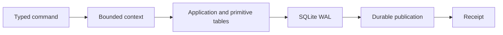
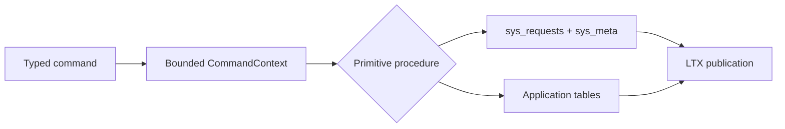
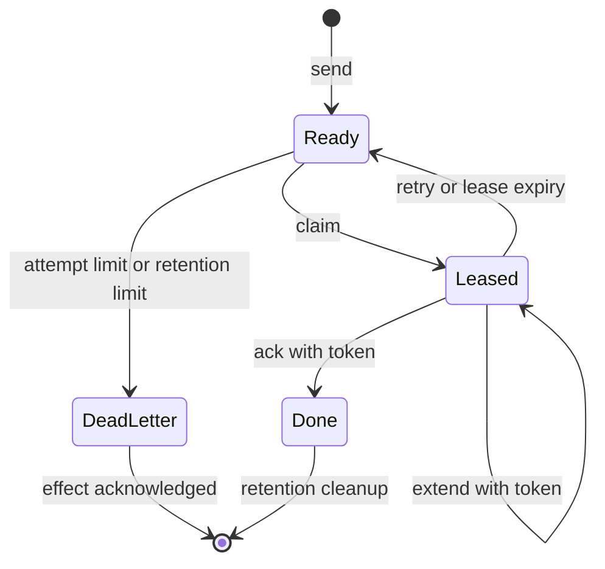
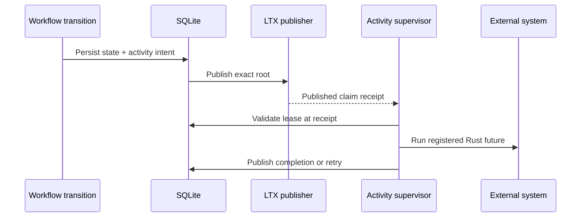
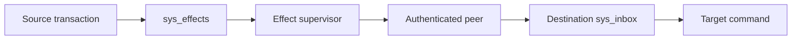

# Cell primitives

Cellule executes eight durable primitives through one Cell actor. Every
primitive shares the same request ledger, SQLite transaction, LTX capture,
publication gate, recovery, admission, and receipt — there is no second
durability path.

| Field | Value |
| --- | --- |
| Content type | Reference |
| Audience | Native module authors and runtime contributors |
| Goal | Choose and use a primitive without creating a second durability path |
| Status | Implemented for all eight primitives; capacity and fault claims need the evidence listed in [Qualification](delivery.md) |

## Contents

- [Overview](#overview)
- [One transaction boundary](#transaction-boundary)
- [Deduplicate every mutation](#deduplication)
- [SQL: relational state in one Cell](#sql)
- [KV: scoped atomic metadata](#kv)
- [Queue: at-least-once work](#queue)
- [Blob: transactional object data](#blob)
- [Cron: failover-safe recurring triggers](#cron)
- [Workflow: durable state machines](#workflow)
- [Effects: cross-Cell delivery](#effects)
- [Scheduler: advance time-based state](#scheduler)
- [Install only compiled primitive modules](#installation)
- [See also](#see-also)

<a id="overview"></a>
## Overview

Cross-Cell work uses durable effects and idempotent destination inboxes, never a
distributed SQL transaction.


```mermaid
flowchart LR
    Command[Typed command] --> Context[Bounded context]
    Context --> Tables[Application and primitive tables]
    Tables --> WAL[SQLite WAL]
    WAL --> Publish[Durable publication]
    Publish --> Receipt[Receipt]
```

| Primitive | Use | Partition key | Key behavior |
| --- | --- | --- | --- |
| SQL | Relational state in one Cell. | Explicit Cell target | Bounded parameterized statements and result rows. |
| KV | Scoped atomic metadata. | Scope hash | Checks before mutations; versioned values and expiry. |
| Blob | Large immutable content. | Object-key hash | Stage content, publish references, then safe cleanup. |
| Queue | At-least-once messages. | Producer hash for send, shard for claim | Claim leases and token-checked ack/extend/retry. |
| Workflow | Durable decisions across steps. | Workflow ID hash | Recorded outcomes and scheduled activities. |
| Activity | External work. | Owning workflow run | Explicit supervisor, lease, retry, and resolution. |
| Cron | Due recurring work. | Schedule-ID hash | Bounded scheduler activation and deduplicated ticks. |
| Effects | Cross-Cell delivery. | Destination Cell | Durable source intent and destination inbox. |

<a id="transaction-boundary"></a>
## Use one common transaction boundary

Commands receive `CommandContext`; queries receive `QueryContext`. Neither
exposes a raw connection.


```mermaid
flowchart LR
    Command[Typed command]
    Context[Bounded CommandContext]
    Primitive{Primitive procedure}
    Ledger[sys_requests + sys_meta]
    App[Application tables]
    LTX[LTX publication]

    Command --> Context --> Primitive
    Primitive --> Ledger
    Primitive --> App
    Ledger --> LTX
    App --> LTX
```

```text
one Cell transaction (SQLite)
├── sys_requests / sys_meta   runtime ledger and outcome
├── kv_/blob_/queue_/cron_/workflow_ tables   installed primitives
└── application tables   the compiled module
        │
        ▼
  committed WAL cut ──▶ immutable LTX root ──▶ control CAS ──▶ receipt
```

| Namespace | Owner | Application SQL access |
| --- | --- | --- |
| `sys_` | Runtime: request ledger, effects, inbox, sequence, due summary. | Denied. |
| `kv_`, `blob_`, `queue_`, `cron_`, `workflow_` | Installed primitive modules. | Denied. |
| Application tables | The compiled module that declares them. | Allowed through the module's own typed statements. |

The SQLite authorizer denies application SQL access to every reserved table,
transaction control, connection configuration, and schema change. Primitive
modules install their own schemas and expose typed capabilities through the
registry, so an application never issues raw primitive SQL.

<a id="deduplication"></a>
## Deduplicate every mutation

Application requests use a 16-byte request ID and a canonical operation digest.
The ledger stores the encoded outcome before commit.

| Existing row | New request | Result |
| --- | --- | --- |
| No row | Valid identity and digest | Execute once |
| Same ID and digest | Any retry | Return stored outcome |
| Same ID, different digest | Conflicting reuse | Durable rejection |
| Expired identity | Any payload | Reject before handler |

Destination effects use `sys_inbox` and a 32-byte effect ID. Internal scheduler
operations use short-lived identities that public listeners cannot submit.

<a id="sql"></a>
## Use SQL for repository-local relational state

`SqlCell<M>` runs bounded parameterized batches against an explicit Cell with
the SQL role.

```rust,ignore
let batch = SqlBatch {
    statements: vec![SqlStatement {
        sql: "INSERT INTO issues(title, state) VALUES(?, ?)".into(),
        parameters: vec![
            SqlValue::Text(title),
            SqlValue::Text("open".into()),
        ],
    }],
};

let committed = sql.batch(identity, batch).await?;
```

| SQL contract | Limit or behavior |
| --- | --- |
| Statements per batch | 128 |
| Encoded input | 1 MiB |
| Result rows | 1,000 |
| Encoded output | 1 MiB |
| Query path | Read-only statements only |
| Command path | Mutating statements only |
| Rejected statements | Transaction control and schema changes |

Repository handlers should prefer typed command and query types over exposing
arbitrary SQL at the HTTP boundary.

<a id="kv"></a>
## Use KV for scoped atomic metadata

`KvNamespace<M>` hashes the scope to a fixed shard. Keys and list prefixes never
cross that shard.

```rust,ignore
let request = KvAtomicRequest {
    scope: b"repo:123".to_vec(),
    checks: vec![KvCheck {
        key: b"settings/version".to_vec(),
        condition: KvCondition::Version(expected),
    }],
    mutations: vec![KvMutation::Put {
        key: b"settings/default_branch".to_vec(),
        value: b"main".to_vec(),
        expires_at_ms: None,
    }],
};

let outcome = kv.atomic(identity, request).await?;
```

The KV procedure applies all checks before any mutation. A failed check returns a
durable `PreconditionFailed` outcome.

| KV contract | Limit or behavior |
| --- | --- |
| Atomic items | 128 checks and mutations combined |
| Value | 4 MiB |
| Atomic operation | 4 MiB plus 64 KiB for keys and framing |
| List page | 1 MiB ordinarily; one larger value occupies its own page |
| Version | Incarnation plus sequence, 28 bytes |
| Expiry | Logical timestamp evaluated inside the Cell |
| List order | Binary key order within one scope and prefix |
| Cleanup | Bounded scheduler Tick |

KV values remain in the Cell's SQLite database and LTX history.

- A module that uses the 4 MiB maximum must declare an atomic input limit and get/list output limits of at least 4 MiB plus 64 KiB for framing.
- The aggregate atomic and list-page budgets prevent a batch of maximum-sized values from bypassing admission.

For frequently replaced large bodies, use Blob to avoid repeated SQLite and LTX
writes. Deleting and recreating a key produces a new version: an old version
cannot match the new incarnation and sequence.

<a id="queue"></a>
## Use Queue for at-least-once work

Queue sends hash the producer ID to a shard. Consumers claim one explicit shard
at a time.

```rust,ignore
let sent = queue
    .send(identity, QueueSendRequest {
        producer_id: request_id,
        payload,
        available_at_ms: now_ms,
    })
    .await?;

let claimed = queue
    .claim(
        claim_identity,
        shard,
        QueueClaimRequest { limit: 16, lease_ms: 30_000 },
    )
    .await?;
```


```mermaid
stateDiagram-v2
    [*] --> Ready: send
    Ready --> Leased: claim
    Leased --> Done: ack with token
    Leased --> Ready: retry or lease expiry
    Leased --> Leased: extend with token
    Ready --> DeadLetter: attempt limit or retention limit
    DeadLetter --> [*]: effect acknowledged
    Done --> [*]: retention cleanup
```

The claim command publishes its lease before returning payloads. Consumers
validate the exact token at the claim receipt before starting external work.

| Queue contract | Limit or behavior |
| --- | --- |
| Payload | 256 KiB |
| Claim batch | Bounded by registered command output and item limit |
| Lease | 5s to 300s |
| Attempts | 20 |
| Retention | 30 days from enqueue |
| Ordering | No FIFO guarantee |
| Delivery | At least once |

A ready message past its retention limit is dead-lettered rather than dropped:

- The expire class moves it to `DeadLetter` with its payload.
- The configured dead-letter target receives a typed effect when one is registered.
- The retention class runs before that transition inside one Tick.
- Cleanup removes the message on a later Tick once its effect has settled, so terminal rows stay observable for at least one Tick.

A dead-letter transition inserts a typed durable effect in the same transaction.
The source row retains its payload until that effect reaches a terminal state.

Queue controls are shard-scoped and use the same request ledger as sends and
leases:

- **Pause** stops new claims and makes published-claim revalidation fail, while live leases may still ack, retry, or extend.
- **Resume** reopens claims and advances a monotonic control generation.
- **Purge** deletes only non-leased messages in batches of at most 128.
- **Redrive** moves dead messages back to ready only after any dead-letter effect is terminal.
- **Info** returns bounded aggregate counts instead of scanning message payloads.

<a id="blob"></a>
## Use Blob for transactional object data

`BlobNamespace<M>` hashes the object key to a stable shard. These commit in one
SQLite transaction domain:

- Multipart upload metadata and part digests
- The published manifest and request outcomes
- LTX state

Part bytes are immutable, content-addressed objects in the configured object
store. A completed manifest never points at an unrecorded part reference, and
range reads verify each object-store part before returning bytes after restore
or failover.

| Blob contract | Limit or behavior |
| --- | --- |
| Key | 1 to 1,024 bytes |
| Part | 256 KiB |
| Parts | 4,096 |
| Object | 1 GiB |
| Range read | 512 KiB |
| User metadata | 8 KiB |
| Upload lifetime | 1 minute to 7 days from mutation issuance; acceptance rejects an already expired upload |
| List | 128 objects from one explicit shard |

Blob supports:

- Multipart begin, idempotent part upload, atomic complete, and abort
- Create-only and ETag compare-and-swap publication or deletion
- Per-part BLAKE3 integrity verification on write and range read
- Bounded range reads and lexicographic per-shard listing
- Atomic replacement followed by deletion of the unreferenced prior upload
- Scheduler cleanup of expired, unpublished uploads

Blob bodies do not live in the Cell database. `BlobNamespace` uploads each
bounded part to the configured object store before committing its digest and
size in SQLite. The manifest is the durable publication boundary; unreferenced
content-addressed parts are safe to retry.

`BlobNamespace::prepare_mutation` performs the same bounded staging and returns
a typed prepared command before Cell dispatch. Retain its evidence before
execution and resolve it after cancellation or an uncertain reply. Staging
alone does not publish the object; the existing `mutate` convenience method
uses this same preparation and execution path.

The configured object-store lifecycle policy must reclaim abandoned parts. The
`BlobArtifactStore::sweep_unreferenced` building block limits each pass to 128
deletions but scans the unordered listing until that limit is reached.

A product-level collector must:

- Quiesce writes throughout the scope
- Pass references from every Cell sharing it
- Use a grace cutoff

The helper is not wired to a product collector yet.

### Own accepted Blob operations during shutdown

All clones of one `BlobArtifactStore` share one irreversible admission word.
The store admits at most 64 original operations. A public namespace mutation
retains staging through its command response; a range read retains metadata
lookup and every part read. Closing between parts cannot interrupt that accepted
read. Cancellation removes the caller's waiter while the original operation
continues. GC retains an `Arc<BTreeSet<[u8; 32]>>` with the complete supplied
reference set through original listing/deletion, even after caller loss.

| API | Local guarantee |
| --- | --- |
| `close()` | Refuse new namespace operations and GC through every clone. |
| `close_and_join()` | Close admission and join known original operations; return an error if any original native join was lost. Cancelled join waiters do not cancel work or reopen admission. |
| `lifecycle_observation()` | Capture admission, accepted-operation count, unjoined original work and the first source-bearing failure. Local joining requires closed admission, zero accepted operations and zero unjoined work. |

A joined operation can have failed or returned an uncertain command result.
Forced Tokio runtime teardown can discard a supervisor while an original
provider worker still runs. This irreversibly closes admission and retains an
unproven join even after that worker finishes. Zero accepted operations cannot
clear it; `locally_joined()` remains false and repeated close/join returns an
error. Native joining cannot be reconstructed from a later object-store read.
Retained diagnostics preserve the original source; they do not establish remote
absence or success. Preparing a mutation still returns a caller-owned
`PreparedCommand`: after return, its later execution is outside the store job
count and uses normal Cell admission and durability. Retain its evidence and
resolve uncertain execution. Store closure cannot revoke that command or prove
all writes in the object-store scope are quiesced.

Install the same store with `CellNode::install_blob_artifact_store` before
readiness, after the task group, and pass its returned clone to
`CellClient::with_blob_artifact_store`. The existing host drain closes and joins
it before runtime shutdown. This local lifetime boundary supplies no complete
Cell-scoped upload, stream, pin, migration or cross-Cell retention proof.
`BlobInventory` therefore still blocks maintenance release. The global collector
must protect outstanding read/pin obligations as well as authoritative manifest
references and quiesced writes; the store's local count alone cannot authorize
deletion or fleet finalization.

<a id="cron"></a>
## Use Cron for failover-safe recurring triggers

Cron schedules are durable rows advanced only by the serialized Cell Tick. Each
due occurrence inserts a typed cross-Cell effect and advances `next_due_ms` in
the same transaction.

The destination receives `CronInvocation`, which includes schedule ID,
generation, occurrence, scheduled timestamp, and the module payload. Registry
construction verifies every compiled target namespace, command ID, codec
version, and input limit against the release descriptor.

| Cron contract | Limit or behavior |
| --- | --- |
| Minimum interval | 1 second |
| Maximum interval | 1 year |
| First due time | Up to 5 years ahead |
| Payload | 256 KiB |
| Catch-up | One durable occurrence at a time, bounded by Tick budget |
| Delivery | Durable effect with destination inbox deduplication |
| Controls | Upsert, pause, resume at an explicit time, delete |

A schedule is a fixed interval plus an explicit first due time. Cron expressions
and time zones are not part of this contract:

- `Upsert` takes `interval_ms` inside the interval bounds above.
- Every fire advances the schedule by exactly one interval.

An application that needs calendar semantics computes the next due time itself
and resumes the schedule at that instant with the documented controls, so the
expression dialect and zone database stay above the primitive.

Blob upload lifetime and Cron's first-due window are evaluated from the
mutation's issued timestamp:

- The serialized Cell still rejects a Blob upload whose expiry has passed before acceptance.
- A Cron schedule whose due time passes while the mutation is waiting is accepted and becomes eligible on the next Tick.

That preserves the caller's absolute schedule without making request latency a
correctness failure.

An owner crash after commit cannot lose an occurrence: the effect and next
occurrence are in the same LTX root. A retry cannot execute the destination
command twice because its inbox resolves the stable effect identity.

<a id="workflow"></a>
## Use Workflow for durable state machines

A workflow definition is compiled Rust with a stable digest. New runs pin the
current digest; existing runs continue with the retained definition they started
with.

```rust,ignore
impl WorkflowDefinition for MergeWorkflowV1 {
    fn digest(&self) -> Digest { MERGE_V1_DIGEST }

    fn transition(
        &self,
        state: &[u8],
        event: &[u8],
        context: WorkflowContext,
    ) -> Result<WorkflowDecision> {
        let event = MergeEvent::decode(event)?;
        decide_merge(state, event, context)
    }
}
```

Workflow transitions run inside SQLite and may produce:

- New durable workflow state
- Timers
- Native activities
- Typed cross-Cell effects
- Terminal completion, failure, or cancellation

The transition callback cannot perform network or object-store I/O. Native
activities run after their claim root is published.


```mermaid
sequenceDiagram
    participant T as Workflow transition
    participant DB as SQLite
    participant P as LTX publisher
    participant A as Activity supervisor
    participant E as External system

    T->>DB: Persist state + activity intent
    DB->>P: Publish exact root
    P-->>A: Published claim receipt
    A->>DB: Validate lease at receipt
    A->>E: Run registered Rust future
    A->>DB: Publish completion or retry
```

Workflow IDs select the shard. Signal IDs make delivery idempotent. Activity
completion requires the exact lease token and attempt.

| Workflow contract | Limit or behavior |
| --- | --- |
| State or event payload | 1 MiB |
| Activity payload | 256 KiB |
| Activity attempts | 20 |
| Activity lifetime | 7 days |
| Definitions | Current plus every digest referenced by stored runs |
| Execution | Deterministic transition; retryable native activity |

Workflow controls preserve the deterministic history boundary:

- **Pause** is accepted only when no activity lease is live. Ready activities and timers remain durable but cannot be claimed or fired.
- **Resume** returns the same run to running state without synthesizing an event.
- **Restart** is accepted only for a terminal run. It deletes the terminal local history and starts a new run under a new request-derived run ID and the current definition.
- **Cancel** remains an idempotent workflow event and cancels outstanding local work.

The quiescent-pause rule avoids converting an already-running external side
effect into a lost completion and unintended replay.

<a id="effects"></a>
## Deliver cross-Cell effects through an inbox

A command emits typed Cell effects through `CommandContext::emit_effect`, which
uses the command-owned allocator. Effects carry typed Cell commands only and
inherit the source tenant and application.


```mermaid
flowchart LR
    Source[Source transaction]
    Ledger[sys_effects]
    Supervisor[Effect supervisor]
    Peer[Authenticated peer]
    Inbox[Destination sys_inbox]
    Target[Target command]

    Source --> Ledger --> Supervisor --> Peer --> Inbox --> Target
```

Registry validation requires every effect target namespace to be declared.
Cross-tenant targets fail before writes.

| Effect contract | Limit or behavior |
| --- | --- |
| Encoded input | At most 1 MiB; claim and acknowledgement budgets reserve their fixed overhead inside the same bound |
| Claim batch | 1 to 32 effects per claim |
| Lease | 5s to 300s, and an extension stays inside the same bounds |
| Attempts | 20, after which the effect fails instead of retrying |
| Effect lifetime | At most 7 days from emission; a longer requested expiry is rejected |
| Inbox retention | 7 days past the effect's own expiry, then the destination inbox drops the record |
| Destination | Same tenant and application; a cross-tenant target fails before any write |
| Delivery | At least once, with idempotent destination execution |

The delivery path preserves these properties:

- Effect bytes and operation digest remain stable across retries
- Destination incarnation is resolved at delivery time
- Destination inbox deduplicates execution
- Destination success means its exact root was published
- Source acknowledgement happens in a later source transaction
- `Resolve` recovers an ambiguous destination result

The design does not claim an atomic transaction across source and destination. It
provides durable at-least-once delivery with idempotent destination execution.

<a id="scheduler"></a>
## Let the scheduler advance time-based state

Each mutating procedure recomputes the earliest due timestamp inside its
transaction. The typed Tick advances bounded work from all installed classes.

| Maintenance class | Example |
| --- | --- |
| Request ledger | Delete expired outcomes |
| KV | Remove expired entries |
| Queue | Reclaim leases, expire messages, clean terminal rows |
| Workflow | Fire timers, retry activities, clean terminal runs |
| Blob | Delete expired unpublished uploads |
| Cron | Publish due occurrences and advance schedules |
| Effects | Claim, retry, extend, acknowledge, clean source or inbox rows |

When a Tick reports no local transition, the compiled registry tells the
scheduler whether an activity or effect runner can claim work for that
namespace.

<a id="installation"></a>
## Install only compiled primitive modules

Primitive mechanics are reusable, but registration is not automatic. A new
module must include:

1. A concrete native Rust module caller
2. A stable namespace and shard count
3. A SQL migration with a checked digest
4. Typed operation IDs and codec fixtures
5. Exact-root restore coverage
6. Capacity and failure tests for its workload

Do not add a public generic SQL, KV, Blob, Queue, Cron, or Workflow endpoint.
Product-specific HTTP handlers remain the external API.

## See also

| Next step | Read |
| --- | --- |
| Author-facing example of every primitive | [Application guide](../../cellule-app/docs/README.md) |
| Authoring modules and typed capabilities | [Native Rust authoring](rust-api.md) |
| Storage inputs and constraints | [Contract SQL](contracts/runtime.sql) |
| Proof levels for capacity and failure claims | [Qualification](delivery.md) |
