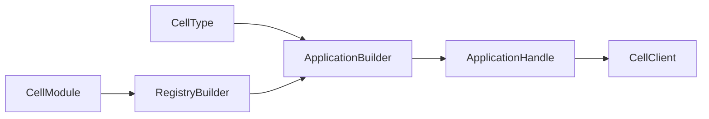
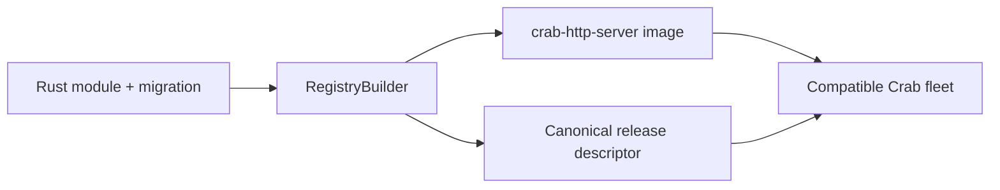
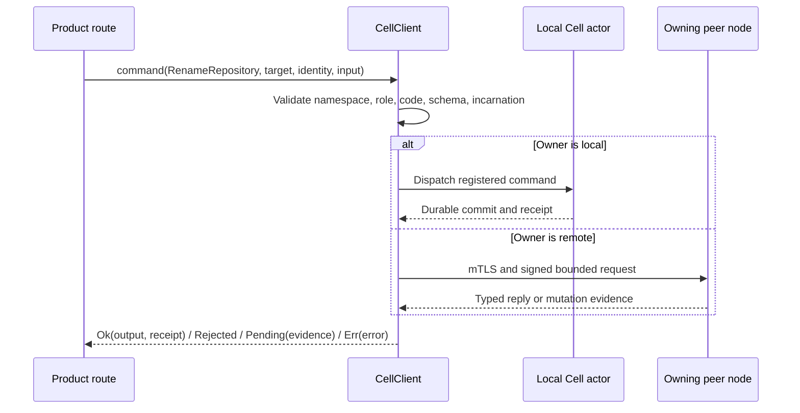
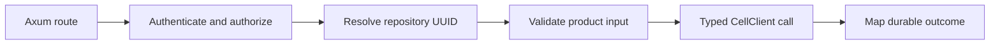
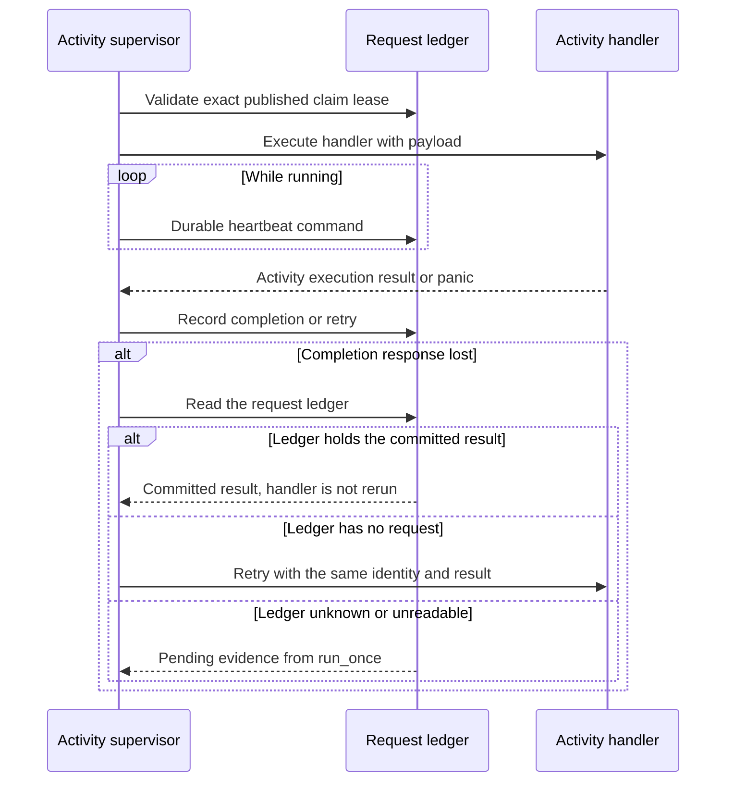
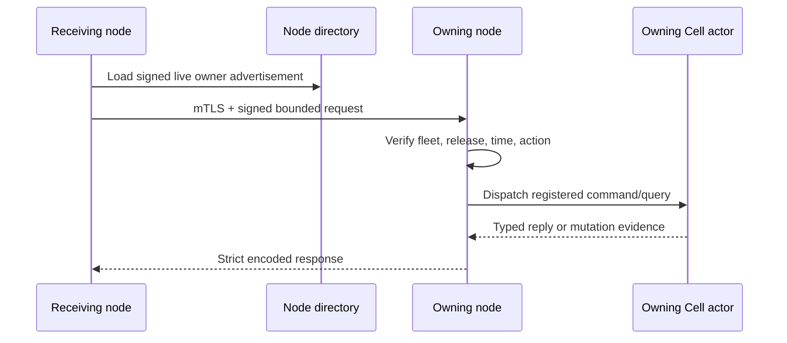

# Native Rust authoring

*Compile-time module registration, typed commands and queries, bounded codecs,
transaction-scoped capabilities, and private peer routing.*

Crab is the historical embedding application for these mechanics. Cellule keeps
the compile-time boundary, registry, codec, context, client, activity, and peer
contracts; HTTP ingress, product authorization, credentials, and deployment
policy belong to the embedding application. See the [Runtime guide](README.md).

| Field | Value |
| --- | --- |
| Content type | How-to and API reference |
| Audience | Module authors, Cellule contributors, and embedding-service engineers |
| Goal | Add one typed application feature and route it through the embedding service |
| Status | Current framework mechanics; Crab server routes and deployment steps are historical embedding examples |

<a id="contents"></a>
## Contents

- [Overview](#overview)
- [Understand the compile-time boundary](#compile-time-boundary)
- [Declare a module descriptor](#module-descriptor)
- [Register typed commands and queries](#commands-and-queries)
- [Encode bounded wire values](#wire-values)
- [Use transaction-scoped capabilities](#contexts)
- [Call a command through CellClient](#cell-client)
- [Stream mutable Cell state safely](#state-streams)
- [Keep HTTP policy in crab-http-server](#http-policy)
- [Register a primitive capability](#primitive-capability)
- [Run external work as a native activity](#native-activities)
- [Forward only private registered messages](#peer-protocol)
- [Add a native feature](#feature-checklist)
- [Preserve version compatibility during rollout](#compatibility)
- [See also](#see-also)

<a id="overview"></a>
## Overview

Register statically linked modules, stable operation IDs, codecs, and a Cell
topology before host readiness. An author handle exposes typed commands and
queries; it does not expose raw SQLite, authority, or provider credentials.



| Author decision | Contract |
| --- | --- |
| Module and operation IDs | Stable across compatible releases. |
| Input/output codecs | Bounded and versioned. |
| Cell topology | Fixed shard or entity partition; descriptor digest changes on edits. |
| Command | One Cell transaction and durable result. |
| Query | Owner-ordered or explicit admitted-replica read. |
| Activity | External work outside the SQLite transaction, supervised explicitly. |

```rust
use cellule_runtime::{ApplicationId, NamespaceId, TenantId};

let tenant = TenantId::from_bytes([1; 16]);
let application = ApplicationId::from_bytes([2; 16]);
let namespace = NamespaceId::from_bytes([3; 16]);
assert_ne!(tenant.as_bytes(), application.as_bytes());
assert_eq!(namespace.as_bytes().len(), 16);
```

Use the current [Cellule API guide](../../../docs/api.md) for application
composition, typed capabilities, receipts, and outcome handling.

The compiled [application topology example](../../cellule-app/README.md) and
[SQL command example](../../cellule-app/examples/sql.rs) show complete
registration and read-back.

The application decides HTTP and user policy; no primitive is a public network
endpoint by itself.

<a id="compile-time-boundary"></a>
## Understand the compile-time boundary

Crab services are statically linked Rust modules. A module declares stable
schemas, operation IDs, codecs, namespaces, workflow definitions, and
activities; `crab-http-server` freezes that inventory before readiness.

The server is the only composition root. Repository owners cannot upload
executable code or choose a module set at runtime.



**The runtime intentionally excludes**

- Dynamic libraries
- WebAssembly or JavaScript execution
- Subprocess handlers
- Network registration
- Public primitive SDKs
- Per-repository executable bundles

A separate workspace crate may organize domain code, but `crab-http-server`
still owns registration, authentication, routing, and lifecycle.

<a id="module-descriptor"></a>
## Declare a module descriptor

`ModuleDescriptor` is static inventory. `RegistryBuilder::finish` compares it
with the functions actually bound by the binary.

**Static inventory fields**

```rust,ignore
static REPOSITORY: ModuleDescriptor = ModuleDescriptor {
    name: "repository",
    source_digest: REPOSITORY_SOURCE_DIGEST,
    retained_codes: RETAINED_CODES,
    schema_min: 1,
    schema_max: 2,
    migrations: MIGRATIONS,
    commands: COMMANDS,
    queries: QUERIES,
    workflow_definitions: WORKFLOW_DIGESTS,
    activity_types: ACTIVITY_TYPES,
    namespaces: NAMESPACES,
};
```

**The registry rejects**

- Duplicate module, namespace, command, or query IDs
- Missing or extra function bindings
- Noncontiguous schema migration coverage
- Incorrect migration digests
- Narrowed codec ranges or byte limits
- Commands whose module does not own the target namespace
- Undeclared effect targets
- Queue dead-letter cycles
- Missing workflow definitions or activity bindings

**The bounds are part of the contract**

| Field | Bound |
| --- | --- |
| Build source revision | 1-128 characters, with a nonzero lock digest |
| Modules per build | 1-128 |
| Namespaces per build | At most 128, each with a 1-128 character name and 1-4096 shards that are a power of two |
| Module schema range | `schema_min` at least 1, `schema_max` at least `schema_min`, nonzero source digest |
| Migration SQL | Nonempty, at most 1 MiB, contiguous from `schema_min`, digest-bound |
| Operation input and output limits | 1 byte to the wire bound (4 MiB + 64 KiB) |

Registration order does not change canonical release bytes.

<a id="commands-and-queries"></a>
## Register typed commands and queries

**Operation kinds**

| Operation | Contract |
| --- | --- |
| Command | Mutates one Cell. |
| Query | Observes one Cell at an optional minimum receipt. |

**Command declaration**

```rust,ignore
pub struct RenameRepository;

impl Command for RenameRepository {
    const MODULE: &'static str = "repository";
    const ID: u32 = 21;
    const CODEC_VERSION: u32 = 1;

    type Input = RenameInput;
    type Output = RepositorySettings;

    fn execute(
        context: &mut CommandContext<'_, '_>,
        input: RenameInput,
    ) -> Result<CommandResult<Self::Output>> {
        rename_repository(context, input)
    }
}
```

**Binding**

The registry uses monomorphized decode, execute, and encode trampolines. It does
not expose a raw byte-handler escape hatch.

```rust,ignore
registry.bind_command::<RenameRepository>()?;
registry.bind_query::<GetRepositorySettings>()?;
```

- **Command and query IDs** are independent.
- **Wire shapes** change only with a new codec version, not a silent
  reinterpretation.

<a id="wire-values"></a>
## Encode bounded wire values

Every command input and output implements `WireValue`. The codec supports:

- Fixed-width scalars
- Bounded bytes and text
- Counts
- Strict option tags

**Codec implementation**

```rust,ignore
impl WireValue for RenameInput {
    fn encode(&self, out: &mut BoundedEncoder) -> Result<(), CodecError> {
        out.write_text(&self.name)
    }

    fn decode(input: &mut BoundedDecoder<'_>) -> Result<Self, CodecError> {
        Ok(Self {
            name: input.read_text()?.to_owned(),
        })
    }
}
```

**Decoding rejects**

- Trailing bytes
- Invalid tags
- Noncanonical floating-point values
- Declared-limit overflow

Add exact byte fixtures for every new input and output version.

<a id="contexts"></a>
## Use transaction-scoped capabilities

`CommandContext` exposes deterministic metadata and bounded procedures.

| Capability | Purpose |
| --- | --- |
| `cell_id()` | Read the verified target Cell ID |
| `target()` | Derive deterministic effect targets |
| `owner_fence()` | Compare a stored operation token with the admitted incarnation/epoch |
| `sequence()` | Allocate stable transition-local identities |
| `now_ms()` | Use the runtime-sampled logical timestamp |
| `sql()` | Execute an authorized bounded SQL batch |
| `emit_effect(&EffectCommandIntent)` | Append one typed cross-Cell intention to the command ledger |

`OwnerFence` is available from `control` and `registry`. The runtime stamps it
on the activation's admission capability and supplies it to typed commands and
inbox effect handlers. Renewal, ordinary publication and schema migration keep
the same incarnation/epoch; an ownership claim advances the epoch. A stale
handle keeps its original value but cannot admit new work. The value alone is
not authority and does not replace current application policy checks or the
runtime's durable response gate. Exact stored-outcome replay skips the handler,
so it preserves the original result rather than substituting the new owner's
fence.

**`QueryContext` exposes** the Cell ID, commit sequence, logical timestamp, and
bounded read-only SQL.

**Timestamp rules**

- Command and query timestamps are at least the logical time persisted in the
  Cell snapshot.
- This includes forwarded commands, effect delivery, and explicit replica
  queries: a backward clock sample cannot hide already-due work or expose values
  that expired before that committed time.
- Queries do not advance persisted time.
- Request expiry and owner/session fencing continue to use their own clock and
  lease checks.

**Contexts do not expose** database paths, raw object storage, control records,
HTTP clients, or transaction commit methods.

<a id="cell-client"></a>
## Call a command through CellClient

Product code resolves a `CellTarget`, authenticates the product request, and
creates a stable mutation identity before dispatch.

**Typed dispatch**

```rust,ignore
let result = client
    .command::<RenameRepository>(
        &target,
        MutationIdentity {
            request_id,
            issued_at_ms: issued_at,
            expires_at_ms: expires_at,
        },
        RenameInput { name },
    )
    .await;

match result {
    Ok(committed) => respond(committed.output, committed.receipt),
    Err(InvocationError::Rejected(committed)) => reject(*committed),
    Err(InvocationError::Pending(evidence)) => resolve_later(*evidence),
    Err(error) => fail(error),
}
```

`CellClient` validates namespace, role, code, schema, and incarnation. It chooses
the local actor or authenticated peer path without changing command semantics.



**Prepared commands for cancellation-safe dispatch**

- Use `ApplicationHandle::prepare_command::<C>` when the caller may be cancelled
  while awaiting dispatch, and retain a clone before calling
  `PreparedCommand::execute`.
- The prepared value fixes the exact input digest, identity, and owner
  incarnation before any mutation is sent.
- After cancellation, resolve its `evidence()` through a separate application
  handle.
- Retry the retained prepared command only when resolution is `Absent`.
- Treat `Committed` as final; `Unknown`, `Expired`, or resolution failure is
  unresolved.
- Preparation itself has no mutation side effect.

<a id="state-streams"></a>
## Stream mutable Cell state safely

Use `CellStateStream` when a response producer must query mutable Cell state
after the response head.

**Emission guarantees**

- **Serial** and **receipt-monotonic**: each `emit` passes the preceding
  `Receipt` as the next minimum watermark.
- **One deadline** bounds the stream.
- **Fail-closed** on cancellation or owner fencing.

```rust,ignore
let mut stream = client
    .open_state_stream::<GetRepositoryEvents>(&target, deadline)
    .await?;

let first = stream.emit(GetEventsInput { after: None }).await?;
send_chunk(first.output).await?;

let next = stream
    .emit(GetEventsInput {
        after: Some(first.receipt.commit_sequence),
    })
    .await?;
send_chunk(next.output).await?;

stream.finish();
```

**Adapter rules**

- Crab HTTP routes use `crab_http_server::state_observing_body` to send a chunk
  only after `emit` returns; it must not read the Cell handle or logical head
  directly.
- The helper serializes input consumption and cancels the stream when the body is
  dropped.
- A custom adapter can call `stream.cancellation().cancel()` from a disconnect
  handler to wake a pending emission.

<a id="http-policy"></a>
## Keep HTTP policy in crab-http-server

A route adapter performs product concerns before invoking the runtime. This is
the historical Crab embedding: in Cellule terms the adapter is application code,
so HTTP ingress and product policy stay outside the runtime.



**The runtime must not know**

- Browser sessions
- Repository names
- Organization roles
- Git ref policy
- HTTP status codes

<a id="primitive-capability"></a>
## Register a primitive capability

Primitive modules bind fixed operation IDs to their typed handles.

```rust,ignore
impl KvModule for RepositoryCache {
    const MODULE: &'static str = "repository";
    const ATOMIC_COMMAND_ID: u32 = 30;
    const GET_QUERY_ID: u32 = 31;
    const LIST_QUERY_ID: u32 = 32;
}

register_kv::<RepositoryCache>(&mut registry)?;
```

**Binding rules**

- The namespace descriptor must declare the matching role and shard count.
- Blob, Queue, Cron, and Workflow modules also implement maintenance registration
  so the scheduler can advance upload expiry, leases, occurrences, timers, and
  retention.
- Cron target bindings are checked against the destination namespace owner,
  command ID, codec version, and exact input limit before readiness.

Read [primitives.md](primitives.md) before binding a primitive.

<a id="native-activities"></a>
## Run external work as a native activity

Command handlers stay synchronous and deterministic. An activity may call Git,
object storage, or another service after its claim root is published.

**Activity handler**

```rust,ignore
impl ActivityHandler for PublishRelease {
    const TYPE: &'static str = "publish-release";

    fn execute(
        context: ActivityContext,
        payload: Vec<u8>,
    ) -> Pin<Box<dyn Future<Output = ActivityExecution> + Send + 'static>> {
        Box::pin(async move {
            publish_release(context, payload).await
        })
    }
}
```

**Execution bounds**

- Async activities run under a CPU-derived bound.
- Blocking activities reserve a slot in a joined fixed operating-system thread
  pool before claim.

**Supervision**

- The supervisor validates the exact published lease, heartbeats through durable
  commands, and records completion or retry.
- If a completion response is lost, it checks the request ledger: a committed
  result is returned without rerunning the handler, while an absent request is
  retried with the same identity and result.
- If the ledger remains unknown or cannot be read, `run_once` returns pending
  evidence; the caller must treat that activity result as unresolved.
- Panic becomes activity failure and does not kill the pool.



<a id="peer-protocol"></a>
## Forward only private registered messages

The peer protocol is private to compatible Crab nodes.
[`contracts/peer.proto`](contracts/peer.proto) defines messages but no generated
public service.



**Forwarding rules**

- The protocol permits at most two forwarding hops.
- Mutation retries happen only when transport proves the first attempt did not
  start.
- Ambiguous attempts use `Resolve`.

**Signed request fields**

Commands, queries, and mutation resolution carry a signed expected Cell ID,
incarnation, code digest, and schema.

- The receiver compares all four with its resolved owner handle before execution
  or ledger lookup.
- Actor admission still fences ownership changes after resolution.
- A stale observation returns a not-started refusal. It cannot authorize a
  different Cell or schema.

**Reusing an observed description**

A host that already read this description from Cell authority can bind one routed
request with `CellClient::with_observed_description`.

- This avoids the extra peer `Describe` round trip.
- The binding is specific to that Cell and does not refresh itself: after
  refusal, resolve a fresh route and retain any pending mutation's original
  identity and digest.
- Other clients obtain the description through their transport.
- Effect delivery retains its destination incarnation and durable inbox
  contract; migration already carries both source and successor code/schema.

**Wire contract note**

- These required fields revise the unshipped private wire contract.
- Compatible application rollout tests use nodes implementing the same peer
  contract; older private binaries that omit or reject these fields cannot
  participate.

Native SQL, KV, Blob, Queue, Cron, Workflow, Activity, and Effect operations
cross this private boundary as registered `CellCommand`/`CellQuery` codecs. The
wire contract deliberately has no primitive-specific peer operation path; those
commands remain behind the application registry and its module checks.

SQL text never crosses the migration peer boundary. The owner derives a trusted
migration from its frozen registry.

<a id="feature-checklist"></a>
## Add a native feature

Implement one vertical slice in this order:

```text
migration+digest -> descriptors -> WireValue -> typed ops -> registry bindings
      -> route adapter -> tests -> release descriptor -> image rollout
```

1. Add the application migration and its checked digest
2. Declare stable namespace, operation, codec, and byte-limit descriptors
3. Implement `WireValue` for inputs and outputs
4. Implement typed commands, queries, or activities
5. Bind every declaration in the server's compiled registry
6. Add the authenticated product route adapter
7. Test replay, rejection, source-loss restore, and exact publication
8. Inspect the built binary's canonical release descriptor
9. Roll the complete server image through release activation

Keep the change one canonical path. Do not retain a legacy storage fallback
unless a shipped contract requires it.

<a id="compatibility"></a>
## Preserve version compatibility during rollout

**A rolling-compatible binary must retain**

- Every code and schema pair that authoritative Cells may still use.
- Referenced command codecs, migrations, workflow definitions, activities,
  namespaces, and byte limits.

**Release gate**

- The release gate rejects a candidate that narrows those contracts.
- An incompatible change requires maintenance activation and a purpose-built
  transform when stored work cannot drain naturally.
- Rollback operates at whole-image granularity. The older image may return only
  while its compiled registry still supports every authoritative Cell.

<a id="see-also"></a>
## See also

| Topic | Document |
| --- | --- |
| Runtime index, contracts, and crate commands | [Runtime guide](README.md) |
| SQL, KV, Blob, Queue, Cron, Workflow, Activity, and Effect primitives | [Cell primitives](primitives.md) |
| Request path, deadlines, takeover, and drain | [Execution](runtime.md) |
| Control, roots, recovery, and retention | [Storage](storage.md) |
| Follower durability and owner loss | [Failover and followers](failover-and-followers.md) |
| Fleet, release, drain, and operations | [Deployment](deployment.md) |
| Qualification levels and required evidence | [Delivery](delivery.md) |
| Application composition, typed capabilities, and receipts | [Cellule API guide](../../../docs/api.md) |
| Compiled registration and read-back examples | [cellule-app](../../cellule-app/README.md), [`examples/sql.rs`](../../cellule-app/examples/sql.rs) |
| Private peer messages | [`contracts/peer.proto`](contracts/peer.proto) |
| Design and audit record map | [Technical reference](technical-reference.md) |
