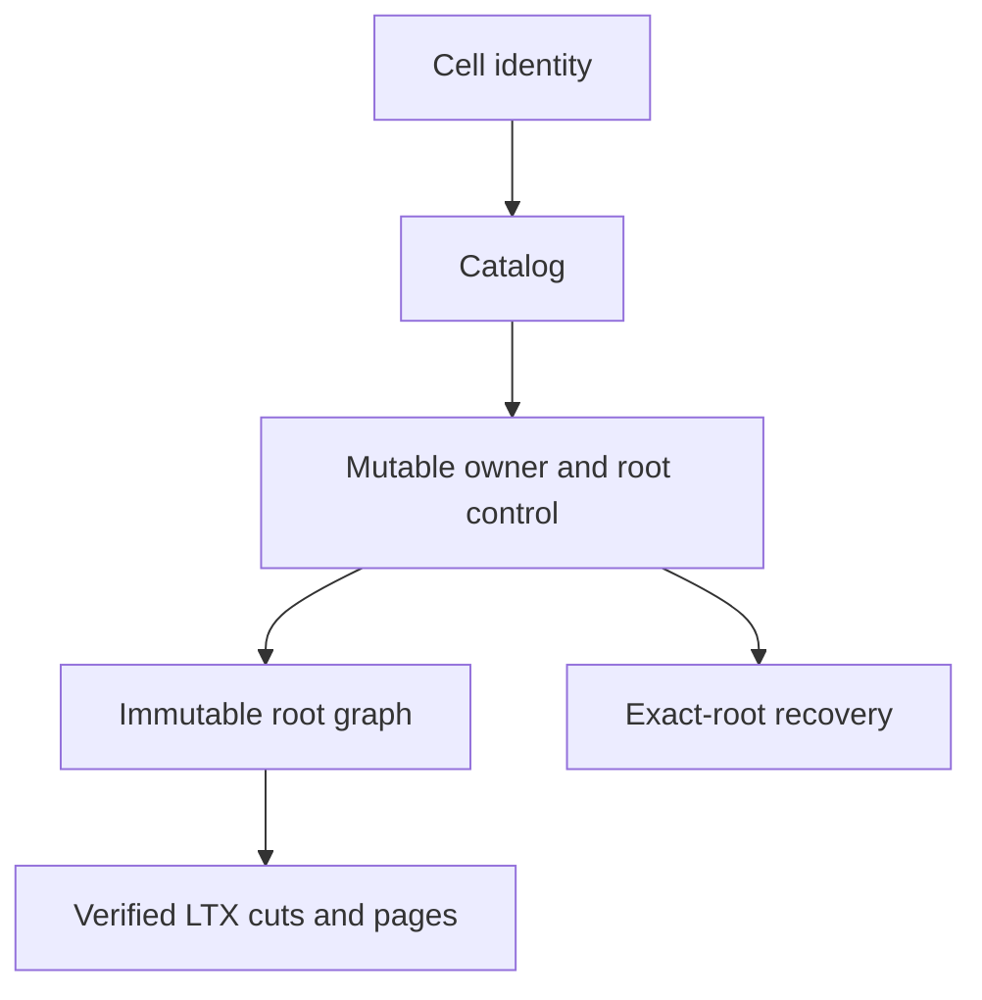
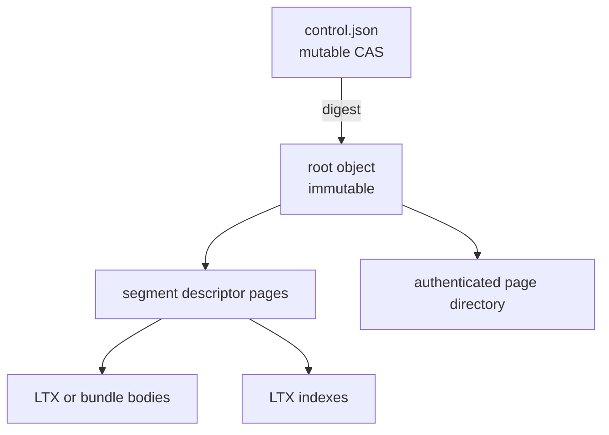
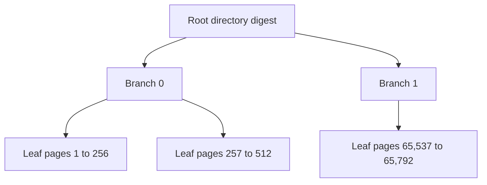
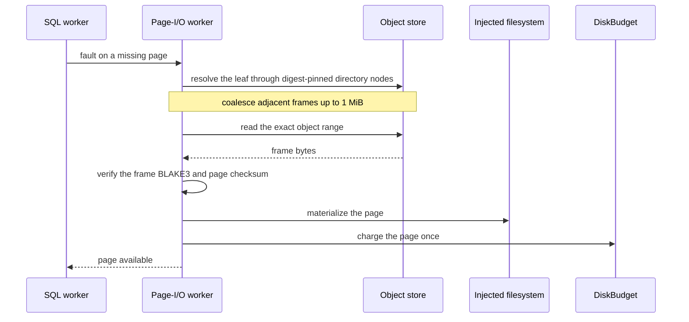
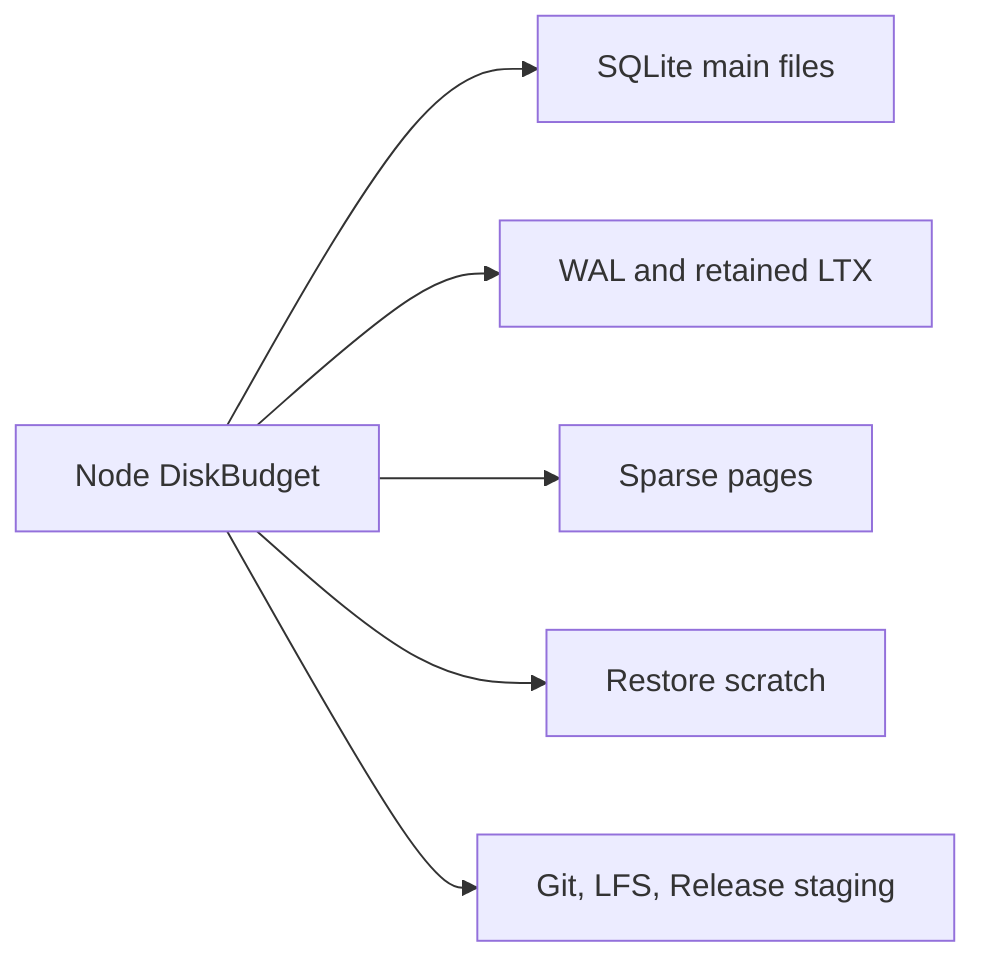
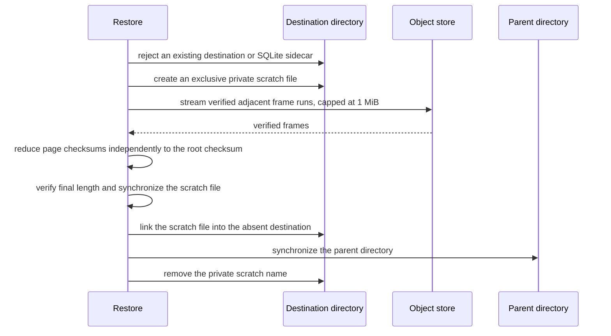
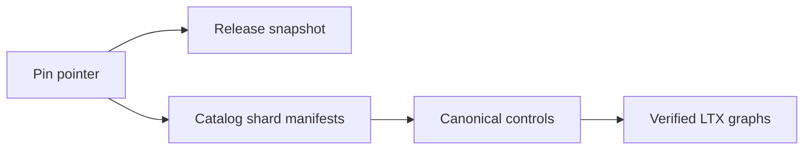

# Authority, storage, and recovery

One mutable authority record and one immutable object graph: identity, control,
roots, pages, restore, compaction, backup, and retention.

This page describes the implemented `cells/v1` object-store contract. The
in-place session record and control-pinned recovery overlay that make follower
fsync a valid response-release proof are specified in
[Follower durability and warm failover](failover-and-followers.md).

| Field | Value |
| --- | --- |
| Content type | Reference |
| Audience | Storage, LTX, and runtime contributors |
| Goal | Implement identity, control, root, page, and recovery paths without weakening verification |
| Status | Implemented `cells/v1` object-store contract; `v1` is the one current development format, not a release counter |

<a id="contents"></a>
## Contents

- [Overview](#overview)
- [Format policy: one current layout](#format-policy)
- [Derive stable identities](#identities)
- [Keep object paths typed](#object-paths)
- [Treat control as the only mutable Cell authority](#control-authority)
- [Store roots as bounded immutable graphs](#immutable-roots)
- [Locate pages with an authenticated radix tree](#page-directory)
- [Read sparse pages without blocking the SQL pool](#sparse-reads)
- [Share one local disk budget](#disk-budget)
- [Restore an exact root atomically](#exact-restore)
- [Compact without changing logical state](#compaction)
- [Catalog Cells before creating control](#catalog)
- [Pin one exact application backup boundary](#backup-pin)
- [Collect unreachable immutable objects behind maintenance](#collection)
- [Preserve storage verification invariants](#invariants)
- [See also](#see-also)

<a id="overview"></a>
## Overview

Cell storage separates one mutable authority record from immutable SQLite
history. Readers verify every immutable object by digest, while writers update
authority with an observed object-store ETag.

Cell identity binds tenant, application, namespace, and partition. The catalog
records admitted Cells; the mutable control record names one owner session and
one exact root. Object listings are not authority.



| Surface | Contract |
| --- | --- |
| Catalog | Admit and discover Cells within application scope. |
| Control | CAS owner, epoch, and exact root; stale writers fence. |
| Immutable root | Scope and authenticate referenced LTX and directory objects. |
| Backup | Pin one exact application boundary. |
| Retention | Keep referenced and grace-period objects; delete only after proof. |
| Recovery | Verify every required object before serving. |

**Publication and read semantics**

- **Proposal versus authority.** A prepared root is a proposal. A successful
  control CAS makes it authoritative; a conflict fences the old owner.
- **Abandoned proposals.** Failed or abandoned proposals may leave unreachable
  content, which retention later handles without deleting referenced objects.
- **Sparse reads.** Sparse reads authenticate pages under the pinned root. A
  fresh writer may hydrate missing pages in bounded steps, but cannot use stale
  activation work.

See [cellule-ltx recovery](../../cellule-ltx/docs/recovery.md) for the LTX
mechanics and [cellule-store](../../cellule-store/docs/README.md) for provider
transport.

<a id="format-policy"></a>
## Format policy: one current layout

- **One development format.** `v1` names the one current development format; it
  is not a release counter.
- **Atomic format change.** Until the framework ships a persistent Cell format, storage
  changes update this layout, its document schemas, all readers and writers,
  tests, and documentation in one change.
- **Recreatable data.** Development data may be recreated.
- **No compatibility machinery.** Do not introduce a new `cells/vN` prefix,
  dual readers, compatibility branches, or migration code merely because the
  structure changes.

<a id="identities"></a>
## Derive stable identities

Identity sizes are fixed:

| Value | Size |
| --- | ---: |
| Tenant, application, namespace, session, incarnation, and request IDs | 16 bytes |
| Cell IDs and BLAKE3 digests | 32 bytes |

The Cell ID is a BLAKE3 digest over the identity fields, with `LP`
length-prefixing the partition bytes:

```text
LP(x) = u32_be(length(x)) || x

cell_id = BLAKE3(
  "crab.cell.v1\0" || tenant_id || application_id ||
  namespace_id || LP(partition)
)
```

**Limits**

- Partition bytes have a 1,024-byte limit.
- Shard counts are powers of two from 1 through 4,096.
- An existing namespace cannot change its shard count.

**Partition inputs.** Routing uses stable namespace rules:

| Primitive | Partition input |
| --- | --- |
| Repository SQL | Repository UUID |
| KV | Hash of scope |
| Blob | Hash of object key |
| Queue send | Hash of producer ID |
| Queue claim | Explicit shard number |
| Cron | Hash of schedule ID; explicit shard for list |
| Workflow | Hash of workflow ID |

<a id="object-paths"></a>
## Keep object paths typed

`cellule-ltx::CellStorageLayout` constructs every path. Callers never concatenate untrusted path fragments.

```text
cells/v1/identity.json
cells/v1/apps/<app>/release.json
cells/v1/apps/<app>/releases/<digest>.json
cells/v1/apps/<app>/catalog/tenants/<tenant>/<00..ff>/head.json
cells/v1/apps/<app>/catalog/objects/<digest>.json
cells/v1/apps/<app>/cells/<cell>/control.json
cells/v1/apps/<app>/cells/<cell>/owner-history/v1/<inc>/<epoch-hex16>.json
cells/v1/apps/<app>/cells/<cell>/inc/<inc>/objects/<digest>.<kind>
cells/v1/apps/<app>/pins/<pin-id>.json
cells/v1/apps/<app>/pins/objects/<digest>.json
cells/v1/nodes/<session>.json
```

**Path rules**

- **ID encoding.** Path IDs use fixed-width lowercase hexadecimal.
- **Immutable kinds.** `ltx`, `index`, `dir`, `root`, and `bundle`.
- **`identity.json`.** Strict-creates the tenant and application identity for
  one configured storage root. Concurrent initializers may adopt only the exact
  same winner.

<a id="control-authority"></a>
## Treat control as the only mutable Cell authority

`control.json` identifies the owner and exact durable root. Its body is strict canonical JSON with an 8 KiB limit.

| Field | Contract |
| --- | --- |
| `version` | Integer `1` |
| `cell` | 64 lowercase hexadecimal characters; matches the path |
| `incarnation` | 32 lowercase hexadecimal characters |
| `epoch` | Canonical decimal `u64`, at least `1` |
| `revision` | Canonical decimal `u64`, at least `1` |
| `progress` | Canonical decimal `u64` |
| `state` | `recovering`, `serving`, `idle`, or `tombstoned` |
| `owner` | `null` or session plus endpoint, bounded to 512 bytes |
| `root` | `null` or exact `RootRef` |
| `code` | Compiled module digest |
| `schema` | Positive `u32` |
| `next_due_ms` | `null` or nonnegative decimal `i64` |

**Mutation rules**

- **`RootRef`.** Contains `digest`, `txid`, `checksum`, and `commit_sequence`.
  Native APIs add Cell and incarnation IDs so a reference cannot cross scopes.
- **ETags.** ETags are mutation tokens, not content hashes.
- **Reads.** Authority reads bypass caches.
- **Writes.** Every replacement validates the runtime transition table before
  calling conditional update.

### Retain original owners before departure

Before the ordinary release, takeover or tombstone CAS removes or replaces an
owner, `CellAuthority::transition` retains its complete original control at the
typed version 1 owner-history path. The body uses the same canonical 8 KiB control
codec. It includes unpublished and recovering controls, exact roots, code/schema,
and pinned recovery overlays. Same-owner publication and renewal write no history.
The existing control CAS remains the only ownership authority.

Several departure proposals can observe the same epoch at different revisions.
History advances by ETag CAS; a delayed older proposal cannot overwrite a newer
observation. A failed proposal may leave a retained observation, which supplies no
departure proof. Ambiguous history replies require a confirmed equal or later
original observation before control departure. Storage failures remain errors.

`owner_observation` reads one exact original epoch. `owner_history` collects every
closed ownership epoch in the current incarnation and appends its current owner,
then rechecks exact current authority. The caller bounds rows and its enclosing
deadline. Missing history returns `Error::OwnerHistoryIncomplete` with the original
Cell, incarnation and first missing epoch. Concurrent authority changes refuse the
read. Ordinary release closes the same epoch; tombstone consumes a final fence
epoch without inventing another owner.

```rust,no_run
use cellule_runtime::{Result, identity::CellId};
use cellule_runtime::control::authority::{CellAuthority, CellOwnerHistory};

async fn original_owners(
    authority: &CellAuthority,
    cell: CellId,
    row_limit: usize,
) -> Result<CellOwnerHistory> {
    authority.owner_history(cell, row_limit).await
}
```

This is retained metadata for one Cell incarnation, not a complete physical-node
inventory or a root retention pin. Fleet collection must traverse authenticated
complete application/tenant catalogs, bind original boot/process joining and
operation scope, durably retain the selected complete set, and freshly verify
successor prefixes and serving. Include object-covered and unpublished writers.
A current-owner filter or recovered-suffix manifest alone omits originals after
takeover. Legacy departures, older binaries and restored controls may lack history;
never interpret that absence as proof that an original boot owned no Cells.
Mixed-binary qualification and a verified earlier inventory are required before
fleet completion can use such scope. The existing immutable-object collector
does not delete these metadata records or pin their historical root graphs.

### Retain the successful acquisition input

The canonical Idle acquisition, published takeover and rootless takeover paths
retain a `CellAcquisitionRecord` after the ownership CAS and any recovery-root
publication, before actor admission. It keeps the exact successful CAS input,
including a pinned recovery overlay, and the exact claimed/materialized Control.
Later renewal, publication, release and compaction do not replace this record.

| Boundary | Contract |
| --- | --- |
| Path | `cells/v1/apps/<app>/cells/<cell>/acquisitions/v1/<incarnation>/<epoch>.bin`; epoch is fixed-width 16-digit hex. |
| Codec | Version 1 domain, two big-endian length-prefixed canonical Controls, at most 8 KiB each; the complete envelope is bounded to 20 KiB. |
| Validation | Rebuild the ordinary Takeover from its input and require exact equality, or validate its one canonical PublishRecovery transition. Reject changed scope, owner, epoch, root, code or schema. |
| Publication | Strict immutable creation. Identical committed bytes can resolve an ambiguous reply; conflicting metadata cannot be overwritten. |
| Admission failure | No actor admission before confirmed retention. Published acquisition follows ordinary rollback. A rootless failure retains the claimed Recovering Control for ordinary bootstrap/takeover recovery. |
| Reader | `CellAuthority::acquisition_record` performs a bounded origin read and verifies Cell, incarnation and epoch. Storage and malformed-record failures remain errors. |

The record may survive failed activation and proves no restore completion,
current serving, root retention, full acknowledged-prefix coverage or maintenance
settlement. Missing metadata remains `None`: initial bootstrap, direct activation
of an already-claimed Control, older binaries and cancellation before retention
can supply no record. Never infer successful acquisition or an empty writer set
from that absence. The existing object collector neither deletes these records
nor pins their referenced roots. A future prefix verifier must combine complete
original scope with independently checked ownership lineage, exact dependencies
and current native serving.

```rust,no_run
use cellule_runtime::{Result, identity::{CellId, IncarnationId}};
use cellule_runtime::control::authority::{CellAuthority, CellAcquisitionRecord};

async fn retained_claim(
    authority: &CellAuthority,
    cell: CellId,
    incarnation: IncarnationId,
    epoch: u64,
) -> Result<Option<CellAcquisitionRecord>> {
    authority.acquisition_record(cell, incarnation, epoch).await
}
```

<a id="immutable-roots"></a>
## Store roots as bounded immutable graphs

### Prove an exact root prefix after compaction

Canonical publication retains verified `PreparedRoot` inputs before the root CAS,
including ordinary append, quiet/foreground compaction, migration and recovery
overlay publication. The version 1 runtime metadata path is
`cells/v1/apps/<app>/cells/<cell>/root-lineage/v1/<incarnation>/<root-digest>.bin`.
It adds no field to control JSON or LTX roots. Only native opaque preparations
produce links; failed root CAS leaves a verified proposal, never ownership.

| Boundary | Contract |
| --- | --- |
| Codec | Fixed-width scoped root references, sorted distinct predecessors and a BLAKE3 envelope checksum; at most 64 predecessors and 8 KiB. |
| Byte-equivalent roots | Several valid preparations may produce identical root bytes. ETag CAS accumulates their original links; a delayed writer cannot erase an earlier input. |
| Publication | Confirm the required link before selecting its root. Lost replies require a confirmed equal/superset record. Existing publisher retry and acquisition rollback own failures; no new task or retry owner. |
| Identity compaction | Preparing the same exact root introduces no self-link. Traversal also detects repeated roots, so representation cycles cannot loop indefinitely. |
| Prefix | `verify_root_prefix` must reach the exact requested digest, scope, TXID, checksum and sequence. Higher counters alone are insufficient. |
| Bounds | The caller permits at most 10,000 expanded/queued lineage roots. Complete origin inventory also caps at 10,000 objects. One enclosing deadline bounds the work; excess refuses without truncating evidence. |
| Availability | After finding a verified derivation path, authenticate the successor's complete current origin graph through the canonical `reachable_objects_bounded` walk, including every body/extent; metadata caches cannot substitute. |
| Missing data | Missing legacy/manual-publication links yield `RootLineageIncomplete`; a complete path search that cannot reach the prefix yields `RootPrefixUnproven`. Storage, corrupt metadata and missing/corrupt graph dependencies preserve their errors. |

The runtime wrapper reserves transient metadata in the existing node retained-byte
ledger before I/O: 16 MiB for bounded graph/cache/fetch/decode work, plus 1 KiB
per permitted lineage root and each of 10,000 origin objects. Vector growth and
map overhead are included conservatively. The token spans awaited work and drops
on success, error or caller cancellation. Origin body bytes stream through the
configured shared LTX I/O host; application Store adapters supply bounded chunks.
Direct authority callers own equivalent admission. No new task or scheduler is
created; the existing finite fleet action owner retains accepted work.

`VerifiedRootPrefix` is an opaque point observation of native verified derivation
and complete successor dependency availability. It is not selected authority,
current actor serving, an immutable-root pin, a complete original physical-boot
inventory, recovered-suffix scope or maintenance settlement. Applications
authenticate canonical backend mappings and protect these runtime metadata writes
with the same storage authorization as authority. Old root objects may be collected
after valid compaction; the retained preparation links remain metadata, and the
verified successor graph must still contain the current state. The existing
immutable-object collector does not delete these lineage metadata records.

Use `CellRuntime::verify_root_prefix` for the runtime's shared configured LTX I/O
host; standalone callers can use `CellAuthority::verify_root_prefix`. Neither path
starts a scheduler, changes Cell authority or invents a legacy link.

```rust,no_run
use cellule_runtime::{Result, cell::{actor::CellRuntime, catalog::CatalogProof}};
use cellule_runtime::control::authority::{CellAuthority, VerifiedRootPrefix};
use cellule_runtime::ltx::{CellReplica, RootRef};

async fn verify_prefix(
    runtime: &CellRuntime,
    catalog: &CatalogProof,
    authority: &CellAuthority,
    replica: CellReplica,
    original: RootRef,
    successor: RootRef,
) -> Result<VerifiedRootPrefix> {
    runtime.verify_root_prefix(catalog, authority, replica, original, successor, 10_000).await
}
```

Fleet movement now requires the exact released root or retained recovery
materialization as its prefix. After complete origin verification, it rechecks
the same native actor through ordinary FIFO admission, selected root/owner/epoch
and native ownership inventory before returning fresh serving evidence. Durable
historical results remain historical; their replay does not refresh this proof.
Complete original-writer/suffix aggregation, physical boot/process scope, reader
and follower replacement policy, and terminal action joining remain separate
requirements before role settlement or finalization.

One root identifies the complete SQLite state at one transaction ID.



| Element | Limit |
| --- | --- |
| Root | 32 KiB; names at most 64 segment-page digests |
| Segment page | 64 KiB; at most 96 descriptors |
| Full graph | At most 4,096 segment descriptors |

**Graph checks.** The graph obeys these checks:

- The first segment is a full snapshot
- Later transaction ranges are contiguous through the root transaction ID
- Pre and post checksums connect every segment
- Every body and index digest matches downloaded bytes
- Offset and length arithmetic uses checked operations
- Bundle descriptors identify one exact extent with no fallback location
- The root's sequence and schema match SQLite `sys_meta`

**Compaction trigger**

- The owner marks routine compaction due after eight appends.
- It starts one promotion only after 250 ms without Cell work, with no queued
  command or publication, and with a live lease.
- The actor retains the exclusive publisher token and tracks the maintenance
  effect through drain.
- A command arriving during maintenance waits under the normal queue and byte
  limits.
- If the next append would reach 32 descriptors, or a lower configured limit,
  compaction runs on the publication path before that append.
- The 4,096-descriptor graph limit and existing byte-limit/full-compaction
  fallback remain unchanged.

<a id="page-directory"></a>
## Locate pages with an authenticated radix tree

**Shape.** The page directory avoids a resident locator map for large
databases. Leaves cover 256 SQLite page numbers; branches have fanout 256.



Each node starts with a 32-byte `CRBDIR01` header. A leaf record stores:

| Value | Size |
| --- | ---: |
| Page number | 4 bytes |
| Physical object digest | 32 bytes |
| Absolute frame offset | 8 bytes |
| Frame length | 4 bytes |
| Frame BLAKE3 | 32 bytes |
| Decoded page checksum | 8 bytes |

**Aggregates**

- Branch records store page range, child digest, live-page count, and XOR checksum.
- Parent aggregates must equal their children.

**Construction and publication**

- Initial construction k-way merges ordered indexes and uploads leaves as they become complete.
- Incremental publication rewrites only paths touched by changed or truncated pages.

<a id="sparse-reads"></a>
## Read sparse pages without blocking the SQL pool

- **Sparse SQLite.** Opens the exact root and materializes pages on demand.
- **Dedicated page-I/O worker.** It performs object-store reads, so SQL workers
  may wait without consuming the same executor needed to satisfy their fault.



The read path:

1. Resolve the leaf through digest-pinned directory nodes
2. Coalesce adjacent frames up to 1 MiB
3. Read the exact object range
4. Verify the frame BLAKE3 and page checksum
5. Materialize the page through the injected filesystem
6. Charge the page once to the shared disk budget

**Corruption rule.** Missing allocated pages are corruption. The runtime never
converts them to zero-filled application data.

<a id="disk-budget"></a>
## Share one local disk budget

- **Accounting.** `DiskBudget` and `DiskReservation` account every local byte on
  the configured volume.
- **Runtime ledger.** When a `CellRuntime` owns the host, its ledger installs a
  reconciliation admission on that budget.
- **Startup import.** Existing bytes are imported at startup and later reserve,
  resize, release, and late-host paths update the same ledger, so the runtime's
  advertised disk usage cannot drift from LTX's local admission.



- **Managed writes.** Managed writes reserve twice the maximum capture size
  before SQLite starts.
- **Reconciliation.** After capture or checkpoint, the runtime reconciles that
  reservation to measured main, WAL, and retained-LTX bytes.
- **Failure semantics.** Pre-transaction capacity rejection is retryable and
  does not fence the Cell. A failure after SQLite starts retains conservative
  admission until the handle closes.

<a id="exact-restore"></a>
## Restore an exact root atomically

- **Full restore.** Reserves the destination database bytes before remote reads.
- **Sparse takeover.** Begins with zero materialized pages and charges each fault.

Full restore follows this procedure:



1. Reject an existing destination or SQLite sidecar before download
2. Create an exclusive private scratch file in the destination directory
3. Stream verified adjacent frame runs capped at 1 MiB
4. Reduce page checksums independently to the root checksum
5. Verify final length and synchronize the scratch file
6. Link the scratch file into the absent destination
7. Synchronize the parent directory
8. Remove the private scratch name

**Cleanup rule.** Cancellation and verification failure remove only the scratch
file owned by that attempt. The restore path never replaces an existing
destination.

<a id="compaction"></a>
## Compact without changing logical state

- **Representation only.** Compaction is a representation-only publication. It
  preserves transaction ID, checksum, commit sequence, schema, due summary, and
  database endpoint.
- **Algorithm.** The implementation externally merges authenticated index
  streams by page number.
- **Bounded memory.** It reads bounded frame ranges and uploads scratch-backed
  output without retaining a whole database or LTX body in memory.

**Scheduling**

- Scheduled compaction promotes eight or more contiguous inputs from one level.
- A quiet-period attempt publishes at most one prepared root through the same
  authority CAS used by commands.
- A retryable preparation failure retains the debt for a bounded retry;
  ambiguous CAS is reconciled against the exact root.
- Admission pressure may run the compaction cascade or force a full level-nine
  replacement before the next append.

<a id="catalog"></a>
## Catalog Cells before creating control

Each tenant catalog has 256 shards selected by the first Cell-ID byte. Head
paths include the tenant because entry identity validation is tenant scoped;
immutable pages remain content addressed within the application.

| Structure | Limit |
| --- | --- |
| Tenant catalog | 256 shards, selected by the first Cell-ID byte |
| Shard head | At most 64 KiB, which holds 256 locator pairs |
| Immutable pages per shard head | At most 256 |
| Sorted entries per page | At most 256 |
| Entries per shard | 65,536 |

**Version-two head as locator**

- A version-two head is the shard locator as well as the page list: every page
  appears with its digest and the first Cell ID it can contain.
- Routing binary-searches those keys and reads one page.
- Without the locator a lookup downloads every page in the shard, so cold
  routing cost would grow with the Cell population.
- Version-one heads, which carried digests only, are not read.

**Reader verification.** The reader still verifies what it reads:

- the page digest;
- that the page opens at its located first Cell ID;
- that every entry stays inside the shard and in order; and
- that the page ends below the next locator key.

A page that disagrees with its locator is a hard error rather than a reported
absence.

**Trusted locator**

- The locator itself is trusted, because only provisioning writes a head and it
  does so through the head CAS.
- An object store that loses or rewrites a head is a storage fault, not a
  routing input.

**Entry contents.** An entry stores:

- Cell ID
- Namespace ID
- Partition bytes
- Role
- Initial code digest
- Initial schema version

**Provisioning order**

- The per-shard ceiling is 65,536 entries.
- Provisioning reads the complete shard, uploads the immutable catalog pages,
  and CASes its head before creating `control.json`.
- A crash may leave an unused catalog entry, but never an unproven mutable Cell.
- `CellAuthority::create_initial` requires a verified `CatalogProof`.
- Readers recompute every Cell ID and enforce ordering across page boundaries.

**Complete operation traversal.** `CellCatalog::scan_all(limit)` captures every
head before returning the first page. It streams through the same verified shard
reader and enforces a nonzero cumulative row bound. A partial, failed or cancelled
scan supplies no receipt. `finish()` requires observed end-of-stream and rechecks
all 256 original heads, including absence, revision, locators and ETag. Changes
fail rather than silently replacing the captured set. The receipt exposes tenant,
application, entry count and each original revision/page-digest list; `revalidate()`
reads the same original adapter again.

```rust
use cellule_runtime::cell::catalog::{CellCatalog, CatalogScanReceipt};
use cellule_runtime::identity::CellId;

async fn collect_cells(
    catalog: &CellCatalog,
    row_limit: usize,
) -> cellule_runtime::Result<(Vec<CellId>, CatalogScanReceipt)> {
    let mut scan = catalog.scan_all(row_limit).await?;
    let mut cells = Vec::new();
    while let Some(page) = scan.next_page().await? {
        cells.extend(page.entries().iter().map(|proof| proof.entry().cell()));
    }
    let receipt = scan.finish().await?;
    Ok((cells, receipt))
}
```

The scan retains at most 256 heads of 256 locators and returns at most 256
entries per page. Callers account for their retained output. The heads and final
checks are sequential observations; they are not a global catalog transaction.
Application authentication, complete application/tenant enumeration, original
process and accepted-work joining, authority/history collection and durable
operation binding remain separate required barriers. A receipt pins no objects,
proves no successor serving and does not establish continuing page availability.

**Tenant scope and retention**

- Tenant-scoped catalog heads do not make release or backup management
  multi-tenant.
- Offline retention marks one tenant and sweeps the application prefix, so it
  rejects a root containing another tenant's catalog before deleting any
  objects.
- This unreleased head layout replaces application-only heads; development
  roots using the old layout require reprovisioning. There is no fallback
  reader.

<a id="backup-pin"></a>
## Pin one exact application backup boundary

A backup pin is an immutable application-wide recovery root. Creation observes
all 256 catalog heads before traversing their pages, then binds the exact set of
cataloged Cells to one canonical control per Cell.



- **Pin contents.** The pin stores the application identity, creation time, all
  catalog revisions, the release-snapshot digest, control count, and nonempty
  shard manifests.
- **Release snapshot.** It contains the canonical release record and the exact
  descriptor digests selected by it.
- **Object placement.** Control pages and manifests are content addressed under
  `pins/objects/`; the pin pointer is strict-created last.

**Creation and verification fail closed when**

- a catalog page, release descriptor, control page, root object, LTX body,
  index, bundle, or directory node is absent or has the wrong digest;
- catalog membership and captured controls differ;
- a control crosses its catalog shard or controls are not globally ordered;
- the pin ID already identifies a different canonical body.

**Restore**

- Repeating creation with an existing pin ID reopens and verifies the existing
  boundary.
- Restore first verifies the full source pin, then copies immutable objects to
  another prefix in the same bucket with create-if-absent semantics.
- It independently verifies the destination graph before publishing unowned
  `Idle` controls, exact catalog heads, the ready release record, and finally
  the pin pointer.


- **Resumability.** This ordering makes an interrupted offline restore
  resumable and keeps stale source node sessions out of the new authority root.
- **Divergence.** A destination that has divergent identity, controls, catalog
  heads, release selection, or immutable bytes fails closed.
- **Scope.** Cross-provider archive export remains a separate service operation.

<a id="collection"></a>
## Collect unreachable immutable objects behind maintenance

- **Explicit activation.** Collection is an explicit maintenance activation,
  never a background request handler.
- **Fencing.** The release first enters `Maintenance`, normal nodes drain, and
  one signed zero-capacity executor becomes the only NodeDirectory member.
- **Backup interaction.** Backup creation also holds a zero-capacity
  advertisement for its complete operation, so maintenance either waits for an
  in-flight pin or fences a later creator at its second `Ready` check.


**The mark phase fails before deletion unless it can authenticate:**

- current and desired release descriptors;
- every current catalog page and non-tombstoned control root;
- every retained pin's release, catalog, control pages, and LTX graph; and
- the absence of an owner on every current control.

**Mark working set**

- Reachable paths live in a temporary SQLite `WITHOUT ROWID` table on bounded
  local scratch storage.
- Remote inventory is consumed as a stream, and candidate lookups use batches
  of 256 paths.
- The collector deletes only recognized V1 content-addressed release, catalog,
  pin, and Cell-incarnation object paths.
- Mutable authority and unknown future layouts are never candidates.

**Deletion bounds**

- Deletion also requires the provider object's modification time to be older
  than the configured grace.
- One pass deletes at most 100,000 objects; the server defaults to 10,000 when
  collection is requested.
- Reaching the selected bound leaves the release in `Maintenance`.
- Repeating the same activation resumes from a new verified mark scan, so
  writes never reopen between partial passes.

<a id="invariants"></a>
## Preserve storage verification invariants

Storage changes must preserve these conditions:

- Control is the only mutable owner and root authority
- Immutable bytes are verified before decoding or execution
- A root is scoped to one Cell and incarnation
- Full and sparse restore produce the same verified SQLite state
- Destination admission runs before downloading restore data
- Compaction changes representation, never logical position
- Local files are caches and cannot override object-store authority
- Provider construction, credentials, and HTTP policy remain outside `cellule-ltx`

<a id="see-also"></a>
## See also

| Topic | Document |
| --- | --- |
| Runtime guide and boundaries | [Runtime guide](README.md) |
| Follower durability and warm failover | [Follower durability and warm failover](failover-and-followers.md) |
| Actor, deadlines, takeover, and drain | [Execution and receipts](runtime.md) |
| SQL and distributed primitives | [Primitives](primitives.md) |
| Verified LTX recovery | [cellule-ltx recovery](../../cellule-ltx/docs/recovery.md) |
| Provider transport | [cellule-store](../../cellule-store/docs/README.md) |
| SQLite schema contract | [Runtime SQL schema](contracts/runtime.sql) |
| Test and evidence levels | [Qualification](delivery.md) |
| Original design and audit map | [Technical reference](technical-reference.md) |
