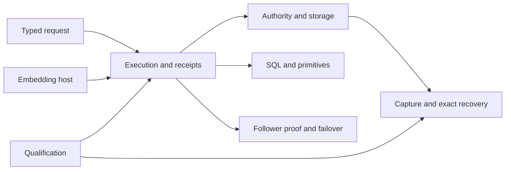

# Technical reference map

The [runtime guide](README.md) indexes the topic references below. Each one is a
complete guide: limits, failure paths, examples, and design reasoning from the
Cellule synthesis, plus the contracts that the source and tests own. Current contracts are owned by Cellule source and
tests. Crab-specific HTTP routes and operations in older references describe
the former application.

| Framework topic | Reference |
| --- | --- |
| Runtime overview and ownership | [Understand the embedded Cell runtime](overview.md) |
| Actor, SQL worker, deadlines, and drain | [Execution and receipts](runtime.md) |
| IDs, control, immutable roots, pages, backups, and retention | [Authority, storage, and recovery](storage.md) |
| SQL, KV, Blob, Queue, Cron, Workflow, and Effects | [Cell primitives](primitives.md) |
| Node logs, follower proof, owner loss, and recovery | [Follower durability and owner loss](failover-and-followers.md) |
| Native modules, codecs, and client calls | [Native Rust authoring](rust-api.md) |
| Node setup, routing, release, and observation | [Embed and operate Cellule](deployment.md) |
| Tests, receipts, and qualification levels | [Verification and qualification](delivery.md) |

## Design and audit records

These pages include current proposed work and preserve the original design
context and measured evidence. They are useful when changing an invariant, but
dated plans and product-specific commands are not current deployment instructions.

| Record | Scope |
| --- | --- |
| [Write performance design and delivery plan](write-performance-design.md) | Current proposed optimization packages, measurable acceptance criteria, matched celld comparison, and durability qualification. |
| [celld architecture and Cellule performance decisions](celld-architecture-performance.md) | Pinned write/read architecture comparison, small-KV tmpfs reference, SQL/read priorities, and durability decisions. |
| [Application framework and Commerce worked example](application-framework.md) | Original module, API, and end-to-end application design. |
| [Canonical LTX scaling](canonical-ltx-scaling.md) | Scaling and publication design. |
| [LTX performance audit](ltx-performance-audit.md) | Measurements, bottlenecks, and follow-up evidence. |
| [Standalone replication audit](standalone-replication-audit.md) | Replication behavior review. |
| [Writable VFS and LTX scale plan](vfs-ltx-scale-plan.md) | Sparse writable activation design. |
| [Original system architecture diagram](diagram/system-architecture.svg) | Historical Crab embedding view. |
