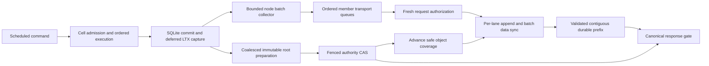

# Cellule write performance design and delivery plan

Improve durable write latency and sustainable throughput by shortening follower
accounting critical sections, reusing authenticated transport, overlapping
ordered batches, and reducing the cost of object publication. Measure aggregate
fleet throughput and one hot Cell separately. Preserve the existing durability,
authority, recovery, and resource contracts throughout.

| Field | Value |
| --- | --- |
| Status | In progress; D0 timing, D1 warm accounting, R0 read/export attribution, initial R1 schema/statement reuse, R2 owner-read connection, and R3 native dispatch implemented; baseline and optimization qualification remain outstanding |
| Prepared | 2026-10-05 |
| Cellule source examined | `e07670e2348231ed401cc7280a47e3ab97596ffe` |
| celld comparison source | `f2bf648663a610eefde71f3547ad61e9b896b1f0` |
| Qualification environment | Docker simulation, selected by the user on 2026-10-05; record actual host and VM contention |
| Audience | Runtime, LTX, embedding application, and qualification maintainers |
| Primary deliverable | Qualified owner read/write, follower, publication, and management improvements with reproducible evidence |
| Node capacity goal | 2,000 owned Cells and simultaneous 10,000 durable new writes/s plus 50,000 reads/s on one 8-vCPU / 16-GiB node |
| Comparative goal | At least 25% more sustainable acknowledged write TPS than celld on explicitly named, matched fleet workloads |
| Scope of this document | Design, work packages, measurement definitions, release gates, and linked implementation evidence; no qualified improvement is claimed |

The numerical thresholds below are **proposed engineering acceptance targets**,
not measured performance or promised gains. Freeze a qualification manifest
before testing. A change to workload, hardware, SLO, or acceptance threshold
requires a new manifest and baseline; it must not turn a failed run into a pass.

## Immediate write priority

Write throughput and latency parity with celld is the immediate milestone.
Additional read-only tuning is deferred unless it blocks write qualification.
The simultaneous node goal and the later comparative gain gates remain intact.
This branch is based on `e07670e2348231ed401cc7280a47e3ab97596ffe`; integrate
subsequent `main` changes before treating it as a release candidate.

Use the user-reported **1,000-Cell, under-100-byte KV, tmpfs** workload as a
provisional reference: about **15,000 fleet writes/s** with three nodes and
**2,000 bucket writes/s**. Freeze matched manifests before claiming parity.
The original celld commit, concurrency, per-owner/aggregate scope, read/write
overlap and latency distribution remain unknown. Preserve persistent storage,
the 64-Cell application comparison and the 2,000-Cell mixed-load profiles as
separate results. Tmpfs does not qualify machine-restart durability.

The runnable [write profiles](../../cellule-app/qualification/write.py) use
96-byte values, eight SQL workers and 8-vCPU/16-GiB caps per owner, with 4-GiB
bounded tmpfs. The actual 8-vCPU/16-GiB VM is shared among three owners, a driver
and the object service; container caps do not establish dedicated hardware.
Keep the 50-ms scheduled p99, 5-ms generator p99, 1,024-request bound, complete
mutation audit, exact roots, selected-member proofs and final log/debt drain.
Report fresh client connections separately from pooled follower connections.
The bucket case and matched celld runner remain outstanding.

### Next write-path decision

The corrected `small-kv-attribution-v2` diagnostic passed the full audit of
4,600 commands and closed every log/session, but failed the first measured
30/s point: **6,300.832-ms scheduled p99** and **39.975-ms generator p99**.
The ramp stopped before 60/s. No rate, stable baseline, gain or parity is
qualified. The [concise implementation record](../../cellule-app/performance/2026-10-05-write-optimization.md#small-kv-fleet-write-diagnostic)
retains representative results and external artifact identities.

The idle 60-second control completed 18,872 Cell renewal CAS operations against
18,918 aggregate PUT completions without new application SQL. The measured
window completed about 405 PUTs/s, with renewal p99 of 4.11–4.62 seconds.
Pre-enqueue submission p99 was 29–40 ms; ticket-order p99 was at most one
microsecond. Owner CPU averaged about 0.20 cores each. Marginal phase quantiles
cannot be added or used to prove individual-request causality. Shared-host and
generator contention still require controlled A/A repeats.

Earlier runs failed final drain after RustFS descriptor exhaustion. The new
finite profile retains the backend's two-CPU/two-GiB cap and persistent volume,
provisions 65,536 soft/hard file limits, checks actual process/cgroup evidence,
and rejects OOM or descriptor exhaustion. Correcting the simulated provider
is not a framework gain. See the [failure summary](../../cellule-app/performance/2026-10-05-write-optimization.md#backend-descriptor-exhaustion-reproduced).

| Deliverable | Measurement and decision gate | Preserved contract |
| --- | --- | --- |
| Authority maintenance | Count/timestamp canonical renewal, publication and node/coverage CAS separately; reconcile with provider totals and the idle population. Evaluate the node-bound candidate first, with passing controlled repeats before a gain claim. | No cached record becomes authority; fencing and takeover rules remain intact. |
| Submission before enqueue | Distinguish byte/queue admission, capture loading, ticket order and encoding; retain failed/cancelled phases. Optimize a demonstrated wait before widening shipping. | No sequence gaps or early ticket commitment; global byte/queue limits stay intact. |
| Receiver authorization and D2 | Attribute fresh enrollment, signed verification, append authorization and store work; qualify production mTLS with one fresh observation. | Recheck expiry after I/O and at admission; no enrollment cache. |
| D3 ordered overlap | Test ordered windows 1, 2, 4 and 8 at fixed common rates and increasing load; record fill, proof latency and debt. | Ordered transports opt in; all selected members prove the contiguous prefix within the same memory budget. |
| D4 publication | Count commits/root, dependencies/root, bytes and operations per new command; select a demonstrated redundant operation or bounded upload overlap. | Exact roots, immutable identity, per-Cell CAS order and complete recovery remain intact. |

**Next candidate, not implemented:** for publishers bound to the exact node
session lease, replace progress-only Cell renewal PUTs with fresh ownership/root
reads at the existing three-second cadence. The node watchdog supplies liveness;
takeover requires a fenced session or graceful release. Keep CAS renewal for
unbound publishers. Adopt a fresh ETag only after unchanged protected fields or
a pure renewal are verified. Root, owner or epoch divergence must fence.
Preserve self-fence deadlines, source errors, retries and lease checks before
and after I/O.

Functional gates cover expired/fenced sessions, takeover/root divergence,
missing/corrupt control, lost/late reads, retry deadlines, cancellation, unbound
CAS renewal and publish-after-refresh ordering. The idle request-count target
is zero progress-only renewal PUTs for node-bound publishers, with fresh-check
coverage for every Cell. Keep all requests through final drain in evidence.
Require the original full audit and latency/generator gates before advancing
the TPS ramp; a failing point is not a sustainable `R0` for D2/D3 gain gates.

The [celld architecture review](celld-architecture-performance.md) describes
source differences and the read/SQL packages. Its reported rates remain
reference observations until matched semantics and manifests are established.

## Node capacity target

The user added the 8-vCPU / 16-GiB node target on 2026-10-05. Qualify it
separately from the 64-Cell celld comparison. Interpret the write and read
targets as simultaneous sustained rates on the same owner node, with uniform
traffic across all 2,000 owned, resident Cells. Use 1 KiB logical write values
and point reads returning the value and digest. Keep the existing atomic
outcome, audit, durability, scheduled-latency, debt, and recovery gates. Report
hot, idle, cold-activation, and larger-value cases separately.

| Case | Required measurement and gate |
| --- | --- |
| Population | 64, 256, 1,000, then 2,000 resident owned Cells; verify distinct identities and exact active count |
| Writes only | 10,000 uniquely acknowledged new writes/s at scheduled p99 <= 50 ms |
| Reads only | 50,000 successful point reads/s at scheduled p99 <= 50 ms; record consistency mode and returned bytes |
| Simultaneous load | 10,000 writes/s plus 50,000 reads/s for 30 minutes, meeting each rate and SLO independently |
| Owner budget | One process/container capped at 8 vCPUs and 16 GiB, including actors, SQL, cache, publication, management, and any follower work performed there |
| External services | Separate load generator, object service, and two durable followers; record their budgets and their effect on capacity |
| Management | Report idle CPU, per-Cell memory and descriptors, actor queueing, shard imbalance, lease-renewal latency, and shutdown drain at each population |
| Correctness | Reconcile every scheduled arrival, command audit, point-read digest, and durable receipt; exact final root coverage and owner-loss recovery |

At 60,000 actions/s, an eight-core node using 80% of its CPU has an arithmetic
budget of about 107 microseconds of CPU per action. This is a planning bound,
not a measurement. A single serialized actor lane has about 16.7 microseconds
of wall time per action at that rate. Measure both before choosing changes.
Uniform traffic averages five writes and 25 reads per Cell per second; a
single hot Cell faces a different proof and execution limit.

The current worker pool supports a fixed number of threads and up to 10,000
active Cells, but those bounds do not establish measured capacity. Its default
active-Cell admission charges 160 KiB native memory, including four 8 KiB
lookaside arenas, and eleven descriptors per
Cell. Managed SQLite page-cache targets are charged separately at 256 KiB per
Cell across four connections. Two thousand Cells therefore reserve 22,000 descriptors; qualify actual
SQLite, cache, actor, retained-cut, and process RSS costs rather than treating
an admission charge as an RSS estimate. Set and verify the embedding process's
OS file limit above that reservation plus process/transport headroom; the
population diagnostic fixes both `nofile` limits at 65,536. Its first attempt
failed while adding Cell 124 under Docker's 1,024-file soft limit. The rerun
verified the earlier three-connection version at 2,000 sparse Cells, roughly
512 MiB process RSS and 797 MiB cgroup memory, with 16,000 named SQLite
descriptors. The four-connection R2 probe verified 2,000 sparse Cells at roughly
671 MiB process RSS and 972 MiB cgroup memory, with 20,000 named SQLite
descriptors and complete drain. It also required increasing the native
reservation from 64 to 128 KiB to cover measured population slopes; the
page-cache target remains 256 KiB. These probes verify sparse residency,
not loaded capacity; see the [implementation record](../../cellule-app/performance/2026-10-05-write-optimization.md#resident-population-probe).
Immutable read replicas currently
reserve 12 MiB per view: 2,000 separate views alone exceed 16 GiB. The primary
target uses owner reads, with read-replica capacity reported separately.

Extend D0 with this population and simultaneous-load profile. Use its evidence
to prioritize D1–D4 and management scheduling. Introduce a shared read-cache or
actor/scheduler change only after identifying its measured contribution;
retain exact-root views, deadlines, resource charging, and one fenced writer.
Docker results remain simulation results, with actual VM capacity and shared
host contention bound in the manifest. The node target is not achieved by
raising admission limits or by passing the smaller comparative profile.

## Existing evidence and implementation

| Finding | Evidence | What it establishes |
| --- | --- | --- |
| Hot object-only owner published 62.28–65.10 roots/s; SQL worker round-trip p95 was 2.03–2.28 ms | [September capacity report](../../cellule-app/performance/2026-09-29-write-capacity.md#final-hot-cell-attribution) | Serialized publication limited this particular CI profile; it is not a production ceiling |
| Clean follower rerun had append p95 of 17.38–141.02 ms and inconsistent fully served rates | [Clean rerun](../../cellule-app/performance/2026-09-29-write-capacity.md#clean-follower-proof-rerun-and-variability) | The existing shared-runner evidence cannot establish a stable follower capacity or a repeatable improvement |
| The original append held the shared reservation mutex through disk sync and a recursive directory recount; D1 uses short updates and tracked warm-path byte changes | [Follower store](../src/follower/mod.rs), [lane accounting](../src/follower/accounting/mod.rs) | Structural serialization and warm recounts are removed; a qualified throughput gain remains unproven |
| Shipper batches at most 64 frames, waits up to 1 ms, then awaits the batch before processing the next | [Node log shipper](../src/node/log_shipper/mod.rs) | Batching already exists; the examined shipper has one active batch at a time |
| One fresh enrollment observation can verify and authorize an append | [Enrollment verifier](../src/node/directory/mod.rs) | The runtime optimization already exists; adoption belongs to the embedding receiver |
| Process fixture now retains one serialized TCP socket per member; receiver still separately loads sender enrollment for verification and append authorization | [Process follower fixture](../../cellule-app/tests/process_follower.rs) | Initial D2 fixture candidate removes repeated connection setup; production mTLS and single-observation authorization remain outstanding |
| A Cell requires a durable logical head before executing its next command | [Executor](../src/cell/executor/mod.rs), [execution guide](runtime.md) | Same-Cell execution remains coupled to proof latency |
| Queued follower-backed commits already coalesce into one object root | [Publication scheduling](../src/cell/actor/requests.rs) | Adding basic coalescing is not a new optimization |
| Incremental preparation model costs six writes and two HEADs, with no body GETs | [Preparation measurements](../../cellule-ltx/perf/README.md) | Immutable writes remain a candidate cost; these operation counts are not cloud latency measurements |
| Warm pruning now skips scans when verified cached records are not covered; advancing coverage still prunes the open chunk | [Pruning implementation](../src/follower/records/append.rs) | Zero-coverage scans are removed; covered-file reuse and advancing-coverage costs remain open |
| celld uses SQLite WAL `NORMAL`, coalesced captures, four shipping rounds by default, and paced node bundles | [Pinned architecture review](celld-architecture-performance.md#what-celld-does) | These are concrete architectural differences; tmpfs rates do not qualify persistent-storage durability or a Cellule gain |
| Cellule owner reads cross actor and SQL-worker admission; commands perform runtime/KV SQL and scheduler discovery | [Read and SQL delivery decisions](celld-architecture-performance.md#recommended-delivery-order) | R0–R2 add attribution, safe statement/schema reuse, and measured read dispatch work without weakening receipts |
| Fixed runtime/KV/deadline SQL now uses bounded statement reuse, and the executor shares schema-cookie capabilities across scheduler/capacity checks | [R1 implementation](../../cellule-app/performance/2026-10-05-write-optimization.md#r1-schema-and-fixed-statement-reuse) | Removes repeated unchanged-schema discovery; generic SQL authorizer invalidation remains; CPU and sustained-rate gains are unqualified |
| Owner reads now use a separate protected connection and end a fresh transaction before return | [R2 implementation](../../cellule-app/performance/2026-10-05-write-optimization.md#r2-owner-read-connection) | Mixed owner reads preserve fixed writer statements; dispatch costs and sustained-rate gains remain to qualify |
| Admitted owner queries now report actor, worker admission/dequeue, execution and reply phases; read evidence export uses a bounded owner-process writer | [R0 implementation](../../cellule-app/performance/2026-10-05-write-optimization.md#r0-owner-read-attribution-and-owned-export) | Phases preserve missing deadline boundaries and one terminal reply; full export queues fail the gate; telemetry overhead and controlled read capacity remain to qualify |
| SQL slot tracing links queries to finite job kinds and request/acquire/start/release boundaries | [Slot implementation and Docker result](../../cellule-app/performance/2026-10-05-write-optimization.md#sql-slot-attribution) | Audited 2.7 million arrivals with zero trace loss; sparse read gates passed at 5,000/s and 10,000/s and failed at 25,000/s. Actor waiting dominated selected total tails; queries held recorded blocking slots. No controlled optimization gain or full target result |
| Actor subphases distinguish ingress, Cell FIFO selection and spawned task start; native dispatch now queues before execution admission | [Actor probe result](../../cellule-app/performance/2026-10-05-write-optimization.md#actor-phase-docker-result), [R3 dispatch result](../../cellule-app/performance/2026-10-05-write-optimization.md#r3-docker-dispatch-result) | R3 fixes the deterministic submitter-dependent handoff regression with native caps and control progress retained; 1,267 workspace tests passed. Its Docker ramp audited 1.2 million arrivals, passed measured 5,000/s and failed 10,000/s on 261 client-full arrivals. Actor/renewal and reply waiting remain; no controlled gain or full target result |

The follower guide describes an eight-batch ordered stream window. That is a
design bound, not evidence that the examined `run_shipper` implements eight
concurrent batches. Update documentation to distinguish implemented behavior
from the proposed pipeline when delivering the shipping change.

## Contracts and ownership

| Contract | Required behavior |
| --- | --- |
| Acknowledgement | Release success only through the existing canonical gate, after exact-root publication or a recoverable follower proof |
| Follower membership | Preserve write-all to the selected members; do not replace it with fastest-member acknowledgement |
| Sequence | Preserve contiguous node-log coverage, Cell commit order, and exact duplicate validation |
| Authority | Recheck request scope, enrollment lifetime, owner generation, log epoch, and safe coverage using the existing authority rules |
| Recovery | Restore the authority-pinned root and required tail byte-identically, or fail closed |
| Outcomes | Commit mutation and durable request outcome atomically; retries cannot execute a second mutation |
| Storage | Keep required data and directory sync barriers, checksums, seal markers, retirement fences, and grace boundaries |
| Resources | Bound queued and active frames, bytes, tasks, connections, descriptors, and publication debt; reconcile every terminal path |
| Shutdown | Stop admission, reconcile dispatched work, drain accepted work, and release resources without acknowledging an unproven suffix |
| Compatibility | Preserve persisted IDs, object paths, LTX and peer formats unless a separate format design and compatibility qualification precede the change |

The runtime owns accounting, sequencing, proof gates, publication scheduling,
and telemetry contracts. LTX owns capture, root construction, and exact restore.
The embedding application owns peer listeners, mTLS identities, authorization
wiring, connection management, and provider construction. The application
qualification directory may contain test adapters; product HTTP code must not
move into `cellule-app` or the pure coordination kernel.

Keep SQLite `synchronous=FULL` for this delivery. Runtime capture already uses
deferred capture; removing an immediate LTX sync is not an available shortcut.
Changing SQLite durability or replacing the follower log with RocksDB is outside
the initial scope. SQLite documents that WAL-mode `NORMAL` can lose committed
transactions after power loss; any future externally durable local mode needs
a separate restart and recovery design. [SQLite synchronous documentation](https://www.sqlite.org/pragma.html#pragma_synchronous)

## Performance definitions

Use one committed qualification command as one transaction. A command may
contain multiple SQL statements or business mutations; report those operations
separately. A duplicate replay is not a new transaction. A frame, a commit, an
object root, and an HTTP request are distinct counting units.

| Metric | Definition |
| --- | --- |
| Acknowledged write TPS | Unique new write commands whose durable success is observed during the measurement interval, divided by interval seconds |
| Arrival completion rate | Scheduled writes that eventually complete successfully, divided by the arrival interval; report alongside acknowledgement TPS so drain completions cannot inflate steady capacity |
| Logical throughput | Logical payload bytes of uniquely acknowledged writes divided by seconds and `2^20`, in MiB/s |
| Replication amplification | Encoded follower bytes summed across selected replicas, divided by uniquely committed logical payload bytes |
| Publication amplification | Provider requests and uploaded bytes divided by new committed commands; include background drain, retries, and compaction |
| Scheduled latency | Client terminal time minus intended arrival time, including scheduler delay, routing, queueing, and proof |
| Service latency | Client terminal time minus actual dispatch time; reported separately from scheduled latency |
| Durable response source | Fleet, Object, or Recorded; report each distribution and fleet-to-object fallback counts |
| Publication debt | Unpublished commits, retained bytes, oldest unpublished commit age, and final drain duration |
| Sustainable rate | Highest tested open-loop arrival rate meeting every success, SLO, resource, and publication-debt gate |

Count every scheduled arrival. Rejects, deadline expiry, unavailable results,
unknown outcomes, and driver misses remain in the evidence. Resolve unknown
outcomes for correctness, but do not convert their original attempts into
successful latency samples. Report successful quantiles with failure counts;
never let a successful-only histogram make an overloaded point pass.

An illustrative shipping bound is `commits_per_batch / batch_cycle_seconds`
when only one batch is active. Thirty-two commits in a 10 ms cycle give an
arithmetic bound of 3,200 commits/s before execution, bytes, and publication
limits. It is not a forecast. A Cell waiting 10 ms for each proof remains near
100 commands/s before its execution cost, even when other Cells fill batches.

## Target architecture

Work packages D0–D4 retain the current same-Cell execution gate. They overlap
work from independent Cells and owners. D5 evaluates execution ahead of proof
as a separate protocol change; the diagram does not authorize that change.

## Delivery packages

| Package | Accountable role | Dependencies | Reviewable deliverable |
| --- | --- | --- | --- |
| D0 Measurement and baseline | Qualification maintainer with runtime maintainer | None | Phase evidence, controlled A/A baseline, frozen manifest, validated accounting of arrivals and receipts |
| D1 Follower accounting | Runtime and LTX resource maintainers | D0 | Incremental ledger, short shared critical sections, fault tests, local and fleet comparison |
| D2 Transport adoption | Embedding application maintainer | D0 | Persistent mTLS qualification adapter using one fresh enrollment proof per append |
| D3 Ordered shipping pipeline | Runtime maintainer and embedding transport maintainer | D1, D2 | Bounded ordered pipeline, serial transport fallback, prefix validation and cancellation tests |
| D4 Publication cost | Runtime and LTX maintainers | D0; remeasure after D3 | One measured reduction in publication cost, exact-root and long-run evidence |
| D5 Hot Cell decision | Runtime maintainer | D0–D4 evidence | Either a qualified protocol change or a written decision to defer it with measured limits |
| D6 celld comparison and release | Qualification maintainer | All shipped packages | Matched comparison, fault evidence, sustained-load report, release decision |

The architecture review adds R0 read attribution under D0, R1 SQL/scheduler
work after a controlled baseline, R2 measured owner-read dispatch changes, and
M1 management scheduling. These are separate reviewable changes alongside
D1–D4. Externally durable owner WAL `NORMAL`, execution ahead of proof, node
bundles, and node-scoped authority require the review's separate protocol or
format decisions; the current `FULL` default and same-Cell proof gate remain.

Each package must report both functional completion and performance
qualification. A correct refactor that misses its performance target is not a
qualified speed improvement. Relative gains are not additive; D6 measures the
final combination. Do not invent calendar commitments before baseline evidence
and staffing are available.

### D0 Measurement and baseline

Extend the existing [telemetry boundary](../src/fleet/telemetry.rs) and
[qualification verifier](../../cellule-app/qualification/entities.py), rather
than introducing an unrelated benchmark path. Existing observations already
cover actor queueing, SQL worker round trip, proof source, publication timing,
publication cost, and aggregate node-log append bytes.

Add the missing phase observations at their actual owners:

| Owner | Proposed observations |
| --- | --- |
| Load generator | Intended arrival, dispatch, terminal result, unique command ID, payload bytes, response source |
| SQL worker and capture | Transaction execution, capture duration, WAL sync count and duration where the VFS can observe them, captured pages and bytes |
| Shipper | Collection delay, queue wait, frames and commits per batch, active batches and bytes per member |
| Application transport | Member resolution, connection establishment, fresh enrollment read, verification, ordered admission, wire round trip |
| Follower store | Shared accounting lock wait and hold time, lane lock wait, append, data sync, directory sync, scans, pruned bytes, reserved scratch |
| Publisher | Commits per root, preparation phase timings, upload dependency waves, CAS, retries, compaction, debt age and bytes |

Use monotonic clocks for durations within a process. Do not subtract timestamps
from different hosts to infer phase latency. Correlate batch IDs, command IDs,
and sequences in local traces, never as unbounded metric labels. Export bounded
histograms and counters without blocking actors. Lost evidence events make the
qualification invalid; no-op telemetry remains available for normal embedding.
Do not sum phase p95 values to produce an end-to-end p95.

**Completion gates:** five controlled same-binary A/A pairs; sustainable TPS
coefficient of variation at most 5% per primary scenario; scheduled p99 spread
at most 15% of its median at a fixed common rate; instrumented/no-op median TPS
overhead at most 3%. All scheduled arrivals, terminal outcomes, receipts, and
root coverage must reconcile. If A/A fails, repair the environment or driver
and repeat before optimizing. Keep existing qualification gates unchanged.

### D1 Follower accounting

**Implementation status:** the prototype removes filesystem work and
lane waits from the shared accounting lock. It reserves per-lane growth,
settles only that lane's contribution, and retains failed-settlement charges
until reconciliation. Appends, seals, retirements, cold tail reads, and
grace-aged collection use the same ledger. Quarantine is charged during startup
before concurrent workers exist. Parent-directory creation is serialized
through its durability barrier; warm appends bypass that creation lock.

Successful warm appends, pruning, and seal markers settle tracked filesystem
byte changes without a directory recount. Verified cached coverage skips prune
scans when no retained record is covered; duplicate receipts still verify their
exact stored record. An open-file length mismatch fails before appending. Cold
recovery, retirement, and error paths recount the affected lane; retirement
still scans for full coverage. Whole-store counts occur at startup. Direct
retirement/recovery deltas and the complete fault matrix remain open. Local
diagnostics and fault tests do not complete the performance or fleet gates below.

Replace the store-wide append-and-recount critical section with an incremental
ledger. Apply the design to append, seal, retire, pruning, quarantine, and
grace-aged removal together; changing only append leaves inconsistent writers
to the same accounting state.

1. Acquire the lane mutation lock. Never hold the accounting mutex while waiting
   for a lane lock or while doing filesystem I/O.
2. Under a short accounting lock, reserve the operation's maximum positive disk
   growth. Include record headers, markers, and temporary files needed by
   partial-chunk pruning. Reject insufficient capacity before dispatching writes.
3. Perform verified append, rotation, required syncs, and safe deletion under
   the lane lock. Return actual byte changes and remaining scratch obligations
   from the filesystem helpers. Do not traverse other lanes.
4. Under a short accounting lock, atomically transfer the operation reservation
   into settled retained bytes and release unused capacity. Removing one
   operation's reserve must not release another operation's admission.
5. If partial I/O makes a delta uncertain, retain its conservative charge and
   reconcile the affected lane before admitting further mutations to it. If a
   full recount is required, use an exclusive maintenance barrier that first
   quiesces mutations. Never resize from a stale global snapshot while other
   lanes are writing.

Let `E` be settled retained bytes and `P` the sum of outstanding operation
reservations. Charge `E + P` before I/O; an operation's reservation covers both
its partially materialized bytes and its remaining authorized growth. On
settlement, update its lane contribution and remove only that reservation in
one ledger operation. The charge must conservatively cover physical retained
and temporary bytes at every intermediate state. Rebuild accounting from disk
on startup. Runtime cancellation cannot drop a dispatched worker's reservation.

Preserve the existing shared `DiskBudget` admission hooks; their failures must
leave an accounted obligation or a reconciled terminal state. The ledger is
derived runtime state, not a new persisted authority or recovery format.

**Functional gates:** no whole-store recount on a successful warmed append;
exact settled accounting after append, duplicate, prune, seal, retire, removal,
and restart; conservative accounting after every injected partial failure;
bounded scratch; a deliberately blocked lane does not hold the accounting lock
against an unrelated lane. Extend the existing [budget tests](../src/follower/tests/budget.rs)
and [append tests](../src/follower/tests/append.rs).

**Performance target:** at least 20% more sustainable append throughput in the
eight-leader, two-follower local-disk microbenchmark, with no more than 5% p99
regression in the single-leader case. Test 1, 8, and 32 leaders and 1, 16, and 64
frames per batch. Report actual commits per batch and bytes. If sync bandwidth
dominates and the target is missed, record that result rather than claiming
that lock removal improved fleet capacity.

Measure covered-prefix pruning independently. After D0 establishes its cost,
the cached verified lane index may avoid a prune scan when no retained record
falls at or below the supplied safe coverage watermark. Any such change must
retain cold-start scans, exact frame validation, required deletion barriers,
and invalidation after partial failures. It belongs to D1 and requires its own
before/after evidence; a cached index must not become recovery authority.

### D2 Transport adoption

Create or update an application-owned qualification adapter that implements
`NodeLogTransport` over persistent mTLS connections. Reuse a client connection
within its validated peer identity, session, and endpoint scope. Close or
replace it when that scope changes. Bound connection creation and multiplexed
requests; preserve signed messages, size limits, and deadlines.

For each append, obtain one fresh mTLS-bound enrollment observation, verify the
signed request with it, and consume that same observation with
`EnrolledPeerVerifier::authorize_log_append`. Recheck time after enrollment
I/O and at authorized admission. Connection authentication does not become an
append authority cache. Sender resolution on the owner and unrelated provider
operations remain separately counted.

Keep the existing signed TCP process fixture as explicitly labelled test
evidence until it has a real mTLS path. Do not manufacture an mTLS enrollment
proof for that fixture. Use the representative adapter for production latency
claims. Reuse applicable TLS machinery in the optional adapter without moving
listener or product policy into the runtime. Read that crate's instructions
before changing it.

**Functional gates:** exactly one fresh leader enrollment read for each admitted
append at the receiver; reject wrong certificate, signature, fleet, release,
expired enrollment, wrong epoch, invalid coverage, and excessive frame size.
Exercise expiry and withdrawal while a connection remains established. Retain
all existing authority checks and error sources.

**Performance target:** at most one connection establishment per 100 successful
append requests after warmup with stable identities, and at least 20% lower
append p95 at the fixed common rate `0.5 × R0`. Here `R0` is D0's sustainable
baseline rate for that scenario. Compare the old and new adapters with the
same authentication guarantees; a plain TCP to mTLS comparison cannot attribute
the gain to connection reuse.

### D3 Ordered shipping pipeline

Maintain one batch collector for the owner's shared node log and one bounded
dispatch lane per selected follower. Submit requests in node-sequence order,
continue collecting while receipts are outstanding, and validate receipts
before advancing the existing durability gate.

A concurrent call to the current generic `append` method is not sufficient:
HTTP delivery and asynchronous future polling can reorder requests, and the
follower correctly rejects sequence gaps. Introduce an explicit transport
ordering capability with a serial default. An ordered implementation must
assign admission in submission order before asynchronous completion can
reorder it, and process requests in that order at the follower. Existing
transport implementations retain a window of one. Propose the minimal additive
trait API with its contract tests in the implementation PR; do not rely on
undocumented HTTP/2 ordering.

Start with a compile-time window of four batches per member and test windows
1, 2, 4, and 8 in qualification builds. Select one measured default; do not add
a general production tuning surface. Retain existing frame, batch, queue, and
capture-byte bounds. The eight-batch documented ceiling is not permission to
multiply memory limits. Acquire permits before queueing, retain frame ownership
until all selected obligations settle, and account transport copies where
actual allocations occur.

For each member, validate a monotonic receipt covering the submitted range and
the uncovered prefix. Advance the proof only through the prefix supported by
every selected member. Never acknowledge around a gap or reinterpret a lost
receipt as success. On a failed lane, stop new fleet submissions, reconcile
already dispatched requests, and retain the current object-proof fallback.
On shutdown, drain accepted batches or leave their unresolved outcomes explicit.
Do not release bytes merely because the caller dropped its future.

Keep current per-batch group sync. Combining several received requests into one
sync is a later optimization requiring distinct receipt and deadline tests;
it is not necessary to overlap collection, network, authorization, and receipts.

**Functional gates:** no sequence gaps under deliberately reordered completion;
no early proof with one slow or failed member; exact replay after a lost receipt;
bounded active batches and bytes under a stalled member; cancellation, sealing,
rotation, and shutdown preserve accounting and proof. Extend [shipper tests](../src/node/log_shipper/tests.rs)
and [transport integration tests](../tests/fleet/node_log_transport.rs).

**Performance target:** at least 25% more sustainable fleet TPS on uniform
many-Cell writes than the D1+D2 serial baseline; scheduled p99 no more than 5%
worse at the common rate; no single-hot-Cell regression over 5%. Report the
selected window, average batch fill, follower syncs per new commit, and debt.
The local-follower transport remains a correctness control, not network evidence.

### D4 Publication cost

Measure the final D3 pipeline before selecting an object optimization. Existing
root coalescing and cached predecessor metadata remain the canonical path.
Instrument commits per root, each immutable upload dependency, upload retries,
HEAD validation, authority CAS, and compaction.

Use these measurements to select one change: overlap independent immutable
uploads within existing admission limits, eliminate a demonstrated redundant
upload without changing identity semantics, or remove unnecessary publication
dispatch overhead. Do not parallelize dependent predecessor roots or authority
CAS for one Cell. Do not add batching delay to low-load writes without a
separate latency result. Object packing or descriptor changes require a format
design first and are not part of this package.

**Functional gates:** byte-identical endpoint reconstruction, complete dependency
verification, outcome coverage for every coalesced commit, fenced CAS races,
bounded upload cancellation, and compaction with concurrent writes. Extend the
[preparation cost test](../../cellule-ltx/tests/cell/roots/prepare_cost.rs) and
the root/recovery suites.

**Performance target:** at least 20% lower root preparation p95 at the fixed
common object-proof rate, with no more than 5% end-to-end p99 regression.
Report requests and bytes per committed command through final drain; do not
claim a request-count reduction from moving requests outside the load window.
The 30-minute sustained run must satisfy the publication-debt gates below.

### D5 Hot Cell decision

First publish the measured hot-Cell bound after D1–D4: execution and capture
time, proof wait, confirmation, and actor occupancy. Application commands may
batch mutations when they form one legitimate atomic operation. Independent
entities may use existing application partitioning; changing stable shard or
descriptor contracts needs the application's migration design. Report business
operations/s separately from transaction TPS.

If proof waiting still dominates and the hot workload misses its target,
deliver a separate decision record for bounded execution ahead of proof. It
must define an executed head, contiguous proven head, and published head,
without a second writer or a second acknowledgement gate. For every command,
retain the exact outcome and required capture until proof. Reads, state
streams, response bodies, and effects observing an unproven command must wait
for its dependencies; no externally visible consequence may escape early.

The record must cover suffix recovery, unknown outcomes, duplicate retries,
fencing during speculative work, migration, admission limits, and shutdown.
Do not simply clear `busy` or remove `logical_head_is_durable`. Prototype only
after the model and failure matrix demonstrate the protocol. Preserve local
SQLite durability for this experiment.

**Decision deliverable:** measured justification and either a complete protocol
plus qualified implementation, or an explicit deferral with the current hot
capacity and remaining limitation. Deferral does not qualify a hot-Cell gain.
If implemented, the target is at least 25% more sustainable hot-Cell TPS than
D4 at the same scheduled p99 budget, with all response and recovery contracts
passing. Aggregate gains cannot satisfy this target.

## Reproducible benchmark protocol

The current [capacity workflow](../../../.github/workflows/write-capacity.yml)
and [Compose fixture](../../cellule-app/qualification/compose.yaml) remain
regression evidence. Add a controlled qualification lane instead of weakening
their existing all-arrivals and readback requirements. The durations, workloads,
and artifacts in this section are planned extensions, not existing runner flags.

### Environment and semantic equivalence

The user selected a Docker simulation on 2026-10-05. The primary qualification
uses three Linux containers with four-vCPU and 8-GiB limits, separate private
disk volumes, a separate load-generator container, and an object-service
container outside the owner budget. Freeze actual VM capacity, physical host
load, oversubscription, filesystem, and volume mapping in each manifest.
Docker volumes share the host storage failure domain; process/container-loss
results do not establish independent-NVMe or power-loss durability. Scope
performance comparisons to this simulation. Keep the numerical acceptance,
arrival reconciliation, recovery, and long-run gates unchanged. Each fleet node
can
own Cells and act as a selected follower. Use the same measured network and
provider conditions for both systems. Record actual selected members and
co-resident responsibilities; the existing three-owner plus dedicated-follower
fixture cannot silently stand in for a different celld topology.

Pin commits, release binaries, compiler and dependency versions, container
digests, CPU affinity and quotas, RAM, filesystem and mount options, disk model,
power-loss protection, kernel, TLS setup, object provider, and latency model.
Use private disks and fresh namespaces for every repeat. Keep warmup and cache
policy identical. Include the current one-vCPU/1-GiB profile as a separate
regression scenario. A result from that profile cannot qualify the primary
container limits or stand in for dedicated physical-node capacity.

The matched application performs one entity upsert and an atomic request
outcome/audit write per unique command. Use equivalent SQL schema, indexes,
deduplication behavior, payload, response, and readback in both applications.
Seed incompressible payload generation and a fixed 100,000-key working set per
Cell. Preserve a complete qualification audit of command IDs and payload
digests; checking only the final overwritten entity value cannot verify every
acknowledged command. Include identical audit overhead in both systems.

Use two selected durable followers, write-all proof, and independently durable
disks for the primary fleet comparison. Verify configuration and response gate
from traces rather than assuming a daemon default. Compare celld's default
HTTP transport and explicitly enabled `CELLD_LOG_TRANSPORT=stream` separately;
the comparative release goal uses the faster qualified configuration for each
scenario. Pin each configuration in the manifest. [celld transport selection](https://github.com/denoland/celld/blob/f2bf648663a610eefde71f3547ad61e9b896b1f0/crates/celld/node_log.rs#L5829)

If equivalent durability, topology, or command semantics cannot be established,
publish separate measurements and mark the comparison unmatched. Source comments
mentioning lab write rates and stateless request benchmarks cannot supply the
celld baseline for this decision.

### Workload matrix

| Scenario | Load | Payload and distribution | Required evidence |
| --- | --- | --- | --- |
| Follower accounting | 1, 8, and 32 leader lanes | 1, 16, and 64 frames/batch; realistic captured frames | Lock, scan, sync, scratch, and accounting observations |
| Fleet aggregate | 100% writes over 64 Cells | Uniform; 1, 4, and 16 KiB logical values | New TPS, MiB/s, amplification, proof source, per-owner load |
| Fleet skew | 100% writes over 64 Cells | 80% to one hot Cell; remaining 20% uniform | Hot owner saturation and fleet capacity |
| Single hot Cell | 100% writes to one Cell | 1, 4, and 16 KiB values | Same-Cell limit, proof wait, actor queue |
| Mixed application | 80% queries and 20% writes | Same key distribution and payloads | Query and write SLOs separately; overall actions/s is not write TPS |
| Object-only | Followers disabled in both systems | Uniform and hot; same provider | Root preparation, CAS, requests/commit, exact coverage |
| Long run | Highest qualified fleet and object rates | Fixed working set, updates/deletes, ordinary checkpoint and compaction | 30-minute debt, resource, and latency trends |
| Recovery | Owner loss with acknowledged unpublished tail | Same load plus complete client witness | Exact outcomes, takeover time, root coverage, recovery debt |

The primary comparative claim covers 1 KiB fleet aggregate and fleet skew.
Hot, 4/16 KiB, mixed, and object results must be reported, but a win in one
scenario does not establish a win in all of them. Bulk commands are a separate
scenario with both transaction TPS and business operations/s.

### Schedule and acceptance

Warm for 60 seconds. Run an open-loop rate ramp using 60-second arrival windows
and account for every intended arrival. After bracketing the first failed rate,
refine until the last fully served rate and first failed rate differ by at most
10%. Record completed-in-window TPS and later drain completions separately.
Do not let post-window completions rescue the latency or sustainability result.

Use five paired baseline/candidate repeats on the same nodes, alternating order.
Reinitialize state and audit load-generator capacity before each repeat. Keep
every failed and invalid run; predeclare infrastructure invalidation reasons
and replacement policy. Scheduler misses caused by an underpowered generator
invalidate the capacity experiment and still remain visible in its artifacts.
Prove that attribution with generator CPU, queue, connection, and concurrency
evidence. Driver backpressure caused by a saturated server remains a valid
failed rate, not an infrastructure exclusion. Do not discard slow valid runs
as outliers.

| Proposed gate | Requirement |
| --- | --- |
| Fleet scheduled latency | p99 at most 50 ms for new writes in the primary scenarios |
| Object-only scheduled latency | p99 at most 200 ms |
| Mixed queries | Scheduled query p99 at most 50 ms; writes retain their mode's budget |
| Success and arrival coverage | Every scheduled action dispatches and completes with the expected result; zero driver misses, rejects, deadlines, unknown outcomes, or audit mismatches at a qualified rate |
| Fleet use | At least 99% of new write successes use Fleet proof in a healthy primary fleet run; record all fallback, excluding Recorded replays from the denominator |
| Publication debt | Sample each second; per-Cell outstanding commits and bytes stay below 50% of their configured high-water limits; oldest unpublished commit stays below 5 seconds |
| Steady drain | In the last 20 minutes, acknowledged and object-covered command rates differ by at most 1%; last-five-minute median debt is no greater than first-five-minute median debt plus one observed normal publication batch |
| Final coverage | Every acknowledged receipt has exact root coverage after drain; drain completes within 30 seconds after arrivals stop |
| Resources | No limit overshoot, OOM, task/connection leak, or unbounded memory/disk growth; report CPU throttling, descriptor counts, and pressure shedding |
| Repeatability | Each primary rate passes all five repeats, not only their pooled histogram |
| Comparative win | Median of five paired sustainable-TPS ratios is at least 1.25, every paired ratio exceeds 1.0, and Cellule meets the same SLO and debt gates as the faster qualified celld configuration |

Long runs must exercise actual checkpoint and compaction activity. If the
chosen rate does not reach those boundaries within 30 minutes, extend the run
or add a separately labelled prefilled scenario; absence of maintenance work
is not evidence of sustainable capacity. A rate that fails the debt gate may
be reported as short-burst throughput, never as sustainable TPS.

## Failure qualification

Reuse current fault suites and add deterministic barriers around admission,
append, sync, receipt emission, object upload, and authority CAS. The witness
runs outside the owner and records successful command IDs, digests, and proof
receipts before triggering failure. A process kill is not a power-loss test.

| Injection | Required observation |
| --- | --- |
| Partial record write, failed data sync, failed directory sync, or failed rotation | No proof for unverified bytes; conservative accounting; exact retained prefix after restart |
| Lost receipt after durable follower write | Unknown original attempt remains visible; replay verifies identical bytes and never duplicates the mutation |
| One member slow, unavailable, or returning an invalid receipt | No fleet proof from the other member alone; bounded queues; existing object path may win |
| Out-of-order completion or reconnect after queued batches | No sequence-gap acknowledgement, no prefix skipped, bounded replay |
| Seal/retire racing append and grace-aged deletion | Existing fences and authoritative safe coverage control mutation and removal |
| Cancellation and shutdown at each boundary | Dispatched workers retain resources until settlement; accepted work drains or remains explicitly unresolved |
| Owner process and local disk loss after Fleet acknowledgement but before object publication | Surviving selected follower tail reconstructs every witnessed acknowledged outcome |
| Owner loss plus loss of one selected follower | Recover from the surviving required data within the existing failure model; do not promise recovery after every durable copy is destroyed |
| Enrollment withdrawal, expiry, wrong identity, or authority generation change | Reject new unauthorized work; persistent connections and buffered batches do not bypass the existing protocol |
| Cold VM reset or storage power-loss fault model | Validate sync-dependent durability separately from process-kill correctness; attach the tested storage assumptions |

For D5, additionally enumerate every executed/proven/published head ordering
and prove that reads, streams, effects, migrations, deduplication, and restart
cannot expose an unproven suffix. Failure qualification is a prerequisite for
performance qualification, not an optional slower benchmark profile.

## Evidence and verification

D0 extends the verifier to emit the following versioned evidence bundle.
These are deliverable requirements, not files generated by this design request.

| Artifact | Contents |
| --- | --- |
| `manifest.json` | Scenario, thresholds, source and binary hashes, complete system settings, hardware and provider identities, seeds, rate schedule, selected followers |
| `requests.ndjson` | Every intended arrival, dispatch, terminal outcome, command ID, digest, logical bytes, source, and observed receipt |
| `phases.ndjson` | Correlated sampled phase spans with sampling coverage; complete counts and bounded histograms for every required phase |
| `resources.tsv` | One-second CPU, memory, disk, descriptors, active connections/tasks, pending bytes, pressure, and publication debt samples |
| `provider.tsv` | Operation counts, bytes, retries, and critical-path attribution through final drain |
| `witness.ndjson` | Independently observed acknowledged writes and fault triggers |
| `verification.json` | Arrival reconciliation, readback/audit and root coverage, resource bounds, SLOs, debt, fault results, and explicit pass/fail reasons |
| `comparison.json` | Per-repeat sustainable rates, first failed rates, paired ratios, raw quantiles, proof-source fractions, and claim scope |
| `report.md` | Findings, failed targets, limitations, source links, and package/release decision |

Retain raw logs and evidence digests for valid, failed, and infrastructure-invalid
runs. Publish the baseline bundle before changing production behavior. Missing
correctness or resource evidence cannot be replaced by a throughput summary.

For implementation packages, run focused crate and fault tests first, then the
root contributor checks in CI or an isolated verification snapshot. Required
routes include format, workspace check/test/Clippy, local LTX without defaults,
API docs, boundaries, module layout, documentation gates, and SQL/peer contract
validation. Execute process, cloud, and power-loss qualification only in their
documented controlled environments. On mounted Workspace workstations, keep
build targets under `$HOME/Workspace/crabbuild-target` with a unique checkout
directory. Never relax an existing qualification profile to accommodate a new
pipeline or noisier timings.

## Release decision and remaining limits

Deliver small PRs in dependency order with one clear hypothesis, focused failure
evidence, and baseline/candidate results. D1 and D2 may be implemented separately
once D0 passes; D3 depends on their measured behavior and ordered transport
contract. Rebaseline after each shipped change. Reverting a package requires
normal drain and restart; do not switch shipping implementations underneath an
active lane with unresolved batches. No persisted-format migration is planned
for D0–D4.

Release the qualified combination only when correctness, resource, long-run,
and comparison gates pass. Claim a celld advantage only for the named matched
workloads that satisfy the comparative gate. Publish all other outcomes,
including a hot-Cell limitation or an unqualified transport configuration.
If the comparative goal is missed, the deliverable is still a measured design
and implementation report, but the performance objective remains unmet.

Completion checklist:

- [ ] D0 phase evidence and stable controlled baseline published.
- [ ] D1 accounting and failure tests pass; measured objective evaluated.
- [ ] D2 representative mTLS transport and fresh one-read authorization qualified.
- [ ] D3 ordered pipeline, default selection, and all terminal paths qualified.
- [ ] D4 publication change passes exact-root and sustained-debt checks.
- [ ] D5 hot-Cell implementation or explicit measured deferral recorded.
- [ ] D6 matched celld results, witness recovery, raw evidence, and release decision published.

Current work and verification evidence are recorded in the
[October implementation record](../../cellule-app/performance/2026-10-05-write-optimization.md).

This design is complete when its work packages are reviewable and its criteria
are verifiable. The optimization program is complete only after the checklist
has real implementation and qualification evidence.
