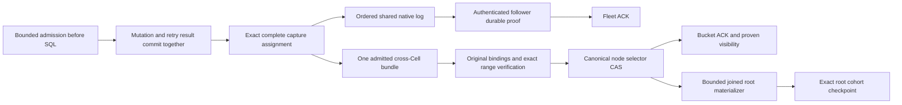

# Node write and read performance design

The [bounded historical-read comparison](../../../docs/pr67-bounded-history-measurement.md)
now groups fresh ranges within the original 20-MiB admission. One original-profile
Fleet pair completes 307.60 writes/s versus 144.50 before, with worse successful
p99 latency. A matched 1-GiB control reaches 237.67 versus 181.45/s, with zero
request errors. All Cellule ACKs pass warm/cold audit. These short overloaded
observations remain unqualified; PR #67 is still a draft.

The [submission diagnosis](../../../docs/pr67-submission-timing-measurement.md)
identified publication capacity held under the global issuance lock. That
coupling still queues native progress before follower proof starts. Repeated
historical/base verification and sparse root checkpoints keep the publication
consumer expensive. Matching celld requires reducing that work and separating
native progress from bounded recoverable publication debt; larger queues alone
do not increase sustainable throughput.

Status: implementation in progress. The application path is not qualified at
the targets below. Component I/O reductions are not application TPS.

Cellule is the management process for a node's Cells. A Cell retains one fenced
writer; node-wide admission, native workers, publication, recovery and collection
must share bounded resources rather than create an independent service per Cell.
The embedding application continues to own ingress and authorization.

## Capacity contract

| Dimension | Required node result |
| --- | --- |
| Serving node | 8 vCPUs, 16 GiB memory; report storage, filesystem, network and SQLite policy |
| Population | 2,000 uniformly active Cells, sub-100-byte values |
| Writes | 2,000 successful commands/s |
| Reads | 20,000 successful queries/s |
| Tail latency | Fleet writes p99 at most 50 ms; Bucket writes p99 at most 200 ms; report read p50/p95/p99 |
| Delivery | Zero errors, dropped offers or unissued requests; at least 99% completed within the window |
| Evidence | Three paired repetitions of at least five minutes, matched celld revision and workload |
| Durability | All acknowledged mutations and retry outcomes survive warm audit, joined drain and cold restore |
| Stability | Bounded memory, native-job occupancy and debt; debt has no sustained positive slope |

Qualify read-only, write-only and simultaneous 2K-write/20K-read load separately.
Count the client, provider and followers separately from the serving node.
Docker can simulate the deployment, but sharing one 8-CPU VM between all roles
does not qualify an 8-CPU serving node. Report KV overwrite and SQL commands with
the durable request/result ledger separately. tmpfs results do not qualify
physical-media durability. Preserve the stronger historical comparison gates in
the [workspace proposal](../../../docs/write-performance-proposal.md); this node
capacity contract does not turn a failed earlier profile into a passing one.

## Canonical write path

Uploaded bytes are not authority. An explicitly installed original publication
feed can now deliver admitted exact bundle receipts through the actor's existing
command, worker and read/retry gate. `NodeDurability::start_bundle_publication`
now retains one producer under the installed runtime ledger. It selects complete
cohorts of at most 64 captures, 64 frames and 4 MiB, with a 1-ms assembly window
and a 20-MiB working reservation, including one bounded fresh origin read.
Startup admission precedes installation of the
irreversible feed. Selection and exact root checkpoints use the same original
binding/heartbeat authority; 512 checkpoint requests are bounded and their
callbacks join before Cell closure. Fair turns alternate queued native work and
checkpoint cohorts. The Fleet SQL example installs this producer; the current
Bucket-only performance adapter bypasses it.

Each selection reads its complete new cohort object once from origin, compares
every byte with the proposal, then verifies header, shards, histories and native
frames from that operation's read. It retains no cross-operation availability
cache. Historical objects and every Cell base dependency still require origin
verification. After the fresh body matches, selection shares the proposal
allocation and uses its released buffer allowance for 2 MiB of historical scratch
and at most 2 MiB of compact facts/planning metadata. Eight bounded reads overlap;
every frame and original Cell chain remains canonically checked. Base traversal
and individual extents above 2 MiB retain serial verification. Selection retains
no reconstruction bodies beyond the operation. Working admission remains 20 MiB;
workload retention and protocol bounds remain unchanged.

The first end-to-end Fleet diagnostic of this connection failed throughput,
availability and drain. It is experimental, not performance qualification.
The subsequent [coverage-race measurement](../../../docs/pr67-coverage-race-measurement.md)
at `e40ecd6` passes warm/cold ACK read/retry and joined drain, but completes
100.20 Fleet writes/s versus 106.05 before the fix. There is no measured speedup.
The earlier [cohort-origin comparison](../../../docs/pr67-cohort-origin-measurement.md)
at `9d4e632` reduces 187 reads of one fresh 64-Cell bundle to one. In one paired
window it completes 95.35 Fleet writes/s versus 88.28, with successful scheduled
p99 of 4,414.52 ms. ACK audits and drain pass, but total GET/range work remains
near 20.4 requests per completed write, root density is 1.08, and steady Bundle
ACKs remain zero. The positive paired rate difference does not establish a
repeatable gain; every point fails qualification. Its separately admitted
origin buffer raises the producer reservation from 16 to 20 MiB under the same
64-MiB diagnostic workload ledger.
Managed selection now retires exact captures and coalesces one root obligation
per Cell. The worker keeps its latest authenticated selection and SQLite retry
results; sequence assignment includes the selected endpoint. Root jobs admit
memory before origin reads, order by oldest debt, permit at most eight jobs, and
join on shutdown. Logical 215-command density requests a checkpoint; physical
locator/byte pressure gates new commands. Root age of 45 seconds, drain,
migration and fallback also request materialization. Due hints expose the exact
selected head while a root lags.

Selection readiness is observed once per Cell without owning its publisher.
The observer shares the original receipt and admitted metadata; it grants no
ACK, narrowed proof or new authority. Only a ready oldest prefix enters exact
cleanup. Its unselected suffix remains in the bounded original queue, allowing
older root debt to prepare. The existing ten-second cleanup timeout begins
after selection readiness, rather than timing an origin wait after Fleet ACKs.
Fencing/removal cancels only observation; original native publication and
checkpoint/drain obligations remain joined. Its real-actor delayed-selection
regression passes read/retry visibility, older-root progress and joined cold
restore. The [paired measurement](../../../docs/pr67-selection-readiness-measurement.md)
at `6c909a6` completes 184.77 Fleet writes/s versus 195.13 before, with failed
application availability. Bucket completes 248.68 writes/s versus 247.55 with
passing ACK audits; its fixture bypasses the managed producer. No throughput
gain or performance qualification is established.

A follow-up preserves exact selected suffixes across a confirmed checkpoint,
including receipts selected against intermediate bases while older roots were
preparing. Process-local hash-chain witnesses retain no frame bodies and expire
when their original prefix exceeds the 256-locator proof bound. Their memory
transfers from admission acquired before root I/O and releases with the worker.
Regression cases exercise live writes, read/retry visibility, joined cold
restore and successive intermediate bases. This supplies no new durability or
origin-availability proof. The
[checkpoint-continuity measurement](../../../docs/pr67-checkpoint-continuity-measurement.md)
at `4a8f55c` completes 185.83 Fleet writes/s versus 164.73 but still returns
304,151 measured errors and fails warm ACK availability. Bucket completes
215.08 writes/s versus 227.15 with passing audits and higher p99. All contributor
checks pass, but the original application load failure persists. No acceptable
improvement or parity is established. A subsequent
[release-build repeat](../../../docs/pr67-release-repeat-measurement.md) of the
same binary completes 107.95 Fleet and 268.12 Bucket writes/s. Fleet still fails
warm ACK availability; Bucket audits pass but delivery targets fail. Diagnostic
logs identify shared-selection deadlines that fence Cells and publication
backlog refusals. This supplies no demonstrated throughput improvement.

The earlier [asynchronous-root comparison](../../../docs/pr67-async-root-measurement.md)
at `6d62d41` completes 183.65 Fleet writes/s versus 115.27, with successful
scheduled p99 of 1,782.74 ms. It returns 297,811 measured errors and fails its
warm ACK audit. No cold or successful drain evidence follows. Root density is
10.25 and PUT cost 0.48 per completed write; retained memory ends at 58.77 MiB
of 64 MiB and oldest debt reaches 49,054 ms. This is an availability regression,
not qualified improvement. The 215-command actor regression is grouped; only
65 sequential commands per Cell are covered by the passing held-root test.
Materializer progress under pressure, exact active-write checkpoint continuation,
application receipt visibility, complete failed-owner orchestration, large-capture
fallback, retryable producer failures and collection remain open.
Do not advance the follower reclamation frontier before
failed-owner recovery understands the selected bundle prefix.

## Locator density and checkpoint cost

Under the measured small-tail four-PUT materialization path, 64 commands per
shared selection and 64 roots per checkpoint give the conditional cost
`2/64 + (4 + 2/64)/K`. At most 0.05 publication PUTs/command therefore requires
at least **215 commands per Cell checkpoint**, before compaction, retries and
collection. Larger tails can leave the four-PUT path and must be measured.

The prior 32 inline frame locators cannot represent this density under uniform
traffic. Increasing only that array also increases every sibling's shard read.
The implemented development representation separates small binding rows from authenticated,
independently addressed locator histories:

- Keep the 256-shard fixed authenticated header and original binding pins.
- Keep unchanged binding shards and histories by exact object/range/digest.
- Store a Cell history in a bounded extent in the same selection object; adding
  a history adds bytes, not a separate PUT. Never rewrite old native bodies.
- Load histories only for the requested Cell/cohort, retaining sibling history
  references without decoding their contents. Preflight aggregate selected
  shard and history metadata against the existing 4 MiB protocol-input bound.
- Bound each history to 256 exact frame references and 32 KiB encoded metadata;
  preserve the 4 MiB verified native-suffix byte bound and 64 frames/selection.
- New selectors use a distinct format version. Existing complete catalogs and
  inline indexed shards remain readable; upgrade every recovery consumer before
  selecting the new format. Use a fresh development prefix during rollout.

Those are protocol bounds, not host admission. The materializer scheduler must
charge retained history, native verification, scratch and outcomes to the node
ledgers. At the revised 2K-write target over 2,000 uniform Cells, each Cell
receives about one command/s: 215 commands span about 215 seconds. The current
45-second root-age trigger therefore requests a checkpoint at roughly 45
commands even before byte pressure. The conditional four-PUT model then costs
about 0.121 PUTs/command, above 0.05. Meeting that separate cost target requires
a measured change to checkpoint scheduling or publication representation;
increasing locator capacity alone cannot meet it. Measure actual retained native
bytes and oldest debt before changing the age policy, and reject a policy that
cannot stay bounded on the 16-GiB node. Earlier benchmark profiles retain their
original thresholds and evidence.

## Remaining implementation and exit gates

| Work | Required verification |
| --- | --- |
| Dense histories | 215 exact commands without checkpoint; corrupt/missing/cross-scope history rejection; bounded selected metadata; byte-identical cold restore; measured larger-tail cost |
| Actor ACK/read/retry integration | Response and visible retry/query state use the same original proof; captured ranges release only after exact matching; unproven suffix remains hidden |
| Canonical coverage frontier | Bundle selector and contiguous native coverage selected atomically; no second authority CAS; ambiguous replies, heartbeat, lease loss and cancellation tested |
| Admitted materializer | One bounded node scheduler, fair cohorts, debt limit and joined native/storage jobs on cancellation and shutdown |
| Failed-owner recovery | Seal complete issued suffix including prior Fleet ACKs; selected prefix plus follower tail restore exactly before closing all bindings or admitting replacement writers |
| Safe collection | Complete cross-Cell root/catalog/proof/reference inventory, admitted scans, quiesced writes and grace-qualified deletion |
| Read efficiency | Bounded workers and views, proven snapshots, minimal per-query authority I/O; overload retains renewal/publication headroom |
| Paired qualification | Node capacity contract and unchanged durability/read/drain gates pass; otherwise report measured gaps with source and binary identities |

Implementation and prior measured results are tracked in the
[bundle delivery record](../../../docs/bundle-coverage-implementation.md) and
[WAL comparison](../../../docs/pr67-normal-wal-reevaluation.md). Keep bulk logs,
raw request ledgers and source manifests outside the repository.

The recovery coordinator now discovers selected-only Cells and joins exact
origin prefixes with the complete sealed follower witness in one admitted
file-backed reconstruction path. It rejects conflicting overlap and incomplete
Cell inventory. Bound overlays retain the original pin, and the canonical node
seal refuses unfinished materialization/checkpoint closure. `recover_and_seal`
now materializes original bound roots through ordinary lineage and exact Cell
CAS, then stages bounded catalog cohorts and selects their complete terminal
inventory with one recovery-claim node CAS. Quiet Cells participate. Exact
manifest reuse supports partial-root retries, and closed original roots support
resumption after transfer or interrupted log seal. Quiet provisional reservations
now close under the same fenced claim after checking current Cell authority and
verifying the original base. An unpinned reservation needs no Cell CAS; a late pin CAS
cannot reopen the closed catalog. Pre-activation native frames remain an explicit
unresolved obligation and cannot be discarded. Admitted host scheduling and full
qualification remain required before enabling actor ACKs. The verified native
selector now advances enrolled coverage and selects its bundle in one node CAS.
Exact local confirmation performs no second CAS and reports a distinct Bundle
proof. Original gate and lease identity remain required; cold proofs grant
reconstruction only. An installed feed's original admitted receipt now grants
actor command/read/retry visibility. Before root preparation starts, the same
serialized publisher can consume a complete selected oldest capture prefix:
the worker compares every cut's metadata and body digest with its original
assignment, verifies every live receipt, and only then removes the local files.
Outcomes, proof metadata and publication coordination remain retained until
normal root lineage, exact Cell CAS and joined drain complete. A later unproven
suffix remains hidden. Origin materialization preserves the captured due time
and retries storage errors within the existing publication grace. The bounded
selection opportunity is 100 ms for installed feeds; absent or later coverage
uses the original root path. A later cohort's proof can now be narrowed only by
the original complete-capture assignment, including its exact descriptors and
body digests. Materialized roots join the managed checkpoint callback before
releasing their publisher; Cell close waits for the complete original issued
prefix, including prior Fleet ACKs. The producer's task and failure cause also
join at epoch shutdown. This provides fair selection/checkpoint turns, not a
fair node materializer scheduler or the 215-command checkpoint density target.

Shared selection can persist a higher native coverage frontier while an older
root completion waits for the original authority mutex. In the same validated
open epoch, `advance_log_coverage` acknowledges that already selected prefix
without another CAS. It preserves the higher frontier; each local root still
confirms only its own original tickets. Expired or closed epochs still fail.

The live root fallback now avoids a node authority mutation when an exact Cell
root covers only a sparse range beyond an unpublished native gap. That root
grants its own object proof under the original lease; it does not advance follower
reclamation or permit rotation. Closing the gap still persists the complete new
contiguous frontier before confirming it locally. Failed or cancelled advancing
CAS work remains staged for retry and joined drain. This removes redundant
coordination work from the existing application path; Bucket producer connection,
dense materialization and the node capacity qualification remain open.
