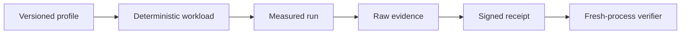
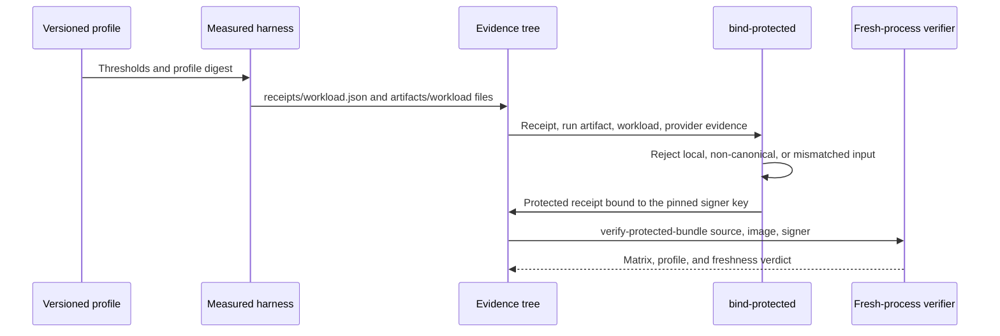

# Runtime qualification

`profiles/` holds versioned threshold inputs. A receipt binds a profile digest,
source revision, image digest, measured artifact, and execution evidence. A
generated workload is a test input, not a protected production receipt.



| Field | Value |
| --- | --- |
| Directory | `crates/cellule-runtime/qualification/` |
| Profiles | [`profiles/`](profiles/) — canonical, versioned threshold inputs |
| Harness | [`worker-profile.compose.yaml`](worker-profile.compose.yaml) with [`run-worker-profile.sh`](run-worker-profile.sh) |
| Scope | Local contract checks plus provider, scale, compatibility, and fault evidence |
| Status | A local run proves its selected path only; protected evidence needs a real harness |

<a id="contents"></a>
## Contents

- [Profile tiers](#profile-tiers)
- [Generate a local workload](#generate-a-local-workload)
- [Evidence pipeline](#evidence-pipeline)
- [Bind protected evidence](#bind-protected-evidence)
- [Provider evidence](#provider-evidence)
- [Scale sample artifact](#scale-sample-artifact)
- [Case schedule and coverage](#case-schedule-and-coverage)
- [Measured metrics and gates](#measured-metrics-and-gates)
- [Profile matrix and release candidates](#profile-matrix-and-release-candidates)
- [Release handoff](#release-handoff)
- [Test routes](#test-routes)
- [See also](#see-also)

<a id="profile-tiers"></a>
## Profile tiers

| Tier | Use | Evidence boundary |
| --- | --- | --- |
| `pr-contract-v1` | Local contract validation. | Synthetic or local evidence; no production claim. |
| `local-provider-v1` | Provider contract checks. | Conditional, range, and multipart observations. |
| `scale-v1` | Bounded Cell population and resource counters. | Measured fleet samples. |
| `compatibility-v1` | Release and persisted-state compatibility. | Explicit upgrade/rollout run. |
| `provider-*-v1`, `fault-*-v1` | Cloud and failure matrix. | Real provider/fault artifacts. |

### Local worker diagnostic

- **Compose worker profile**: for a local worker-scheduling diagnostic with real RustFS and enforced one-vCPU, one-GiB limits, use [the Compose worker profile](worker-profile.md).
- **Evidence class**: its raw measurements inform performance work; they do not produce protected receipts.

### Threshold and environment binding

The JSON files in `profiles/` are canonical, versioned threshold inputs. The
receipt signer binds the profile digest; changing a threshold therefore makes
old evidence unusable.

- **Profile schema 2** also binds workload thresholds to the measured environment.
- **Protected profiles carry** required provider and topology labels, minimum throughput, peak RSS/local-disk/file-descriptor ceilings, and an object-store call ceiling.
- **Matrix verification requires** the corresponding `cells`, `operations`, `duration_secs`, `p99_latency_ms`, `peak_local_disk_bytes`, and `peak_file_descriptors` metrics when a profile sets those limits.
- **A missing metric is a failed gate**, not an assumed zero.
- **Freshness**: the release CLI additionally rejects protected receipts finished more than seven days ago or more than five minutes ahead of its verifier clock.
- **Timestamp neutrality**: the historical library verifier remains timestamp-neutral; use the fresh protected matrix entry point for release decisions.

<a id="generate-a-local-workload"></a>
## Generate a local workload

Generate and verify a deterministic mixed primitive workload. Run from the
workspace root:

```sh
cargo run -p cellule-runtime --bin qualification_receipt --locked -- \
  workload workload.json crates/cellule-runtime/qualification/profiles/pr-contract-v1.json 7
cargo run -p cellule-runtime --bin qualification_receipt --locked -- \
  verify-workload workload.json crates/cellule-runtime/qualification/profiles/pr-contract-v1.json
```

The original qualification record uses the profile-relative form below; both
invocations name the same `pr-contract-v1` profile and the same `workload.json`
artifact.

```sh
cargo run --locked -p cellule-runtime --bin qualification_receipt -- \
  workload workload.json profiles/pr-contract-v1.json 7
cargo run --locked -p cellule-runtime --bin qualification_receipt -- \
  verify-workload workload.json profiles/pr-contract-v1.json
```

- **`workload`** generates the deterministic mixed primitive workload; **`verify-workload`** verifies that artifact against the profile.
- **`emit` cannot mint a protected receipt.** Protected evidence must come from a measured adapter and be bound with `bind-protected`; the signing key stays outside the evidence directory.
- **`verify-protected-bundle`** requires the full provider, scale, compatibility, and fault matrix with a trusted signer and freshness checks. No local smoke substitutes for those inputs.

<a id="evidence-pipeline"></a>
## Evidence pipeline

A measured run writes a receipt and raw artifacts; the manifest indexes them,
and one fresh process verifies the protected bundle.



After a real harness has written one receipt and one or more raw artifacts for
each matrix workload, build the canonical manifest from that evidence tree:

```text
evidence/
├── receipts/<workload>.json
└── artifacts/<workload>/<artifact files>

cargo run --locked -p cellule-runtime --bin qualification_receipt -- \
  manifest evidence/qualification-matrix.json evidence/
```

Manifest rules:

- **Order**: the builder emits schema-2 rows in the required order.
- **Rejects**: missing, symlinked, or non-file evidence entries.
- **Location**: the manifest output must be directly under the evidence directory so its relative paths remain verifiable.
- **Scope**: it only indexes files; it does not create or sign receipts.
- **Gate**: run `verify-matrix` with the protected profile and pinned attestation key before treating the resulting manifest as release evidence.

### Verify the protected bundle

The protected release bundle has one canonical fresh-process verifier:

```sh
cargo run --locked -p cellule-runtime --bin qualification_receipt -- \
  verify-protected-bundle protected/ <source-sha> <image-digest> \
  <trusted-signer-hex>
```

- **All nine profiles**: requires all nine provider, scale, compatibility, and fault profiles.
- **No symlinks**: rejects symlinks anywhere below the bundle.
- **Contracts**: checks each profile name and protected threshold contract.
- **One identity**: verifies every matrix against the same source, image, and pinned signer.
- **Workflow use**: the workflow and release gate call this command directly; they only retain their shell-side byte-for-byte comparison between each supplied profile and the tracked profile from the exact source checkout.

<a id="bind-protected-evidence"></a>
## Bind protected evidence

After a protected adapter has captured a verified run artifact, write the
non-secret execution identity and fault/ownership observations with the
`QualificationExecutionEvidence` schema, then bind the receipt with the
trusted signing key held outside the evidence directory:

```sh
cargo run --locked -p cellule-runtime --bin qualification_receipt -- \
  bind-protected receipt.json <source-sha> <image-digest> profile.json \
  execution-evidence.json /run/secrets/qualification-signing-key \
  run-artifact.json workload.json raw/provider-events.json
```

The command rejects:

- local profiles;
- non-canonical evidence;
- mismatched workload/run artifacts;
- missing protected resource measurements;
- a signing key symlink.

- **Never synthetic**: it never generates a protected receipt from the synthetic `emit` path.
- **Still gated**: the resulting receipt must still pass `verify-matrix` with the pinned public key before release packaging.

<a id="provider-evidence"></a>
## Provider evidence

Named provider profiles also require one canonical `QualificationProviderEvidence`
raw artifact beside the run and workload artifacts.

| Artifact | Binds | Records | Rejected when |
| --- | --- | --- | --- |
| `QualificationProviderEvidence` | Provider/profile digest and workload seed. | Successful conditional, range, and multipart checks. | Missing, duplicated, partial, or mismatched provider semantics — rejected by both the binder and the fresh-process matrix verifier. |

<a id="scale-sample-artifact"></a>
## Scale sample artifact

The protected `scale-v1` primitives row also requires one canonical raw JSON artifact.

| Field | Value |
| --- | --- |
| `schema_version: 1` | Canonical raw-JSON artifact version. |
| `profile` | Profile name. |
| `profile_digest` | The 32-byte profile digest. |
| `workload_seed` | Workload seed. |
| `cell_samples` | Exactly fifteen samples. |

**Sample order** — `empty`, `sparse`, `resident`, `pending-publication`, and
`churned`, each at 1,000, 5,000, and 10,000 open Cells.

| Per-sample field | Content |
| --- | --- |
| `state` | Workload state. |
| `target_cells` | Requested open Cells. |
| `before`, `after`, `peak` | Snapshots. |

- **Snapshot fields**: `active_cells`, `rss_bytes`, `allocator_bytes`, `threads`, `file_descriptors`, `sqlite_cache_bytes`, `admitted_resident_bytes`, `admitted_file_descriptors`, `retained_bytes`, `local_disk_reserved_bytes`, and `local_disk_bytes`.
- **Capture rule**: the protected harness must capture OS process counters and runtime admission counters from the same isolated sample.
- **Open from zero**: it starts with zero active Cells and observes the requested count after opening them.
- **`peak` semantics**: `peak` records each field's high-water mark over that sample; its fields need not come from one instant.

**Verifier checks**

- Rejects missing, duplicate, partial, or false-open samples.
- Requires the peak snapshot to cover before and after.
- Checks the admission ledger's minimum active-Cell charges.
- Requires the measured run's RSS, disk, and descriptor peaks to cover every sample.

**Per-Cell slopes**

- The artifact makes the per-Cell slopes calculable from raw before/after counters; signing a scheduled 10,000-Cell workload alone is insufficient evidence that those Cells opened.
- Each sample's ledger increase must cover its open Cells.
- Within each workload state, the verifier compares the net `after` minus `before` growth at 1,000, 5,000, and 10,000 Cells.
- Growth between those points in RSS and allocator bytes must fit the additional native and SQLite page-cache reservations plus retained-byte charges.
- SQLite cache and descriptor growth must fit their own per-Cell reservations.
- This comparison cancels fixed process overhead rather than charging it repeatedly to every Cell.
- The protected report must still compare that measured fixed overhead with the node's separate process reserve.

<a id="case-schedule-and-coverage"></a>
## Case schedule and coverage

The default workload contains a deterministic, seed-bound case schedule for
each primitive: `happy`, `retry`, `duplicate`, `expiry`, `cancellation`,
`owner-loss`, and `recovery`.

| Concept | Contract |
| --- | --- |
| Case schedule | A case plan, not evidence that an external provider or owner fault actually occurred. |
| Adapter hook | Adapters inspect `QualificationOperation::case()` (or its bounded hint accessors) to drive the corresponding primitive-specific behavior. |
| Outcome counts | Forecasts used to describe that schedule. |
| Measured run | Binds the scheduled attempt count for each primitive and records actual acknowledgements, rejections, ambiguity, retries, and verification independently; it need not reproduce those forecasts. |
| PR wiring smoke | Marks only the primitive/case pairs it actually exercises and checks; other scheduled pairs stay unmarked. |

### Workload entry points

| Entry point | Use |
| --- | --- |
| Serial `run` | The safe choice for workloads with application-level ordering dependencies. |
| `QualificationWorkload::run_concurrent` | Bounded entry point when scheduled operations are independent or idempotent. |
| `run_with_case_coverage`, `run_concurrent_with_case_coverage` | Protected adapters; each result must bind the lifecycle case it exercised. |

Both paths retain the same streaming schedule, counters, latency histogram, and
logical outcome digest.

<a id="measured-metrics-and-gates"></a>
## Measured metrics and gates

- **Throughput**: the measured summary emits `throughput_ops_per_sec` using the artifact's whole-millisecond elapsed time, rounded up to seconds.
- **Truncation**: sub-millisecond fractions are discarded consistently before calculating duration and throughput; the minimum-duration gate still uses the recorded milliseconds.
- **Resource counters**: protected profiles also verify their independent resource counters.
- **Receipt matching**: protected `primitives` receipts must also match the measured run artifact's cells, operations, duration, throughput, and p50/p95/p99/max latency metrics in non-decreasing order; a signed receipt with substituted threshold values is rejected.
- **Schema 4**: measured run artifacts use schema 4 and include a bounded primitive/case bitset; named provider/topology profiles reject artifacts missing any lifecycle case.
- **Full verification**: those protected profiles also require every acknowledged operation to have an independent verification result; a partial verification count cannot be promoted by the receipt binder.
- **Local smoke**: the local observed smoke remains allowed to report partial coverage and is not release evidence.

<a id="profile-matrix-and-release-candidates"></a>
## Profile matrix and release candidates

| Profile | Role |
| --- | --- |
| `pr-contract-v1` | Correctness gate. |
| `local-provider-v1`, `fault-v1`, `provider-v1`, `compatibility-v1`, `scale-v1` | Release-candidate inputs only. |
| `provider-{s3,gcs,azure}-v1`, `fault-{s3,gcs,azure}-v1` | Bind the object-store provider and Kubernetes fault topology explicitly. |

- **No implicit claim**: those provider-specific profiles do not claim provider or Kubernetes qualification until a protected run records matching receipts and artifacts signed by the pinned qualification attestation key.
- **Extra rejections**: profile verification also rejects those non-PR profiles when the receipt is local, has no measured object-store/RSS counters, has an environment label that does not match the profile, or has no ownership watermark proof.
- **`emit` scope**: the command-line `emit` helper only creates threshold metrics for the PR correctness profile; protected evidence must come from the real provider/fault/scale harness so it cannot be promoted from a synthetic local receipt.

<a id="release-handoff"></a>
## Release handoff

The HTTP server release uses three runs so the protected receipt and the
promoted image share one immutable digest:

1. **Push an annotated `crab-http-server-v*` tag** reachable from `origin/main`.
   - `.github/workflows/http-server-release.yml` builds and Compose-qualifies a candidate.
   - It records its source, image reference, and digest in the `http-server-candidate-<run-id>-<attempt>` artifact, then stops before promotion.
   - Keep this candidate run ID.
2. **Dispatch protected qualification** from that exact tag/commit.
   - Dispatch `.github/workflows/cell-runtime-protected-qualification.yml` with the candidate artifact's source as `source_ref` and digest as `image_digest`.
   - Wait for its successful protected evidence run and keep that run ID.
3. **Manually dispatch the release** with `.github/workflows/http-server-release.yml` **from that exact tag ref**.
   - Pass `tag`, `candidate_run_id`, and `cell_runtime_evidence_run_id`.
   - The workflow rejects a dispatch SHA/ref different from the tag so its provenance cannot bind to another commit.
   - The release reloads the original candidate instead of rebuilding it.
   - It repeats Compose qualification on that digest and verifies the complete protected bundle.
   - Only then does it promote the image and chart.
   - An optional `cell_runtime_evidence_artifact` selects a non-default artifact name.

Use the same tag ref for both manual dispatches (with values read from the
candidate and protected run artifacts):

```sh
gh workflow run cell-runtime-protected-qualification.yml --ref "$tag" \
  -f source_ref="$source_sha" -f image_digest="$candidate_digest"
gh workflow run http-server-release.yml --ref "$tag" \
  -f tag="$tag" -f candidate_run_id="$candidate_run_id" \
  -f cell_runtime_evidence_run_id="$protected_run_id"
```

### Protected workflow contract

| Contract | Requirement |
| --- | --- |
| Dispatch ref | Must not differ from `source_ref`; the protected workflow rejects a different ref. |
| Runner | Protected self-hosted runner labelled `cellule-runtime-protected`. |
| Identity | Exact source commit and image digest. |
| Executable | Operator-installed `/opt/crab/bin/cellule-runtime-protected-qualifier`. |
| Boundary | That executable is the provider/Kubernetes boundary; it must run the real workload and write the complete evidence tree, and the workflow fails when it is absent. |
| Fallback | There is no local, emulator, or synthetic fallback. |
| Workflow name | `Cell runtime protected qualification`, run against the exact release commit. |
| Artifact | `cell-runtime-protected-<run-id>-<attempt>`, holding one `protected/` directory with the tracked profiles, verified matrix manifests, receipts, and raw artifacts. |
| Pre-upload verification | The workflow independently verifies every required provider, scale, compatibility, and fault matrix with the pinned signer before uploading it. |
| Release job checks | Run status, workflow name, manual-dispatch event, run ID, attempt, and commit, before moving that directory beside the exact-source Compose receipt; the existing pinned-signer and image/profile-bound matrix verifier remains authoritative. |

### Protected executable interface

The protected executable receives these arguments and must not print secrets:

```text
cellule-runtime-protected-qualifier \
  --source-sha <40-hex-commit> \
  --image-digest sha256:<64-hex> \
  --signing-key-file /run/secrets/cellule-runtime-qualification-signing-key \
  --output <directory>
```

- **Responsible for**: isolated provider prefixes/namespaces, fault injection, resource sampling, and writing the signed matrices.
- **Workflow verification**: the workflow verifies the result in a fresh Cargo process; it does not turn a command that merely claims to have run a workload into release evidence.

### Candidate acceptance

The manual release verifies that the candidate artifact came from a successful
candidate job in this workflow on the exact source commit and tag-push run.

- **Fails closed**: missing, failed, stale, wrong-workflow, wrong-commit, symlinked, or malformed candidate or protected evidence.
- **No substitute**: no synthetic receipt is accepted.

<a id="test-routes"></a>
## Test routes

| Route | Location |
| --- | --- |
| Pure coordination model | [`model/README.md`](../model/README.md) |
| Runtime integration suites | [`tests/qualification.rs`](../tests/qualification.rs) |
| Public typed end-to-end | [`cellule-app` integration suite](../../cellule-app/tests/integration.rs) |
| One-vCPU sparse worker diagnostic | [Worker profile](worker-profile.md) |
| Application process/reader scenarios | [`cellule-app` performance guide](../../cellule-app/PERFORMANCE.md) |

### Local process-fault smoke

The public host's local process-fault smoke can be run without credentials:

```sh
cargo test --locked -p crab-http-server --test public_cell_process_fault \
  filesystem_owner_kill_ -- \
  --nocapture
```

- **Processes**: it starts an owner, successor, and independent observer as separate processes.
- **Fault points**: it kills the owner before writes, after leases, and after settlements.
- **Check**: it verifies all primitive outcomes through typed `CellNode` handles; the filter selects all three local lifecycle-boundary tests.
- **Fixture only**: the filesystem CAS backend is a deterministic lifecycle regression fixture; it is not a provider, Kubernetes, or large-scale qualification receipt.

### Claims and evidence discipline

A passing local run proves only its selected path. For every claim, record:

- provider and topology;
- resource limits;
- binary identity and source revision;
- raw logs;
- the exact selector.

The [verification guide](../docs/delivery.md) lists proof levels and ownership.

<a id="see-also"></a>
## See also

| Next step | Read |
| --- | --- |
| Run the one-vCPU sparse-read measurement | [Worker profile](worker-profile.md) and [`run-worker-profile.sh`](run-worker-profile.sh) |
| Inspect the harness limits and pinned images | [`worker-profile.compose.yaml`](worker-profile.compose.yaml) |
| Read the canonical thresholds | [`profiles/`](profiles/) |
| Understand the runtime architecture | [Runtime guide](../docs/README.md) |
| Find proof levels and ownership | [Verification guide](../docs/delivery.md) |
| Study the pure coordination kernel | [Coordination model](../model/README.md) |
| Run the runtime integration suites | [`tests/qualification.rs`](../tests/qualification.rs) |
| Exercise the public typed path | [`cellule-app` integration suite](../../cellule-app/tests/integration.rs) |
| Measure application process and reader scenarios | [`cellule-app` performance guide](../../cellule-app/PERFORMANCE.md) |
