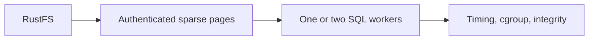

# Sparse reads under a one-vCPU worker limit

This optional Compose profile compares one and two SQL workers under the same
one-vCPU, 1-GiB limit against a disposable RustFS bucket. It measures sparse
read interference; it does not establish application latency or a protected
release receipt.



| Field | Value |
| --- | --- |
| Harness | [`worker-profile.compose.yaml`](worker-profile.compose.yaml) with [`run-worker-profile.sh`](run-worker-profile.sh) |
| Cases | `single` (one SQL worker) and `paired` (two SQL workers) |
| Process limits | Linux CPU quota of one vCPU, 1 GiB memory, no swap |
| Storage | Real RustFS 1.0 GA in a disposable Compose network |
| Evidence | Timing records, kernel counters, container inspect data, payload integrity |
| Claim | Private worker scheduling only; not a protected release receipt |

<a id="contents"></a>
## Contents

- [Case selectors](#case-selectors)
- [What the diagnostic measures](#what-the-diagnostic-measures)
- [Run from a committed source revision](#run-from-a-committed-source-revision)
- [Interpret the measurements](#interpret-the-measurements)
- [See also](#see-also)

<a id="case-selectors"></a>
## Case selectors

| Case | Exact test selector |
| --- | --- |
| `single` | `cell::worker::tests::rustfs_single_worker_reports_sparse_read_interference` |
| `paired` | `cell::worker::tests::rustfs_sparse_reads_report_worker_interference` |

The entrypoint runs the selected test with `--ignored --exact` and fails when
the filter executes zero tests.

<a id="what-the-diagnostic-measures"></a>
## What the diagnostic measures

This diagnostic runs the runtime's existing sparse-read fixture against real
RustFS 1.0 GA.

- **Per-process limits**: a Linux CPU quota of one vCPU, a 1 GiB memory limit and no swap.
- **Cases**: `single` uses one SQL worker; `paired` uses two under the same limits.
- **Workload**: interference between three Cells, with payload integrity checks.
- **Evidence**: raw timings and kernel counters.

- **Exercises**: private worker scheduling only.
- **Not covered**: public `CellNode` actions, traffic through the load balancer, durable confirmations, first activation and recovery still need the [application fleet qualification](https://github.com/crabbuild/crab/blob/beb439039cb37e750afe6625a2358101c70d1191/crates/crab-http-server/deploy/cell-issue-fleet/README.md).
- **Not a receipt**: this diagnostic does not generate a protected receipt or establish a supported throughput or latency limit.

<a id="run-from-a-committed-source-revision"></a>
## Run from a committed source revision

Run from a committed Cellule revision and a fresh external state directory. The
state directory must be writable inside the chosen Docker context; a host-only
mount is insufficient.

### Quick start

`CELLULE_WORKER_STATE` names the external state directory consumed by the
tracked Compose file:

```sh
export CELLULE_WORKER_STATE=$(mktemp -d "$HOME/Workspace/crabbuild-target/cellule-worker-XXXXXX")
mkdir -p "$CELLULE_WORKER_STATE"/{source,target-linux,evidence}
git archive HEAD | tar -x -C "$CELLULE_WORKER_STATE/source"
docker compose -f crates/cellule-runtime/qualification/worker-profile.compose.yaml config --quiet
```

### Environment and state directory

- **Docker context**: use a dedicated context with cgroup v2 and `memory.peak` support; on macOS, use the existing Colima context.
- **VM capacity**: allow the VM at least four CPUs and 8 GiB memory; the builder has a separate two-CPU/four-GiB limit.
- **Hygiene**: finish building before measuring; stop other workloads in that context during measurement.
- **Fresh state**: from the repository root, choose a **new** state directory and project name for each run.

The bind mounts must resolve on the Docker host; on Colima, the mounted
Workspace volume must be shared with the VM. The recorded run uses a
per-checkout directory on that volume and the `CRAB_WORKER_CONTEXT` /
`CRAB_WORKER_STATE` variables:

```sh
export CRAB_WORKER_CONTEXT=colima-ga-8bc8
worker_target=$(cd "$HOME/Workspace/crabbuild-target/crab-8bc8" && pwd -P)
export CRAB_WORKER_STATE="$worker_target/worker-profile-$(date -u +%Y%m%dT%H%M%SZ)"
worker_project="crab-worker-$(date -u +%Y%m%d%H%M%S)"
test -d "$HOME/Workspace" && test -w "$HOME/Workspace"
test ! -e "$CRAB_WORKER_STATE"
mkdir -p "$CRAB_WORKER_STATE"/{source,target-linux,evidence}
git archive HEAD | tar -x -C "$CRAB_WORKER_STATE/source"
git rev-parse HEAD > "$CRAB_WORKER_STATE/evidence/source-sha.txt"

worker_compose() {
  docker --context "$CRAB_WORKER_CONTEXT" compose \
    --project-name "$worker_project" \
    -f "$CRAB_WORKER_STATE/source/crates/cellule-runtime/qualification/worker-profile.compose.yaml" "$@"
}
worker_compose config --quiet
worker_compose config > "$CRAB_WORKER_STATE/evidence/compose.yaml"
docker --context "$CRAB_WORKER_CONTEXT" info --format '{{json .}}' \
  > "$CRAB_WORKER_STATE/evidence/docker-info.json"
```

### Build and start RustFS

On Colima, share this state directory as writable before the build.

- **Mount sharing**: add `--mount "$CRAB_WORKER_STATE:w"` when starting the task's idle profile, preserving its existing mounts.
- **Failure mode**: an unshared host path can appear as an empty directory inside Docker.

Check the source mount, then build:

```sh
worker_compose run --rm --no-deps --entrypoint test build -f /source/Cargo.toml
worker_compose run --no-deps --name "$worker_project-build" build \
  > "$CRAB_WORKER_STATE/evidence/build.log" 2>&1
```

- **Check first**: the build exit status and log before continuing.
- **Pinned versions**: the image and RustFS versions are pinned by digest.
- **Credentials**: RustFS credentials `crab` / `crab` are confined to this disposable network; no ports are published.

Start it and initialize the fresh bucket once:

```sh
worker_compose up -d --wait rustfs
worker_compose run --no-deps --name "$worker_project-bucket-init" bucket-init
```

### Run both cases

Build the `build` service, initialize `rustfs` and `bucket-init`, then run
`worker single` and `worker paired` serially. Retain the exact test logs,
container inspect data, source SHA, binary SHA-256, and cgroup counters.

- **Exit status**: keep each exit status and inspect even a failed container.
- **Entrypoint rejects**: a missing or ambiguous test binary, incorrect kernel limits, a failed test, or a filter that ran zero tests.
- **Entrypoint records**: the binary SHA-256, cgroup CPU/memory counters before and after, and the complete test log.

Run the cases serially:

```sh
worker_compose run --no-deps --name "$worker_project-single" worker single
docker --context "$CRAB_WORKER_CONTEXT" inspect "$worker_project-single" \
  > "$CRAB_WORKER_STATE/evidence/single-container.json"
worker_compose run --no-deps --name "$worker_project-paired" worker paired
docker --context "$CRAB_WORKER_CONTEXT" inspect "$worker_project-paired" \
  > "$CRAB_WORKER_STATE/evidence/paired-container.json"
docker --context "$CRAB_WORKER_CONTEXT" inspect "$(worker_compose ps -q rustfs)" \
  > "$CRAB_WORKER_STATE/evidence/rustfs-container.json"
worker_compose logs --no-color rustfs > "$CRAB_WORKER_STATE/evidence/rustfs.log"
worker_compose stop
```

- **Retention**: keep the state directory, containers and volumes until the evidence is reviewed.
- **Repeat runs**: for another independent process pair, use another fresh directory/project.
- **Build directory**: avoid reusing a build directory containing multiple runtime test binaries.
- **Executable contract**: see [the Compose file](worker-profile.compose.yaml) and [runner](run-worker-profile.sh).

<a id="interpret-the-measurements"></a>
## Interpret the measurements

Each `worker-interference` JSON record (schema 3) includes:

- worker assignments;
- the runtime's detected CPU parallelism;
- the authenticated cold root and payload digest;
- query admission/queue time, SQLite callback time, and provider reads.

With one SQL worker all three Cells share it. With two workers:

- the cold and same-worker Cells share worker zero;
- the comparison Cell uses worker one.

```text
one measured process (1 vCPU quota, 1 GiB memory, no swap)
  |
  +-- worker 0 --> cold Cell + same-worker Cell
  +-- worker 1 --> comparison Cell (paired only)
  |
  +-- 4 MiB payload reopened as six sparse files
        GET delays: 0, 20, 20, 0, 0, 20 ms
        background hydration: 500 ms per GET
```

### Payload and hydration

- **Payload**: each process creates a random 4 MiB payload, then reopens that exact root into six fresh sparse files with added GET delays `0, 20, 20, 0, 0, 20` ms.
- **Warm caches**: provider and metadata caches remain warm.
- **Resident Cells**: the two resident Cells each hold 256 KiB.
- **Integrity**: a repeated full-payload query must return the original digest with zero new origin reads.
- **Background hydration**: a separate phase adds 500 ms per GET.
- **Real provider**: delays wrap the real provider; they do not replace it with memory storage.

### Comparison caveats

- **Medians**: compare medians within each process and retain every sample; three samples per delay cannot establish p99.
- **Not an A/B**: separate processes create different payloads/roots; one versus two workers is a scheduling experiment, not a byte-identical A/B throughput comparison.
- **Kernel counters**: kernel `memory.peak` includes charged cache and is not process RSS; CPU throttling counters cover setup as well as query phases.
- **Shared VM**: RustFS and workers share one VM, so this does not prove independent failure domains.
- **Docker limits**: Docker's [CPU and memory limits](https://docs.docker.com/engine/containers/resource_constraints/) cap consumption; they do not reserve a dedicated physical core.

<a id="see-also"></a>
## See also

| Next step | Read |
| --- | --- |
| Understand the qualification tiers and receipts | [Runtime qualification](README.md) |
| Run the harness and inspect its checks | [`run-worker-profile.sh`](run-worker-profile.sh) |
| Read services, limits, and pinned digests | [`worker-profile.compose.yaml`](worker-profile.compose.yaml) |
| Find proof levels and ownership | [Verification guide](../docs/delivery.md) |
| Measure application process and reader scenarios | [`cellule-app` performance guide](../../cellule-app/PERFORMANCE.md) |
| Exercise the public typed path | [`cellule-app` integration suite](../../cellule-app/tests/integration.rs) |
