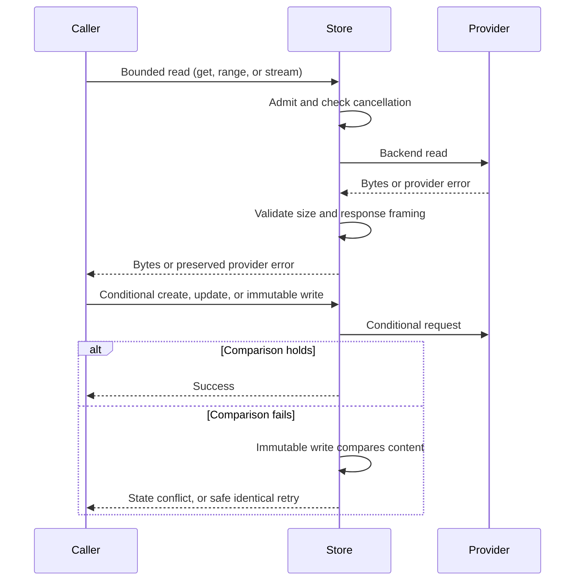

# Store guide

`cellule-store` is Cellule's provider-neutral object-store transport. It wraps
`object_store` with bounded reads, immutable writes, conditional create and
update, classified errors, retries, multipart uploads, and optional request and
byte observation. It does not choose a Cell owner or authoritative root.

| Field | Value |
| --- | --- |
| Content type | Guide and crate reference |
| Audience | Application authors and storage contributors |
| Goal | Use `Store` without turning a provider write into Cell authority |

| Document | Answers |
| --- | --- |
| [Transport contract](transport.md) | What read/write guarantees does `Store` provide? |
| [Provider setup](providers.md) | Who creates providers and scopes? |
| [Crate entry](../README.md) | Where does storage sit in Cellule? |

<a id="contents"></a>
## Contents

- [Overview](#overview)
- [Create and read objects](#create-and-read-objects)
- [Guarantees](#guarantees)
- [Errors and retries](#errors-and-retries)
- [See also](#see-also)

<a id="overview"></a>
## Overview

- The store reports conflicts and transport failures. It never turns a provider
  write into Cell authority.
- The caller supplies a validated object-store prefix.
- `cellule-ltx` defines the Cell object layout, and `cellule-runtime` decides
  when a proposed root becomes authoritative.
- The application resolves credentials and constructs cloud providers.
- `build_explicit_store` is available when the application wants Cellule's
  provider builder.

<a id="create-and-read-objects"></a>
## Create and read objects

Open a `Store` over any `object_store` implementation, write immutable bytes,
and read them back with the ETag:

```rust
use std::sync::Arc;
use bytes::Bytes;
use cellule_store::Store;
use object_store::{memory::InMemory, path::Path};

# async fn example() -> Result<(), cellule_store::StorageError> {
let store = Store::new(Arc::new(InMemory::new()));
let path = Path::from("cells/example/object");
store.put(&path, Bytes::from_static(b"state")).await?;
let (body, _etag) = store.get_with_etag(&path).await?;
assert_eq!(&body[..], b"state");
# Ok(())
# }
```

<a id="guarantees"></a>
## Guarantees

Reads, conditional writes, and immutable writes cross the same transport:



- **Conditional create and update** retain provider conflict semantics. A failed
  comparison is a state conflict, not a successful retry.
- **Bounded reads** validate size and response framing before exposing data.
  Range and stream reads preserve provider errors.
- **Immutable writes** compare content on an existing-object conflict, so an
  identical retry is safe and differing bytes fail.
- **Multipart failures** attempt cleanup while retaining the original error.
  Resumable uploads can use caller-owned journals.
- **Read admission and cancellation** apply before backend work; observed request
  and byte counts remain bounded.

<a id="errors-and-retries"></a>
## Errors and retries

`StorageError` retains transport causes where available, and `RetryClass`
separates transient, throttled, state-dependent, and fatal failures.

See [the crate API](../src/lib.rs) and
[the workspace architecture](../../../docs/architecture.md).

<a id="see-also"></a>
## See also

| Document | What it covers |
| --- | --- |
| [Transport contract](transport.md) | Bounded reads, conditional writes, retries, and multipart behavior. |
| [Provider setup](providers.md) | Who creates providers and scopes. |
| [Crate entry](../README.md) | Where storage sits in Cellule, and the workspace commands. |
| [Store API](../src/lib.rs) | The public transport surface. |
| [LTX guide](../../cellule-ltx/docs/README.md) | Cell object layout and immutable root formats. |
| [Authority, storage, and recovery](../../cellule-runtime/docs/storage.md) | When a proposed root becomes authoritative. |
| [Identity contracts](../../cellule-types/docs/README.md) | Provider and bucket identities used for routing. |
| [Architecture overview](../../../docs/architecture.md) | Layer boundaries and placement. |
