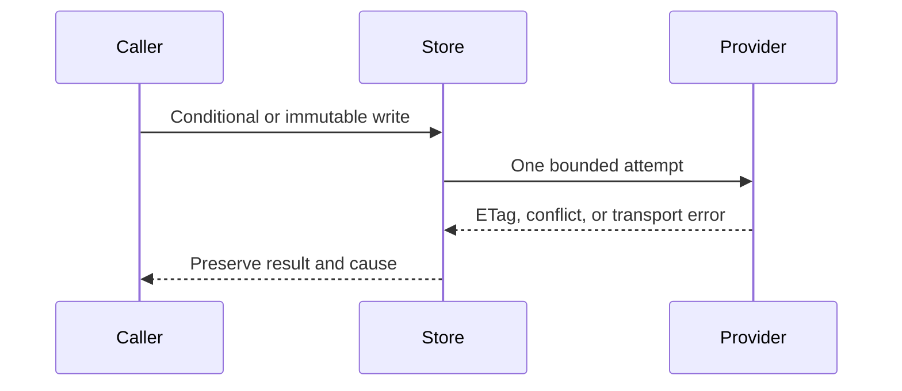

# Transport contract



| Operation | Guarantee |
| --- | --- |
| Bounded read | Reject oversized or malformed responses before exposing bytes. |
| Conditional create/update | Preserve provider conflict semantics; a failed CAS is not a successful retry. |
| Immutable write | Identical existing bytes allow an idempotent retry; different bytes fail. |
| Multipart | Cleanup is attempted on failure; the original error remains available. |
| Read admission | Reserve before backend work and release on completion/cancellation. |
| Observation | Count requests and bytes without changing ownership semantics. |

Observed GET, listing, and deletion streams remain finished after EOF, including
empty bodies. Polling them again returns `None` and records no second terminal
observation. Completion, provider errors, and cancellation each release the
active operation exactly once.

`StorageError` keeps its source where available. `RetryClass` separates
transient, throttled, state-dependent, and fatal failures. A caller controls
its own deadline and whether an ambiguous write can be retried.

```rust
use std::sync::Arc;
use bytes::Bytes;
use cellule_store::Store;
use object_store::{memory::InMemory, path::Path};

async fn example() -> Result<(), cellule_store::StorageError> {
let store = Store::new(Arc::new(InMemory::new()));
let key = Path::from("cells/example/object");
store.put(&key, Bytes::from_static(b"state")).await?;
let (body, _etag) = store.get_with_etag(&key).await?;
assert_eq!(&body[..], b"state");
Ok(())
}
```

See [`Store`](../src/store.rs) and its tests for the exact API and limits.
