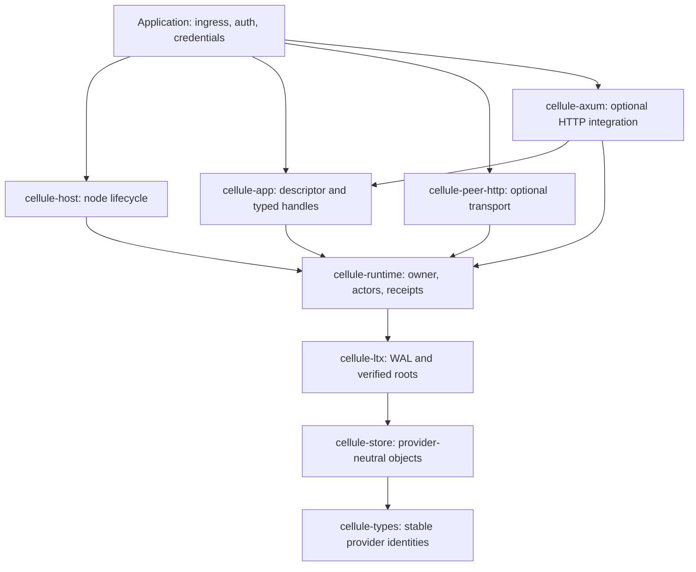
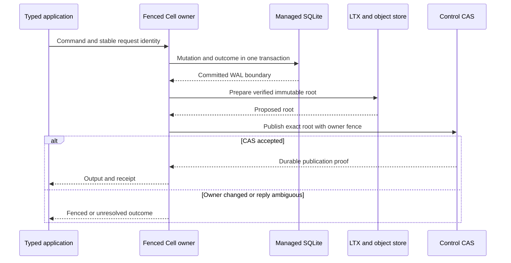
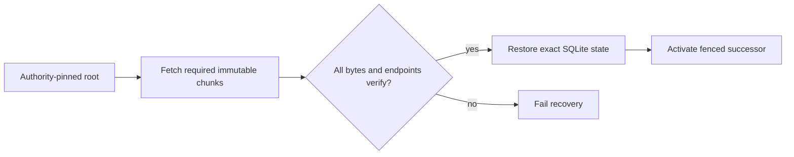

# Architecture and ownership

Cellule is a Rust framework embedded in a service. The service defines the
product API and policies; Cellule supplies the repeatable mechanics of Cell
identity, one fenced writer, durable commands, exact recovery, and node drain.
A Cell is addressed by tenant, application, namespace, and partition. Changing
its owner does not change its identity.

Dependencies point down from host and app to runtime, LTX, store, and types.
The host also uses runtime directly. The optional peer adapter depends on
runtime contracts; it never becomes an application authorization layer. See the
[workspace reference](reference.md) for where each crate lives.

## Boundaries

| Owner | Responsibility | Does not decide |
| --- | --- | --- |
| Application | Domain modules, tenant identity, public ingress, authorization, providers, credentials, deployment policy. | Cell publication or recovery format. |
| `cellule-app` | Compile static modules and stable topology; expose scoped typed handles. | Network listeners, provider construction, or node lifecycle. |
| `cellule-host` | One runtime per node, installed facilities, readiness prerequisites, drain and shutdown. | Product routing or authorization policy. |
| `cellule-runtime` | Cell identity, catalog and authority transitions, owner fencing, actors, request ledger, primitive execution, publication. | Cloud credentials or HTTP endpoints. |
| `cellule-ltx` | SQLite WAL capture, LTX validation, immutable root construction, exact restore. | Which proposed root is authoritative. |
| `cellule-store` | Bounded object operations, conditional writes, retries, classified provider failures. | Which Cell owner or root is current. |
| `cellule-types` | Stable dependency-light provider and bucket identities. | Application behavior. |
| `cellule-peer-http` | Optional signed owner routing and pinned mTLS transport. | Public receivers and user authorization. |
| `cellule-axum` | Extract existing scoped capabilities and convert HTTP outputs and failures. | Routes, listeners, authentication, or tenant selection. |

The [framework integration guide](framework.md) covers assembly of a serving
node. The [API guide](api.md) covers application-facing methods and typed
results.

## Command path and durability gate

One command mutates **one** Cell's SQLite database. Its state transition and
request outcome are recorded in the same transaction, so recovery does not
separate the data from the answer returned for that request identity.

This is the object-store path. A configured follower-log path may acknowledge
after a recoverable follower proof; object publication follows. Both modes use
the same output gate. A transport timeout or lost reply does not prove the
handler failed. The caller resolves the **original** request identity before
attempting the exact command again. Read
[execution](../crates/cellule-runtime/docs/runtime.md) and
[failover](../crates/cellule-runtime/docs/failover-and-followers.md) for the
protocol details.

A `Receipt` names the Cell, owner incarnation, and commit sequence. A later
query can require at least that receipt. It is a per-Cell observation rule, not
a transaction across Cells. The default query is owner-ordered; an explicitly
selected replica must prove its minimum receipt or fail closed.

## Authority and recovery

The object store holds immutable data. The authority control record identifies
the fenced owner and the exact root to restore. Listing objects cannot elect a
root. A successor owner follows this sequence:

1. Observe and fence the prior owner through authority.
2. Read the authority-pinned root, not the newest-looking object key.
3. Verify the root and every required LTX chunk, checksum, and endpoint.
4. Reconstruct byte-identical SQLite state or fail without activating the Cell.
5. Resume request resolution from the recovered outcome ledger.

A stale local database, partial object listing, or merely plausible snapshot
cannot be promoted. Read [storage](../crates/cellule-runtime/docs/storage.md)
and the [LTX guide](../crates/cellule-ltx/docs/README.md) for formats and
restore behavior.

## Work that crosses Cells

Commands are single-Cell transactions. Effects append a durable source intent;
a destination uses an idempotent inbox before applying it. Queue leases and
workflow activities are also explicit durable workflows around external work.
None of these imply an atomic SQL transaction spanning multiple Cells. Blob
parts require a complete cross-Cell reference set, quiesced writes, and a
grace boundary before deletion.

## Persisted and exchanged contracts

| Contract | Why edits require review |
| --- | --- |
| Cell IDs, namespaces, partitions, and descriptors | Route requests and select persisted state across releases. |
| Catalog roles, schema versions, operation IDs, and codecs | Bind compiled code to the owner and stored request outcomes. |
| Authority revisions and root references | Fence writers and select the only valid recovery root. |
| LTX bytes and object paths | Must be read and verified by future owners. |
| Signed peer messages and hash domains | Must authenticate and remain compatible during rollout. |
| Blob-part references | Govern safe retention and deletion across Cells. |

Existing prefixes or signed peers require a reviewed migration before a
compatibility promise. See the [release guide](releasing.md) and
[roadmap](roadmap.md) for qualification gates and current gaps.

## What the test layers prove

| Level | Evidence |
| --- | --- |
| Unit and contracts | IDs, descriptors, schemas, codecs, and pure coordination decisions. |
| Application integration | Typed call, durable output, receipt-bound read, and local recovery across all primitives. |
| Process and provider | Separate nodes, object-store behavior, owner loss, and drain in a named environment. |
| Production qualification | Provider, load, fault, security, compatibility, and rollout evidence from controlled runs. |

A local in-memory test does not establish cloud-provider or production behavior.
The [qualification guide](../crates/cellule-runtime/docs/delivery.md) names the
levels and their evidence.
