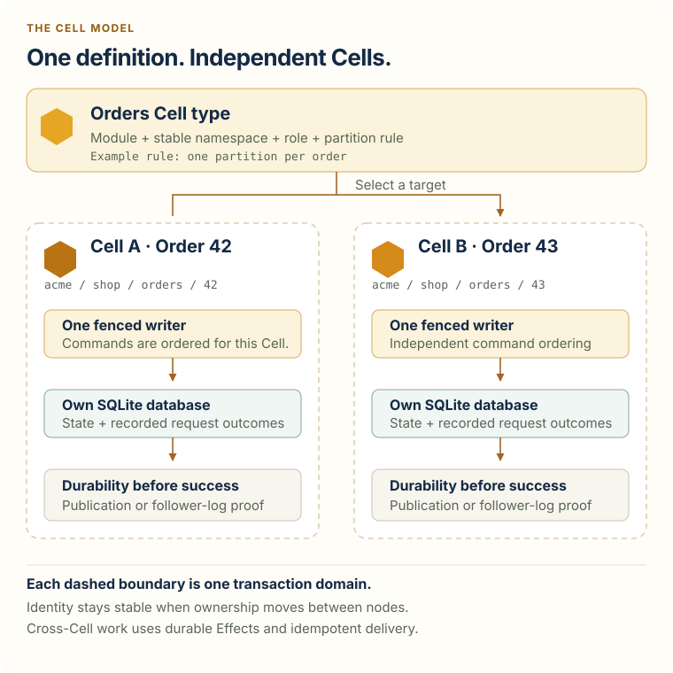
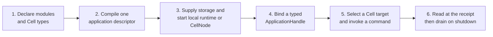

# Cellule at a glance

Cellule embeds durable, SQLite-backed state partitions in a Rust application.
Your application chooses the domain operations and the key that selects a
partition. Cellule runs each **Cell** through one fenced writer and returns a
successful command only after its outcome has recoverable durability proof.

## What is a Cell?

A `CellType` declares a module, stable namespace, role, and partition rule. A
`CellTarget` combines the tenant, application, namespace, and partition to
address one Cell. Many targets can use the same Cell type; ownership can move
between nodes without changing a target's identity.

Open the [full-size Cell model SVG](diagram/cell-model.svg). The example targets
use tenant `acme`, application `shop`, namespace `orders`, and an entity
partition for order `42` or `43`. The two writers may run on the same node or
different nodes; the ownership and transaction boundaries remain per Cell.

A command changes one Cell in one SQLite transaction. Its state change and
request outcome commit together. The returned `Receipt` lets a later query
require that Cell's committed position. Work across Cells uses durable effects
and idempotent delivery, not a shared SQL transaction.

## Components and ownership

Open the [full-size SVG](../diagram/cellule-components.svg) or
[2× PNG](../diagram/cellule-components@2x.png).

`cellule-app` provides the author-facing declaration and typed client layer.
`cellule-host` is the serving node lifecycle facade. The runtime owns Cell
coordination; LTX and store handle data bytes and transport. The application
keeps its existing public API and security policy. The optional peer adapter
does not add a public endpoint or authorize users.

## Embed it in an application

Start with the [local SQL example](../crates/cellule-app/examples/sql.rs),
which shows every step with in-memory object storage. For a serving process,
the [framework integration guide](framework.md) adds provider probes, node
lease enrollment, readiness, and shutdown. A product can keep its existing
router, authentication, and cloud SDK. Cellule runs inside that process and
does not require a particular public web framework.

| Integration scope | Direct Cellule crates to use |
| --- | --- |
| Write a module for an existing Cellule host | `cellule-app` for topology and handles; `cellule-runtime` for module, operation, and identity types. |
| Bootstrap the local reference example yourself | Add `cellule-ltx` and `cellule-store` for the replica and object-store setup used by that example. |
| Run a serving node | Add `cellule-host` for readiness, facilities, and drain. |
| Write Axum handlers | Add [`cellule-axum`](../crates/cellule-axum/README.md) for typed extraction and responses with receipts. |
| Route between nodes over HTTP | Add `cellule-peer-http` only when using its signed peer transport. |

These are the **direct integration surfaces**, not a claim that Cargo's
transitive dependency tree is small. The embedding service still supplies an
async executor, storage provider, credentials, and node facilities appropriate
to its deployment. See the [API guide](api.md) for typed calls and
[architecture](architecture.md) for durability and recovery details.
