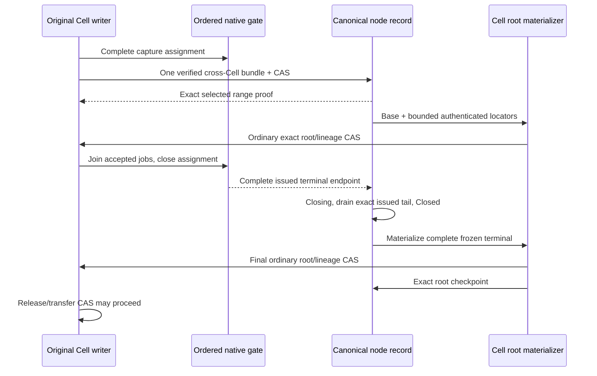

# Bundle coverage implementation

The connected protocol APIs now implement shared selection, independently
awaitable root materialization and complete live-writer closure. They are **not
enabled in the ordinary actor response path**. The prior performance regression
and failed qualification remain the baseline. This slice establishes ordering
and reconstruction evidence. The [fresh application-path benchmark](pr67-performance-reevaluation.md)
measures `7fc0793`; it does not exercise bundle-based responses or establish
write parity. The [WAL NORMAL comparison](pr67-normal-wal-reevaluation.md)
separately records seven completed diagnostic cases and an interrupted matrix.

## Celld reference and Cellule adaptation

The reference is celld `f2bf648663a610eefde71f3547ad61e9b896b1f0`.
Its [bundle loop](https://github.com/denoland/celld/blob/f2bf648663a610eefde71f3547ad61e9b896b1f0/crates/celld/ltx_repl.rs#L4401)
gathers Cell tails into one node upload and separates durable coverage from
materialized positions. Its [bundle credit path](https://github.com/denoland/celld/blob/f2bf648663a610eefde71f3547ad61e9b896b1f0/crates/celld/node_log.rs#L6620)
rechecks bucket state and epoch after the upload before crediting rows.
These are architectural references; this module is independently implemented.

Cellule also has independent Cell ownership epochs. It first reserves a
provisional catalog binding, pins the original writer in Cell control, then
opens the binding through node CAS. Interrupted enrollment remains an inventory
obligation; a lower-level Cell pin CAS cannot bypass reservation. The existing
canonical node-record CAS selects catalog and range together. A
heartbeat preserves the head; a conflicting closure requires a fresh proposal.
Uploading an immutable object supplies no coverage proof.

## Implemented contracts

| API or boundary | Behavior |
| --- | --- |
| `NodeDirectory::initialize_bundle_lane` / `bind_bundle_cell` | Establish a boot/epoch catalog; reserve a provisional inventory entry, pin the original Cell's base/code/schema/writer, then open it before issuing bundled commands |
| `NodeLogShipper::submit_assigned` / `NodeDurability::submit_assigned` | Use the existing bounded native shipping lane and return an opaque witness for every frame in a complete capture |
| `prepare_node_bundle` / `select_node_bundle` | Reject missing, overlapping, unassigned or cross-binding ranges; verify origin extents before selecting; reconcile only the exact head under the original lease |
| `BundleCoverageProof` | Retain authenticated immutable locators, logical endpoint, SQLite position and original base; retain no capture bodies |
| `load_bundle_coverage` | Reopen a selected suffix from the authority-pinned canonical catalog, including a fenced boot; grant no writer or follower-suffix closure |
| `CellPublisher::materialize_bundle` | Reconstruct the exact overlay and use normal root preparation, lineage and Cell CAS independently of selection; bounded small tails reuse canonical native coalescing and packing |
| `checkpoint_bundle_cell` / `checkpoint_bundle_cells` | Require the opaque proof matching each freshly read materialized root; drop only its identical locator prefix, retain newer suffixes, and select up to 64 checkpoints with one index upload and one node CAS |
| `close_cell_issuance` / `begin_bundle_close` / `finish_bundle_close` | Freeze complete assigned issuance, including prior Fleet ACKs above the selected prefix; retain that same opaque issuance witness through terminal closure; read only its authenticated shard |
| Cell departure CAS | Refuse release, takeover and tombstone until Closed, exact materialization and catalog checkpoint; migration refuses while bound |
| Node withdrawal/maintenance | Refuse unresolved bindings; stale fencing preserves the catalog head; one bundle-bound boot cannot rotate its native log to another epoch |
| Backup and collection | Backup refuses bound Cells. Coverage objects have no deletion path; this is retention, not a qualified collection implementation |

The original SQL/capture/submission jobs must join before `close_cell_issuance`.
Its ordered gate prevents late assignment from consuming a node sequence. The
legacy identity-free `DurabilityGate::issue` cannot produce a per-Cell closure:
using it makes that closure fail closed. Automatic actor joining and scheduling
are still required before enabling this path for application commands.

## Format and bounds

Unbound Cell controls and node records retain version-1 encodings. A binding or
bundle head selects version 2; inconsistent version/field combinations and
unknown fields are rejected. Old readers must not operate on those records.
Use a fresh development prefix and initialize the lane before native issuance;
there is no live-format migration or same-boot bundle-epoch rotation.

New `CNB2` objects contain a fixed authenticated root index, changed catalog
shards and native extents under the existing
`cells/v1/node-logs/<session>/<epoch>/coverage/v1/<digest>.cnb` path. The selected
head digest authenticates the 32 KiB canonical header; the header authenticates
all shard ranges and new native extents. Unchanged shard references retain their
original object, offset, length and digest. A Cell lookup needs one header and
one shard, then its exact native ranges; it never follows a predecessor chain.
Both the application and Cell ID determine the shard. Complete maintenance
inventory still reads and verifies every shard, retaining one bounded shard at
a time and a duplicate-pin set capped at 4,096 entries.
Hot cohort lookups preflight the sum of their chosen shard lengths against a
4 MiB encoded-metadata budget before leaf I/O; a point lookup charges only its
own shard. This bounds protocol input, not total heap usage or host admission.

The `CNB1` complete-catalog reader remains available. Its selected digest still
authenticates the whole object. A new update migrates that catalog to `CNB2`
without changing Cell pins. Older binaries cannot read `CNB2`; upgrade all
recovery consumers before selecting this format. This does not migrate unbound
live actor activations or enable bundle-based responses.

| Development bound | Value |
| --- | ---: |
| Immutable object or individual catalog shard bytes | 4 MiB |
| Encoded catalog shards loaded for one cohort | 4 MiB, checked before leaf reads |
| Authenticated index header | 32 KiB / 256 shard references |
| Original bindings per boot/epoch | 4,096 |
| Native frames per selection | 64 |
| Uncheckpointed locators per Cell | 32 |
| Encoded suffix bytes verified per Cell | 4 MiB |
| Distinct base-root origin dependencies verified per Cell | 65,536 |

Exhaustion rejects further bundle preparation while retaining the last proof.
These are safety ceilings, **not performance-qualified policies**. New selections rewrite only changed shards. Old locator bodies are still
reverified. The indexed point lookup and copy-on-write catalog are implemented;
the 32-locator bound, materializer policy and full lifecycle cost do not yet meet
the current conditional 215-command checkpoint cost constraint in the [authority decision](bundle-coverage-proof.md#quantified-checkpoint-constraint).
The caller owns host memory/native-job admission; automatic materializer budget,
fairness and cancellation/drain ownership are not integrated.

## Verification and remaining delivery

The index regression reproduces a **783,146-byte** metadata rewrite for one
update among 1,000 Cells on the old source. The same test measures **35,223 bytes**
with `CNB2` (95.5% less), retains one immutable PUT plus one node CAS, and recovers
through three coverage-object ranges: header, chosen shard and native frame.
An exact materialized-prefix checkpoint among those 1,000 Cells falls from
**253 coverage-object reads to two**, without reading old native frames. A
64-Cell checkpoint cohort selects all completed roots with **two PUTs**, keeping
a hot Cell's newer suffix; an unmaterialized participant rejects the whole cohort
without a partial CAS. Small independent materialization now uses the canonical
native coalescer and pack: **256 PUTs instead of 320** for those 64 roots, or four
per root. A 32-locator suffix falls from **37 PUTs to four**, and cold restore
includes every selected outcome while excluding the later unselected command.
The aggregate native rows, indexes and pack headers must fit the existing
256 KiB budget; larger tails preserve the ordinary bundle representation.
The [updated cost calculation](bundle-coverage-proof.md#quantified-checkpoint-constraint)
requires at least 215 commands per Cell checkpoint if that four-PUT path and
64/64 cohorts hold, before retries or maintenance. Real larger checkpoints must
be measured; the 32-locator safety ceiling does not satisfy this constraint.

Additional tests cover legacy migration with the same Cell pin, a reused shard
without reading its old header, corrupt and missing reused shards, and refusal
to omit a corrupt shard from complete inventory. Bootstrap enrollment accepts
the runtime's command-zero root only before any native issuance; the first
command materializes and a quiet Cell drains without inventing a command.
An exact installed checkpoint retry preserves hot newer locators without another
PUT. A chosen cohort exceeding the metadata budget refuses before fetching its
first leaf. These regressions were reproduced before their fixes.
This is metadata/I/O evidence,
not application TPS or complete M4 qualification.

The original twenty-three focused tests cover real managed SQLite captures, canonical object-store
CAS and materialization: two-Cell shared selection, byte-identical roots, a prior
Fleet ACK above the selected prefix, held old proposals across closure, hot
siblings and dormant bindings, lost replies, lease loss, partial command groups,
overlaps, corrupt/missing objects, version rejection, checkpoint continuation,
locator pressure and materializer failure. One test removes the original
database/captures, fences the node record and reconstructs the selected outcome
from origin. Its Fleet ACK setup uses the native gate; it is not a physical
follower-fsync qualification.

The asynchronous tests select another command while an older root is pending.
The older root checkpoints a complete prefix without dropping the hot suffix;
the next materializer can continue from that root before or after the catalog
checkpoint. Origin lookup also works between the root CAS and catalog CAS.
Enrollment fault tests cover failure before pin selection and after the pin
but before catalog activation; neither grants a proof or clean maintenance.

The two-Cell selection test observes **one immutable PUT plus one node CAS**,
with both Cell roots unchanged. That excludes enrollment, root materialization,
catalog checkpoints, compaction and maintenance and must not be reported as
total PUTs/command, TPS or a latency result.

The original bundle source snapshot passed all contributor checks: **1,887 workspace
tests passed, 38 ignored; 58 local LTX tests passed**. All-feature/all-target
checking, warnings-denied Clippy and API docs, formatting, boundaries, module
ownership, document syntax/links and SQL/peer validation also passed. Ignored
environment-dependent tests and the complete production qualification remain
outside this result.

The final indexed publication/materialization snapshot passed all twelve
contributor checks: **1,902 workspace tests passed, 38 ignored; 60 local LTX
tests passed**. This includes warnings-denied Clippy and API docs, all-feature
and all-target checking, formatting, boundary/layout checks, document syntax
and links, SQL/peer validation and performance-harness tests. Its 34 focused
bundle/index tests and two public recovery-overlay tests cover the new cost,
checkpoint retry, command-zero bootstrap and larger-tail fallback behavior.
Source manifests, failed-before/pass-after logs and build outputs remain in the
external `cellule-write-perf-8ad1` evidence directory. Environment-dependent
ignored tests and production performance qualification remain outstanding.

The experimental checkpoint API now takes its `BundleCoverageProof`, and
`finish_bundle_close` takes the same retained `CellIssuedRange` used for Closing.
Consumers must pass those original capabilities; a pin or sampled endpoint is
not a substitute. The singleton checkpoint method delegates to the cohort path.

Remaining work before responses can use bundle proof:

1. Integrate actor/executor proof and query/retry endpoints, release proved
   capture retention, and schedule admitted materializers with joined shutdown.
2. Build on the authenticated index: bound admitted maintenance inventory,
   increase checkpoint density with retained-byte accounting, and measure the
   complete materialization/checkpoint/collection cost.
3. Fence and seal a failed original node's complete follower-issued suffix,
   including ACKs above the selected head, before reconstructing and closing
   every original binding, including interrupted provisional enrollments.
   Current departure/maintenance guards refuse this
   unfinished recovery rather than advancing a replacement writer.
4. Implement complete cross-Cell reference inventory, pins and grace-qualified
   collection. Preserve original catalog and base dependencies throughout.
5. Run the unchanged all-ACK cold recovery, paired Docker throughput/latency,
   debt, read, overload and drain qualification from the
   [performance proposal](write-performance-proposal.md).
